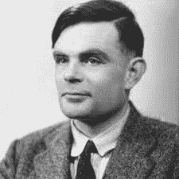

# 图灵测试

> 原文：<https://learnetutorials.com/artificial-intelligence/turing-test>

对于一台给定的机器，我们如何测试它的智能，或者我们如何说这台机器智能与否？图灵测试是第一个被提出来判断机器是否智能的测试。1950 年，一位名叫**的英国数学家艾伦·图灵**提出了一个名为**模仿游戏**的测试，来测试如何扩展一台机器可以像人类一样模仿的能力，或者计算机器展现类似人类的智能行为的能力。这种测试方法被称为图灵测试。

## 什么是图灵测试？

图灵测试是一种用来测试机器是否能像人类一样行动或思考的方法。该测试同意计算机只有在特定条件下能像人一样模仿时才是智能的。这个测试的结果就是“机器能思考吗？”。英国数学家、计算机科学家、密码分析学家和理论生物学家艾伦·图灵先生是这个提议的幕后推手，因此这个测试被命名为图灵测试。

测试需要三个玩家或终端。它们中的每一个都被完全隐藏或与其他的分开。其中之一是计算机或由计算机操作。另外两个是人或者由人操作。

在测试中，其中一个人充当提问者，另一个人和计算机充当应答者。提问者将以特定的形式向回答者提问任何特定领域的问题。在固定的时间或固定数量的问题之后，提问者必须区分计算机和人类。

测试将重复多次。如果提问者不能在一半的时间内区分机器和人，那么机器就被说成是通过了测试，可以说计算机被认为具有人工智能。测试的结果取决于机器能像人类一样给出多长的答案。

## 历史

伟大的英国计算机科学家艾伦·图灵，也被认为是人工智能之父之一，也是机器学习的先驱，是这个概念背后的人。他在 1950 年 T2 的论文《计算机械与智能》中介绍了这项测试。

通过这次测试，图灵试图回答“机器会思考吗？”以间接的方式。他首先将问题本身重新排列为“机器能模仿人吗？”

图灵提出了一个叫模仿游戏的游戏，没有任何 AI 的参与。他在三个不同的房间里和三个人类参与者一起进行游戏，他们通过键盘和屏幕连接在一起。这个游戏有 2 男 1 女作为参与者。玩家 B(女)试图说服玩家 C(法官，男)她是男的。c 试图通过提问来发现谁是男性，谁是女性。

上面展示了一个模仿游戏的例子。甲-男、乙-女、丙-男(法官)被安排在三个独立的房间里。只有 C 可以通过键盘与 A 和 B 进行交互。

## 考试考得怎么样？

在他的模仿游戏之后，图灵提出了一个问题“机器会思考吗？或者有没有能通过模拟游戏的数字电脑？”模仿游戏是用电脑代替一个人类玩家来玩的。

考虑上图。这里有三个玩家。**A 号选手****B 号选手**和**C 号选手**。玩家 A 是电脑，玩家 B 是人类应答者，玩家 C 是人类提问者或询问者。这里他们三个相互隔离。审讯者知道其中一个玩家是电脑，另一个是人。但是审讯者需要根据询问的问题和回答的答案来确定哪一个是机器，哪一个是人。这里玩家之间的互动是通过键盘和屏幕进行的。电脑或玩家 A 被允许做任何可能的事情来欺骗玩家 C(审讯者)。测试的最终结果取决于玩家 A 像人类一样反应的紧密程度。
玩家之间的互动会是这样的:

**玩家 C** :你是电脑吗？
**A 号选手**:号
**B 号选手**:号
**C 号选手**:乘 18765439 * 8749049
**A 号选手**:过了一会儿，一个不正确的答案
**B 号选手**:很久以后回答不正确。
**玩家 C** :加 524310，34521
**玩家 A** :暂停 x 秒左右然后给出答案 558831。
**玩家 B** :暂停 Y 秒左右然后回答 558831
**玩家 A** 只有当其对话不能被玩家 c 轻易区别于玩家 B 时才会被认为是智能的。

## 图灵测试在人工智能中的重要性

图灵测试不能被认为是评估人工智能系统的相关方法。但必须指出的是，图灵测试是在 1950 年提出的，比人工智能的概念不存在早了 6 年。然而图灵已经在思考机器能思考的问题了？是他描述了确定机器智能的框架。直到图灵测试对人工智能系统来说仍然难以捉摸。没有人工智能通过图灵测试。伊莱扎和**帕里**差点擦肩而过。**尤金·古斯特曼**，一名计算机程序员，是第一个通过测试的人工智能。图灵测试可以用来判断机器人的对话技巧。图灵测试在如何定义智能行为以及我们想要智能机器人做什么方面给了我们很多思考。

## 图灵测试的局限性

1.  鼓励犯错。-根据图灵测试，错误对机器来说是必要的。这就是机器的目的，就是为了不让审讯者知道它的身份，所以它必须犯错。例如，如果询问器要求乘以 2 个大数，即使机器知道正确答案，也被迫给出错误答案。
2.  没有提供智能的斜坡——图灵测试只为机器提供了两个条件，无论机器是否智能。它不鼓励定义智力水平
3.  不测试机器智能-在此测试期间，不测试机器智能。它只测试机器是否能像人一样工作。人类行为和智能行为在所有意义上都是不一样的。图灵测试要求机器执行一些非智能的人类行为，例如撒谎的诱惑。如果机器不能模仿这种类型的非智能行为，那么它就不能通过测试。此外，该测试没有将处理困难问题的能力视为智能测量。如果机器能做比人类更智能的工作，那么它就不能通过测试，不被认为是智能的。这反过来导致非智能机器通过测试，智能机器未通过测试。

图灵测试已被证明既有影响力，也受到了广泛的批评，存在严重的缺陷，如上所述。不管怎样，它已经成为人工智能哲学中一个非常重要的概念。
哲学家**约翰·塞尔**在 1980 年提出的论点被称为**中国房间论点**，是一个思想实验，是对图灵测试的主要批评之一。它认为，无论程序如何智能地使计算机做出反应，数字计算机都不可能有头脑，或者一个系统可以智能，但实际上并不智能。其他专家也提出了类似的论点。

## 图灵测试的变体

已经提出了图灵测试的许多版本。其中一些是:

### 反向图灵测试

就像名字一样，这是一个相反的过程。一种改进的图灵测试，其中一个或多个角色在人和机器之间互换。这种修改方法
可以克服标准版的大部分异议。验证码是一个反向图灵测试的例子。在扭曲的图形图像中向用户呈现一些字母数字字符，并要求用户在允许用户在网站上执行某些操作之前键入这些字符。这种方法用于防止自动化系统滥用网站。任何能够正确做到这一点的系统都是人，因为能够读取和再现这种扭曲图像的软件是不存在的。

### 主题专家图灵测试。

主题图灵测试也称为“费根鲍姆测试”，是爱德华·费根鲍姆提出的图灵测试的另一种变体。在这里，计算机试图复制特定领域的专家，如会计或市场营销。

### “低级”认知测验

人类认知的低级或无意识过程是通过提问来揭示的。除非计算机像人类一样体验世界，否则询问者可以通过这些类型的问题轻松地揭开计算机的面具。这是罗伯特·弗伦奇介绍的。

### 全图灵测试

认知科学家 Stevan Harnad 给传统的图灵测试增加了两个要求。除了语言询问，它还涉及视觉能力和身体互动。这个修改版本被称为全图灵测试。

### 最小智能信号测试

作为传统图灵测试的最大抽象，克里斯·麦金太尔提出了一个只允许二进制响应的版本。重点只在于思考能力。