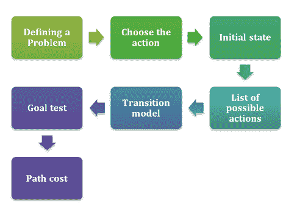

# 人工智能中的问题解决

> 原文：<https://learnetutorials.com/artificial-intelligence/problem-solving-in-ai>

我们知道智能体(参见之前的教程【AI 中的[智能体)直接将状态映射为动作。每当映射的状态太大并且智能体无法在这些环境中执行时(参见前面的教程](../artificial-intelligence/intelligent-agents-in-ai)[任务环境](../artificial-intelligence/agent-environment-in-ai))，问题解决域会将给定的问题划分为较小的任务，并逐个解决这些较小的存储区域。最后，整合结果以获得期望的结果。人工智能中的问题解决包括各种技术，如高效算法、启发式和执行根本原因分析以获得理想的解决方案。对于人工智能中的一个给定问题，不同的启发式方法可能会有不同的解决方案，同时，也存在具有唯一解决方案的问题。这些都取决于要解决的问题的性质。

## 人工智能中问题的特征

给人工智能的每个问题都有不同的表现和解释。给定的问题必须与几个维度一起分析，以选择最可接受的方法来解决。下面列出了问题的一些关键特征。

*   问题能分解成子问题吗？
*   是否可以忽略任何解决步骤？
*   给定的问题普遍可预测吗？
*   我们能为给定的问题选择一个好的解决方案而不与所有可能的解决方案进行比较吗？
*   期望的输出是世界的一种状态还是通向一种状态的路径？
*   这个问题需要大量的知识来解决吗？
*   它需要与计算机和人类进行任何交互吗？

上面列出的问题特征称为 7 问题特征。给定问题的解决方案必须在这些特征下发生。

**AI 中的问题基本上可以分为两类。玩具问题和现实世界的问题。**

### 玩具问题:

它也可以被称为一个类似难题的问题，可以用来解释一种更普遍的问题解决技术。为了测试和演示方法，或者比较不同算法的性能，可以使用 Toy 问题。玩具问题通常有助于提供复杂问题中特定现象的预测。大而复杂的问题被分成许多更小的玩具问题，这些问题可以很容易地详细理解。滑块拼图，N 皇后问题，河内塔就是一些例子。

### 现实世界的问题:

和名字一样，这是一个基于现实世界的问题。现实世界的问题需要一个解决方案。它不依赖于描述，而是有一个通用的公式。在线购物、欺诈检测、医疗诊断是人工智能中现实问题的一些例子。

## 解决问题的步骤

*   **目标制定**:解决问题的第一步是识别问题。它包括从多个目标中选择制定完美目标的步骤，并选择实现目标的行动。
*   **问题制定**:解决问题最重要的一步是选择要采取的行动，以实现制定的目标。
*   **初始状态**:座席朝向目标的起始状态。
*   **动作**:智能体可用的可能动作列表。
*   **过渡模型**:描述每个动作做什么。
*   **目标测试**:测试给定状态是否为目标状态。
*   **路径成本**:为每个跟随目标的路径分配一个数字成本。它反映了它的性能。路径成本最低的解是最优解。

### 问题解决程序示例

<u>**八皇后拼图**</u>

这里的问题是将八个国际象棋皇后放在一个 8*8 的棋盘上，这样就没有皇后会威胁到对方。如果两个皇后在同一行、列或对角线上出现，一个会攻击另一个。

考虑这个问题的增量公式:它从一个空状态开始，操作者在每一步扩展一个皇后。
以下是该配方中涉及的步骤:

*   **状态**:棋盘上排列 0 到 8 个皇后。
*   **初始状态**:空棋盘
*   **动作**:在棋盘上的任意一个空方块中增加一个女王。
*   **过渡模式**:返回棋盘新状态，方块中加入女王。
*   **目标测试**:检查棋盘上是否留有 8 位皇后，没有任何攻击的可能。
*   **路径成本**:路径成本被忽略，因为只计算最终状态。

## 人工智能中的问题解决方法

让我们讨论像启发式、算法、人工智能使用的根本原因分析等技术，作为解决问题的方法，为给定的问题找到理想的解决方案。

## 1.算法

一个解决问题的算法可以说是一个过程，如果严格遵循它的步骤，这个过程是有保证解决的。
我们举一个简单的例子来了解一下是什么意思:
一个人想在图书馆浩如烟海的藏书中找到一本展出的书。他不知道这本书放在哪里。通过追踪对图书馆每个书架上陈列的每本书的连续检查，这个人最终会找到这本书。但是这种方法会消耗大量的时间。因此，算法方法会成功，但通常很慢。

### 人工智能算法的类型

*   回归算法。
*   基于实例的算法。
*   决策树算法。
*   聚类算法。
*   关联规则学习算法。
*   人工神经网络算法。
*   深度学习算法。
*   搜索算法

## 2.启发式。

一个解决问题的启发式方法可以说是一个非正式的、概念性的、冲动的过程，它只在某些情况下导致期望的解决方案。事实是，启发式操作的结果是不可预测的。使用启发式方法可能比使用算法更有效或更无效。
考虑上面讨论的同一个例子。如果他知道去哪里找这本书，就可以节省很多时间。这可以说是试探性的搜索。但是如果一个人在第一次试验中碰巧错了，他必须尝试另一种启发式方法。
常用的问题解决启发式方法有

**向前工作**

这是一种解决问题的前瞻性方法。在这种方法中，问题从开始本身和工作到结束都得到解决。

**向后工作**

这是一种逆向解决问题的方法。在这里，问题是从终点或目标到实现目标的步骤来解决的。

**平均值-终点分析。**

上述两个方向的混合。这种方法适用于解决复杂的大问题。MEA 是一种控制问题解决中搜索过程的策略。它集中于评估当前状态和目标状态之间的差异。首先，计算初始状态和最终状态之间的差异。然后为每个差异选择不同的运算符。这些操作符的应用将减少当前状态和目标状态之间的差异。

**生成并测试。**

生成和测试方法是一种解决问题的启发式方法，涉及随机方法中的一组替代动作。每种替代方法都是为了检查它是否能解决问题。它确保所选的最佳可能解决方案与生成的可能解决方案进行核对。

## 算法和试探法的区别

| 算法 | 探索法 |
| 问题的自动化解决方案确定性的，并被证明能给出最佳结果包含解决问题的有限指令集。 | 任意选择或有根据的猜测没有正确性的证明，可能不会授予最佳结果。应用于提高算法运行时间。 |

在人工智能中，启发式和算法这两个术语有些重叠。试探法可以是一个子程序，可以用来确定在哪里首先寻找最佳算法。启发式算法可以列在算法的类别下。从某种意义上说，启发式是算法，启发式是一种解决问题的猜测方法，给出一个足够好的答案，而不是找到最好的可能结果。间接层次是两者的主要区别。

## 3.根本原因分析

就像名字本身一样，它是识别问题根源的过程。分析问题的根本原因，以确定适当的解决方案。原则、技术和方法的集合被用来识别问题的根本原因。RCA 可以在第一时间发现问题。

RCA 的第一个目标是确定问题的根本原因。第二个目标是了解如何解决根本原因中的潜在问题。第三个目标是防止未来的问题或重复成功。

驻地协调员评估的核心原则是:

*   重点纠正根源。
*   治疗症状以获得短期缓解。
*   可能有多个根本原因。
*   关注如何？为什么？
*   根本原因声明由具体的因果关系来支持。
*   提供信息以获得纠正措施。
*   分析将来如何避免一个根本原因。