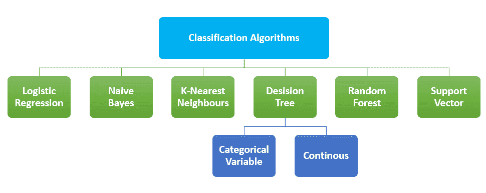
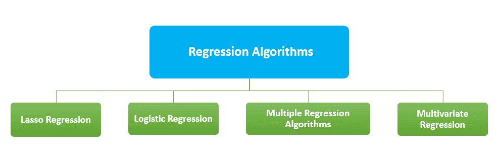

# 人工智能算法

> 原文：<https://learnetutorials.com/artificial-intelligence/algorithms-and-classifications>

在上一个话题中，我们讨论了人工智能的问题解决任务。算法是解决问题的主要技术之一。AI 中有很多类型的算法。其中，一些主要的类别可以在这里讨论。

算法可以定义为开始编程过程的地方，而 **AI 算法可以定义为机器学习的扩展子集，建议计算机学习操作自己的**。人工智能算法已经被用来解决数百万个问题，因此很难列出每一个算法。那么，我们来讨论一下人工智能算法的三个主要类别。

## 分类算法

将数据分类成类的技术称为分类。对问题进行分类的主要目标是确定问题所属的类别。在人工智能中，称为分类算法的算法用于识别给定数据集的类别，这些类型的算法用于预测决定性数据的输出。分类算法是一种监督学习技术，程序从观察中学习，然后将新的观察分为几组。分类过程有助于将大量数据分离成独立的值，如 0/1、真/假。这些算法主要用于预测分类数据的输出。使用这种方法可以发现类似单词、数字序列、s 等模式的相似性。

最广泛使用的分类算法:

### 1.逻辑回归

因为听起来像回归，所以它用于对样本进行分类，属于分类算法。这个模型使用了预测建模作为回归的概念。在逻辑回归中，分类因变量是用一组自变量预测的。该算法的结果是 0 到 1 之间的概率值。它可以使用离散数据集对新数据进行分类。它很重要，因为它提供了可能性。

### 2.NAIVE BAYES

该算法基于贝叶斯定理。这是最简单的解决方案，但功能强大。该算法可用于基于历史结果的二分类和多分类。该算法的准确性取决于强假设。Baye 定理可以用来确定一个事件的发生对另一个事件发生概率的影响。

### 3.k-最近邻居

它是最简单的分类算法之一。KNN 只是存储训练数据的出现，而不是构建一个通用的内部模型。分类是基于每个点的 K 个最近邻居的多数投票。在计算给定查询和数据中所有可用示例之间的距离后，选择与给定查询最接近的有限数量的示例。这个数字在 KNN 算法中用字母 K 表示。然后最常见的标签被投票。这是对 KNN 工作的简单描述。这可以分为分类和回归两类。

### 4.决策图表

决策树方法可以说是可视化决策过程最本能的方式。决策将产生一系列规则，这些规则可用于给定数据的分类。它以树形结构的形式建立分类模型。给定的数据集被分成越来越小的子集。最终的结果将是一个具有决策节点和叶节点的树形结构。该方法从树根开始预测给定输入的类别。根据目标变量的性质，有两种决策树

*   分类变量决策树
*   连续变量决策树

决策树的主要问题之一是它可能导致过度拟合

### 5.随机森林

它在数据集的不同子样本上使用几个决策树。为了防止过拟合，提高预测精度，该方法将平均结果作为模型的预测值。由于结果的准确性，它可以用来解决复杂的问题。这种方法的实现有些困难，也需要更多的时间来形成预测。

### 6.支持向量机

为了对数据点进行分类，支持向量机使用 N 维空间中的超平面。这里用 N 表示特征的数量。n 可以是任何数字，但是如果数字越大，实现模型就越困难。如果 N=2，那么我们可以假设超直线是分隔标签的直线。这条线可以视为决策边界。落在超平面不同边上的任何东西都被分配给不同的类。

### 不同分类算法的优缺点

| 算法 | 优势 | 不足之处 |
| 逻辑回归 | 

*   The influence of several independent variables on a single result variable can be calculated.

 | 

*   Binary variables only applicable to forecast
*   The missing data value of is ignored.
*   Dependence of predictors is ignored.

 |
| 奈伊夫拜厄斯 | 

*   A small amount of training data is needed.
*   Compared with others, it is extremely fast.

 | 

*   Bad estimate

 |
| k 近邻 | 

*   Simple implementation
*   Effective for a large amount of training data.

 | 

*   High computational cost
*   The distance of each instance should be calculated with all training samples.

 |
| 决策图表 | 

*   Low data preparation
*   And numerical and classification data can be processed.
*   Easy to understand visualization

 | 

*   不稳定
*   Complex tree has poor generalization ability.

 |
| 随机森林 | 

*   More accurate
*   Reduce over-fitting

 | 

*   Implementation complexity
*   Complex algorithm
*   Slow prediction

 |
| 支持向量机 | 

*   Memory efficiency
*   Effective in high-dimensional space

 | 

*   Probability estimation is not provided directly.

 |

### 分类算法的应用

*   电子邮件垃圾邮件检测
*   药物分类
*   语音识别
*   生物识别
*   癌症肿瘤细胞的检测。

## 聚类算法

将数据点分成几组的过程称为聚类。每个组中的数据点彼此相似，但与其他组中的数据点不同。相似的项目被分组。最常见的聚类算法有:

### 1.k-均值聚类

这是最简单的学习方法。在人工智能中，K-Means 将数据分组到聚类中来研究相似性。数据点被分组为 K 个簇。对于每个聚类，计算质心，然后评估聚类质心和数据点之间的距离。

### 2.模糊 c 均值算法

概率是 FCM 的基本工作原理。这种方法被称为 fuzzy，因为它不为任何特定簇上的任何数据点分配任何绝对成员资格。每个数据点都分配有属于任何集群的概率值。

### 3.期望最大化算法

高斯分布是这种方法的工作原理。为缺失的数据点选择随机值，通过这些猜测，估计第二组数据。这些新值可用于为第一组创建更好的猜测，并且该过程将继续，直到算法遇到固定点。

### 4.层次聚类算法

在这个模型中，相似的对象被分组到集群中。端点是一组集群，其中每个集群不同于其他集群，并且每个集群具有彼此大致相似的对象。两种类型的层次聚类算法是

*   自上而下方法的分裂聚类
*   对于自下而上的方法，采用聚集聚类

### 聚类算法的优缺点

| 算法 | 优势 | 不足之处 |
| k-均值算法 | 

*   Simple implementation
*   Easily adapt to new instances

 | 

*   The value of k is to be specified in advance.
*   Not suitable for clusters of different sizes and densities.

 |
| 模糊 C 均值算法 | 

*   The degree of membership of data points to clustering is measured by degrees.

 | 

*   Theoretical norms of the number of clusters.

 |
| 期望最大化算法 | 

*   Easy to implement.
*   Each iteration will increase the probability.

 | 

*   Slow convergence
*   Probability of needing forward and backward

 |
| 层次聚类算法 | 

*   No prior information about the number of clusters is required.
*   Easy to implement

 | 

*   Previously executed activities cannot be removed.
*   Time complexity.

 |

### 聚类算法的应用

*   市场研究和客户细分
*   生物数据医学成像
*   搜索结果聚类
*   推荐引擎
*   模式识别
*   社交网络分析
*   图像处理。

## 回归算法

回归算法主要用于预测。人工智能中的回归可以定义为找出变量之间关系的数学方法。回归模型的输出是数值。常见的回归算法有:

### 1.套索回归

套索回归是一种使用收缩的方法。LASSO 代表“最小绝对收缩和选择算子”。通过对数据点施加限制并将其中一些缩小到零值，该算法获得了预测器的子集。这个子集的方式是最小化响应变量的预测误差。

### 2.逻辑回归

这种方法的主要应用是用于二元分类。分析一组变量并预测分类结果。

### 3.多元回归算法

它采用多个解释变量作为输入。它可以描述为线性回归和非线性回归算法的组合。因变量和几个预测变量之间的关系可以用多元回归来评估。

### 4.多变量回归

该算法使用多个预测变量进行操作。它是多元回归的延伸。该算法主要应用于零售领域的产品推荐引擎。

| 算法 | 优势 | 不足之处 |
| 套索回归 | 更简单、更易于解释的模型 | 不适用于组选择 |
| 逻辑回归 | 更容易实现。不太容易过度拟合 | 非线性问题无法解决。难以捕捉复杂的关系。 |
| 多次回归 | 比简单的回归更准确。识别异常的能力。 | 使用不完整的数据，错误地推断相关性是一个原因。 |
| 多变量回归 | 帮助我们理解数据集中变量之间的关系。 | 不适合较小的数据集。 |

### 回归算法的应用

*   输出预测
*   预测数据
*   分析时间序列
*   寻找变量之间的偶然效应相关性。

算法在实现、准确性、性能和处理时间方面各有优缺点。以上只是几个算法和关于它们的一点点。如果你想了解更多，请访问我们的机器学习教程。