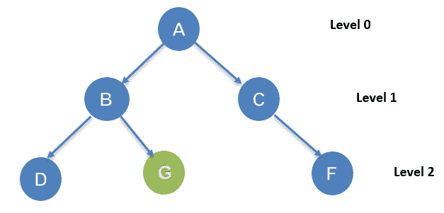
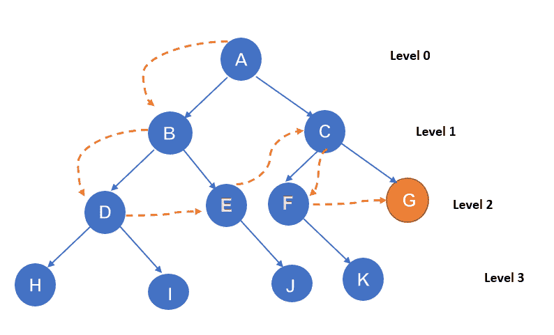
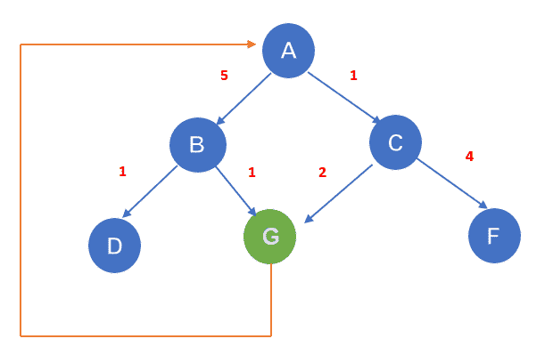
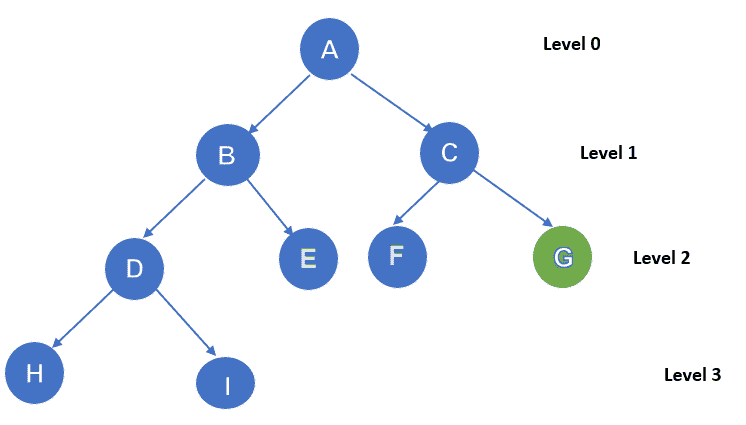
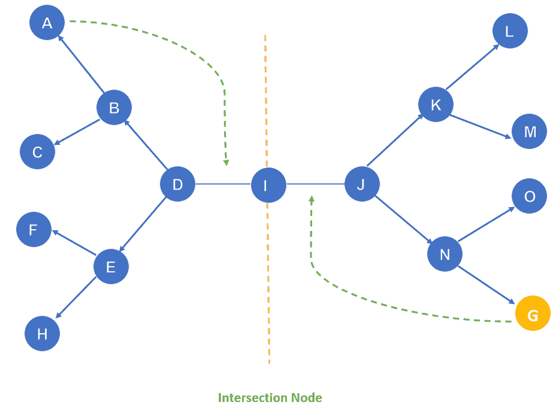

# 人工智能中的搜索算法

> 原文：<https://learnetutorials.com/artificial-intelligence/uninformed-searching-algorithms>

在人工智能中，解决问题的通用技术是搜索。对于一个给定的问题，需要考虑所有可能的方法来从初始状态达到现有的目标状态。人工智能中的搜索可以定义为为给定的一组问题找到解决方案的过程。搜索策略用于指定选择哪条路径来到达解决方案。

## 搜索算法中的术语

*   **搜索**:解决给定搜索问题的分步过程。搜索问题的三个主要因素:
    *   搜索空间:系统可能具有的一组可能的解决方案。
    *   开始状态:智能体开始搜索的状态。
    *   目标测试:监控当前状态并返回目标是否实现的功能。
*   **搜索树**:以树的形式表示搜索问题。树根是问题的初始状态。
*   **动作**:对智能体的所有动作的描述。
*   **过渡模型**:用于表示动作的描述。
*   **解决方案**:从初始节点到最终节点的动作序列。
*   **路径成本**:为每条路径分配数值成本的函数。
*   **最优解**:成本最低的解。
*   **问题空间**:搜索发生的环境。
*   **问题深度**:从初始状态到最终状态的最短路径长度。

## 搜索算法的性质

搜索算法有四个基本属性来比较效率。

1.  **完备性**:如果算法保证返回一个解，那么对于任意随机输入，如果至少存在一个解，那么可以说算法是完备的。
2.  **最优性**:如果算法在其他解中找到了最优解(路径成本最低)，那么这个解可以说是最优解。找到最优解的能力叫做最优性。
3.  **时间复杂度**:算法完成一个任务所花费的时间
4.  **空间复杂度**:搜索过程中任意一点所需的存储空间。

基于搜索问题，搜索算法可以主要分为两类；

## 无信息搜索算法

不知情的搜索算法不知道领域知识，如接近度、目标位置。它只知道如何遍历以及如何区分叶节点和目标节点，因此它是以蛮力方式操作的，因此它也被称为**蛮力算法**。它在没有任何先验知识的情况下搜索每个节点，因此也被称为**盲搜索算法**。

不知情的搜索算法可以分为六种主要类型:

### 1.广度优先搜索:

遍历树或图是最常见的搜索策略。它使用横向搜索过程，因此称为广度优先搜索。该过程从树的根节点开始，扩展到第一级的所有后续节点，然后移动到下一级节点。基于先进先出(FIFO)概念的队列数据结构用于实现这种方法。当它返回一个解(如果它存在的话)时，它可以说是一个完整的算法。

搜索过程从根节点 A 开始。这里的目标节点是 g。从节点 A 开始，它将按照 A-B-C-D-G 的顺序遍历。它将逐级遍历。

| 优势 | 不足之处 |
| 

*   Provide a solution, if one exists.
*   When there are multiple solutions to a given problem, the minimum solution with the least number of steps is provided.

 | 

*   The memory requirement is increased, because each level of the tree must be stored in memory to expand the next level.
*   If the dissociation root node is far away, the time requirement is more.

 |

### 2.深度优先搜索:

这是一个类似于 BFS 的过程。搜索过程从根节点开始，沿着每个路径到达最大深度，然后在进入下一个路径之前回溯。基于后进先出(LIFO)概念的堆栈数据结构用于实现该过程。
例:

搜索过程从根节点 A 开始。这里的目标节点是 g。从节点 A 开始，它将按 A-B-D-G 的顺序遍历。它将按深度遍历。

| 优势 | 不足之处 |
| 

*   Less space is required because it stores nodes linearly.

 | 

*   The algorithm may enter an infinite loop.
*   Possibility of state recurrence.

 |

### 3.深度受限搜索:

这与具有预定限制的深度优先搜索非常相似。DFS 的主要缺点是路径无限，这可以通过深度受限搜索来解决。这里，处于极限的节点被视为没有后续节点。它可以被称为 DFS 的扩展和细化版本。

深度受限搜索将在两个条件下终止。

*   标准故障值:表示给定问题没有任何解决方案
*   截止故障值:表示在给定的极限内，给定的问题没有解决方案。

示例:

搜索从节点 a 开始。该过程的限制设置为 l=2。我们的目标状态是节点 g，这个过程就像 A-B-D-E-C-F-G

| 优势 | 不足之处 |
| 

*   Memory efficiency

 | 

*   [incompleteness]
*   It is not optimal for problems with multiple solutions.

 |

### 4.均匀成本搜索算法:

它用于遍历加权树或图。它不同于 DFS 和 BFS。这里成本被认为是一个因素。达到目标的途径不止一条。选择成本最低的路径。为了遍历路径，选择了成本增加的顺序。如果每次过渡的费用相同，那么可以说与 BFS 的费用相似。

例子。

如果起始节点是 A，目标是 G，那么它将遍历 A-C-G，代价是 3

| 优势 | 不足之处 |
| 

*   Optimal, because the path with the lowest cost was chosen.

 | 

*   May fall into an infinite loop because only the path cost is considered.

 |

### 5.迭代深化深度优先搜索:

它是外勤部和 BFS 的结合体。它会找到最佳深度限制，并且该限制会逐渐增加，直到找到目标。该算法执行深度优先搜索到某个深度极限，并且该深度极限在每次迭代之后增加，直到达到目标。BFs 的快速性和 DFS 的存储效率结合在这个迭代深化深度优先搜索中。随着大的搜索空间和未知深度的目标节点，这可以更有用。

示例:

第 1 次迭代- A
第 2 次迭代- A、B、C
第 3 次迭代- A、B、D、E、C、F、G
第 4 次迭代- A、B、D、H、I、E、C、F、K、G
在第 4 次迭代找到目标节点。

| 优势 | 不足之处 |
| 

 | 

*   Repeat the previous work.

 |

### 6.双向搜索算法:

它同时执行两次搜索。一个从起始端开始叫做向前搜索，另一个从末端开始叫做向后搜索。一个图被两个小的子图代替，一个来自初始顶点，另一个来自最终顶点。当这两个图相交时，搜索过程停止。它可以使用搜索技术，如 BFS，DFS，DLS 等。

示例:

该算法终止于两个子图相遇的节点 I。

| 优势 | 不足之处 |
| 

 | 

*   Implementation difficulties
*   The status of the target must be known.

 |