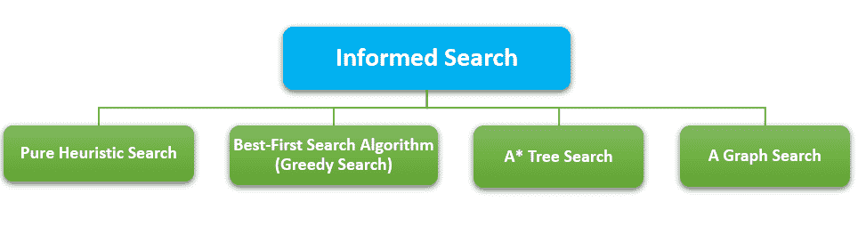

# 知情搜索算法

> 原文：<https://learnetutorials.com/artificial-intelligence/informed-search-algorithms>

我们在上一个主题中讨论了未知的算法。现在人工智能中搜索策略的另一个类别是信息搜索算法。
知情搜索算法包含关于目标状态的信息。这将有助于更有效的搜索。它包含一系列关于目标状态与当前状态有多接近、路径成本、如何达到目标等的知识。有根据的搜索算法在大型数据库中很有用，在大型数据库中，无根据的搜索算法不能得到准确的结果。通知搜索算法也被称为启发式搜索，因为它使用启发式的思想。
启发式函数是用于测量当前状态与目标状态的接近度的函数，启发式属性用于找出到达目标状态的关于路径成本的最佳可能路径。
举一个在谷歌地图上搜索你想去的地方的例子。当前位置和目的地被提供给搜索算法，用于计算该特定路线上的准确距离、花费的时间和实时交通更新。这是使用信息搜索算法执行的。

**知情搜索算法可分为 4 大类。**

### 1.纯启发式搜索

这是基于由 h(n)表示的启发式值执行的简单搜索。它为新的和未扩展的节点维护两个列表 OPEN，为扩展的节点维护两个列表 CLOSE。每次迭代都会扩展启发式值最小的节点。然后它的所有子节点被展开并添加到封闭列表中。然后将启发式函数应用于封闭列表，保存具有最短路径的节点，并分散其他节点。算法从开放列表中的初始状态节点开始。在开放列表中具有最小 h(n)值的节点在每个周期被展开，并生成其子节点，并被保存在封闭列表中。然后将启发式函数应用于子节点，并根据它们的启发式值将其放在开放列表中。

该过程继续，直到选择目标状态进行扩展。

在给定启发式函数的纯启发式搜索中，最简单的方法是

**f(n) = h(n)**

其中 f(n)是成本函数，h(n)是启发式函数。对于小灵通算法来说，即使存在目标节点，也不能保证以无限图终止。

这里返回长度为 4 的解，即使存在长度为 3 的解。PHS 只考虑 h(n)、启发式函数或扩展节点时对目标的估计成本，或从节点 n 到达目标节点的成本，不考虑从起始状态 g(n)到达节点 n 的成本

| 优势 | 不足之处 |
| 

*   Provide quick feedback
*   Early feedback in the design process

 | 

*   Effective application of heuristics requires knowledge and experience.
*   There are many small problems to pay attention to and few big problems to evaluate.

 |

### 2.最佳优先搜索算法(贪婪搜索)

就像最初最喜欢的名字一样，被选中了。它总是选择那个时刻看起来最好的道路。它结合了广度优先搜索和深度优先搜索算法，并利用了这两种算法的优势。它还使用启发式函数并执行搜索过程。它有助于在每一步选择最乐观的节点。最接近目标节点的节点被扩展，并且最接近的成本由启发式函数近似。

让我们借助旅行推销员问题来讨论一下。
给销售员提供一份城市参观地点的清单。他必须找到最佳的旅行路线，以尽可能减少旅行时间。在这里，他可以从他当前要去的地方中选择 2 个或更多的地方。他必须选择距离最小的那个。

节点成本存储在优先级队列 pq 中。
过程可以像
我们的源或起始节点是 S，目标节点是 G. pq 最初是带 S 的，我们从 pa 中去掉 S，添加子节点 **{A，C，B}** (C 放在 B 之前是因为 C 成本更低)。
现在 A 被移除，A，B 被添加到 pq **{C，B，A，b}** 。移除 C 并将 e 添加到 pq **{B，e，a，b}** 移除 B 并将 C，d 添加到 pq **{ e，a，B，C，d}** 。现在 e 被移除，因为我们的目标已经达到

| 优势 | 不足之处 |
| 获得了 BFS 和 DFS 的优点。比外勤部和 BFS 更有效率。 | 不是最佳的。可能会像 DFS 一样陷入循环。 |