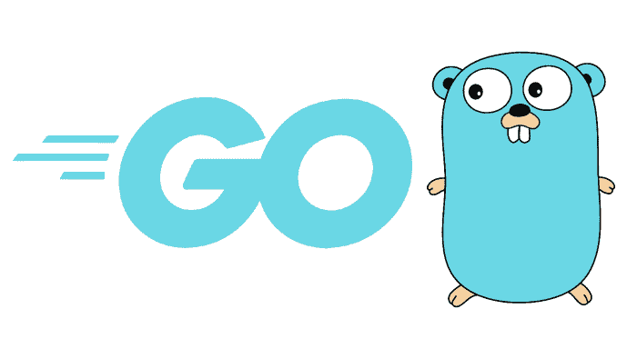

# Go编程语言入门

> 原文：<https://learnetutorials.com/golang/go-programming-language-introduction>

Go 是一种通用编程语言。Go 语言也因其网站域名 golang.org 而被称为 Golang，但其专有名称是 Go。Go是以它的吉祥物“地鼠”命名的。

Go 是谷歌开发的。Go的发展始于 2007 年，当时是谷歌的一个内部项目。《Go》的最初设计者是罗伯特·格里森、罗布·派克和肯·汤普森。
Go 的设计始于避免当时已经存在的编程语言的问题、困难和缺点的目的。Go 的灵感来自其他各种流行语言，如 C、C++、Python、Smalltalk、Pascal 等。
Go的受欢迎程度与日俱增。背后的原因是 Go 可以作为 Java、C++、C 等流行复杂编程语言的替代品。用于开发 web 应用程序、数据库、网络编程等。

### Go开发者

## Go的历史

Go的发展始于 2007 年谷歌内部的一个项目。《Go》的最初设计者是罗伯特·格里森、罗布·派克和肯·汤普森。罗伯特·格里森是在谷歌工作的瑞士计算机科学家。罗布·派克是加拿大程序员和作家。他也是 UNIX 团队的一员，为谷歌工作。肯·汤普森是美国计算机科学的先驱。还有，他是 Unix、B 编程语言、C、Go、火海等的设计者和创造者。除了最初的设计师之外，Go 在谷歌还有一个团队，包括 Russ Cox、Ian Lance Taylor、Andrew Gerrand 和许多其他开发 Go 的人。
Go 于 2009 年公开宣布，成为开源。Go 的首次发布是在 2012 年 3 月。第一个版本是 Go 版本 1 或 Go 1。Go 的最新版本是 2021 年 2 月发布的 Go 1.16。

## Go的特点

*   **    Strongly Statically-Typed Language :**

    Go 是一种强静态类型的编程语言，这意味着类型检查是在编译时完成的。许多程序员可能认为这对于编写大型程序来说很困难，但是 Go 的语法很短。此外，Go 提供了一个方便的 duck typing 版本(duck typing 是一个在没有类型的对象上调用现有方法的系统，如果已经定义了该方法，则可以调用它)。

*   **    Open-Source License : **

    自 2009 年以来，Go 获得了自由开源许可。拥有开源许可证的软件不是专有的，源代码可以免费使用、修改和分发给公众。这是一个庞大的程序员社区，提供开发、问题的新解决方案等支持。
    来自世界各地的众多开发者为 Go 的开放开发模式做出了贡献。此外，许多第三方Go软件包都可以在Go仪表盘中找到。

*   **    Memory Management :**

    在程序执行时，它们将对象写入内存，但有时这些对象在不再需要时不得不被移除。移除这些不需要的对象的过程称为内存管理。
    Go 提供自动动态内存管理，称为垃圾收集。因此，不需要手动释放内存。垃圾收集可以提供各种好处，比如更高的安全性、更好的可移植性、更短的代码长度等。

*   **    Goroutines : **

    在 Go 语言中，同时(并发)执行的每个活动(方法或函数)都称为 Goroutines。每个程序至少有一个被称为主 goroutine 的 Goroutine。如果主 Goroutine 被终止，那么其中的所有 Goroutine 也将被终止。

*   **    High-Level Concurrency :   **

    大型程序是由较小的子程序组合而成的。同时和独立执行这些较小的子程序的过程称为并发。Go 通过使用 goroutines 和 channels 实现了高并发性。

*   **    “C” inspired : **

    Go 语言在语法上类似于“C”，这使得那些对编程语言有基础知识的人更容易学习。Go 使用非常容易理解的语法，可以避免复杂性和冗长。

*   **    Procedural Programming Language :**

    Go 是一种过程编程语言。过程编程是基于调用过程概念的编程模型，也称为函数、例程或子例程

*   **    Multi-Paradigm :**

    Go 允许使用最适合解决问题的范例。Go 是一种纯过程语言，但也支持面向对象编程。Go 的面向对象方法与其他流行的语言(如 C++、Java 或 Python)完全不同，与这些语言相比，Go 更容易使用，也更灵活。

*   **    Standard Library :**

    Go 有一个由一组核心包组成的标准库。这些包可以添加到各种程序中，以增强和扩展语言。这样就不需要构建自己的包或下载他人创建或发布的包。

## Go的优势

*   Go is simple and easy to learn:

    Go 有一个简单的语法，对初学者来说很容易。此外，互联网上还有各种类型的教程。

*   Go is simple and short:

    Go 有简单而简短的代码行，这有助于节省时间。这非常重要，因为阅读和理解大型程序非常耗时。

*   Go has syntaxes similar to the C programming language:

    对于那些有编程语言基础知识的人来说，Go 更容易理解。

*   Fast compile-time and run-time:

    用 Go 编写的代码被直接翻译成处理器可以理解的格式。因此，它不需要更多的时间来执行。

*   Potability: 

    Go 可以在 Windows、Linux、Mac 等不同操作系统(平台无关)上工作。

*   许多集成开发环境(IDEs)和编辑器如 Emacs、VSCode、Eclipse 等都支持 Go。
*   使用垃圾收集器进行高效的内存管理。
*   内置并发。
*   它是一种开源编程语言。

## Go的主要缺点

*   Go是一门非常年轻的语言，还在发展中。
*   缺乏图书馆。
*   没有手动内存管理。
*   与其他编程语言相比，Go 的在线帮助或支持较少。

## Go的使用领域:

*   Go 用于创建高性能系统编程。
*   Go 被广泛用于 web 应用程序的开发。
*   Go 在基于网络的程序开发中很受欢迎。
*   Go 可用于云和服务器端应用等应用。
*   各种命令行工具是用 Go 语言编写的。
*   Go用于人工智能和数据科学。
*   Go 还用于微控制器编程、游戏和机器人技术。

## 使用 Golang 的顶级公司

*   谷歌
*   脸谱网
*   推特
*   国际商用机器公司
*   英国广播公司(British Broadcasting Corporation)
*   收纳盒
*   声音云
*   日常生活
*   超级的
*   油管（国外视频网站）