# 为 Go 设置集成开发环境:

> 原文：<https://learnetutorials.com/golang/ide-setup>

## 什么是 IDE？

ide 是用来帮助程序员开发其他应用程序的应用程序。它们被设计成将几乎每个编程任务都包含在一个应用程序中。IDEs 提高了程序员的生产力，加快了软件产品的开发速度。
网上有免费的 IDEs，包括 Visual Studio Code (VS Code)、Eclipse 等。一些需要付费才能使用的 IDEs 是 Goland 和 IntelliJ IDEA。这些 ide 可用于编辑和调试 Go 命令。

基于网络(在线)的集成开发环境也可以用于软件开发，但是它们提供的功能有限。基于网络的 IDEs 的主要优点是它需要更少的设置工作，降低个人硬件要求等。
一些免费的网络版 IDE 的网址如下:
[【https://play.golang.org】](https://play.golang.org)
[https://www.onlinegdb.com](https://www.onlinegdb.com)

在本教程中，我们将使用 VS 代码作为 Go 的 IDE。

## 安装 Visual Studio 代码(VS 代码):

VS Code 是一个免费的 IDE，用于 Windows、macOS 和 Linux 等操作系统。微软开发的 VS 代码。VS Code 支持许多其他编程语言，如 HTML、JavaScript、Java、CSS 等。
按照以下步骤安装 VS 代码:

1.  访问以下链接:
    [https://code.visualstudio.com/](https://code.visualstudio.com/)
2.  点击**下载**选项，下载对应操作系统的 VS Code 安装程序。
3.  下载完成后运行安装程序。只需要不到一分钟。
4.  然后接受许可协议，点击**下一步**按钮。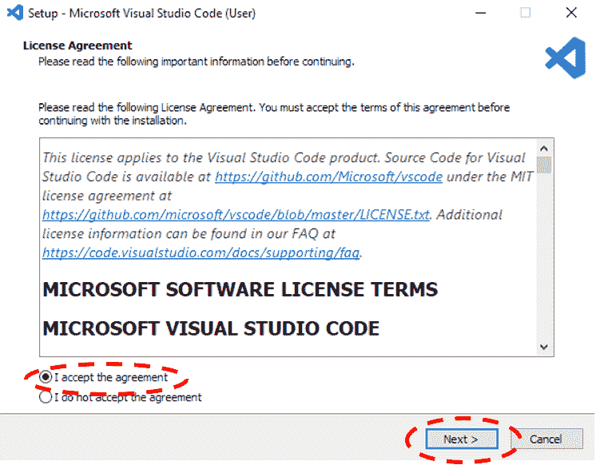
5.  Set the destination location to install VS Code.

    (将给出默认的目标位置，但如果您想在不同的位置安装 VS Code，则单击“浏览...”按钮选择另一个目标位置。)

    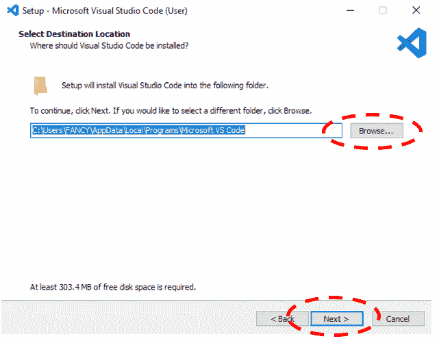
6.  下一个窗口是设置开始菜单文件夹。如果你想选择不同的文件夹，点击**浏览** …”按钮，如果你不想创建任何开始菜单文件夹，点击下面给定的复选框。然后点击**下一步**按钮。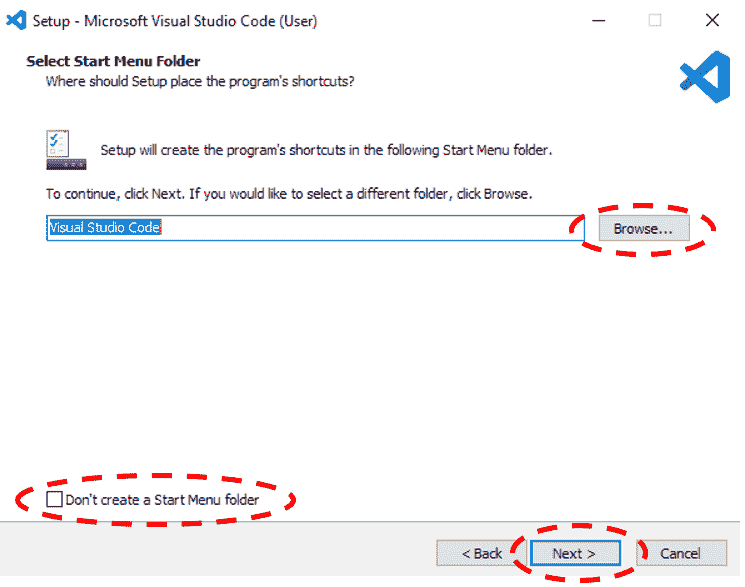
7.  下一个窗口将提供安装 VS 代码时要执行的附加任务。选择您想要设置执行的附加任务，然后点击“**下一步**”按钮。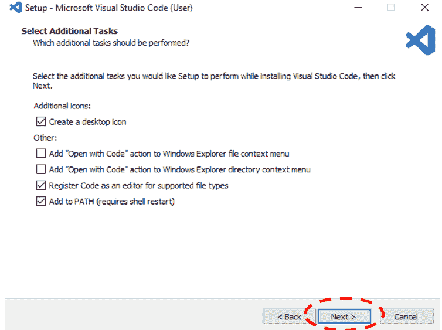
8.  点击**安装**按钮，开始安装 VS Code，等待安装完成。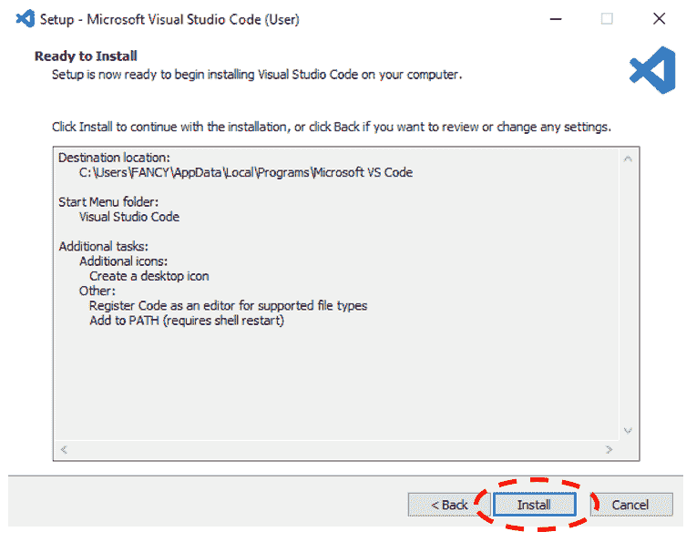
9.  安装完成后，点击**完成**按钮，VS 代码打开。

现在 VS 代码的安装在您的系统上成功完成。

## 将 VS 代码配置为使用 Go

现在需要配置 VS 代码在里面使用 Go。进行配置时，请确保在您的系统上启用互联网连接。
按照下面给出的步骤和相应图片配置 VS 代码:

1.  启动 VS 代码。
2.  从活动栏打开分机管理器，或按**Ctrl+Shift+x .**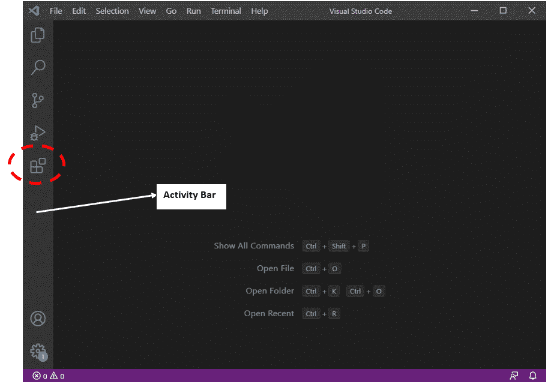
3.  在搜索框中输入“**转到**，然后按回车键。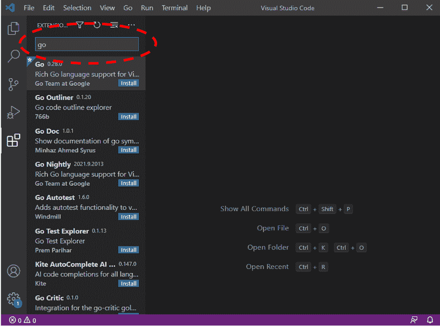
4.  从搜索结果来看，在谷歌安装 **Go 团队的 Go 扩展。**
5.  Go 扩展安装完成后，从**视图**菜单打开命令面板或按 **Ctrl + Shift + p** 。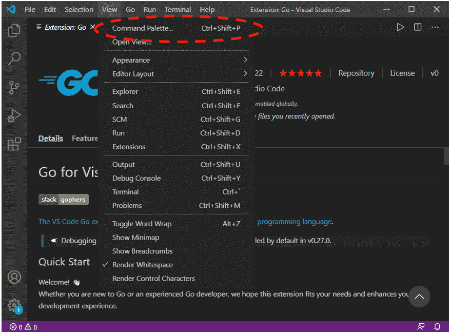
6.  在命令面板中键入“ **Go:安装/更新工具**”，然后按回车键。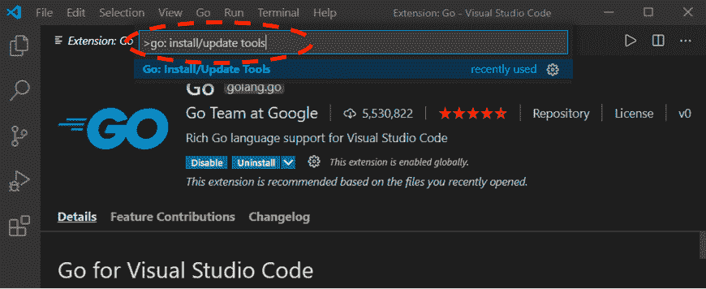
7.  Select all the tools in the list and click **OK**.

    安装状态将显示在输出窗口中，如下所示:

    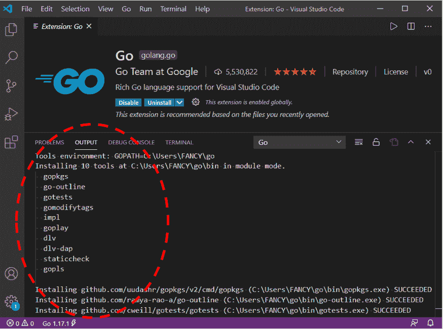
8.  现在按照子步骤检查 Go 是否安装成功。
    *   从**查看**菜单打开终端或按 **Ctrl +** `。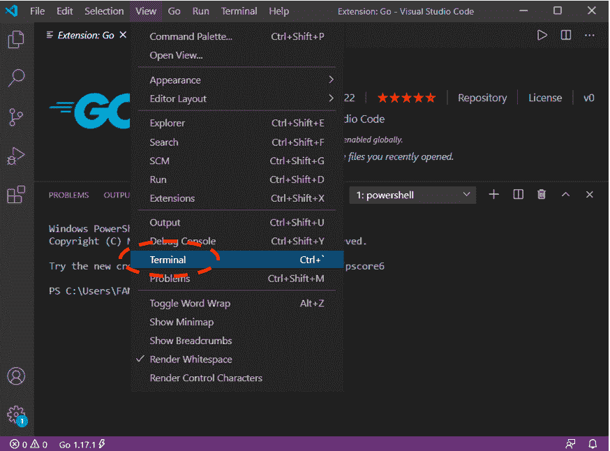
    *   如截图所示，在终端上输入“ **go 版本**，按回车键: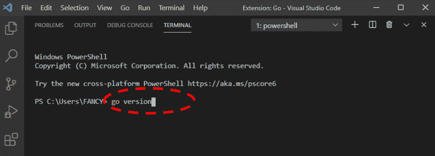
    *   If the installation is successful, then the Terminal will display the current version of Go as shown in the screenshot below:

        现在，VS 代码准备在其中使用 Go。

## 使用 VS 代码打印“你好世界”的基本程序:

使用文本编辑器和命令提示符创建和执行 go 程序与在 VS 代码中创建和执行 go 程序相同。
现在按照以下步骤在 VS Code 中运行一个简单的基本 Go 程序:

1.  首先，通过按下 **Ctrl + N** 或从“文件”菜单中选择“**新文件**，在 VS Code 中创建新文件。
    **文件> >新文件**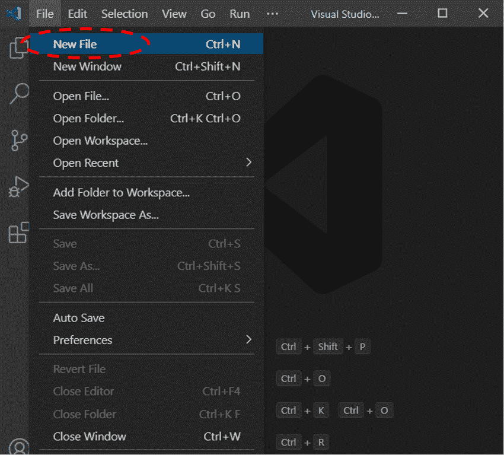
2.  将以下 Go 命令键入或复制并粘贴到刚刚创建的新文件中:

    ```go
     package main  
    import ("fmt")  
    func main(){  
       fmt.Println("Hello, World!")  
    } 

    ```

    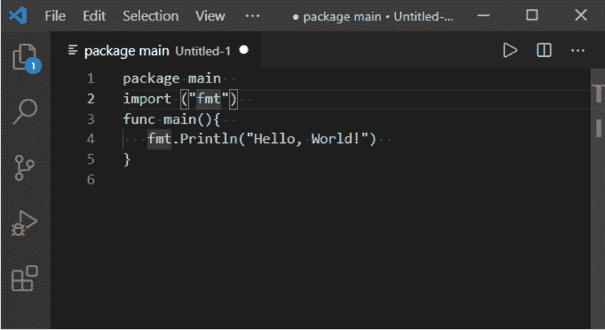
3.  现在通过按 **Ctrl + S** 保存文件，或者从**文件**菜单中选择**保存**选项。
4.  将出现另存为窗口。在窗口中，设置保存 GO 文件的位置，输入 Filename 为 helloworld，**另存为类型**为 Go，然后点击**保存**按钮:
    T5】文件> >另存为>>hello world(Filename)>>Go(另存为类型)**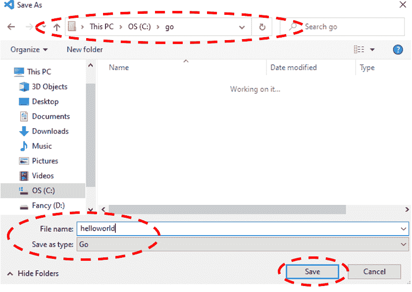**
***   按照子步骤运行/执行 Go 程序:
    *   通过按下 **Ctrl +** 打开 VS 代码中的**终端**,或者从**查看**菜单中选择终端选项:
        **查看> >终端**
    *   在终端中，使用“ **cd** ”(更改目录)命令打开保存 Go 文件的文件夹。如果你的 Go 文件保存在一个子文件夹中，那么使用“cd”命令打开每个子文件夹，如下图所示:**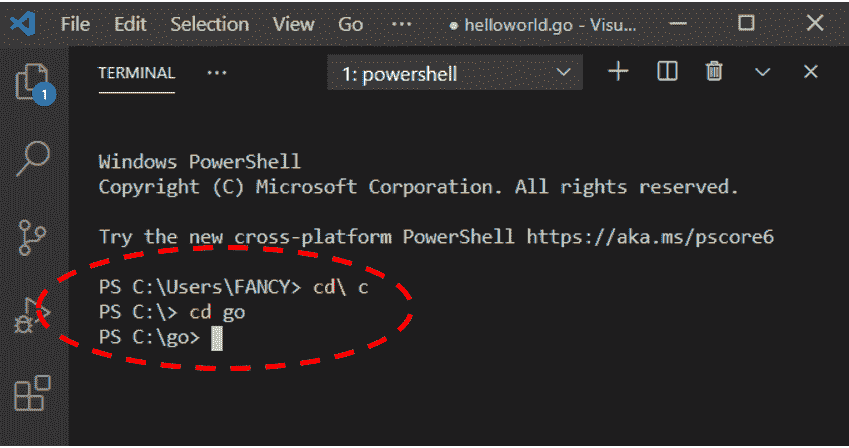** 
    *   现在在终端中键入以下命令来运行程序。
        **去跑地狱世界****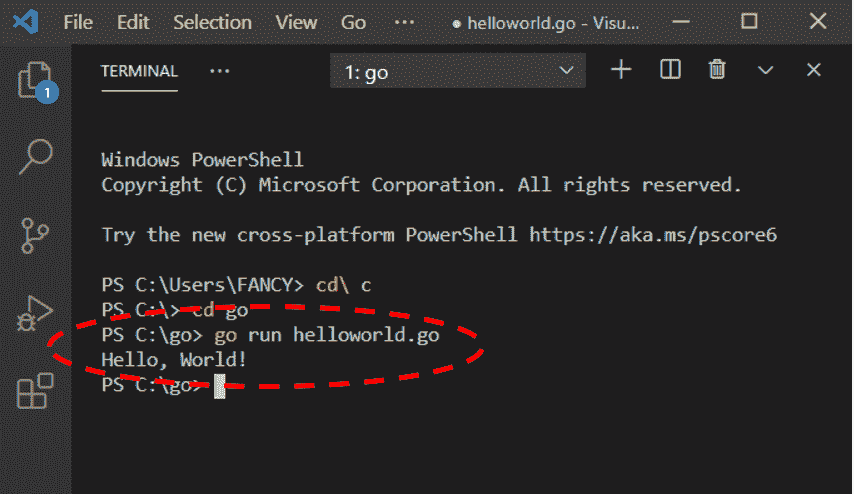** 
    *   The program can also be saved as an executable by the following command:
        **Go build helloworld.go******

        打开保存 helloworld(您的 Go 文件)文件的文件夹，查看可执行文件。

        **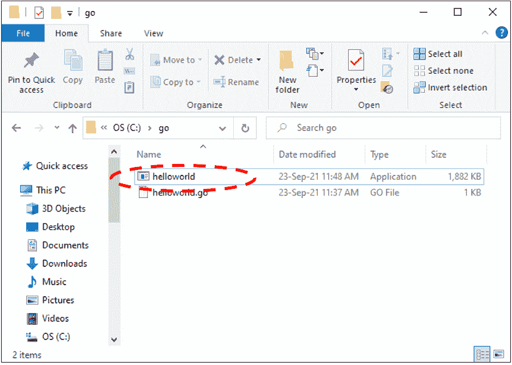**

        这个可执行文件可以在 VS 代码中访问，如下图所示:

        **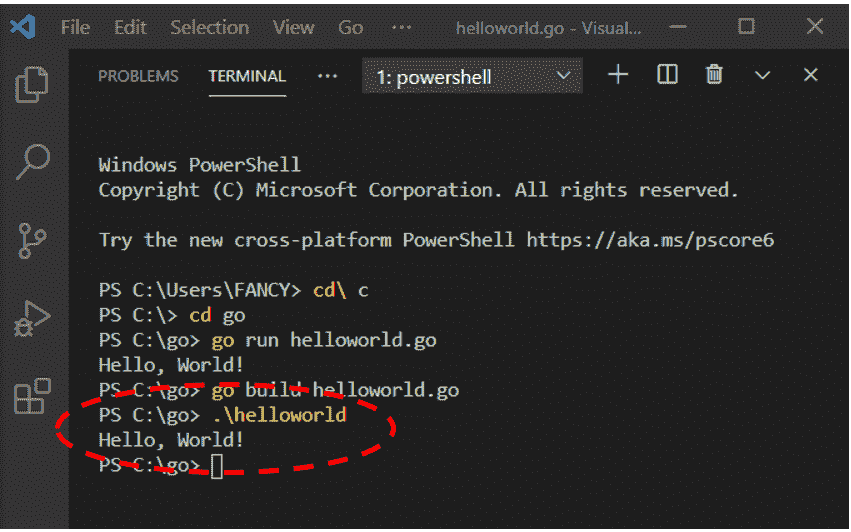****