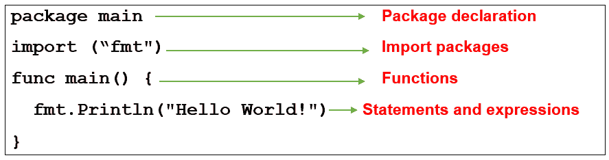

# 围棋程序中的语法和注释

> 原文：<https://learnetutorials.com/golang/syntax-and-comments>

## Go 中的注释

注释是程序中的文本，在程序执行过程中被忽略。编译器将注释视为不可执行的命令。注释用于程序文档。它可以提供关于源代码或程序中使用的任何语句的信息、描述或解释。注释是人类可读的信息。
注释也用于在特定时间隐藏某些代码，或者在程序测试过程中阻止程序中某些代码或某个代码块的执行。

### 在程序中使用正确注释的主要好处是:

*   它将提高源代码的质量和效率。
*   写好注释将增加程序中使用的命令和逻辑的可读性。
*   正确使用注释可以帮助开发人员进行代码维护。
*   注释非常有助于更快地发现错误。

Go 提供了两种形式的注释，它们是:

## 单行注释

单行注释用于对程序中的单行语句进行注释。它们被用来描述一行代码。
**单行注释使用两个正斜杠(// )** 。任何写在//之后到行尾的内容都会被编译器忽略，这意味着这段文字不会被执行。
单行注释可以放在行前或代码末尾。

### 单行注释的语法:

```
 // type the comments here 

```

### 单行注释示例:

```
 // This is a single-line comment before the line of code
package main
import ("fmt")// This is a single-line comment at the end of the code
func main() {
  fmt.Println("Hello World!") 
} 

```

## 多行注释

多行注释也称为块注释。它们用于对程序中的多行语句进行注释。多行注释以/*开头，以*/结尾。/*和*/之间编写的文本/语句/代码将不会在程序执行期间执行。
单行注释也可以多行注释格式书写。

### 多行注释的语法:

```
 /* type multiple lines of statements here*/ 

```

### 多行注释示例:

```
 package main
import ("fmt")
func main() {
  /* this is a multi-line comment
it contains multiple lines of comments */
  fmt.Println("Hello World!")
} 

```

## 源代码作为注释

在许多编程语言中，程序员也广泛使用注释功能来防止源代码被执行。可以对一行源代码或一个源代码块进行注释。这个特性将帮助程序员发现程序中的错误。Go 语言也支持这个功能。

### 例子

```
 package main
import ("fmt")
func main() {
   //fmt.Println("Hello World!")
 /**/
} 

```

## 基本围棋程序的结构

围棋程序主要由以下部分组成:

1.  包装声明
2.  导入包
3.  功能
4.  语句和表达式

为了理解基本围棋程序的结构，下面给出了一个示例程序:

### 在屏幕上显示消息的示例程序



让我们学习围棋程序的每个部分…

1.  **Package declaration: **

    每个围棋程序都必须以一个包声明开始，因为每个围棋程序都是一个包的一部分。这些包用于重用和组织代码。在 Go 编程语言中，关键字“包”用于定义包。在上面的例子中，程序属于“主”包。“主”包告诉编译器，包必须在可执行程序中编译。可执行程序是可以直接从终端运行的程序。“main”包中还包含 main()函数。

2.  **Import packages:**

    此部分用于将各种包导入您的 Go 程序。Go 编程语言提供了各种具有预定义基本功能的内置包，以帮助程序员简化编码。“fmt”(fmt 代表 Format 包)就是这样一个包，它用来格式化输入和输出的功能。在上面的示例程序中，“fmt”包中的文件包含在该程序中。

3.  **Functions:**

    Go 程序的执行从 main()函数开始。主包包含 main()函数，Go 编程语言中的每个可执行程序都必须包含一个主包和 main()函数。不需要调用 main()函数来执行其中的代码，因为该函数是自动调用的。main()函数不允许任何参数，也不返回任何内容。在 Go 编程语言中，关键字“func”用于创建函数。

4.  **Statements and expressions:  **  

    程序的语句和表达式都写在这一部分。在上面的示例程序中，语句 fmt。《你好，世界》)用于在屏幕上显示“Hello World”字符串。这里，Println()是 fmt 包的一种方法。