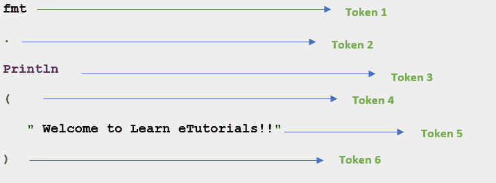

# 围棋中的代币

> 原文：<https://learnetutorials.com/golang/tokens>

在编程语言中，标记是源代码的基本组成部分。标记构成了编程语言的词汇。
例如，下面的 Go 语句由 6 个标记组成–

```go
 fmt.Println("Welcome to Learn eTutorials!!") 

```

单个令牌是



在 Go 编程语言中，令牌分为五类。他们是…

1.  **Keywords:**

    在编程语言中，关键字是具有某种特殊含义的预定义单词。关键字用于执行一些预定义的操作。关键字不允许用作标识符。Go 编程语言支持 25 个关键字。它们是:

    
2.  **Identifiers:** 

    在编程语言中，标识符是程序中组件的用户定义名称或实体。标识符是用于标识组件的一个或多个字母和数字的序列。在 Go 语言中，标识符可以是常量、函数名、变量名、包名、类型或语句标签。

3.  **Operators:**

    运算符是每种编程语言的基本组成部分。运算符用于对操作数(变量和值)执行不同类型的操作。Go 编程语言根据其功能提供不同类型的运算符，如下所示:

    1.  算术运算符
    2.  比较运算符
    3.  逻辑运算符
    4.  赋值运算符
    5.  BitWise 运算符
4.  **    Variables:**

    在 Go 编程语言中，变量用于在内存中存储值。变量是具有特定类型和关联名称的存储位置。正确命名变量是软件开发的一个重要部分。

5.  **Literals or Constants:**

    在 Go 编程语言中，文字是程序中的固定值，在程序执行过程中可能不会改变。文字也称为常数。Go 编程语言中有不同类型的文字。它们是:

    1.  整数文字
    2.  浮点文字
    3.  字符串文字