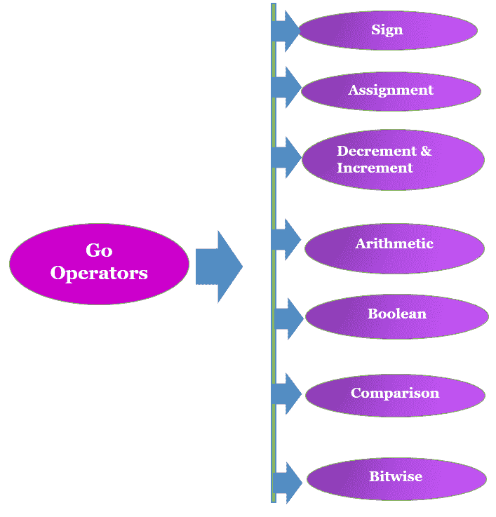
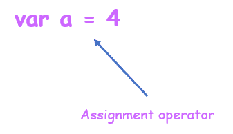

# 戈朗的运营商

> 原文：<https://learnetutorials.com/golang/operators-and-punctuations>

在本教程中，您将学习 Go 编程语言中使用的各种类型的运算符。
我们将进一步讨论如何使用这些运算符来创建表达式，从而使 Go 代码变得简单易行。

## 格朗有哪些运营商？

运算符是每种编程语言的基本组成部分。任何编程语言中的运算符都是表示某些数学计算或函数性能的符号。运算符用于对操作数(变量和值)执行特定操作。操作数是操作符的输入或参数之一。比如加 20 + 30 =？是由操作数和运算符组成的表达式，数字 20 和 30 表示输入或操作数，而符号“+”、“=”构成运算符？


**注**:表达式是根据运算符的优先&结合性计算的

根据操作数在操作中的参与程度，运算符可以分为一元和二元类型。

*   **一元运算符** : -使用一个操作数的运算符。
*   **二进制运算符**:-运算两个操作数的运算符。

## 格朗有哪些类型的运营商？

Golang 支持类似于其他编程语言的操作符，如

1.  符号运算符
2.  赋值运算符
3.  递增和递减运算符
4.  算术运算符
5.  逻辑算子
6.  比较运算符
7.  逐位运算符

在接下来的几节中，我们将分别讨论每个运算符。



## Golang 中的符号运算符

符号运算符表示 Go 编程语言中值的符号。符号运算符主要有两种类型。


正(“+”)和负(“-”)符号运算符表示在 Golang 中声明的变量的整数值的符号。让我们通过下面给出的一个简单的围棋程序来理解

例子

```
 package main
import "fmt"

func main() {

 var s = 1
// -(-1)= +1
fmt.Println(" + sign operator prints positive numbers ")
 fmt.Println(-(-s))
// -1 = -1 
fmt.Println(" - sign operator prints negative numbers ")
   fmt.Println(-s)
} 

```

**输出:**

```
 + sign operator prints positive numbers 
1
 - sign operator prints negative numbers 
-1 
```

在上面的程序中，变量 s 是用 var 关键字(链接到变量声明)声明的。减号表示整数的符号，不管它是正数还是负数。

## 递增和递减运算符

Go 与许多其他编程语言一样，支持递增和递减操作，以增加(递增)或减少(递减)一个值。表示递增运算符的符号是“++”&递减运算符是“-”。假设一个变量 x 被声明并赋值 10，即 var x = 10。


让我们用一个例子来理解这个概念

例子

```
 package main
import "fmt"

func main() {

    x := 10

    x++  //increment operator x=x+1=10+1=11
    x++    //increment operator  x=11+1=12

    fmt.Println("The varaiable x is incremented two times ",x)

    x--      // decrement  operator x=12,x-1=12-1=11
    fmt.Println("The variable x is decremented one time ", x)
} 

```

**输出:**

```
 The varaiable x is incremented two times  12
The variable x is decremented one time  11 
```

## 算术运算符

算术运算符用于在操作数之间执行算术运算。

| 操作员 | 行动名称 | 描述 | 例子 |
| **操作** | **结果** |
| + | 添加 | 用于添加两个操作数 | 2 + 5 | seven |
| - | 减法 | 用于从第一个操作数中减去第二个操作数。 | 5 - 4 | one |
| * | 增加 | 用于乘以两个操作数 | 2 * 6 | Twelve |
| / | 分开 | 用于将第一个操作数除以第二个操作数。 | 6 / 2 | three |
| % | 系数 | 该运算符返回操作数之间除法的余数。 | 5 % 2 | one |

### 使用算术运算符的示例程序:

```
 package main
import ("fmt")
func main() {
  x:= 10
  y:= 2
  fmt.Println("Addition:",x+y)
  fmt.Println("Subtraction:",x-y)
  fmt.Println("Multiplication:",x*y)
  fmt.Println("Division:",x/y)
  fmt.Println("Modulus:",x%y)
} 

```

**输出:**

```
 Addition: 12
Subtraction: 8
Multiplication:20
Division:5
Modulus:0 
```

## 比较运算符

比较运算符将其左侧值(或表达式)与右侧值(或表达式)进行比较。比较运算符也称为关系运算符。使用比较运算符的运算输出将是一个真或假的布尔值。

| 操作员 | 行动名称 | 描述 | 例子 |
| **操作** | **结果** |
| == | 平等的 | 该运算符用于检查两个操作数是否相等。如果第一个操作数等于第二个操作数，则返回*真*。否则，返回*假*。 | 4 == 4 | 真实的 |
| 2 == 5 | 错误的 |
| ！= | 不平等 | 该运算符将检查两个操作数是否相等，如果不相等，则返回 *true* ，否则返回 *false* 。 | 2 ! = 2 | 错误的 |
| 4 ! = 5 | 真实的 |
| < | 较少的 | 如果第一个*操作数的值小于第二个操作数，该运算符将返回真，否则将返回假*。** | 3 < 6 | 真实的 |
| 2 < 2 | 错误的 |
| <= | 少于或等于 | 如果第一个操作数的值小于或等于第二个操作数，该运算符将返回 *true* ，否则返回 *false* 。 | 7 <= 7 | 真实的 |
| 10 <= 5 | 错误的 |
| > | 包括市区及郊区的 | 如果第一个操作数的值大于第二个操作数，该运算符将返回 *true* ，否则将返回 *false* 。 | 10 > 3 | 真实的 |
| 3 > 3 | 错误的 |
| >= | 大于或等于 | 如果第一个操作数的值大于或等于第二个操作数，该运算符将返回 *true* ，否则返回 *false* 。 | 10 >= 10 | 真实的 |
| 1 >= 4 | 错误的 |

### 使用比较运算符的示例程序:

*   Equal (==)

    ### 转到程序检查这两个数字是否相等

    ```
     package main
    import ("fmt")
    func main() {

      var x = 3
      var y = 2

      fmt.Println(x==y) 
    } 

    ```

    **输出:**

    ```
     false 
    ```

*   Not Equal (!=)

    ### 进入程序检查数字是否不相等

    ```
     package main
    import ("fmt")
    func main() {

      var x = 3
      var y = 2

      fmt.Println(x!=y) 
    } 

    ```

    **输出:**

    ```
     true 
    ```

*   Greater (>)

    ### 转到程序检查“x”是否大于“y”

    ```
     package main
    import ("fmt")
    func main() {

      var x = 3
      var y = 2

      fmt.Println(x>y) 
    } 

    ```

    **输出:**

    ```
     true 
    ```

*   Greater or equal (>=)

    ### 转到程序检查“x”是否大于或等于“y”

    ```
     package main
    import ("fmt")
    func main() {

      var x = 3
      var y = 2

      fmt.Println(x>=y) 
    } 

    ```

    **输出:**

    ```
     true 
    ```

*   Less (<)

    ### 转到程序检查“x”是否小于“y”

    ```
     package main
    import ("fmt")
    func main() {
      var x = 3
      var y = 2
      fmt.Println(x
    ```

    **输出:**

    ```
     false 
    ```

*   Less or Equal (<=)

    ### 转到程序检查“x”是否小于或等于“y”

    ```
     package main
    import ("fmt")
    func main() {

      var x = 3
      var y = 2

      fmt.Println(x<=y) 
    } 

    ```

    **输出:**

    ```
     false 
    ```

## 逻辑运算符

逻辑运算符用于执行逻辑运算“与”、“或”和“非”。使用逻辑运算符的运算输出将是一个真或假的布尔值。

| 操作员 | 行动名称 | 描述 | 例子 |
| **操作** | **结果** |
| && | 和 | 如果两个语句都为*真*，则该运算符返回真，否则返回*假*。 | 如果 x 的值是 5，(x > 4 & & x < 6) | 真实的 |
| 如果 x 的值是 2，(x > 4 & & x < 6) | 错误的 |
| &#124;&#124; | 运筹学 | 如果任一语句为*真*，则该运算符返回真，否则返回*假*。 | 如果 x 的值是 5，(x < 10 &#124;&#124; x == 5) | 真实的 |
| 如果 x 的值是 5，(x > 10 &#124;&#124; x == 20) | 错误的 |
| ！ | 不 | 该运算符反转结果。如果语句为假，非操作符返回*真*，如果语句为真，则返回*假*。 | 如果 x 的值是 5，(！(x > 4 & & x < 6)) | 真实的 |
| 如果 x 的值是 5，(！(x > 4 &#124;&#124; x < 6)) | 错误的 |

### 使用逻辑运算符的示例程序:

*   AND (&&)

    ### 转到程序检查“x”的值是否大于 4 且小于 6

    ```
     package main
    import ("fmt")
    func main() {
      var x = 5
      fmt.Println(x > 4 &&  x < 6) 
    } 

    ```

    **输出:**

    ```
     true 
    ```

*   OR (||)

    ### 转到程序检查“x”的值是小于 10 还是大于 20

    ```
     package main
    import ("fmt")
    func main() { 

      var x = 5

      fmt.Println(x < 10 || x > 20) 
    } 

    ```

    **输出:**

    ```
     true 
    ```

*   NOT (!)

    ### 如果“x”的值大于 4，请转到程序打印“true”

    ```
     package main
    import ("fmt")
    func main() {

      var x = 5

      fmt.Println(!(x > 4))
    } 

    ```

    **输出:**

    ```
     false 
    ```

## BitWise 运算符

BitWise 运算符用于对二进制数执行按位运算。首先，整数被转换成二进制格式，然后一点一点地执行操作。

| 操作员 | 行动名称 | 描述 | 例子 |
| & | 按位“与” | 两个操作数都被转换成二进制数系统，并对二进制数的每一位执行“与”运算。 | 如果 x=3 和 y=2，则 x = 11 和 y = 10 的二进制值，则 x & y = 10 |
| &#124; | 按位“或” | 两个操作数都被转换成二进制数系统，并对二进制数的每一位执行或运算。 | 如果 x=3 和 y=2，x = 11 和 y = 10 的二进制值，则 x &#124; y = 11 |
| ^ | 按位异或 | 两个操作数都被转换成二进制数系统，并对二进制数的每一位执行异或运算。 | 如果 x=3 和 y=2，二进制值 x = 11 和 y = 10，那么 x ^ y = 1 |
| << | 左移 | 两个操作数都转换为二进制数系统，并将第一个操作数的位向左移动指定的位数。 | 如果 x=10，二进制值 x = 1010，则 x << 2 = 101000 |
| >> | 右移 | 两个操作数都转换为二进制数系统，并将第一个操作数的位向右移动指定的位数。 | 如果 x=10，二进制值 x = 1010，则 x >> 2 = 10 |
| & | 而不是 | 这个运算符用于清除一个位。 | 如果 x=5 和 y=2，二进制值 x = 101 和 y = 10，那么 x &^ y = 101 |

### 使用按位运算符的示例程序:

*   bitwise AND (&),bitwise OR (|),bitwise XOR (^)

    ### 按位“与”、“或”、“异或”示例

    ```
     package main
    import ("fmt")
    func main() {

      var x = 10
      var y = 11

      fmt.Printf("x = %b\n",x)
      fmt.Printf("y = %b\n",y)

      fmt.Printf("x & y is %b\n",x & y)
      fmt.Printf("x | y is %b\n",x | y)
      fmt.Printf("x ^ y is %b\n",x ^ y)
    } 

    ```

    **输出:**

    ```
     x = 11
    y = 10
    x & y is 10
    x | y is 11
    x ^ y is 1 
    ```

*   left shift (<<)

    ### 示例程序

    ```
     package main
    import ("fmt")
    func main() {

      var x = 10
      fmt.Printf("x = %b\n",x)

      fmt.Printf("x << 2 is %b\n",x << 2)
    } 

    ```

    **输出:**

    ```
     x = 1010
    x << 2 is 101000 
    ```

*   right shift (>>)

    ### 示例程序

    ```
     package main
    import ("fmt")
    func main() {

      var x = 10
      fmt.Printf("x = %b\n",x)

      fmt.Printf("x >> 2 is %b\n",x >> 2)
    } 

    ```

    **输出:**

    ```
     x = 1010
    x >> 2 is 10 
    ```

*   AND NOT ($^)

    ### 示例程序

    ```
     package main
    import ("fmt")
    func main() {

      var x = 5
      var y = 2

      fmt.Printf("x = %b\n",x)
      fmt.Printf("y = %b\n",y)

      fmt.Printf("x &^ y = %b\n",x &^ y)
    } 

    ```

    **输出:**

    ```
     x = 101
    y = 10
    x & y is 101 
    ```

## 赋值运算符

变量是一个占位符，它将值存储在其中，供以后在 Go 程序中使用。这些值通过称为赋值运算符的运算符赋给变量。



var 关键字使用运算符“=”为变量 a 赋值 4。

**注**:在将变量 a 声明为 a: = 4 时，使用符号“:=”的速记声明不同于赋值运算符“=”。在 a: = 4 中，变量 a 在一个步骤中声明并赋值。

| 操作员 | 行动名称 | 描述 | 例子 |
| **操作** | **相当于** |
| = | 赋值运算符 | 该运算符将把右侧操作数的值赋给左侧操作数。 | x = 2 |   |
| += | 添加赋值运算符 | 该运算符将执行右侧和左侧操作数之间的加法运算，并将输出分配给左侧操作数。 | x += y | x = x + y |
| -= | 减法赋值运算符 | 该运算符将从左侧操作数中减去右侧操作数，输出将分配给左侧操作数。 | x -= y | x = x-y |
| /= | 除法赋值运算符 | 该运算符将左侧操作数除以右侧操作数，输出将分配给左侧操作数。 | x /= y | x = x/y |
| *= | 乘法赋值运算符 | 该运算符将右侧操作数与左侧操作数相乘，输出将分配给左侧操作数。 | x *= y | x =x * y |
| %= | 模数赋值运算符 | 首先，该运算符通过右侧操作数计算左侧操作数的模数，然后将输出分配给左侧操作数。 | x %= y | x = x%y |
| &= | 按位“与”赋值运算符 | 首先，该运算符通过右侧操作数对左侧操作数执行按位“与”，然后将输出分配给左侧操作数。 | x &= y | x = x&y |
| &#124;= | 按位包含或赋值运算符 | 首先，该运算符通过右侧操作数对左侧操作数执行按位异或运算，然后将输出分配给左侧操作数。 | x &#124;= y | x = x&#124;y |
| = | 按位异或赋值运算符 | 首先，该运算符通过右侧操作数对左侧操作数执行按位异或运算，然后将输出分配给左侧操作数。 | x ^= y | x = x^y |

### 使用赋值运算符的示例程序:

```
 package main
import ("fmt")
func main() {

  var x = 2
  var a = 3
  var s = 3
  var m = 3
  var d = 3
  var md = 3
  a += 2
  s -=2
  m *= 2
  d /= 2
  md %= 2

  fmt.Println("Using Asignment operator :",x)
  fmt.Println("Using Add assignment operator :",a) 
  fmt.Println("Using Subtract assignment operator :",s) 
  fmt.Println("Using Multiply assignment operator :",m) 
  fmt.Println("Using Division assignment operator :",d) 
   fmt.Println("Using Modulus assignment operator :",md) 
} 

```

**输出:**

```
 Using asignment operator : 2
Using Add assignment operator : 5
Using Subtract assignment operator : 1
Using Multiply assignment operator : 6
Using Division assignment operator : 1
Using Modulus assignment operator  : 1 
```

### 使用按位与赋值运算符(&=)的示例

```
 package main
import ("fmt")
func main() {

  var x = 3
  var y = 2
  fmt.Printf("x = %b\n",x)
  fmt.Printf("y = %b\n",y)
 x &= y
  fmt.Printf("x &= y = %b\n",x)
} 

```

**输出:**

```
 x = 11
y = 10
x &= y = 10 
```

### 使用按位异或赋值运算符(|=)的示例

```
 package main
import ("fmt")
func main() {

  var x = 3
  var y = 2
  fmt.Printf("x = %b\n",x)
  fmt.Printf("y = %b\n",y)
 x |= y
  fmt.Printf("x |= y = %b\n",x)
} 

```

**输出:**

```
 x = 11
y = 10
x |= y = 11 
```

### 使用按位异或赋值运算符(^=)的示例

```
 package main
import ("fmt")
func main() {

  var x = 5
  var y = 8
  fmt.Printf("x = %b\n",x)
  fmt.Printf("y = %b\n",y)
 x ^= y
  fmt.Printf("x ^= y = %b\n",x)
} 

```

**输出:**

```
 x = 101
y = 1000
x ^= y = 1101 
```