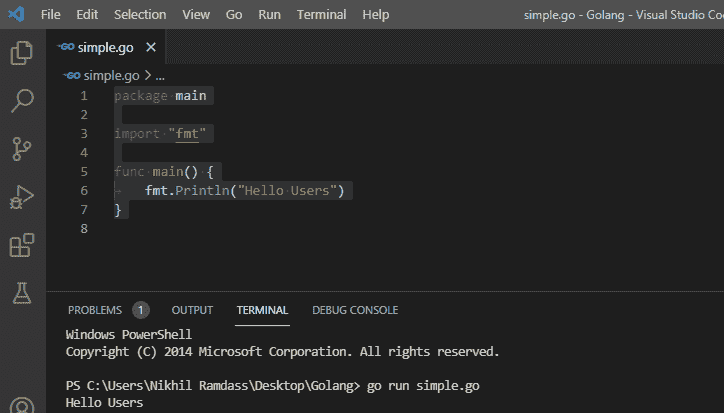

# Go 语言中的变量

> 原文：<https://learnetutorials.com/golang/variables>

在这个也被描述为 Go 或 Golang 的 Go 语言教程中，您将了解所有编程语言的核心
，即编程语言的基本单位变量。我们将详细讨论什么是变量，如何在 Golang 中声明和定义变量，然后了解变量的范围和生存期，它们的命名约定，以及变量如何在 Golang 中被遮蔽。

## 变量的概念

让我们从理解编程语言中对变量的需求开始，
考虑下面的简单可执行 Go 语言程序

### 围棋程序

```
 package main            //Declaration of main package 

import "fmt" //Importing input-output libraries

func main() {          //Main function

 fmt.Println("Hello Users")    //Display print statement
} 

```

**输出:**

```
 Hello Users 
```

这个可执行的 Golang 程序包含 4 个不同的部分。为了更好地理解变量的概念，让我们简要地讨论一下这几行代码。

*   **Package main** :package main 是每个程序开始执行的包声明。package main 通过告诉 Go 编译器这些程序必须作为可执行代码来执行，而不是使用共享库来初始化程序的执行。T3】注意：共享库包用于构建可重用代码,而打包主要用于开发可执行代码 T5
*   **导入“fmt”:**第二行代码导入“fmt”。导入负责实现输入输出方法或功能的 fmt 包文件
*   **Func main():**Func 关键字后跟花括号{}的主函数。写在花括号内的编程代码从这一点开始执行。简单来说，就是程序开始执行的入口点。
*   **fmt。Println():** Println()是一个函数，它在屏幕上打印用双引号提供的指定文本，这些文本是从 fmt 包中以 Go 语言导入的，以便在控制台中向用户显示输出。fmt。Println()函数在控制台中显示“Hello Users”作为输出。

为了更好地理解，让我们看看下面同一程序的截图(示例 1)。创建了一个名为简单的文件。去添加上面给定的代码行。



#### 使用命令运行 Go 程序

`**go run simple. go**`

在控制台中打印(显示)输出为

**输出:**

```
 Hello Users 
```

多次执行同一个程序会导致输出相同的结果。打印语句保持固定，在程序执行过程中不能更改。用固定值来解决现实场景是不可能的，所以需要有某种机制能够存储从用户那里读取的值。它还应该满足在程序执行时改变存储值的要求。这就是为什么我们有了变量的概念。

## 什么是变量？

变量是特殊的容器，能够存储一个值，并且该值在程序执行期间保持固定。

## 为什么戈朗需要申报

声明指定 Go 程序中使用的变量名和变量类型。像其他语言 C，C++，Java Go 也是一种静态类型的编程语言。Go 编程语言是一种静态类型的编程语言，其中变量在程序执行期间被使用之前被声明。

## Golang 的命名惯例和风格

*   变量名只包含字母“a-z”或“A-Z”或数字 0-9 以及字符下划线“_”。

    ```
    Golang     //valid variable name
    _golang     //valid variable name
    Golang236,golang_0   //valid variable name
    236golang   //invalid varaible name

    ```

*   变量名必须以字母或下划线(_)开头，不能以数字开头。

    ```
    236golang     //invalid variable name

    ```

*   变量的名称区分大小写。
*   关键字不允许用作变量名
*   变量名称的长度没有限制，但建议仅使用 4-15 个字母的最佳长度。
*   Variable styles use mixedCaps or MixedCaps 

    考虑员工姓名可以表示为员工姓名或员工姓名的员工详细信息

    **例** : `var emp_Name = “john” Emp_Name := “Stephen”`

    程序来理解这个例子

    ```
     package main
    import ("fmt")

    func main() {
      var emp_Name string = "John" //Variable in mixedCaps

      Emp_Name:= "Stephen" //Variable in MixedCaps

      fmt.Println("The variable name in mixedCaps : ",emp_Name)

      fmt.Println("The variable name in MixedCaps : ",Emp_Name)
    } 

    ```

    **输出:**

    ```
     The variable name  in mixedCaps :  John
    The variable  name in MixedCaps :  Stephen 
    ```

**注意:**避免在程序中使用相似的变量名

让我们考虑一个表格，以便更好地理解命名规则和样式

| **无效** | **有效** | **为什么无效？** |
| 1 戈朗 | 戈朗 1 | 不要以数字开头 |
| %戈朗 | 戈朗 | 不要以符号开头 |
| 围棋郎 | 戈朗 | 不允许有空间 |
| 围棋 | 戈朗 | 不允许使用连字符 |

## 格朗的申报方式

Go 中的变量主要使用

1.  使用“var”关键字
2.  使用“:=”的短变量声明。

## 在 Golang 中用 var 关键字声明一个变量

**var 关键字**用于两种不同的方法来声明变量

1.  使用 var 关键字后跟变量名及其类型的两步声明。然后将变量值初始化为声明的变量。

    ```
     var <variable_name> <type>
    <variable_name> =  <value> 

    ```

    ```
     var  price int
    price = 35 

    ```

    关键字 var 后跟整数类型的可变价格被声明。在下一行中，可变价格的值为 35。因此，在程序执行期间，可变价格的值为 35。

2.  作为一种简单的声明方法，语法遵循带有变量名的 var 关键字，并为其赋值。

    ```
     var <variable_name> = <value> 

    ```

    ```
     var price = 35 

    ```

## 使用冒号等于赋值运算符(:=)声明变量

使用短变量声明在函数中声明和初始化局部变量。在“:=”变量声明中，变量的类型是由编译器从变量的赋值或存储值中推断出来的。

```
 <variable_name> := <value> 

```

```
 Price := 35 

```

## Var 关键字和短变量声明的用法

| **有关键词** | **:=** |
| **var** 用于内外主功能 | 仅在主函数中使用 |
| Var 语法允许单行或不同行的变量声明和赋值。单线 Eg:

```
var name1 string = “Golang”

```

分离线 Eg:

```
var name1 string
name1=” Golang”
```

 | 仅允许单行声明和赋值例如:

```
name1:= “Golang”
```

 |
| 变量的值的声明和赋值可以分别进行 | 不能单独完成 |

## 函数内外的 var 关键字

这个 Go 程序是一个使用 var 关键字在函数内部和外部进行变量声明的例子

```
 package main
import ("fmt")
/* variable declared outside function */
var name1 string
/* variables declared and assigned values outside function */
var num int = 2021   
var c = 3

func main() {
/* variable name1 declared outside function assigned value inside function */
  name1 = "Golang"   
  fmt.Println(name1)
  fmt.Println(num)
  fmt.Println(c)
} 

```

**输出:**

```
 Golang
2021
3 
```

### 函数外部的短变量声明

在函数外声明短变量会导致编译错误。不能使用“:=”在函数外部声明和赋值变量。

### 例子

```
 package main
import ("fmt")

name1 := "Golang"    //short variable declaration

func main() {
  fmt.Println(name1)  //Type inferred as string
} 

```

**输出:**

```
 -/home/5ZqYyz
prog.go:4:1 Syntax error non-declaration statement outside function body 
```

**注意:**变量不能使用“:=”在函数外声明和赋值

## 初始化变量声明

在 Golang 中，如果程序中变量存储的值是已知的，则变量由初始值声明。

### 例子

```
 package main

import "fmt"

func main() {
  var price_ph //var keyword
                    //variable  price_phone
                    //value 15000

 var mobile_name  = "SAMSUNG" //var keyword,variable phone
     //value string type SAMSUNG
 Ear_phone := 300             // := assigns 300 to variable Ear_phone

 fmt.Println("Prints phone prices by inferring its type", price_phone)
 fmt.Println("Displays name of phone ", phone)
 fmt.Println("Displays price of Ear_phone", Ear_phone)
} 

```

在这些代码行中，所有变量都用某种类型的值初始化，以便以后在 Go 程序中使用。这是在 Go 语言中如何初始化或使用带值变量的简单想法。

*   var price_ph 行将整数类型的值 15000 赋给使用 var 关键字声明的 variable price_phone。
*   var mobile_name = "SAMSUNG "，这一行使用 var 关键字为变量 mobile_name 分配字符串类型大写字母的 SAMSUNG 值。
*   Ear_phone := 300，冒号-等号赋值运算符将整型值 300 赋给名为 Ear_phone 的变量。

**输出:**

```
 Prints phone prices by inferring its type : 15000
Displays name of phone : SAMSUNG
Displays price of ear_phone :300 
```

**注:**值的类型是从它们的值推断出来的

## 未初始化变量声明的默认值

在 Go uninitialized variables 中，也就是说，如果变量没有用初始值声明，该变量将初始化其声明类型的默认值。一旦一个变量被声明，它将被分配一个与其内置类型相匹配的零值。变量的零值或默认值将在下面用一个例子进行解释

### 例子

```
 package main
import ("fmt")

func main() {

  var words string    //default value set to string
  var number int  //default value set to integer
  var Logic_gates bool //default value set to boolean

  fmt.Println(words)
  fmt.Println(number)
  fmt.Println(Logic_gates)
} 

```

**解释**

*   下面给出的代码行是没有任何初始值的变量
    *   可变单词串
    *   可变整数
    *   var Logic_gates bool
*   有三个变量，即字、数、逻辑门，每个变量分别用其类型指定，如字符串、整数、布尔。
*   变量没有用任何值初始化，但是在编译代码时，相应类型的默认值(零值)被分配给变量。
*   当变量没有设置初始值时，默认值就是这样设置的。
*   成功编译代码后，默认值将被赋予相应的类型
    *   单词为" "
    *   数字为 0
    *   逻辑门为假

### 例子

```
 package main

import ("fmt")

func main() {

  var words string    //default value set to string
  var number int  //default value set to integer
  var Logic_gates bool //default value set to boolean

  fmt.Println(words)
  fmt.Println(number) 

```

**输出:**

```
 0
false 
```

## 在声明后分配变量值

在变量值未知的情况下，可以在程序中声明变量后为其赋值。

考虑语法

```
var <varaiable_name><type>
<variable_name> = <value>

```

使用此语法，可以在变量声明后为变量赋值。

### 声明后分配变量值的示例程序

```
 package main
import ("fmt")

func main() {

  var mobile_name string           // variable phone of string type 
  mobile_name = "SAMSUNG"          // variable phone reads value samsung
  fmt.Println(mobile_name )         //Displays value as output
} 

```

**输出:**

```
SAMSUNG

```

在这个程序中，程序员首先声明变量及其类型。在下一行中，只有值被分配给变量。

*   `var mobile_name string`:声明了一个字符串类型的变量 mobile_name。
*   `mobile_name = "SAMSUNG"`:一个变量 mobile_name 读取值 Samsung

## 具有不同类型声明的简单围棋程序

下面给出了一个 Go 程序，它包含了到目前为止讨论过的不同类型的声明:

### 程序

```
 package main
import "fmt"
func main() {

 //method 1
 var value1 int
 value1 = 380

 //method 2
 var value2 = "cat"

 //method 3
 value3 := 87

 fmt.Println(value1, value2, value3)
} 

```

声明和定义变量的三种不同语法被称为 method1、method2 和 method3，从上面的程序中可以理解。

**输出:**

### 多变量声明定义

Go 程序中的多个变量是使用另一种简写方式定义的。关键字 var 后跟括号，用于在 Go 程序的不同代码行定义变量。

```
 var (
x=100
y=” hello”
z=0
) 

```

### 程序

```
 package main
import ("fmt")
func main() {
/* Multiple variable declaration*/
  var(
   x=100
 y= "hello"
 z=0  )
  fmt.Println(x,y,z)         //Displays value as output
} 

```

**输出:**

```
100 hello 0

```

### 变量的多重赋值

Go 编程语言使用户或程序员能够为同一行中的不同变量分配多个值。单行中的变量可以具有不同数据类型的值

### 程序

```
 package main
import ("fmt")

func main(){

num1, num2, num3 := "one", 2, "three"  //Multiple variable assignment

fmt.Println(num1)
fmt.Println(num2)
fmt.Println(num3)

} 

```

**输出:**

```
one
2
three

```

在这个 Go 示例中，Num1、num2、num3 是在一行中声明的三个变量。每个变量都有不同的数据类型

*   num1 是字符串类型
*   num2 是整数类型
*   num3 是字符串类型

## 变量的范围和生存期

变量根据其名称和存储位置分为三种类型。

*   **局部变量**:函数内部声明的变量
*   **全局变量**:函数外声明的变量，变量名应以大写字母开头。
*   **包级变量**:函数外声明的变量，变量名称应以小写字母开头。

让我们用一个例子来理解

```
 package main
import "fmt"

/*Global variables can be  accessed by all
the  functions in the same or different packages
*/

var Global_var int  //Begins with uppercase letter

/*Package level variables only accessed
from the function of the same package
*/

var pack_var int   //begins with lowercase letter

func main() {
 /* Local variables cannot be accessed
 from outside of the function
 */

 //method 1
 var value1 int
 value1 = 380

 //method 2
 var value2 = "cat"

 //method 3
 value3 := 87

 fmt.Println(value1, value2, value3)
} 

```

**输出:**

**解释**

*   在上面给出的程序中，在主函数中声明了三个变量。因此，变量 value1、value2、value3 是只能从主函数访问的局部变量。程序中的其他函数被限制访问局部变量。
*   程序声明 var pack_var = int，pack_var 是另一个以小写字母开头的变量，在主函数外声明形成**包级变量**。
*   类似地，变量 Global_var 以大写字母开头声明，使用的语法是 var Global_var = int，在名为**全局变量**的 Go 程序中，其他函数可以进一步访问该变量。

**注:**

1.在包级别，变量:=语法不允许声明变量。如果这样做，将会出现编译错误。

2.一旦变量被声明并且没有在 Go 程序中的任何地方使用，就会导致编译错误。

### 遮蔽

假设在包级别声明的变量被重新声明为局部变量。当试图访问局部变量时，包级变量被局部变量遮蔽。
考虑 Go 计划

```
 Package main
import "fmt"

var value0 = 0   //package level variable

func main() {
 var value0 = 34  //local variable
 fmt.Println(value0)

} 

```

**输出:**

```
34

```

value0 是一个用两个值初始化的变量，一个值是使用语法后跟 var 关键字的包级变量，该关键字将 0 赋给 value0。相同的变量值 0 在主函数中被重新声明为存储值 34 的局部变量。当程序正在执行时，局部变量仅被考虑用于执行，因此遮蔽概念起作用。变量不限于字符串、整数和布尔值等数据类型。变量可以用下面给出的一些其他数据类型来表示，这将在下一个教程中讨论。

```
 s := "Hello, World!"
f := 465.86
b := 15 > 9 // A Boolean value will return either true or false
array := [3]string{"item_1", "item_2", "item_3"}
slice := []string{"one", "two", "three"}
m := map[string]string{"letter": "h", "number": "nine", "symbol": "&"} 

```