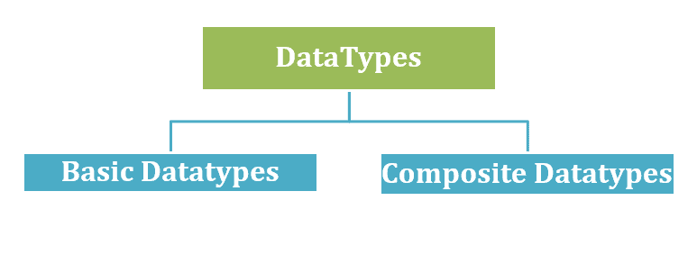

# Golang 数据类型

> 原文：<https://learnetutorials.com/golang/data-types>

在本教程中，您将学习 Go 编程语言中的不同数据类型。到目前为止，我们讨论了变量，每个变量都与保存一些值的数据类型相关联。Golang 支持数字、字符、布尔等**基本数据类型**。，以及**复合数据类型**，它们是使用 int、float 等基本数据类型构建的用户定义数据类型。在本教程中，我们将经历两种数据类型的不同分类，并详细了解 Golang 中的每种数据类型。

## Golang 中有哪些数据类型？

在编程语言中，数据类型是指定变量包含的数据类型
的分类。为任何变量定义的数据类型告诉编译器，程序员声明的变量打算如何在 Golang 程序执行期间使用。因此变量的所有值都有一个静态类型，Go 语言可以称为静态类型编程语言。

*   数据类型定义变量存储在内存位置的数据类型。
*   Golang 是一种静态类型的编程语言，这意味着变量的类型在编译时是已知的。

## 数据类型的声明

对于变量，数据类型用**关键字 var** 声明；对于常量变量声明，数据类型用**关键字 const** 单行或单行声明。语法中的 **<类型>** 占据了 Golang 的基本数据类型。让我们在下一节讨论基本数据类型。通过下面的示例，刷新变量如何使用 cons 和 var 关键字来定义其类型，以便更好地理解(参见 const 和 var 教程的链接)

示例 1:用数据类型声明变量的语法

```go
 var <variable_name> <type> = <value> //var keyword
Or
const <variable_name> <type> = <value> //const keyword
Or
var <variable_name1>,<variable_name2> <type> //Multiple variable declaration
    Or
<variable_name1>,<variable_name2> := <value1><value2>
//short variable declaration 

```

## 数据类型的分类

Golang 中的数据类型分为两种:



1.  ### 基本类型

    A **基本类型**是构成基本构件的数据类型。它是一个**原始数据类型**。GO 语言支持整数、浮点数、字符串、布尔值、复数等基本数据类型。

2.  ### 复合类型

    一个**复合数据类型**是由原始数据类型和其他复合类型构成的数据类型。也被称为**复合数据类型**。

## Golang 中的基本数据类型

基本数据类型主要分为

1.  **号**
2.  **弦**
3.  **布尔**


让我们详细了解每种基本数据类型

## Golang 的数字数据类型

数字或数字数据类型表示**整数**、**浮点数**和**复数**。例如 34，345 等整数，小数点为 45.89，5.8 等的浮点数，以及 a+bi，34 +78i 形式的复数。

让我们从数字数据类型开始。编程中有三种主要的数值类型:

### 1.Golang 中的整数(整数)数据类型

整数数据类型是代表一组二进制数字的整数范围。(位)。在 Golang 中，整数可以有正值、负值或零值。

基本整数数据类型进一步分为:

1.  签名
2.  无符号的


`“int”`代表有符号整数，`“uint”`代表无符号整数

### 有符号整数数据类型

有符号整数数据类型是依赖于机器的默认类型，支持 32 位(4 字节)和 64 位(8 字节)机器。此数值数据类型存储正值和负值，它们有 5 种不同的大小(类型)和不同的范围。

| （同 Internationalorganizations）国际组织 | int8 | int16 | int32 | int64 |

下表详细介绍了有符号数据类型的类型、大小和各种范围。

| **类型** | **尺寸** | **范围** |
| （同 Internationalorganizations）国际组织 | 32 位/4 字节或 64 位/8 字节 |   |
| int8 | 8 位/1 字节 | -128 到 127 |
| int16 | 16 位元/2 位元组 | -32768 到 32767 |
| int32 | 32 位元/4 位元组 | -2147483648 到 214748367 |
| int64 | 64 位元/8 位元组 | -922337203685 . 4775808 到 922337 . 477788861 |

考虑从表中推断: **int8** 是一个有符号整数，具有从-128 到 127 的值，int16 是一个有符号整数，具有从-32768 到 32767 的值，等等。

让我们讨论所有类型的有符号整数数据类型，以及如何用相应的语法在 Golang 中声明它们

```go
var a int      //declares variable a of int integer type

var a int8     //declares variable a of integer type int8

var a int16   //declares variable a of integer type int16

var a int32    //declares variable a of integer type int32

var a int64    //declares variable a of integer type int64 

```

让我们通过两个程序示例来了解如何使用不同的 int 数据类型。使用 int 进行声明简单易行；许多使用这种数据类型的 Golang 程序在前面的教程中都提到过。

### 如何声明和打印数据类型 int8 和 int 16 的类型？

```go
 package main
import (
    "fmt"
    "reflect"
    "unsafe"
)
func main() {
    //Declare a int 8
    var Type1 int8 = 6
      //Declare a int16
    var Type 2 int16 = 6
    //Size of int8 in bytes
    fmt.Printf("%d bytes\n", unsafe.Sizeof(Type1))
    fmt.Printf("Type1's type is %s\n", reflect.TypeOf(Type1))
     //Size of int16 in bytes
    fmt.Printf("%d bytes\n", unsafe.Sizeof(Type2))
    fmt.Printf("Type2's type is %s\n", reflect.TypeOf(Type2)
} 

```

**输出:**

```go
 1 bytes
Type1's type is int8
2 bytes
Type2's type is int16 
```

### 程序 2 如何声明和打印数据类型 int32，int64

```go
 package main
import (
    "fmt"
    "reflect"
    "unsafe"
)

func main() {
    //Declare a int32
    var Type3 int32 = 6

    //Declare a int64
    var Type4 int64 = 6

    //Size of int32 in bytes
    fmt.Printf("%d bytes\n", unsafe.Sizeof(Type3))
    fmt.Printf("Type3's type is %s\n", reflect.TypeOf(Type3))

    //Size of int64 in bytes
    fmt.Printf("%d bytes\n", unsafe.Sizeof(Type4))
    fmt.Printf("Type4's type is %s\n", reflect.TypeOf(Type4))
} 

```

**输出:**

```go
 4 bytes
Type3's type is int32
8 bytes
Type4's type is int64 
```

### 无符号整数数据类型

无符号整数数据类型( **uint** )是依赖于机器的默认类型，支持 32 位(4 字节)& 64 位(8 字节)机器。这种数字数据类型只保存负值，它们有 6 种不同的大小(类型)和不同的范围。

| 无符号整型 | uint8 | uint16 | uint32 | uint64 | uintptr |

| **类型** | **尺寸** | **范围** |
| 无符号整型 | 32 位/4 字节或 64 位/8 字节 | 0 至 4294967295 或 |
| uint8 | 8 位/1 字节 | 0 至 25 |
| uint16 | 16 位元/2 位元组 | 0 到 65535 |
| uint32 | 32 位元/4 位元组 | 0 到 4294967295 |
| uint64 | 64 位元/8 位元组 | 0 到 18446744073709551615 |
| uintptr | 未解释的位 | 指针值 |

上面给出的表详细地表示了无符号数据类型的类型、它们的大小和各种范围。考虑从表中推断。

*   `uint8`是 0 到 255 有符号整数，uint16 是 0 到 65535 的有符号整数，等等
*   `uintptr`是一种无符号整数数据类型，其大小足以容纳指针值的未解释位。

声明 uint 整数数据类型的语法

```go
 var a uint      //declares variable a of unsigned integer type uint

var a uint8     //declares variable an of integer type uint8

var a uint16   //declares variable an of integer type uint16

var a uint32    //declares variable an of integer type uint32

var a int64    //declares variable an of integer type uint64 

```

**【uintptr】**

*   尺寸和范围取决于平台。
*   存储指针地址的无符号整数类型。

让我们通过两个程序示例来了解如何使用不同的 uint 数据类型

### 程序 1:如何用 uint、int8 和 int 16 声明和打印数据类型的 uint 类型。

```go
 package main
import (
    "fmt"
    "reflect"
    "unsafe"
)
    func main() {
    //Declare a uint8    
      var type1 uint8 = 2
     //Size of uint8 in bytes
    fmt.Printf("%d bytes\n", unsafe.Sizeof(type1))
    fmt.Printf("type1's type is %s\n", reflect.TypeOf(type1))
    //Declare a uint16
    var type 2 uint16 = 2
    //Size of uint16 in bytes
    fmt.Printf("%d bytes\n", unsafe.Sizeof(type2))
    fmt.Printf("type2's type is %s\n", reflect.TypeOf(type2))
   }

```

**输出:**

```go
 1 bytes
Type1's type is uint8
2 bytes
Type2's type is uint16 
```

### 程序 2:如何使用 int32，int64 声明和打印数据类型的类型

```go
 package main
import (
   "fmt"
    "reflect"
    "Unsafe" )
func main() {
    //Declare a uint32
     var type3 uint32 = 2
      //Size of uint8 in bytes
    fmt.Printf("%d bytes\n", unsafe.Sizeof(type3))
    fmt.Printf("type3's type is %s\n", reflect.TypeOf(type3))
     //Declare a uint64
    var type4 uint64 = 2
   //Size of uint16 in bytes
    fmt.Printf("%d bytes\n", unsafe.Sizeof(type4))
    fmt.Printf("type4's type is %s\n", reflect.TypeOf(type4))
 }

```

**输出:**

```go
 4 bytes
Type3's type is uint32
8 bytes
Type4's type is uint64 
```

* * *

### 2.Golang 中的浮点数据类型

浮点是一种数字数据类型，它表示像 45.6，0.00005666 这样的十进制数值

在 Golang 中，浮点分为两种类型:Float32 和 Float64。

| 类型 | 大小 | 范围 |
| 浮动 32 | 32 位元/4 位元组 | -3.4e+38 至 3.4e+38 |
| Float64 | 64 位元/8 位元组 | -1.7e+308 至+1.7e+308 |

1.  **Float32** 是 32 位的浮点数据类型

    用于声明 float32 数据类型的语法是

    ```go
    var  a float32 

    ```

    ### 用于声明和打印浮点数据类型的程序

    ```go
     package main
    import (
        "fmt"
        "reflect"
        "unsafe"
    )
    func main() {
        //Declare a float32
        var a float32 = 2   
        //Size of float32 in bytes
        fmt.Printf("%d bytes\n", unsafe.Sizeof(a))
        fmt.Printf("a's type is %s\n", reflect.TypeOf(a)) 
    } 

    ```

    **输出:**

    ```go
     4 Bytes
    a's type is float32 
    ```

2.  **浮点 64** 是一种 64 位的浮点数据类型

    用于声明 float64 数据类型的语法是

    ```go
    var  a float64 

    ```

    ### 用于声明和打印 float64 数据类型的程序

    ```go
     package main

    import (
        "fmt"
        "reflect"
        "unsafe"
    )

    func main() {
        //Declare a float64
        var a float64 = 2

        //Size of float64 in bytes
        fmt.Printf("%d bytes\n", unsafe.Sizeof(a))
        fmt.Printf("a's type is %s\n", reflect.TypeOf(a))

        //Default is float64 when you don't specify a type
        b := 2.3
        fmt.Printf("b's type is %s\n", reflect.TypeOf(b))
    } 

    ```

    **输出:**

    ```go
     8 Bytes
    a's type is float64
    b's type is float64 
    ```

**注意:**带有任意浮点数的变量的简短声明被检测为 float64 数据类型。如果没有提到类型，Float64 是默认的数据类型。

* * *

### 3.复数

复数的形式是`a+ib`，**是**的实部， **ib** 是虚部。

复数有两种初始化方式

1.  使用复变函数时，实部和虚部应属于相同的数据类型，即 float32 或 float64

    ```go
    complex(a,b)
    var a int64    //declares variable a of integer type int64 

    ```

2.  使用:=的简写声明，以防在没有对变量进行任何其他初始化的情况下提供直接数字。在这种情况下，默认类型是复数 128

    ```go
    A := 9 + 20i 

    ```

在 Golang，复数有两种数据类型复数 64 和复数 128

| 类型 | 特征 |
| 复杂数字 64 | Float32 形成实部和虚部 |
| 复杂数字 128 | Float64 形成实部和虚部 |

1.  **Complex number64**

    实部和虚部的大小是浮点型的，即 32 位或 4 字节的大小。

    复数 64 的范围与浮点数 32 相同，即 1.2E-38 到 3.4E+38

    ### 用于声明和打印 complexnumber64 数据类型的程序

    ```go
     package main
    import (
        "fmt"
        "reflect"
        "unsafe"
    )
    func main() {
        var a float32 = 7
        var b float32 = 2

        //Initialize-1
        c := complex(a, b)

        //Initialize-2
        var d complex64
        d = 4 + 5i

        //Print Size
        fmt.Printf("c's size is %d bytes\n", unsafe.Sizeof(c))
        fmt.Printf("d's size is %d bytes\n", unsafe.Sizeof(d))

        //Print type
        fmt.Printf("c's type is %s\n", reflect.TypeOf(c))
        fmt.Printf("d's type is %s\n", reflect.TypeOf(d))

        //Operations on complex number
        fmt.Println(c+d, c-d, c*d, c/d)
    } 

    ```

    程序给出了上面使用的初始化方法，可以将任何变量初始化为复数。两个变量 a 和 b 被声明为类型 float 32，并由复数()进一步赋给变量 c。现在 c 包含一个复杂数字 64 类型的变量，因为 float 32 类型用于变量 a 和 b 的声明。接下来，变量 d 被声明为数据类型复杂数字 64，并使用简写声明 ie 直接以复杂形式赋值

    d := 4 + 5i

    **输出:**

    ```go
     c's size is 8 bytes
    d's size is 8 bytes
    c's type is complex64
    d's type is complex64
    (11+7i) (3-3i) (18+43i) (0.9268293-0.6585366i) 
    ```

2.  **Complex number128**

    实部和虚部的大小为浮点型，即 64 位或 8 字节的大小。

    复数 128 的范围与 float64 ie -1.7E+308 至+1.7E+308 相同

    ### 用于声明和打印 complexnumber64 数据类型的程序

    ```go
     package main
    import (
        "fmt"
        "reflect"
        "unsafe"
    )
    func main() {
        var a float64 = 3
        var b float64 = 5

        //Initialize-1
        c := complex(a, b)

        //Initialize-2\. When don't specify a type , the default type will be complex128
        d := 4 + 5i

        //Print Size
        fmt.Printf("c's size is %d bytes\n", unsafe.Sizeof(c))
        fmt.Printf("d's size is %d bytes\n", unsafe.Sizeof(d))

        //Print type
        fmt.Printf("c's type is %s\n", reflect.TypeOf(c))
        fmt.Printf("d's type is %s\n", reflect.TypeOf(d))

        //Operations on complex number
        fmt.Println(c+d, c-d, c*d, c/d)
    } 

    ```

    使用 var 关键字将 a =3 & b=5 指定为 float64 类型。函数调用 complex()将值 3 + 5i 作为复数赋给变量 c。现在 c = 3 + 5i。使用简写声明:= d 被赋值为 4 + 5i。加法运算(c+d)将复数相加，得到输出 7 + 10i。程序中给出的其余操作也以同样的方式工作。

    **输出:**

    ```go
     c's size is 16 bytes
    d's size is 16 bytes
    c's type is complex128
    d's type is complex128
    (7+10i) (-1+0i) (-13+35i) (0.902439024390244+0.12195121951219513i) 
    ```

基本的整数数据类型还有两种:字节和符文。Byte & Rune 是两种整数数据类型，分别交替引用 uint8 和 int32 数据类型。

1.  **字节:**字节数据类型代表 ASCII 字符。

    ##### 如何声明字节？

    ```go
    Var name1 byte = 'B' // byte data type 

    ```

    例如，值为“a”的字节变量转换为整数 97，值为“b”的字节变量转换为整数 98，等等。

2.  **符文:**符文数据类型代表以 UTF-8 格式编码的 Unicode 字符。例句:在 Go 中，字符是用单引号括起来表示的，比如“c”。

    ##### 符文怎么申报？

    ```go
    var character = 'C ‘ // Type inferred as rune which is the default type for character values var r rune = ‘~’ // rune data type 

    ```

    例如:一个 Unicode 值为“~”的符文变量 r 被转换为对应的 Unicode 码点 U+007E，其中 U+表示 Unicode，数字为十六进制，本质上是一个整数。

**注:**

1.在 Golang 中，没有字符数据类型，而是使用字节和符文来表示 Golang 中的字符值。

2.角色值的默认类型是符文

## Golang 中的字符串数据类型

一个**字符串**是 Golang 中另一个最常用的基本数据类型，它是一系列字符组成一个文本。双引号内的数字、字母或符号。例如:考虑一个单词 Golang，在 Go 语言中，它通过在双引号“Golang”内表示来表示为字符串，这是一个数字序列 6456657，像+_abcr 这样的符号在引号内形成字符串。
`var text = “Golang”`

`var A = “6456657”`

`var B = “+_abcr”`

### 程序 8:字符串

```go
 package main
import ("fmt")

func main() {
/* var keyword assigns variable text with value “Golang” of string type */
  var text string = "Golang"
/* short declaration to txt2 of string */
  txt2 := "12345"

  fmt.Printf("Type: %T, value: %v\n", text, text)
 fmt.Printf("Type: %T, value: %v\n", txt2, txt2)

} 

```

**输出:**

```go
 Type : string,  value : Golang
Type : string,  value : 12345 
```

**注:**引号内的任何内容都构成一个字符串。例如，txt2 被赋予了数字 12345，但是它的类型是字符串而不是整数，因为它在双引号内给出

## Golang 中的布尔数据类型

使用 `bool`关键字声明一个`boolean`数据类型，有两个可能的推论，要么是假的，要么是真的。

*   布尔值的默认类型是 false。
    1.  **与:**只有当两个给定输入为真或假时，输出才为真
    2.  **或:**当任意两个输入为真或假时，输出为真
    3.  **否定**与结果输出正好相反。

### 布尔类型及其运算

```go
 package main
import "fmt"

func main() {
    //Default value will be false it not initialized
    var v bool
    fmt.Printf("a's value is %t\n", v)

    //And operation on one true and other false
    andOperation := 1 < 2 && 1 > 3
    fmt.Printf("Ouput of AND operation on one true and other false %t\n", andOperation)

    //OR operation on one true and other false
    orOperation := 1 < 2 || 1 > 3
    fmt.Printf("Ouput of OR operation on one true and other false: %t\n", orOperation)

    //Negation Operation on a false value
    negationOperation := !(1 > 2)
    fmt.Printf("Ouput of NEGATION operation on false value: %t\n", negationOperation)
} 

```

******输出:******

```go
 v's value is false
Output of AND operation on one true and other false : false
Output of OR operation on one true and other false : true Output of NEGATION operation on false value : true 
```

### ****汇总****

Golang 中的基本数据类型有:

| ******基础数据类型****** | ******描述****** | ******例****** |
| （同 Internationalorganizations）国际组织 | 整数 | 0,567,9,-8766 |
| 漂浮物 | 小数点数字 | 4.5,0.66,-67.98 |
| 线 | 字符序列 | “Go 郎”“学习电子教程” |
| 弯曲件 | 非真即假 | 真，假 |
| 复数 | a+ib 表格数字 | 5+4i、-7+76i |
| 字节 | 一个非负整数字节。 | 115,2,97 |
| 古代北欧文字 | 用于字符 | >'、' 8 '、' I ' |

## 复合数据类型

复合数据类型是由程序员构建的任何数据类型，用于声明单个变量，该变量能够借助于像 int、float、bool(一种 Go 编程语言的字符串)这样的基元/基本数据类型来保存值的集合。

*   原始/基本数据类型是复合数据类型的构建块。
*   它们也被称为“未命名类型”。
*   它被称为未命名类型，因为它们使用文字类型来定义结构表示。
*   复合类型示例:数组、切片、映射和结构。

### 复合数据类型的分类

复合数据类型主要有三种类型:

1.  **非引用类型(聚合)**
    *   数组和结构是聚合类型，其值是内存中其他值的串联。
    *   数组是同构的。这些元素都具有相同的类型。
    *   struts 是异构的。
    *   数组和结构都是固定大小的
2.  **参考类型**
    *   切片和映射是动态数据结构，随着值的增加而增长。
3.  **界面**

