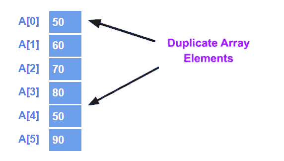
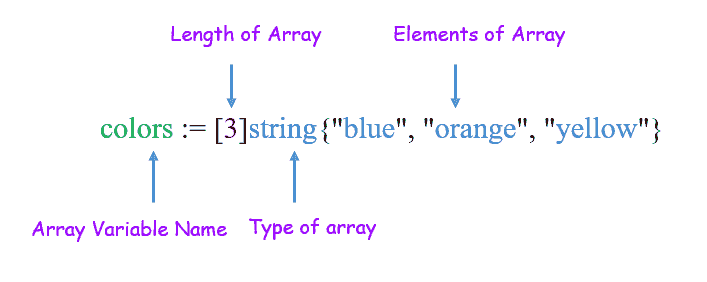
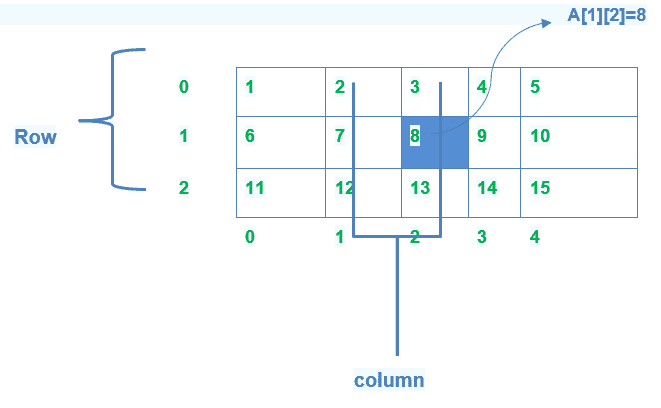
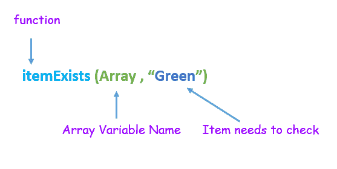

# Go 数组

> 原文：<https://learnetutorials.com/golang/arrays>

在本教程中，我们将检查 Go 数组数据类型，它属于复合类型的聚合数据类型。正如我们在前面的教程中所讨论的，Go 附带了一些基本的**基本数据类型** : int、float、复数、Boolean 和 string。在这里，我们检查什么是聚合数据类型及其分类，进一步了解其分类的声明和语法，如数组和结构。

## 围棋中的数组是什么？

Golang 中的数组是具有固定长度的相同类型元素的数据结构。在数组数据类型中，初始化或声明它们时，必须定义大小。它们可以有零个或多个元素。


**劣势**:数组一旦创建就不能调整大小。因此，数组在围棋程序中并不常用，但它们构成了切片和地图的基础。
**优势**:在 struct type 中，可以存储 int、float、string 等多种基本数据类型的多个值，将它们作为单个实体对待。

## 围棋中如何声明数组？

要在 Golang 中将变量声明为数组类型，请遵循以下语法:

1.  **Using var keyword:**  In Go Programming language, An array is declared using the var keyword of a particular type with name, size, and elements. Values are set to default zero value 

    ```go
     var <variable name> <size of array><data type> 

    ```

    例子

    ```go
     var  a[4]int 

    ```

    变量“a”是使用 var 关键字声明的，该关键字可以保存数组大小为 4 的整型值。即变量“a”可以容纳 4 个数值元素。变量可以是任何数据类型，如字符串、浮点等。

    
    *   在 Golang 中，数组的类型是一维的。
    *   数组长度是固定的，创建后不能更改。
    *   数组可以存储重复的值。A [0] = 50 & A [4] =50
    *   数组元素/值由索引值访问。
    *   考虑下面显示的包含元素 50，60，70，80，50，90 的数组。让我们用索引 0，1，2，3，4，5 来命名数组 A
2.  ** Shorthand declaration:**  In Golang, arrays can also be declared using shorthand declaration. It is more flexible than the above declaration. Both sizes & values are specified

    ```go
     <variable name> := <size of array>.<data type{<value1><value2>.....} 

    ```

    例子

    ```go
     colors := [3]string{"blue", "orange", "yellow"} 

    ```

    声明了一个包含蓝、橙、黄 3 种颜色的**字符串类型**的可变“颜色”。

    

## 通过数组元素的索引分配和访问数组元素

在数组中，通过指示对应于每个数组元素的索引号来分配或访问元素。方括号[ ]指定相应的数组索引。例 A [1]，例 A [5]。

让我们用简单的 Go 程序来理解上面定义的语法:

### 程序 1:使用 var 关键字

```go
 package main
import "fmt"
func main() {
    var a [4]int          //Declare array
    a[1] = 1             //initialize array values
    a[3]= 3
    fmt.Println(a[0])   //print statement displays variable values
    fmt.Println(a[1])
    fmt.Println(a[2])
    fmt.Println(a[3])      
} 

```

**输出:**

```go
 0
1
0
3 
```

**说明:**

*   Go 用**默认数据类型**初始化每个元素。
*   数组大小为 4 的变量“ **a** ”可以容纳 4 个元素，即 a[0]、a[1]、a[2]、a[3]，每个数组都包含一些数据。默认情况下，a[0]=0，a[1]=0，.....如果没有初始化任何值。(数组索引从 0 开始)
*   所以在这种情况下， **int** 的默认值为零。
*   这里 a[0] =0，a[2]=0
*   Here a[1]=1, a[3]=3 are assigned so it displays values 1 & 3  respectively which means you can assign a value to a specific position.

    ### 程序 2:使用速记数组声明

    ```go
     import "fmt"

    func main() {
    //Declare a array
    //colors[0] =”blue”
    //colors[1] =”orange”
    //colors[2] =”yellow
        colors := [3]string{"blue", "orange", "yellow"} //shorthand array declaration
        print(colors)
    }

    func  print(colors [3]string) {  //Pass array as a function argument
        fmt.Println(colors)} 

    ```

    **输出:**

    ```go
     [blue orange yellow] 
    ```

*   如何使用速记变量声明来声明数组
*   如何将数组作为函数参数传递

## 什么是数组中的省略

当确切的数据数量已知但位置未知时，省略号是声明和初始化数组的另一种方式。省略号由(...)如下例所示
`s := [...]int{4, 5, 6}`
我们修改一下上一节使用的程序，使用一个省略号。代码应该如下例所示:

```go
 package main
import "fmt"
func main() {
//Declare a array
//colors[0] =”blue”
//colors[1] =”orange”
//colors[2] =”yellow
  colors := [...]string{"blue", "orange", "yellow"} //ellipsis array declaration
  print(colors)
} 

```

**输出:**

```go
 [blue orange yellow] 
```

## 初始化特定元素的值

在声明数组的过程中，数组允许对其包含的元素初始化特定的值。
一个数组 A 是用速记声明的，数组的大小是 6。为某些数组元素指定了三个值。值 50 被分配给第二元素(索引 1)，值 30 被分配给第四元素(索引 3)，值 30 被分配给第六元素(索引 5)
示例

```go
 package main

import "fmt"

func main() {
 //initializing values to specific array elements 
 A := [6]int{1: 50, 3: 30,5:50} 
 fmt.Println("Initializing values to specific array elements \n",A)
    fmt.Println("Default type of unspecified elements is 0 \n") 
} 

```

**输出:**

```go
 Initializing values to specific array elements
[0 50 0 30 0 50]
Default type of unspecified elements is 0 
```

**注意:**如果未指定值，整数类型的默认值为零，字符串的默认值为空格“”。

## 围棋中的多维数组

Golang 支持一维数组和多维数组。
Golang 中的多维数组支持处理复杂的数据结构。
您可以使用以下语法创建多维数组:
语法:

```go
 var <variable_name>[size 1][size 2]….[size m]<type> 

```

例子

```go
 var twoDM  [3][5]int     //Two dimensional array

var threeDM [4][2][3]int //Three dimensional array 

```

关键字 var 后跟一个变量名称，如 twoDM(2D)提到它是一个 3 *5 矩阵类型，有 3 行 5 列。同样，也声明了三维数组。



### 计划:2D 阵列宣言

```go
 package main
import "fmt"

func main() {
    var twoD [3][2]int
    for i := 0; i < 3; i++ {
        for j := 0; j < 2; j++ {
            twoD[i][j] = (i + 1) * (j + 1)
        }
        fmt.Println("Row", i, twoD[i])
    }
    fmt.Println("\nExample of multi dimensional :", twoD)
} 

```

**输出:**

```go
 Row 0 [1  2]
Row 1 [2  4]
Row 2 [3  6]
Example of multi dimensional : [[1 2][2 4][3 6]] 
```

### 初始化多维数组

有两种类型:

1.  多维数组可以通过为每一行指定用花括号括起来的数组元素的值来初始化，而数组的声明。下面是一个 3 行的数组，每行有 2 列。

    ```go
     a = [3][2]int{  
     {1,2} ,    /*  initialize a[0] row indexed by 0 */
     {2,4} ,     /*  initializer a[1]  row indexed by 1 */
     {3,6}   /*  initializer a[2] row indexed by 2 */
    } 

    ```

2.  另一种使用 var 关键字初始化多维数组的方法是，用二维整数类型的 var 关键字声明一个名为 a 的数组，每个行元素的值在大括号内赋值。下面是一个有 5 行的数组，每行有 2 列。

    ```go
     var a = [3][2]int{ {0,0}, {8,2}, {2,4}, {3,9},{4,7}} 

    ```

## 求数组的长度

在 Golang 中，数组的长度可以通过使用 len()函数来识别。len()函数返回一个整数类型，表示数组中定义的元素总数。

```go
 len (variable name) 

```


*   声明任意大小的数组
*   调用 len()函数返回长度
*   Example
    `colors := [4]string{"blue ","black","white","orange"} length := len(colors)`

    上面给出的代码将颜色声明为一个大小为 4 的数组，包含 4 种不同的颜色。函数 len(变量名)返回值 4，这里变量名是 color，所以调用函数 len(colors)

    例子

    ```go
     package main
    import "fmt"

    func main() {

        // Create an exmaple array
        array := []int{1, 2, 3, 4, 5}

        //create array with var keyword of string type  & assign values
       var array1 [3]string
       array1[0] ="Go"
       array1[1] ="Lang"

        // Print number of items
        fmt.Println("First array ",array)
        fmt.Println("Array Length:", len(array))

        fmt.Println("Second array ",array1)
        fmt.Println("Length of array1 :", len(array1))
    // Add an item and print again
        array = append(array, 6)
        fmt.Println(" Length after apppending element to array :", len(array))    
    } 

    ```

    **输出:**

    ```go
     First array [1 2 3 4 5]
    Array Length : 5
    Second array [Go Lang]
    Length of array1 : 3
    Length after appending element to an array : 6 
    ```

## 检查元素是否存在

若要确定数组中特定元素的存在，请使用 for 循环执行迭代，然后使用 if 条件检查数组中的元素。
语法:

```go
 key word itemExists<variable name><item needs to check> 

```



关键字`itemExists`后跟变量名和需要在数组内部检查其存在的元素，根据其评估返回真或假。如果一个元素存在，返回真，否则返回假。

例子

```go
 package main

import (
 "fmt"
 "reflect"
)

func main() {
 //Declare array of type string
 Array := [4]string{"Green", "blue", "orange", "yellow"}
 fmt.Println(itemExists(Array, "Green"))  //item exist returns true
 fmt.Println(itemExists(Array, "orange")) //item exist returns true
 fmt.Println(itemExists(Array, "white")) //item does not exist returns false

}

func itemExists(arrayType interface{}, item interface{}) bool {
 arr := reflect.ValueOf(arrayType)

 if arr.Kind() != reflect.Array {
  panic("Invalid data-type")
 }

 for i := 0; i < arr.Len(); i++ {
  if arr.Index(i).Interface() == item {
   return true
  }
 }
 return false
} 

```

**输出:**

```go
 true
true
false 
```

## 如何过滤数组元素

Golang 支持数组过滤，从数组包含的元素集中选择所需的元素
语法

```go
 Array elements are filtered using the symbol “: “ 

```

例子

```go
 package main
import "fmt"

func main() {
 colors := [...]string{"green", "orange", "white", "blue", "red"}

 fmt.Printf("colors: %v\n", colors)

 fmt.Printf(":2 %v\n", colors[:2])   //Return first 2 elements

 fmt.Printf("1:3 %v\n",colors[1:3]) // return first 2 elements exclude 3rd element

 fmt.Printf("2: %v\n", colors[2:])
    } 

```

**输出:**

```go
 colors : [green orange white blue red]
: 2 [green orange]
1: 3 [orange white]
2 :  [white blue red] 
```

## 从另一个数组复制数组

通过创建一个新的数组类型变量，并为新数组赋值或传递其引用类型，可以将一个数组复制到另一个数组。

例子

```go
 package main
import "fmt"

func main() {

Array1:= [3]string{"orange", "yellow", "white"}
Array2:= Array1 // elements are passed by value
Array3:= &Array1; // elements are passed by reference

fmt.Printf ("Display Array1: %v\n", Array1)   //Display array1
fmt.Printf ("Display Array2: %v\n", Array2) //Display copied elements in Array2

Array1[0] = "green"

fmt.Printf("Display Array1 after appending new value: %v\n", Array1)

fmt.Printf("*Array3: %v\n", *Array3) //Display array 1 element passed by reference
} 

```

**输出:**

```go
 Display Array1: [orange yellow white]
Display Array2: [orange yellow white]
Display Array1 after appending new value : [green yellow white]
*Array3 : [green yellow white] 
```