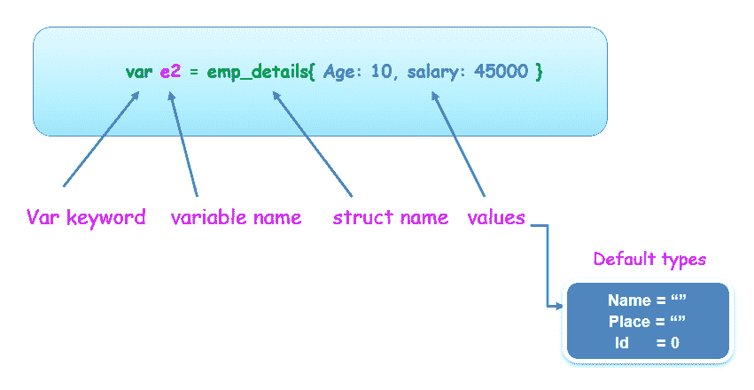
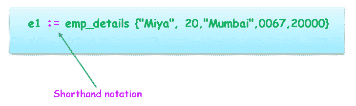

# Go 结构

> 原文：<https://learnetutorials.com/golang/structures>

在本教程中，我们将检查 Go struct 数据类型，它属于复合类型的聚合数据类型。在本教程中，您将了解什么是 Golang 中的结构，它们在 Golang 中的定义和声明语法，结构的命名，结构数据类型的访问和嵌套等。

## 戈朗的结构是什么？

结构是由字段集合组成的结构，其中每个字段保存不同类型的数据。因此，在 Golang 中，结构被归类为复合数据类型的聚合类型。结构中定义的字段有不同的属性&每个属性都有指定的类型和赋值。

*   结构是复合字段的集合
*   Struct 允许将相关数据分组到一个单元/实体中。
*   Struct 是一个没有继承的轻量级类。

例如:考虑一个组织中的雇员数据库，它保存与所有雇员相关的记录，例如雇员的详细信息，如姓名、年龄、身份证、地点、工资等。这些是不同的字段，包含引用 struct 数据类型下的单个实体的各种类型的数据。


*   姓名、年龄、地点、身份证、工资字段是员工详细信息的记录。
*   年龄、标识是存储整型值的类型
*   名称、薪金是存储字符串值的类型。
*   因此，员工的记录是一个结构下不同类型实体的字段的组合/集合

## 定义结构

要定义结构，需要两个关键字。他们是

1.  类型:允许创建跟随结构名的新类型
2.  结构:表示新的数据类型

```
 type emp_details struct{
Name string
Age Int
Place string
Id int
Salary int
} 

```

上面的代码显示了一个名为`emp_details`的结构，其中包含`fields`姓名、年龄、地点、身份证和工资。上面定义的结构是一个`named struct`，因为它创建了一个名为 emp_details 的新结构数据类型。

*   关键字`type`提到了一个新的类型&关键字`struct`将该类型定义为结构。
*   关键字`type`后面是结构的名称(emp_details)。
*   该结构在大括号内包含一个各种字段的列表，如姓名、年龄、地点、工资、员工 id。
*   每个字段都有一个名称和一个类型。
*   示例

名称为字符串类型，
工资为整数类型，以此类推。

每行写入一个字段，可以通过将具有相似数据类型的字段分组到一行来更改，如下所示:

```
 type emp_details struct{
Name Place string  //single line declaration of same type(string)
Age Id Salary Int //single line declaration of same type(integer)
} 

```

## 结构中的初始化

在 Go 语言中，通过使用 var 关键字或使用符号“:=”的速记声明来初始化结构。只要结构字段没有用任何特定的值初始化，它们就被设置为默认类型。

让我们用一个例子一个一个来理解

1.  使用 var 关键字初始化结构字段
2.  使用速记初始化结构字段
3.  如果在声明
    时没有初始化，默认类型是零

### 程序 1。使用 var 关键字初始化结构字段

```
 // Golang program to show how to declare and define the struct  
package main  
import "fmt"

// Defining a struct type
type emp_details struct {
    Name    string
    Age int
    Place string
    Id int
    salary int
}

func main() {
     // Declaring a variable  e  `struct` type using var keyword
     var e emp_details
     fmt.Println(e)

    //Declaring and Initializing variable of struct type
    var e1 = emp_details{"miya", 20,"Mumbai",0067,20000}
 fmt.Println(e1)

     //Declaring and Initializing variable of struct type
    var e2 = emp_details{Age: 10, salary: 45000} 
 fmt.Println(e2)
} 

```

**输出:**

```
 { 0  0 0}
{miya 20 Mumbai 55 20000}
{ 10  0 45000} 
```

说明

*   定义了一个名为 emp_details 的结构类型。
*   变量 e 声明后跟一个结构名
*   Var e emp_details
*   创建了另一个变量 e1，通过引用结构名来为结构字段赋值或初始化值
*   Created another variable e2 to which we can initialize values depending on the programmer's need. In a single line-specific selected field are initialized rest of the uninitialized values of fields will be set to default type. Strings are empty space while integer values are 0 during the default type.

    ### 程序 2:使用速记初始化结构字段

    ```
     // Golang program to show how to declare and define the struct  
    package main  
    import "fmt"

    // Defining a struct type
    type emp_details struct {
        Name    string
        Age int
        Place string
        Id int
        salary int
    }

    func main() {

           // Shorthand notation Declaration and Initialization 
        e1 := emp_details{"miya", 20,"Mumbai",0067,20000}
     fmt.Println(e1)

         //Shorthand notation Declaration and Initialization
       e2 := emp_details{Age: 10, salary: 45000} 
     fmt.Println(e2)
    } 

    ```

    **输出:**

    ```
     {miya 20 Mumbai 55 20000}
    { 10  0 45000} 
    ```

说明

*   定义了一个名为 emp_details 的结构类型。
*   与我们在上面的程序中讨论的一样，但是我们使用了语法“:=”来初始化结构类型的值，而不是 var 关键字。刚刚用:=语法替换了 var。
*   Output is also as same as the previous program.

    ### 程序 3 如果在声明时没有初始化，默认类型是零

    ```
     // Golang program to show how to  declare and define the struct  
    package main
    import "fmt"

     // Defining a struct type
    type emp_details struct {
        Name    string
        Age int
        Place string
        Id int
        salary int
    }  
    func main() {

    // Declaring a variable of a `struct` type
    // All the struct fields are initialized  with their zero value
    var e emp_details
    fmt.Println(e)
    } 

    ```

    **输出:**

    ```
     { 0  0 0} 
    ```

说明

*   上面的程序创建了一个默认设置为零的 emp_details 类型的变量。
*   对于结构数据类型，零意味着结构内的所有字段都被设置为它们相应的零值。
*   因此“姓名”、“地点”字段被设置为“空字符串”)年龄、身份证、工资被设置为 0。

## 访问结构字段

在 Golang Struct 中，字段由一个点(。)运算符。Golang 使用点运算符很容易获得和设置结构字段

在下面给定的程序中，创建了一个包含 5 个字段的结构 emp_details。要访问字符串类型的字段名称并为其赋值，我们使用语法


让我们用一个例子来理解

```
 // Golang program to show how to  declare and define the struct  
package main
import "fmt"
 // Defining a struct type
type emp_details struct {
    Name    string
    Age int
    Place string
    Id int
    salary int
}  
func main() {

    // Declaring a variable of a `struct` type
   // All the struct fields are initialized  with their zero value  
    var e emp_details
    //setting values using dot(.) operator
    e.Name = "Nainika"
    e.Age=5
    e.Place = "MALAYSIA"
    e.Id = 007
    e.salary = 100000
    //Displays output 

```

**输出:**

```
 e.Name : Nainika
 e.Age : 5
 e.Place : MALAYSIA
 e.Id: 7
 e.salary : 100000 
```

## 嵌入结构中

在 Golang 结构中，数据类型提供了一个称为嵌入的属性，它允许将一个结构嵌入到另一个结构中。一个结构类型可以定义为另一个结构类型。

*   嵌入结构也是嵌套结构的一种。
*   当声明了两个结构类型，并且其中一个已定义的结构类型使用父结构类型进行初始化时，就会发生结构嵌套。
*   在下面的语法中，地址是嵌套在另一个 emp_details 结构类型中的结构类型
*   在结构类型声明之后，使用:=，对其进行初始化。
*   在下面给出的程序中，一个 emp 变量被声明为使用 emp_details 结构类型，在那里初始化它自己的字段，如姓名、年龄，并调用结构类型 Address 来进一步使用在它下面定义的字段，如城市、国家。

句法

```
 type Address struct {
    City    string
    Country string
}

type emp_details struct {
    Name string
    Age int
    Address
} 

```

```
 package main

import "fmt"

type Address struct {
    city    string
    country string
}

type emp_details struct {
    name string
    age  int
    Address
}

func main() {
    emp := emp_details{
        name: "Joseph",
        age:  54,
        Address: Address{
            city:    "italy",
            country: "USA",
        },
    }

    fmt.Println("Name of employee:", emp.name)
    fmt.Println("Age:", emp.age)
    fmt.Println("City:", emp.city)
    fmt.Println("Country:", emp.country)
} 

```

**输出:**

```
 Name of employee: Joseph
Age: 54
City: italy
Country: USA 
```

## 使用指针地址运算符的结构

指向结构数据类型的指针是用“&”运算符创建的。所有变量都有内存位置，带有&运算符的指针允许访问分配变量操作数的内存位置，而*运算符允许访问保存在该位置的相应值。

示例:

```
 package main

import "fmt"
// declaration of struct type 
type emp_details struct {
 Age  int
 Name string
 Salary int 
}

func main() {
 var emp1 = &emp_details{40, "zen", 45000} // all values are shown
 fmt.Println(emp1)

 var emp2 = &emp_details{}
 emp2.Age = 10
 emp2.Name = "Vihan"
 fmt.Println(emp2) // salary not mentioned

 } 

```

**输出:**

```
 &{40 zen 45000}
&{10 Vihan 0} 
```

说明

*   已声明 emp_details 结构类型。
*   下面的语法声明了变量 emp1 和用于访问内存位置及其值的指针(&)运算符。
*   另一类初始化

    ```
     var emp2 = &emp;_details{}
    emp2.Age = 10
    emp2.Name = "Vihan" 

    ```

*   变量 emp2 用结构指针类型声明和赋值，然后使用点运算符访问字段并初始化各个字段的值。
*   检查上述程序的输出，以便更好地理解。