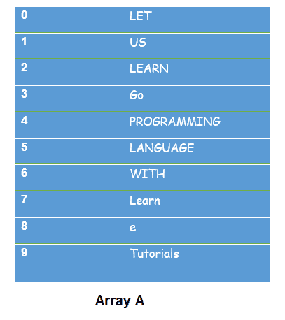
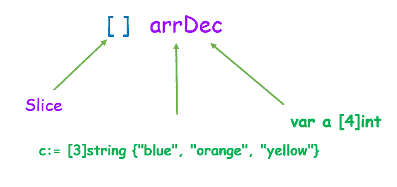

# Golang切片

> 原文：<https://learnetutorials.com/golang/slice>

在本教程中，我们将讨论 Go 切片数据类型，它属于复合类型的参考数据类型。在这里，您将了解什么是 Golang 中的切片，它们在 Golang 中的定义和声明语法，在 Golang 中使用的复制、追加、移动函数等

## Golang的切片是什么？

切片是一种引用类型的数据结构，表示现有或基础数组中相同类型的元素序列。切片是指现有数组的一部分。像数组一样，切片没有自己的数据，它只提供对数组中特定数据/元素部分的引用。

*   切片是灵活的、动态调整大小的，即切片的大小可以调整；它们不像数组那样固定。
*   与数组不同，切片不存储任何数据。
*   切片表示底层数组的一部分。

让我们用一个简单的数组表示来更容易地理解切片概念:



上图显示了索引为 0、1、2……9 的数组“A”。每个数组索引存储一些字符串类型的元素。例如，索引为 0 的数组，A [0]包含“LET”，A [1]包含“US”等。(为了更好的理解数组，请参考[数组教程](../golang/arrays))。

现在让我们了解切片如何与数组一起工作。数组 A 将被分成两个部分。A 的两个切片切片 1 和切片 2 构成了底层数组的子集。


## 如何在 Golang 中声明和初始化一个切片？

切片的声明类似于[数组](../golang/arrays)。与数组相比，唯一的例外是切片的大小不需要预先指定。

例如，在切片声明中方括号[ ]保持为空，而在数组的情况下，在方括号内指定一些值，如[5]，[7]来初始化数组大小。根据切片要求，切片的大小会相应地扩展和压缩。

语法:

一个空的方括号[ ]，后跟在[数组教程](../golang/arrays)中讨论的任何声明类型。

```go
 [ ] arrDec
 Or 
[ ] arrDec{ }
Or
[ ] arrDec{value1, value 2, value 3 …………..value m} 

```

在上面的语法中，arrDec 表示所选数组声明的类型。



### Golang 程序演示如何使用切片文字和速记符号创建切片

```go
 package main
import "fmt"

func main() {

    // Creating a slice
    // using the var keyword
    var slice1 = []string{"learn", "e", "tutorials"}

    fmt.Println(" Slice 1:", slice1)

    // Creating a slice
    //using shorthand declaration
    slice2 := []int{ 67, 67,56,98, 43 }
    fmt.Println(" Slice 2:", slice2)
    } 

```

**输出:**

```go
 Slice 1: [learn e tutorials]
Slice 2: [67 67 56 98 43] 
```

## Make()函数在 Golang 的切片中运行

Golang 中的 Make 函数创建一个新切片。这是一个内置函数。

*   语法用 make()函数表示，括号内包含参数类型、长度和容量。容量是可选的。
*   make()分配大小等于提供容量的底层数组。
*   make()返回指向数组中该部分的切片。

语法:

```go
 make([]arrDec, len, cap) []arrDec 

```

### 用 make()创建切片的程序

```go
 package main
import "fmt"

func main() {
   // Creating slice using make function
   A := make([]string, 5)  
   //initially empty
    fmt.Println("array A is: ", A) 
   //assigning values to slice array
    A[0] = "Golang"
    A[1] = "in"
    A[2] = "learn"
    A[3] = "e"
    A[4] = "tutorials"

    fmt.Println("slice created using make(): ", A)
} 

```

**输出:**

```go
 array A is:  [    ]
slice created using make():  [Golang in learn e tutorials] 
```

解释:

*   通过 make 函数将大小设置为 5，创建了一个能够容纳 5 个元素的字符串类型切片。
*   创建切片后，它是空的，没有任何值。默认值已设置。如果是字符串空格或整数 0。
*   在下一步中，新的值被分配给切片。

## 如何在 Golang 中切片数组/切片的创建？

*   切片是通过从底层或现有阵列中切片子集来创建的。
*   为了切分，我们需要在方括号内定义要切分的元素的范围。
*   范围定义了从切片开始到上限的下限，语法看起来像 A [LOW: HIGH]，在这种情况下，排除了最后一个元素。
*   下限的默认值为零，上限的切片长度也为零。
*   示例切片 1 在范围[2:6]内，6 元素被排除。下面，给定的程序解释了相同的概念。

### Golang 程序来说明切片的创建

```go
 package main
import "fmt"

func main() {

    // Creating an array
    A:= [10]string{"Let", "us", "learn", "Go",
                         "programming", "language", "with","learn ","e","tutorials"}

    // Display array
    fmt.Println("Array A:", A)

    // Creating a slice
    slice1:= A[2:6] // start from index 2 till 5

    slice2 :=A[:2] //start from index 0 till 1 excludes index 2

    slice3 := A[7:] //start from 7 till ending index

    slice4 := A[:]

    // Display slice
    fmt.Println("Slice 1 is :", slice1)
    fmt.Println("Slice 2 is :", slice2)
    fmt.Println("Slice 3 is :", slice3)
    fmt.Println("Slice 4 is :", slice4)
} 

```

**输出:**

```go
 Output
Array A: [Let us learn Go programming language with learn  e tutorials]
Slice 1 is : [learn Go programming language]
Slice 2 is : [Let us]
Slice 3 is : [learn  e tutorials]
Slice 4 is : [Let us learn Go programming language with learn  e tutorials] 
```

## 什么是切片内部/切片组件？

切片内部是组成切片的组件。切片在内部用指向数组的指针、长度和容量来表示。我们知道 slice 是具有这三个组件的数组的一部分，因此可以用下面的语法来概括它。

1.  指针
2.  长度
3.  容量

```go
 type Slice struct {
    array unsafe.Pointer
    cap   int
    len   int
} 

```

## 什么是切片中的指针？

指针指向数组中切片的初始元素。在包含元素的切片 1 的给定示例中

**[“学习”、“开始”、“编程”、“语言]**


这里，用索引 2 学习初始或开始元素，因此指针指向该位置。因此指针被设置为 2

## 如何求切片的长度？

切片的长度是切片中元素的数量。`len()`切片中的函数用于确定切片的长度。在下面给定的切片 1 中，从开始总共有 4 个元素。因此，长度设置为 4。

**Slice1 - > [“学习”“开始”“编程”“语言”]**

`len(slice1)`返回切片 1 中存在的元素数量，即`len(slice1)`调用返回值 4

## Golang一片的容量是多少？

切片的容量是基础数组中元素的最大数量。`cap()`切片中的功能决定了切片的容量。在下面的示例中，从 slice1 元素的开头开始计数，直到底层数组的结尾


所以从片 1 索引开始到数组结束位置的计数表示上面的片的容量，它返回一个整数值 8。可以表示为**帽(片)=8** 。

下图描述了片 1 的内部组件，指针指向数组地址 2，段的长度为 4，片 1 的容量为 8，因为片 1 是数组 A 的段，实际大小为 10 (0，1，2…..9 索引)，其中从 2 到 5 的索引段形成 slice1，从 6 开始到索引 9 结束的剩余索引形成总容量，即容量等于 8。(关于上面讨论的例子)


让我们用 Golang 来理解上面讨论的`len( )`和`cap( )`函数。我们已经讨论过的相同描述被编码在下面的 Go 程序中。

### Golang 程序说明切片透镜()的工作原理，cap()

```go
 package main
import "fmt"

func main() {

    // Creating an array
    A:= [10]string{"Let", "us", "learn", "Go",
                         "programming", "language", "with","learn ","e","tutorials"}

    // Display array
    fmt.Println("Array:", A)

    // Creating a slice
    slice1:= arr[2:6]   //slicing array

    // Display slice
    fmt.Println("Slice 1 is :", slice1)

    // Display length of the slice
    fmt.Printf("Length of the slice 1: %d", len(slice1))

    // Display the capacity of the slice
    fmt.Printf("\nCapacity of the slice 1: %d", cap(slice1))
} 

```

**输出:**

```go
 Output
Array A: [Let us learn Go programming language with learn  e tutorials]
Slice 1 is : [learn Go programming language]
Length of the slice 1: 4
Capacity of the slice 1: 8 
```

## 如何向切片追加元素？

**Append ()** 函数是一个切片中的内置函数，用于向切片追加元素。
或者，append()允许扩展切片的大小。

### 要追加到切片中的程序

```go
 package main
import "fmt"

func main() {
// slice creation using make()
  A := make([]string, 3)
//dispplays initial slice values
    fmt.Printf("slice:%v; len: %d; cap: %d \n", A, len(A), cap(A))

    fmt.Println("---------------------------")
//performs appending values to slice A
    A = append(A, "Go")
    A = append(A, "Lang")
    A = append(A, "in")
    A = append(A, "learn", "e", "tutorials")
//display slice after insertion
    fmt.Printf("slice: %v; len: %d; cap: %d \n", A, len(A), cap(A))
} 

```

**输出:**

```go
 slice:[  ]; len: 3; cap: 3 
---------------------------
slice: [   Go Lang in learn e tutorials]; len: 9; cap: 12 
```

*   在上面的示例中，使用切片中的 make()函数声明了三个元素。空切片是长度和容量为 3 的字符串类型。
*   学习 e 教程中的六个元素 Go Lang 被附加到切片 A，它将切片扩展了长度 9 和容量 12。

## 如何在切片中复制？

**Copy ()** 函数是一个内置函数，允许将元素从一个切片(源切片)复制到另一个切片(目标切片)。

### 复制切片的程序

```go
 package main
import "fmt"

func main() {
// slice creation using make()
  A := []string {"Go", "lang"}
  B :=make([]string,len(A))
//displays initial slice values
    fmt.Printf("Initial slice A:%v; len: %d; cap: %d \n", A, len(A), cap(A))

    fmt.Println("---------------------------")

   copy1 := copy(B,A)
//display slice after COPYING

    fmt.Printf("%d elements copied\n", copy1)
    fmt.Printf("slice after copying to B: %v; len: %d; cap: %d \n", B, len(B), cap(B))
} 

```

**输出:**

```go
 Initial slice A:[Go lang]; len: 2; cap: 2 
---------------------------
2 elements copied
slice after copying to B: [Go lang]; len: 2; cap: 2 
```

在上面的程序中，通过使用 copy()函数，在字符串类型的 A 到 B 切片中声明了复制的切片。

## Golang 切片中的迭代？

In slice for loop 用于切片元素之间的迭代。

```go
 package main

import "fmt"

func main() {

   tutorial := []string{"Go", "Programming", "language", "in", "learn", "e","tutorials"}

    for a, tutorial := range tutorial {

        fmt.Println(a, tutorial)
    }
} 

```

**输出:**

```go
 0 Go
1 Programming
2 language
3 in
4 learn
5 e
6 tutorials 
```

### 数组和切片之间的差异

| **序列号** | **ARRAY** | **切片** |
| **1** | 数组存储相同类型的元素序列 | 切片不存储任何数据 |
| **2** | 该阵列具有固定的大小 | 切片是灵活的，可以调整大小 |
| **3** | 数组在Go中使用较少 | 切片在Go中最常用 |
| **4** | 数组副本引用不同的底层数据 | 切片拷贝指的是**相同的**基础数据 |