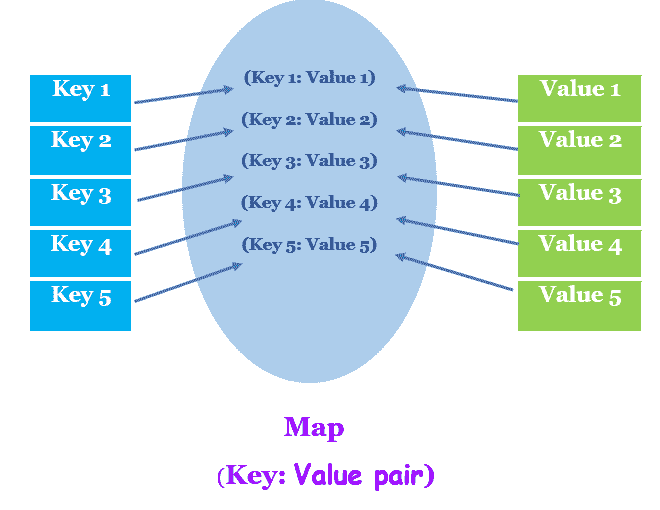
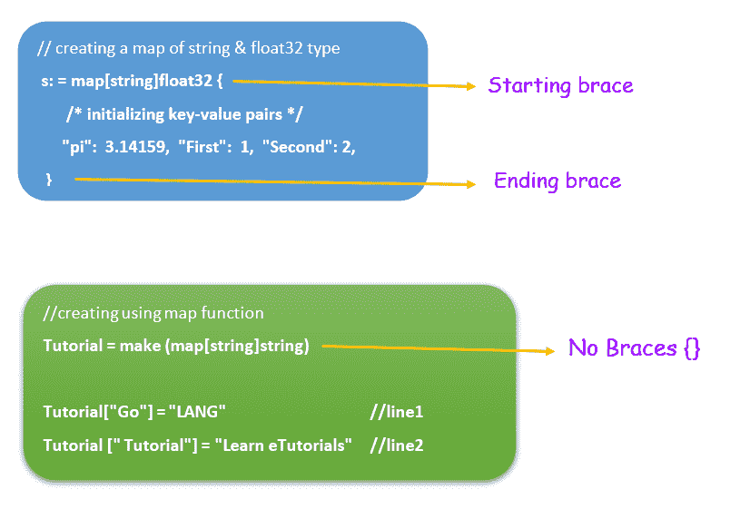
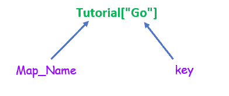

# 前往地图

> 原文：<https://learnetutorials.com/golang/maps>

在本教程中，我们将检查属于复合类型的参考数据类型的 Go Map 数据类型。您将了解地图在 Golang 中的含义，它是如何定义、声明和初始化的，并且还将讨论一些与地图一起使用的操作。

## 戈朗的地图是什么？

映射是包含一组键值对的数据结构。在映射中，键值对是数据的无序集合或组合，需要像字典或哈希表或关联数组一样存储。



**注意:**键是唯一的，在地图中值可能会有所不同

## 如何在 Golang 申报地图？

在 Golang 中，Map 是关键字&赋予数据结构的名称。在 Golang 中定义映射的语法从 map 关键字开始，然后在方括号“[ ]”中提到键的数据类型&值的数据类型。键值对在大括号内初始化。
在 Golang 中用于声明地图的通用语法是

```
 map [key_<datatype>] value_<datatype>{} 

```

例如:


*   上面的语法后面还有一个 var 关键字或简写符号，以便在 Go 编程语言中声明。
    1.  申报时使用 var 关键字

        ```
         Var a = make(map[string]int{
        “first” : 1
        “second”: 2
        } 

        ```

    2.  速记符号

        ```
         a := make(map[string]int){ 
        “first” : 1
        “second”: 2
        } 

        ```

*   使用 var 关键字变量创建一个映射类型。同样，使用:=声明的变量 a。
*   地图通常用于将相关数据存储在一个组中。在上面给出的代码中，变量“a”被分配给`map`数据结构，该数据结构进一步使用`make function`创建。
*   大括号{ }包含用分号“:”分隔的键-值对，如 key1: value1。该键为字符串数据类型，值以数字格式存储，即整数类型(int)。
*   在上面给出的代码中，键是字符串“第一”、“第二”&值是整数 1，2。
*   使用`make( )`概念类似于我们在[切片教程](../golang/slice)中讨论的概念，这将在本教程的下一节中详细讨论。

## 如何在 Golang 中创建和初始化地图？

在 Golang 中，地图以下列方式创建和初始化:

1.  ### 在 GoLang 中使用 make()函数创建地图

    如果没有为花括号提供特定的键值对来初始化花括号，Make()将创建一个空映射。让我们看看如何使用 make()制作一个空地图。

    ### //创建空地图的程序

    ```
     package main
    import "fmt"

    func main() {
    // Declare a variable tutorial of type map

        var Tutorial map[string]string

    //initialize the key-value pairs  with nil values
    //creates an empty map
       Tutorial = make(map[string]string)   
       fmt.Println( Tutorial)
    } 

    ```

    **输出:**

    ```
     map[] 
    ```

    在给定的例子中，变量`Tutorial`被声明为映射类型。映射类型指定字符串类型的两个键值。

    ```
     var Tutorial map[string]string 

    ```

    为了创建一个映射，我们使用 make 函数，在这个例子中，花括号内没有指定键值，所以返回一个空映射。

    ```
     //initialize the key-value pairs  with nil values
    //creates an empty map
       Tutorial = make(map[string]string) 

    ```

    现在我们将检查如何在上面解释的相同代码中初始化值。让我们用同样的例子再来理解一下，其中添加了一些更简单的代码。

    ```
     package main
    import "fmt"

    func main() {
    // Declare a variable tutorial of type map
        var Tutorial map[string]string
    //initialize the key-value pairs 
       Tutorial = make(map[string]string)
     Tutorial["Go"] = "LANG"
        Tutorial[" Tutorial"] = "Learn eTutorials"

        fmt.Println( Tutorial)
        fmt.Printf("%q\n",  Tutorial)
    } 

    ```

    **输出:**

    ```
     map[ Tutorial:Learn eTutorials Go:LANG]
    map[" Tutorial":"Learn eTutorials" "Go":"LANG"] 
    ```

    直到使用 make 函数创建的空地图与上述代码相同。

    ```
     Tutorial = make (map[string]string)
    Tutorial["Go"] = "LANG"                     //line1
    Tutorial[" Tutorial"] = "Learn eTutorials" //line2 

    ```

    键值在第 1 行和第 2 行初始化。调用带方括号的变量名，指定键的类型，后跟赋值运算符来给键赋值。
    在本例中，第 1 行为字符串类型的键“Go”赋值为字符串类型的值“LANG”。

2.  ### 在 GoLang 中使用地图文字创建地图

    使用文字符号，您可以在 Golang 中创建和初始化一个地图，下面的代码显示了如何表示文字符号:

    ```
     // creating a map of string & float32 type
        s := map[string]float32{ 
            "pi":  3.14159, /* initializing key-value pairs */
            "First":  1,
            "Second": 2,
        } 

    ```

    在上面的代码中，s 被创建为映射类型，键值对被指定为字符串，float32 类型使用速记符号。在大括号内，我们使用“:”(冒号)来指定与每个键相关联的值。每个键值对由逗号分隔。
    让我们通过一个示例来理解，该示例显示如下所示的输出:

    ### //使用地图文字的程序

    ```
     package main
    import "fmt"

    func main() {
       // creating a map of string & float32 type
        s := map[string]float32{
            "pi":  3.14159, /* initializing key-value pairs */
            "First":  1,
            "Second": 2,
        }

        fmt.Println(s) //dispalys output
    } 

    ```

    **输出:**

    ```
     map[First:1 Second:2 pi:3.14159]] 
    ```

**注意:**我们需要注意的两种初始化类型的区别是速记或文字符号使用花括号{ }来指定键值对，而在 make()的情况下，没有这样的概念。



## Map len()函数

len()表示的 length 函数表示创建映射时在大括号内初始化的键值对的数量。

```
 package main
import "fmt"

func main() {
// Declare a variable tutorial of type map
    var Tutorial map[string]string
//initialize the key-value pairs 
   Tutorial = make(map[string]string)
 Tutorial["Go"] = "LANG"
    Tutorial[" Tutorial"] = "Learn eTutorials"

    fmt.Printf("%q\n",  Tutorial)
    //len() displays no of key-value pairs
    fmt.Printf("There are %d pairs in the map\n", len(Tutorial))

} 

```

**输出:**

```
 map[" Tutorial":"Learn eTutorials" "Go":"LANG"]
There are 2 pairs in the map 
```

在上面的代码中，对的数量是 2，即
**教程**:“学习练习曲”(第一个键值对)
”**Go**:“LANG”(第二个键值对)

## Golang 中的地图循环/迭代

在 Golang 中，使用 for & range 关键字迭代地图元素

### //使用映射循环的程序

```
 func main() {
// Declare a variable tutorial of type map
    var Tutorial map[string]string
//initialize the key-value pairs 
   Tutorial = make(map[string]string)
 Tutorial["Go"] = "LANG"
    Tutorial[" Tutorial"] = "Learn eTutorials"

    fmt.Printf("%q\n",  Tutorial)

    fmt.Println(".................................")
    fmt.Println("Two Different representation using for & range")
    //for & range loop
    for key, value := range Tutorial {
    fmt.Printf("Tutorial[%s] = %s\n", key, value)
     }

  fmt.Println("")

  for LEARN := range Tutorial {
        fmt.Println(LEARN, "=>", Tutorial[LEARN])
    }

  fmt.Println("")  
} 

```

**输出:**

```
 map[" Tutorial":"Learn eTutorials" "Go":"LANG"]
.................................
Two Different representation using for & range
Tutorial[Go] = LANG
Tutorial[ Tutorial] = Learn eTutorials

Go => LANG
 Tutorial => Learn eTutorials 
```

```
 for key, value := range Tutorial {
    fmt.Printf("Tutorial[%s] = %s\n", key, value)
     } 

```

使用 for 和 range 关键字的语法或代码作为对对象进行迭代以提供输出

`Tutorial[Go] = LANG`

`Tutorial[ Tutorial] = Learn eTutorials`

```
 for LEARN := range Tutorial {
        fmt.Println(LEARN, "=>", Tutorial[LEARN])
    } 

```

使用 for 和 range 关键字的语法或代码作为键值对进行迭代以提供输出

`Go => LANG`

`Tutorial => Learn eTutorials`

## Golang 的地图操作？

格朗的地图操作包括**插入**、**删除**、**更新**、**找回**。让我们详细检查每个操作。


## 地图中的删除操作

Delete 关键字后跟地图名称和要通过指定其关键字来消除的元素在地图中执行删除操作。
例
T2【删除(s、【pi】)

此语法从创建的地图中删除 pi。为了更好的理解，请看下面的程序和输出。

```
 package main
import "fmt"

func main() {
   // creating a map of string & float32 type
    s := map[string]float32{
        "pi":  3.14159, /* initializing key-value pairs */
        "First":  1,
        "Second": 2,
    }

    fmt.Println(s) //dispalys output

    delete(s,"pi")
    fmt.Println(s)
} 

```

**输出:**

```
 map[First:1 Second:2 pi:3.14159]
map[First:1 Second:2] 
```

## 地图中的插入和更新操作

在 Golang 中，只要需要，就可以插入新的键值对。同样，我们可以更新已经指定的值。例如，在下面的程序中创建了`tutorial map`
，它包含以下两个键值对，如输出所示。
“教程”:“学习练习曲”
“开始”:“LANG”
稍后使用语法插入新的键值对现在长度将变为三个
`Tutorial ["Insert"] = "new string"`，输出为

“教程”:“学习练习曲”
“开始”:“LANG”
“插入”:“新字符串”

**注意:**更新操作几乎和插入差不多唯一的区别就是我们给已经定义的键类型指定了一个新值，这个新值会替换旧值。

```
 package main
import "fmt"

func main() {
// Declare a variable tutorial of type map
    var Tutorial map[string]string
//initialize the key-value pairs 
   Tutorial = make(map[string]string)
   fmt.Println( Tutorial)
    Tutorial["Go"] = "LANG"
    Tutorial[" Tutorial"] = "Learn eTutorials"
    fmt.Printf("%q\n",  Tutorial)
    //insert operation
    Tutorial["Insert"] = "new string"
    fmt.Printf("%q\n",  Tutorial)
    //update operation
     Tutorial["Tutorial"] = "Learn eTutorials users"
    fmt.Printf("Updated   %q\n",  Tutorial)

} 

```

**输出:**

```
 map[]
map[" Tutorial":"Learn eTutorials" "Go":"LANG"]
map[" Tutorial":"Learn eTutorials" "Go":"LANG" "Insert":"new string"]
Updated   map[" Tutorial":"Learn eTutorials" "Go":"LANG" "Insert":"new string" "Tutorial":"Learn eTutorials users"] 
```

## 在戈朗的取回行动？

在 Golang 中，检索操作允许从已经存在或创建的地图中获取分配给特定键的值。当且仅当这样的键-值对存在时，该操作检索值，否则它返回零值。

下面给出了用于检索值的语法

```
 map_Name[key] 

```



### golang 检索操作程序

```
 package main

import "fmt"

func main() {

 // Declare a variable tutorial of type map
 var Tutorial map[string]string

 //initialize the key-value pairs
 Tutorial = make(map[string]string)
 fmt.Println(Tutorial) // displays an empty map
 Tutorial["Go"] = "LANG"
 Tutorial[" Tutorial"] = "Learn eTutorials"
 fmt.Printf("%q\n", Tutorial) // displays non empy map

 //retrieve operation using var keyword
 var LangName = Tutorial["Go"]
 fmt.Println("Name of Language is %q  : ", LangName)

 //retrieve operation in single statement
 fmt.Println("SiteName is  %q :", Tutorial[" Tutorial"])

 //retrieve operation returns an empty string  " " if no key-pair exist
 fmt.Println("Retrieve operation returns an empty string   :", Tutorial[" year"])

} 

```

**输出:**

```
 map[]
map[" Tutorial":"Learn eTutorials" "Go":"LANG"]
Name of Language is %q  :  LANG
SiteName is  %q : Learn eTutorials
Retrieve operation returns an empty string   : 

Program exited. 
```

**注意:**如果地图不存在，根据地图类型返回零值。

在上面的例子中，创建的映射是字符串类型的，所以返回空格，表示在整数值返回 0 的情况下的空字符串，如下面给定的程序

### golang 检索操作程序

```
 package main

import "fmt"

func main() {

 // Declare a variable tutorial of type map
 var Tutorial map[string]string

 //initialize the key-value pairs
 Tutorial = make(map[string]string)
 fmt.Println(Tutorial) // displays an empty map
 Tutorial["Go"] = "LANG"
 Tutorial[" Tutorial"] = "Learn eTutorials"
 fmt.Printf("%q\n", Tutorial) // displays non empy map

 //retrieve operation using var keyword
 var LangName = Tutorial["Go"]
 fmt.Println("Name of Language is %q  : ", LangName)

 //retrieve operation in single statement
 fmt.Println("SiteName is  %q :", Tutorial[" Tutorial"])

 //retrieve operation returns an empty string  " " if no key-pair exist
 fmt.Println("Retrieve operation returns an empty string   :", Tutorial[" year"])

} 

```

**输出:**

```
 map[]
map[" Tutorial":"Learn eTutorials" "Go":"LANG"]
Name of Language is %q  :  LANG
SiteName is  %q : Learn eTutorials
Retrieve operation returns an empty string   : 

Program exited. 
```

### 为 int 类型的映射检索不存在的键值对的 0 值的程序

```
 `package main

import "fmt"

func main() {
 var m = map[string]int{
  "one":   1,
  "two":   2,
  "three": 3,
  // Comma is necessary
 }

 fmt.Println(m)
 fmt.Println(m["six"]) //retrieve a 0 value for non existing key-value pair for map of int type
}` 
```

**输出:**

```
 <samp>map[one:1 three:3 two:2]
0

Program exited.</samp> 
```