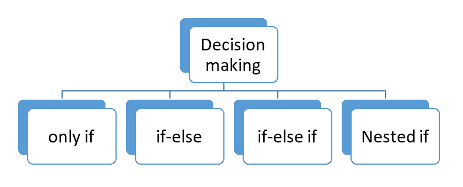

# 控制流语句

> 原文：<https://learnetutorials.com/golang/control-flow-statements>

在之前的 Golang 教程中，您已经学习了 Go 编程语言的基础知识。我们讨论了 Golang 的基础知识，例如数据类型、变量、常量，这些都是编写高效代码的一部分。在本教程中，您将了解如何使用控制流语句(如 if/else、switches)和循环语句(如 for、range 等)在 Golang 程序中进行决策。此外，我们将讨论决策语句的语法和流程图。


## Golang 中有哪些控制流语句？

程序是一段代码，其中控制在执行过程中按顺序从一行代码流向另一行代码。当没有指定控制流时，这是程序执行的正常情况。在特定的程序中，控制流是指解释器基于一些条件语句执行程序的地方。因此，控制流程可以表述为程序中代码行的执行顺序。Golang 中的控制流语句进一步分为决策语句和循环语句。

接下来，在本教程中，您将学习不同的决策语句，如仅 **if、if-else、else-if 和 Nested-if**等…



Go 条件支持比较运算符和逻辑运算符。

| 比较运算符 | 标志 |   | 逻辑算子 | 标志 |
| 不到 | < |   | 逻辑“与” | && |
| 小于或等于 | <= |   | 逻辑或 | &#124;&#124; |
| 大于 | > |   | 逻辑非 | ！ |
| 大于或等于 | >= |   |   |   |
| 等于 | == |   |   |   |
| 不等于 | ！= |   |   |   |
| 不到 | < |   |   |   |

## 戈朗的决策声明

*   决策声明基于某些条件。所以它们被称为条件语句。
*   当程序中没有提供条件时，控制按顺序流动。
*   如果在程序中的任何代码块处提供了任何要满足的条件，则基于对该块结果的评估，控制流会发生变化。
*   在作出控制流决策时所提供的满足结果的条件。Go decision 语句返回真值或假值。

## if–Golang 语句

*   If 语句是一种决策语句，与任何其他编程语言中执行某些条件逻辑的语句相同。
*   语法:-

    ```
     If condition {
    //perform some instruction
    } 

    ```

*   如果条件被设置为满足，即真，那么只执行花括号“{ }”内的指令。
*   如果你熟悉 c，c++语言，你可以观察到不同之处，这里的条件不像其他语言那样放在括号内。
*   在包含要执行的指令的条件之后，提供了一个开大括号和闭大括号。
*   if 语句的流程图

### 使用 if 语句检查一个数字是否大于。

```
 package main
import ("fmt")

func main() {
  if 19 > 14 {
    fmt.Println("29 is greater than 14")
  }
} 

```

**输出:**

```
 29 is greater than 14 
```

在 if 语句中显示多个语句或条件的另一个例子。在给定的示例中，给 a 分配了一个值，比如 45，使用&&(逻辑与)运算符将该值与两个数字进行比较。

```
 package main
import "fmt"

func main() {
    a := 45
    // mutiple conditions in if statement
    if a > 14 && a < 49 {
        fmt.Println("a satisfies the multiple if condition return true")
    }
} 

```

**输出:**

```
 a satisfies the multiple if condition return true 
```

## if-else 语句

*   if-else 是另一个决策语句。
*   如果条件为真或满足，则在条件之后立即执行花括号内的指令块
*   The condition is not satisfied then execute the block of instruction in the else

    ```
     if condition {
    //do some instructions
    }else {
    //do some instructions 

    ```

    **Note:** When the else keyword is not on the same line, followed by the closing curly brace of the previous block, a compiler error will be displayed.

if-else 语句的流程图


### 让我们通过一个使用比较运算符的简单示例来理解 if-else。

```
 package main
import "fmt"

func main() {
    NUM1 := 15
    NUM2:= 27

    if NUM1 > NUM2 {
        fmt.Println(" NUM1 is greater than NUM2")
    } else {
        fmt.Println("NUM2 is greater than NUM1")
    }
} 

```

**输出:**

```
 NUM2 is greater than NUM1e 
```

## if-else if 语句

*   也称为 if-else 梯形语句。
*   if & else 条件之间可以包含多个 else if 语句。
*   else-if 和 else 应该紧跟在右大括号或前面的块之后。

if-else if 阶梯的语法如下所示:

```
 If condition1 {
//do some instructions
}else if condition2 {
//do some instructions
}else {
do some instructions
} 

```

下面是一个使用 if-else if 阶梯的例子，它决定了产品的成本属于哪一类，如“低成本”、“可行”、“昂贵”。

```
 package main

import "fmt"

func main() {
    cost := 1000
    if cost < 250{
        fmt.Println("low cost")
    } else if cost>= 250 && cost < 400 {
        fmt.Println("feasible")
    } else {
        fmt.Println("Expensive")
    }
} 

```

**输出:**

```
 Expensive 
```

if-else if 梯形语句的流程图


## 嵌套 if 语句

包含另一个 if 语句的 if 语句包含在花括号内，形成嵌套的 if 语句。

```
 if condition1 {
   // instruction gets executed if condition1 is satisfied
if condition2{ 
 // instruction gets executed if both condition1 and condition2 are satisfied
}
}else {
 //some other instructions
} 

```

嵌套 if 的流程图


```
 package main
import ("fmt")

func main() {
num1 := 35
if num1 >= 35 {
fmt.Println("Num1 >= 35.")
if num1 > 25 {
fmt.Println("Num1 > 25.")
}
} else {
fmt.Println("Num1 < 35.")
}
} 

```

**输出:**

```
 Num1 >= 35.
Num1 > 25. 
```

### 如果用速记声明

语句可以在 if 条件之前使用速记符号来声明，如下语法所示。该语句后面是一个要满足的条件，该条件还包含要执行的指令。如果条件为真，将在花括号内给出要执行的指令。

语法:

```
 If statement;condition {

} 

```

让我们用一个例子来理解

```
 package main

import "fmt"

func main() {
    if j := 6; j > 5 {
        fmt.Println("j > 5")
    }
} 

```

**输出:**

```
 j > 5 
```

**注意:** var 关键字不能用来代替语句中的速记符号。

## 将语句切换到 Golang

Golang 支持像任何其他编程语言一样的 switch 语句。与另一个控制语句(链接到控制语句)相比，切换语句的一个优点是防止程序中出现多个 if 语句。
让我们从 Golang 中的基本 switch 语句开始

句法

```
 switch statement; expression {
case expression1:
     //Do some instructions
case expression2:
     // Do some instructions
default:
     // Do some instructions
} 

```

### Golang 中的 switch 是如何工作的？

上面的语法 switch 关键字定义了语句遵循一个开关条件。switch 关键字后面跟一个 switch 表达式。switch 表达式需要通过与花括号中提供的不同对应大小写进行匹配来计算。语法也可以用下面给出的其他形式来表达。在上面的语法切换中，语句和表达式在一行中给出，它是可选的。它们也可以根据程序员的需要单独说明。
让我们看看另一个开关语法:

```
 //SYNTAX 1
Switch statement ;{   // only with switch statement
case 1:
case 2:
default:
} 

```

```
 //SYNTAX 2
Switch  expression    // only with switch expression
case 1:
case 2:
default:
} 

```

```
 //SYNTAX 3
Switch {    // only with switch keyword
case 1: 
case 2:
default:
} 

```

*   语法 1 只有一个 switch 语句，注意分号放在后面
*   就在声明之后。
*   语法 2 仅用于开关表达式。
*   语法 3 是一个简单的开关语法，后跟要评估的案例。如果所有情况都不成立，则切换到默认关键字。然后将执行默认关键字下定义的指令。


让我们用例子来理解一个基本的开关

```
 package main
import ("fmt")

func main() {
  months := 4

  switch months {
  case 1:
    fmt.Println("january")
  case 2:
    fmt.Println("february")
  case 3:
    fmt.Println("march")
  case 4:
    fmt.Println("april")
  case 5:
    fmt.Println("may")
  case 6:
    fmt.Println("june")
  case 7:
    fmt.Println("july")
  }
} 

```

**输出:**

```
 april 
```

在前面的示例中，开关表达式计算的是案例 4，因为月份(开关表达式)是用 4 初始化的。因此，在它与案例 4 匹配之前，请与其他案例进行比较。如果没有找到匹配的案例，它会切换到默认类型。
下面我们来讨论一下在切换过程中如何使用默认类型的例子。
检查开关默认类型工作的程序

```
 package main
import ("fmt")

func main() {
  months := 12//switch expression to evaluate

  switch months {
  case 1:
    fmt.Println("january")
  case 2:
    fmt.Println("february")
  case 3:
    fmt.Println("march")
  case 4:
    fmt.Println("april")
  case 5:
    fmt.Println("may")
  case 6:
    fmt.Println("june")
  case 7:
    fmt.Println("july")
  default:
  fmt.Println("no months defined") 
 }
} 

```

**输出:**

```
 no months defined 
```

在上面的示例月份中:= 12 未被评估，没有找到与给定案例的匹配，因此打印默认语句。

### 一行中 switch 语句和 switch 表达式的程序

```
 package main
import ("fmt")

func main() {

  switch months := 6;months {
  case 1:
    fmt.Println("january")
  case 2:
    fmt.Println("february")
  case 3:
    fmt.Println("march")
  case 4:
    fmt.Println("april")
  case 5:
    fmt.Println("may")
  case 6:
    fmt.Println("june")
  case 7:
    fmt.Println("july")
  default:
  fmt.Println("no months defined")

  }
} 

```

**输出:**

```
 june 
```

switch 语句中不同情况的多个值是可能的。开关情况提供了多个值，用于评估给定的语句。
让我们用一个例子来理解

```
 package main
import ("fmt")

func main() {
 // multiple switch cases
  switch months := 7;months {
  case 1,2,3:
    fmt.Println("holiday")
  case 4,5:
    fmt.Println("working day")
  case 6,7,8:
    fmt.Println("weekend")

  default:
  fmt.Println("invalid case")

  }
} 

```

**输出:**

```
 weekend 
```

到目前为止，我们已经讨论了不同的控制流语句，在下一个教程中，您将学习如何在 Golang 中实现循环。