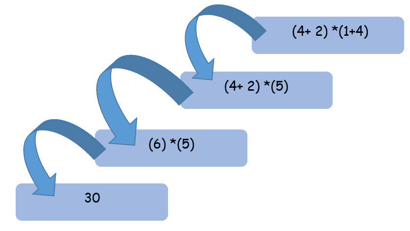

# 戈兰高地的高楼大厦

> 哎哎哎:# t0]https://learnetauthorities . com/golang/gorroutines

在本教程中，您将了解 Go 编程语言中使用的 Goroutines。在 Golang 中，Goroutine 用于实现 Golang 并发。因此，我们将首先了解什么是并发性、如何实现并发性、Goroutine 的用途等等的概述。

## Golang 中的并发是什么？

*   并发性是程序或算法的不同段或单元独立执行而不影响程序最终输出的能力。
*   当一个程序被分解成不同的段时，说“n”没有段或部分。
*   最终的输出不应该取决于这些“n”段是如何执行的。

### 并发的好处

*   并发允许并发单元的并行执行。
*   它提高了执行的整体速度/性能。

让我们以更简单的方式理解这个概念。考虑一下数学表达式

`(4+ 2) *(1+4)`
我们可以分 3 步求解这个表达式


计算相同表达式的另一种方法是



从这个数学表达式的例子中，我们可以推断，即使执行的顺序不同，最终的输出也将保持不变。
并发是通过线程实现的。

### 格朗的线是什么？

在 go 编程语言中，Goroutine 是一个轻量级线程，由 go 运行时控制。Goroutine 类似于任何其他编程语言中的线程。Go 线程也被称为“绿色线程”。绿色线程只是不由底层操作系统管理的线程，而是由用户程序或用户库或以其他方式管理的线程。

## Golang 的 Goroutine 是什么？

在围棋编程语言中，在程序中同时执行动作被称为`Goroutines`。除了使用巨大的资源密集型线程，go 编程语言还创建了一个线程的抽象，称为 Goroutine。Go runtime 有一个调度器，可以在一定时间内将 Goroutine 映射到 OS 线程。

**注意:**程序员不与低级线程交互，但与 Golang 运行时提供的高级 Goroutine 交互。

考虑一个简单的程序

*   打印“go 程序开始”和“go 程序结束”的主功能 main()
*   inside main()使用整数数据类型的参数 1 调用 hello(1)函数。
*   当程序开始执行时，当它看到 hello()时，控制从 main 开始，跳到声明和初始化 hello 语句的代码。
*   hello()函数在循环的[中打印 5 次 hello](../golang/loops-with-examples)
*   当循环结束时，控制返回到主& print“执行程序结束”语句。

```
 package main
import "fmt"

func main() {
 fmt.Println("Go program starts")
    hello(1)
    fmt.Println("Go program ends")
    }

  func hello(word int){
  for i :=0; i<5 ; i++ {
      fmt.Println(word,"hello ")
      }
      } 

```

**输出:**

```
 Go program starts
1 hello 
1 hello 
1 hello 
1 hello 
1 hello 
Go program ends 
```

## Golang 的 thread & Goroutine 的区别？

| **螺纹** | 高楼大厦例程 |
| 线程由操作系统管理。 | Goroutine 方法由 Golang 运行时管理 |
| 线程依赖于硬件 | Goroutine 独立于硬件。 |
| 线程没有简单的通信媒介。 | Goroutines 有一个简单的沟通媒介，称为渠道。 |
| 线程没有可增长的分段堆栈。 | Goroutine 拥有可扩展的分段堆栈。 |
| 线程被抢先调度。 | 戈罗廷是合作安排的 |

## 如何在 Golang 介绍 Goroutine？

现在，您将学习 Go 程序中如何引入 Goroutine &它将在上述程序中引起什么变化。【Goroutine 的语法

```
 func  main (){
      …….
                go f(a,b)       //go keyword
}
                func  f(a,b){
} 

```

关键字`go`定义了一个普通函数或方法中的 Goroutine 语句。

*   go f(a，b)开始运行新的 Goroutine，b)。
*   函数 f (a，b)在当前的 Goroutine 中计算，执行在新的 Goroutine 中进行。

在上面的程序中，我们引入了一个新的关键字`go`来使这个程序并发。当正常的 hello(1)功能被 go hello (1)取代时。

在上述程序中顺序执行的 hello (1)函数将开始在一个单独的 Goroutine 中执行。当您运行代码时，它只打印 main()函数中给出的两个打印语句。即使调用了 hello (1)函数，控制台中也看不到任何输出。

### 让我们看看输出相同的程序。

```
 package main
import "fmt"

func main() {
 fmt.Println("Go program starts")
    go hello(1)  
    fmt.Println("Go program ends")
    }

  func hello(word int){
  for i :=0; i<5 ; i++ {
      fmt.Println(word,"hello ")
      }
      } 

```

**输出:**

```
 Go program starts
Go program ends 
```

hello(1)功能不显示的原因？
这是因为 main()函数或 main Goroutine 在 hello(1)函数执行前终止。

主()函数或主 Goroutine 提前终止的解决方案是什么？
解决这个问题的办法是让主戈罗廷睡一段时间。为了实现这一点，我们需要为上面的程序
时间提供一个新的声明。睡眠(100 *时间。毫秒)
让我们用一个包含睡眠的程序来理解。

```
 package main
import (
  "fmt"
  "time"
)

func main() {
 fmt.Println("Go program starts")
    go hello(1)  
    fmt.Println("Go program ends")
    time.Sleep(100 * time.Millisecond)
    }

  func hello(word int){
  for i :=0; i<5 ; i++ {
      fmt.Println(word,"hello ")
      }
      } 

```

**输出:**

```
 Go program starts
Go program ends
1 hello 
1 hello 
1 hello 
1 hello 
1 hello 
```

运行代码后，我们得到两个 Goroutines

在 Golang 中，不需要扩展线程类，也不需要像在其他编程语言中那样实现任何可运行的类。
一个 3 击即走<space>就足以实现并发。</space>

1.  main() Goroutine output 

    **输出:**

    ```
     Go program starts
    Go program ends 
    ```

2.  the output of Goroutine running hello(1) function

    **输出:**

    ```
     1 hello 
    1 hello 
    1 hello 
    1 hello 
    1 hello 
    ```

## Goroutine 中的匿名函数

在下面的程序中，一个被称为匿名函数的未命名函数被声明&它自己在那里被调用。函数后面的左括号和右括号{}表示函数调用本身。

`msg :="learn eTutorial"`
`go func(){`
`fmt.Println(msg)`
`}()`

当我们运行下面的代码时，函数的输出如输出会话所示。即
围棋程序开始
围棋程序结束
学习练习曲

### 程序显示了匿名函数

```
 package main
import (
  "fmt"
  "time"
)

func main() {
 fmt.Println("Go program starts")

    msg :="learn eTutorial"
    go func(){  //anonymous function
    fmt.Println(msg)
    }()

    fmt.Println("Go program ends")
    time.Sleep(100 * time.Millisecond)
    } 

```

**输出:**

```
 Go program starts
Go program ends
learn eTutorial 
```

接下来，让我们看看当函数之后 msg 变量值改变时会发生什么。
`msg :="learn eTutorial"`
`go func(){`
`fmt.Println(msg)`
`}()`
`msg := “hello users”`

```
 package main
import (
  "fmt"
  "time"
)

func main() {
 fmt.Println("Go program starts")

    msg :="learn eTutorial"
    go func(){  //anonymous function
    fmt.Println(msg)
    }()
    msg = "hello users"
    fmt.Println("Go program ends")
    time.Sleep(100 * time.Millisecond)
    } 

```

**输出:**

```
 Go program starts
Go program ends
hello users 
```

由于函数中添加了最后一条语句，输出被修改。比较上面讨论的两个程序的输出。

## 戈罗廷的比赛条件是什么？

在前面的代码中，我们引入了一个竞争条件。在匿名函数中，可以从主 Goroutine 以及 Goroutine 访问相同的代码。


一般来说，在程序内部使用条件是不安全的，因为它会导致很多错误。

### 戈鲁汀的优点

*   Goroutine 可以从非常小的堆栈空间开始。
*   Goroutine 可以很容易地创建或销毁
*   Goroutine 可以快速重新分配。
*   Go 应用程序可以有 1000 个 Goroutines。