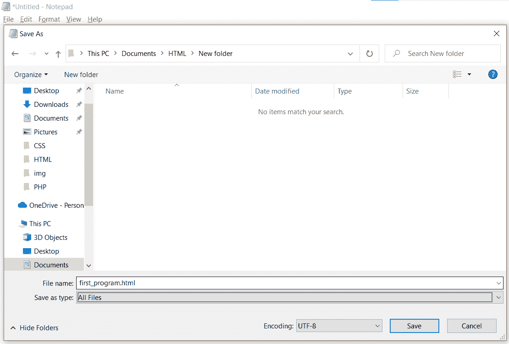
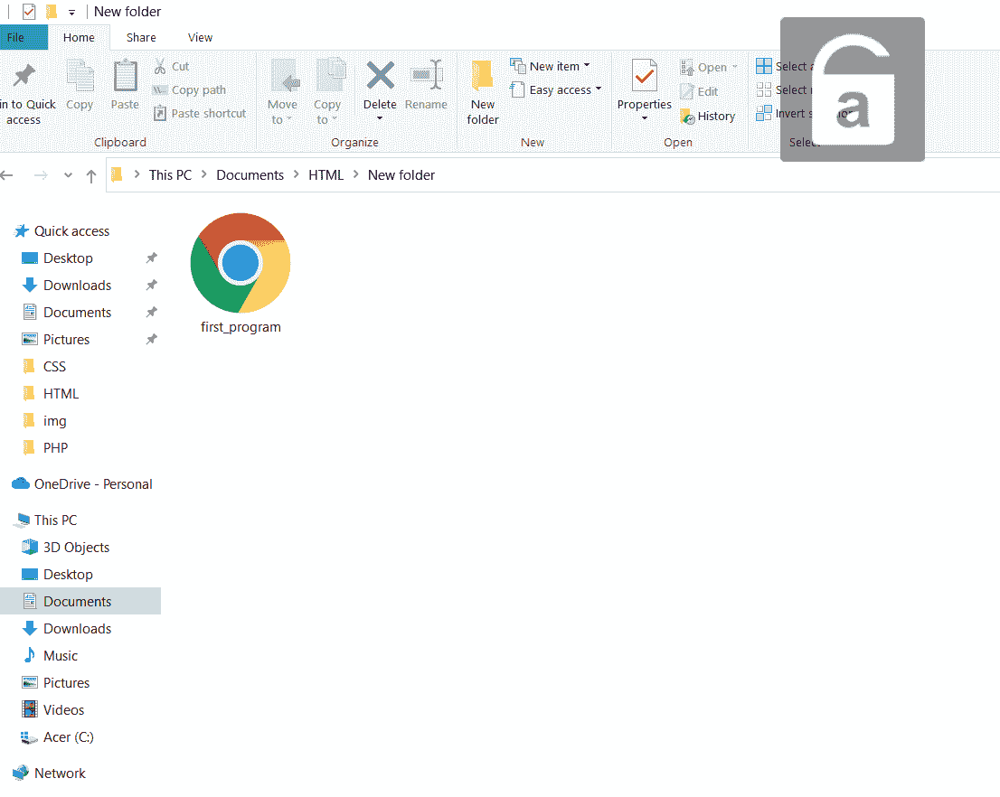

# HTML 环境设置

> 原文：<https://learnetutorials.com/html/environmental-setup>

在本 HTML 教程中，我们将讨论 HTML 文档的环境设置及其要求。

## 对 HTML 有什么要求？

正如我们在前面的教程中所讨论的，HTML 是一种标记语言，它不像大多数其他语言那样有很多要求。连接 HTML 代码的唯一要求是一个文本编辑器和一个浏览器来运行编写好的 HTML 文档。为了编写一个 HTML 文档，我们可以使用一个简单的记事本，但是大多数当代程序员仍然使用 IDE 来编写源代码。如果我们想托管创建的 HTML 网站，那么我们必须使用服务器。

## 什么是 IDE？

集成开发环境是那些用于开发其他应用程序的应用程序。集成开发环境可以执行开发应用程序所需的所有功能。集成开发环境包括源代码编辑器、编译器、调试器和其他内置工具。

## HTML 最流行的 ide 有哪些？

*   VS 代码
*   黯然失色
*   开发工具
*   原子
*   IntelliJ IDEA
*   RJ 文本
*   NOTEPAD++
*   括号
*   科莫多编辑
*   web 图形

## 什么是网络浏览器？

网络浏览器，通常称为“浏览器”，是一种允许您访问和查看网页的程序。微软 Edge、Internet Explorer、谷歌 Chrome、Mozilla Firefox 和苹果 Safari 都是流行的网络浏览器的例子。网络浏览器的主要作用是呈现 HTML，即用于构建或“标记”网页的代码。

## 什么是网络服务器？

网络服务器是用来托管网站的计算机。这是一个计算机应用程序，可以根据请求自动分发网页。web 服务器的主要目标是存储、处理和向用户分发网页。超文本传输协议用于这种相互通信。

## 如何编写和运行 HTML 代码？

**第一步**:打开我们正在使用的任何文本编辑器

**第二步**:把 HTML 代码写在记事本上。例如，我们正在编写打印 Hello World 的代码

**第三步**:点击文件菜单中的保存或另存为菜单，或者使用快捷键 ctrl + s 或 ctrl + shift + s 保存文件

**第 4 步**:现在从保存文件的驱动器中选择文件夹，并用扩展名命名文件”。html”(一个 HTML 文件应该总是以扩展名保存。html)。然后将另存为类型更改为“所有文件”，并通过单击保存按钮保存文件。

**第 5 步**:要运行 HTML 文档，我们必须打开保存的文件，我们只需要在任何一个浏览器中打开文件。

**第 6 步**:HTML 文件的输出会是

