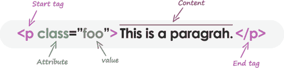

# 超文本标记语言元素

> 原文：<https://learnetutorials.com/html/elements>

在本 HTML 教程中，您将了解 HTML 中的所有元素。我们还将讨论 HTML 中最常用的属性。

## HTML 元素是什么意思？

HTML 元素是 HTML 文档的独立组件。它代表语义或意义。例如，title 元素表示文档的标题。大多数 HTML 组件都有一个开始标记(或开始标记)和一个结束标记(或结束标记)，中间有内容。元素也可以具有决定其额外特征的属性。

## 超文本标记语言和超文本标记语言元素有什么区别？

从技术上讲，一个 HTML 元素是一个开始标记、它的属性、一个结束标记以及它们之间的所有东西的集合。HTML 标记(开始或结束)用于表示元素的开始或结束。然而，在通常的使用中，短语“HTML 元素”和“HTML 标签”是相同的，即标签是元素是标签。为了清楚起见，术语“标签”和“元素”在这个网站上被同等地使用来表示同样的事情——因为它将在你的网页上指定一些东西。

## 标签和属性不区分大小写

HTML 中的标签和属性名称不区分大小写(但大多数属性值区分大小写)。它指的是标签

，HTML 中的标签

指定了同样的东西，就是一个段落。但是，在 XHTML 中，它们区分大小写，标签

不同于标签

。

## 什么是块级和内嵌的 HTML 元素？

在 HTML 中，出于默认显示和样式的目的，所有组件都分为两组:

*   块级元素
*   内嵌元素

### 块级元素

*   这些组件通过将网页分成内聚的部分来构建网页的主要部分。
*   块级元素总是以新的一行开始，并占据整个网页的宽度，从左到右。
*   这些元素可以包括块级和内联元素。

最常用的块级元素有 **<地址>、<文章>、<一旁>、<块引用>、<画布>、< dd >、< div >、< dl >、< dt >、< fieldset >、< figcaption >、<图> < li >、< main >、< nav >、< noscript >、< ol >、< output >、< p >、< pre >、< section >、< table >、< tfoot >、< ul >和>**

### 内嵌元素

*   内联元素是那些区分一段文本并为其提供特定功能的元素。
*   这些项目不会以新行开始，而是采用所需的宽度。
*   内联元素通常与其他组件结合使用。

最常用的内联元素有 **< a >、<缩写>、<缩写>、< b >、< bdo >、< big >、< br >、< button >、<引用>、<代码>、< dfn >、< em >、 <对象>、< q >、< samp >、<脚本>、<选择>、<小>、< span >、<强>、<子>、< sup >、< textarea >、< time >和**