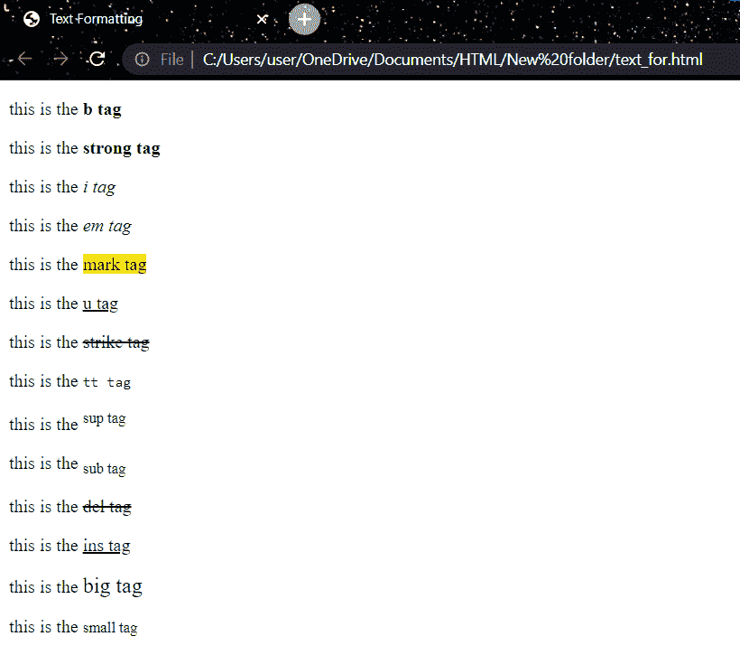

# HTML 格式

> 原文：<https://learnetutorials.com/html/formatting>

在本 HTML 教程中，您将学习 HTML 中的所有文本格式。我们还将讨论 HTML 中最常用的文本格式标签。

## 文本格式是什么意思？

HTML 格式化是格式化文本以改善其外观和感觉的过程。HTML 允许我们在不需要 CSS 的情况下格式化文本。HTML 有各种格式标签。使用这些标签，文本可以加粗、斜体或加下划线。文本在 HTML 和 XHTML 中的外观有很多可能性。

*   **粗体文本**:HTML 中的< b >和<强>标签是格式化元素。默认情况下，< strong >和< b >标签都以粗体显示包含的文本，但< strong >标签暗示其内容非常重要，同时< b >标签只是吸引读者的注意力，并没有赋予任何特殊意义。
*   **斜体文本**:HTML 中的< i >和< em >标签是格式化元素。与< em >标记类似，< i >标记也以斜体形式呈现所包含的文本，但是< em >标记表示其组件比周围的文本具有更大的强调度，而< i >标记用于标记与正常文本不同的文本，例如技术术语、来自另一种语言的惯用短语、思想等。
*   **标记格式**:为了突出显示或者标记一个文本，应该在<标记>内写内容。
*   **带下划线的文本**:<u>标签用于显示带下划线的内容。
*   **删除文本**:包含在<删除>标签中的任何文字都会显示删除线。这是一条跨越内容的细线。
*   **等宽字体**:如果希望每个字母的宽度相同，请将内容写在< tt >元素内。因为不同的字母有不同的宽度，大多数字体被称为可变宽度字体。(例如，“w”比“I”宽等宽字体在每个字母之间有相同的间距。
*   **上标文字**:如果将内容放入< sup >元素内，会以上标显示，也就是说会高出其他字符半个字符的高度。
*   **下标文字**:如果将内容括在<子>元素内，会以下标显示，也就是说会比其他字符低半个字符的高度。
*   **删除的文本**:包含在< del >标签中的任何内容都显示为删除的内容。它将在内容上有所突破。
*   **插入文本**:包含在< ins >标签中的任何内容都显示为插入内容。大多数情况下，浏览器会给输入的文本加下划线。
*   **更大的文本**:如果你想让你的字体比文本的其他部分大，但是它包含在<大>标签中。它使字体比前一个大一号。
*   **较小的文本**:如果你希望你的字体比文本的其余部分大，但是它被包含在<小>标签中。它使字体比前一个大一号。

### HTML文本格式示例

```html
 <!DOCTYPE html>
<html>
<head>
    <title>Text Formatting</title>
</head>
<body>
   <p> this is the <b>b tag</b> </p>
   <p> this is the <strong>strong tag</strong> </p>
   <p> this is the <i>i tag</i> </p>
   <p> this is the <em>em tag</em> </p>
   <p> this is the <mark>mark tag</mark> </p>
   <p> this is the <u>u tag</u> </p>
   <p> this is the <strike>strike tag</strike> </p>
   <p> this is the <tt>tt tag</tt> </p>
   <p> this is the <sup>sup tag</sup> </p>
   <p> this is the <sub>sub tag</sub> </p>
   <p> this is the <del>del tag</del> </p>
   <p> this is the <ins>ins tag</ins> </p>
   <p> this is the <big>big tag</big> </p>
   <p> this is the <small>small tag</small> </p>
</body>
</html> 

```

