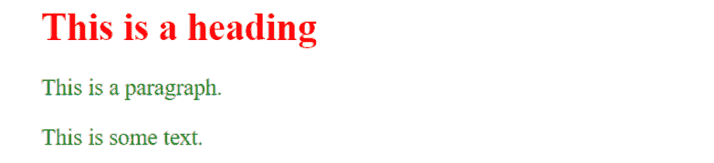
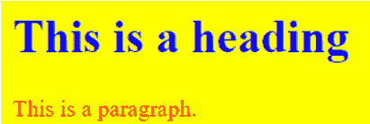
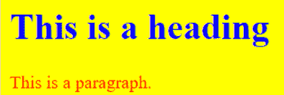

# HTML 和 CSS

> 原文：<https://learnetutorials.com/html/html-css-tutorials-for-beginners>

在本 HTML 教程中，您将学习如何在 HTML 中使用 CSS。我们还将讨论在 HTML 中包含 CSS 的不同方法。

## CSS 在 HTML 中有什么用？

假设我们用简单的 HTML 代码开发了我们的网页，并且想要一些既能以合适的方式传递我们的内容，又能在视觉上吸引人的东西。为此，我们可以使用 CSS(级联样式表)属性来设置网页的样式。CSS 用于给由 HTML 组件组成的网页赋予风格。它描述了网站的外观。为了给网页设置样式，CSS 提供了各种样式属性，例如背景色、填充、边距、边框颜色等等。每个 CSS 属性都有一个由分号(；).

在 HTML 文档中包含 CSS 主要有三种方式

1.  **倾斜 CSS**–在 HTML 元素中，使用样式属性定义 CSS 特征。它将包含在我们想要赋予样式的元素的开始标记中。
2.  **内部 CSS**–内部 CSS 将包含在文档的头部，并包含在样式元素中
3.  **外部 CSS**–外部 CSS 将被写入一个单独的带有扩展名的文档中。css ”,它将通过使用标题部分中的链接元素被包含到 HTML 文档中。

## 什么是 HTML 中的内联 CSS？

内联样式用于通过将 CSS 规则直接插入开始标记来实现元素的独特样式规则。style 属性可用于将其绑定到元素。一系列 CSS 属性和值对组成了样式属性。分号(；)分隔每个“property: value”对，就像在嵌入式或外部样式表中一样。但是，必须全部在一行上，分号后面不能有换行符。

使用内联样式通常被视为不良做法。因为样式规则直接集成到 HTML 元素中，所以呈现会与文档内容混杂在一起，使得更新或维护网站变得困难。

```html
 <h1  font-size:30px;">This is a heading</h1> 
<p  font-size:18px;">This is a paragraph.</p> 
<div  font-size:18px;">This is some text.</div> 

```



## 什么是 HTML 中的内部 CSS？

嵌入或内部样式表对嵌入它们的文档没有影响。`<style>`元素用于在一个 HTML 文档的头部建立嵌入的样式表。在`<head>`部分，您可以声明无限数量的`<style>`元素。

```html
 <head>
    <style>
        body { background-color: Yellow; }
 h1 { color: blue; }
        p { color: red; }
    </style>
</head>
<h1>This is a heading</h1>
<p>This is a paragraph.</p> 

```


## 什么是 HTML 中的外部 CSS？

当样式应用于大量页面时，外部样式表是完美的。外部样式表是一个单独的文档，它包含站点的所有样式规则，并且可以链接到任何 HTML 文档。外部样式表是适应性最强的，因为它们允许您通过只修改一个文件来更改整个网站的外观。外部样式表可以通过两种方式附加:**链接**和**导入**:

### 链接外部样式表

使用`<link>`元素，外部样式表可以连接到一个 HTML 文档。`<link>`标签用于`<head>`部分。

```html
 <head>
    <link rel="stylesheet" href="css/style.css">
</head> 

```



### 导入外部样式表

加载外部样式表的另一种方法是使用@import 规则。@import 声明指导浏览器加载和利用外部样式表。它有两种用途。最简单的方法是将其包含在`<head>`部分的`<style>`元素中。需要注意的是，附加的 CSS 规则仍然可以放在`<style>`元素中。

```html
 <style>
    @import url("css/style.css");
    p {
        color: blue;
        font-size: 16px;
    }
</style> 

```

