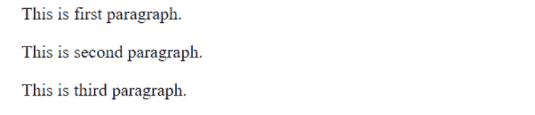
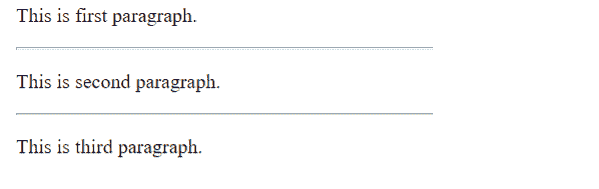
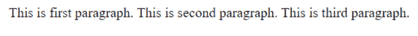
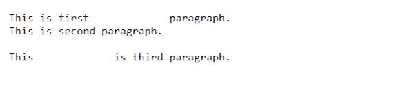

# HTML 段落

> 原文：<https://learnetutorials.com/html/paragraph-tags>

在本 HTML 教程中，您将了解 HTML 中段落标记的所有内容。我们还将讨论 HTML 中的换行符标签和水平规则标签。

## HTML 中的段落标签有什么用？

网页中的段落由 HTML 段落或 HTML p 标记定义。为了演示它是如何工作的，让我们看一个基本的例子。值得注意的是，浏览器会在段落前后自动插入空行。HTML 中的`<p>`标记表示新段落的开始。

```html
 <p>This is first paragraph.</p>  
<p>This is second paragraph.</p>  
<p>This is third paragraph.</p> 

```



## 使用 HTML 中的
标签

换行符是通过 HTML `<br>`标签生成的，可以和段落组件一起使用。以下是如何将`<br>`元素与元素一起使用的示例。

```html
 <p>This is first paragraph. <br>  
This is second paragraph. <br>
This is third paragraph. </p> 

```


## 使用 HTML 中的

* * *

标签

使用 HTML `<hr>`元素在两个语句或段落之间画一条水平线。下面是如何使用带有段落的`<hr>`标签的例子。

```html
 <p>This is first paragraph.</p><hr>  
<p>This is second paragraph.</p><hr>
<p>This is third paragraph.</p> 

```



## HTML 段落中的空白

通过按键盘上的空格键或 tab 键，浏览器通常会将 HTML 代码中的许多空格显示为一个空格。在 HTML 代码中使用回车键创建的多个换行符同样显示为一个空格。

```html
 <p>This is first             paragraph.
This is second paragraph.

This             is third paragraph.</p> 

```



## 使用预格式化文本

使用、`<br>`和其他间距管理工具并不总是实用的。您也可以使用`<pre>`标签来精确显示空格、制表符、换行符和其他元素在 HTML 文件中的显示。当呈现需要大量空白和换行符的内容时，例如诗歌或代码，它非常有用。

```html
 <pre>This is first             paragraph.
This is second paragraph.

This             is third paragraph.</pre> 

```

