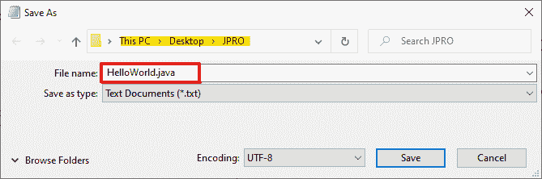
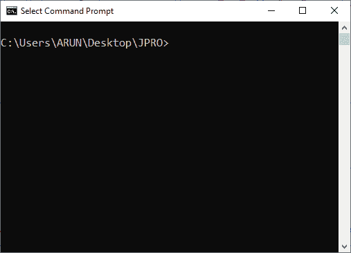
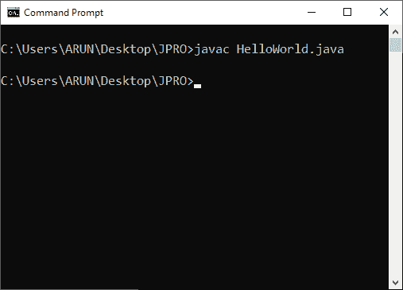
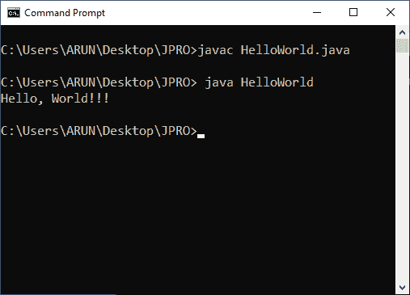
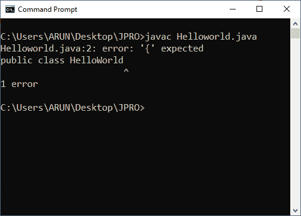
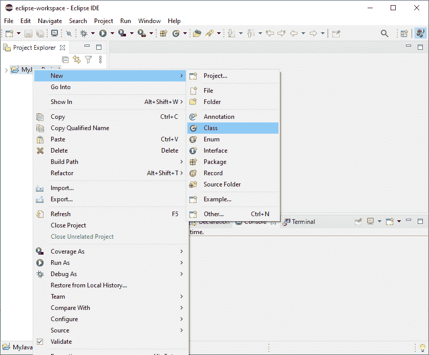
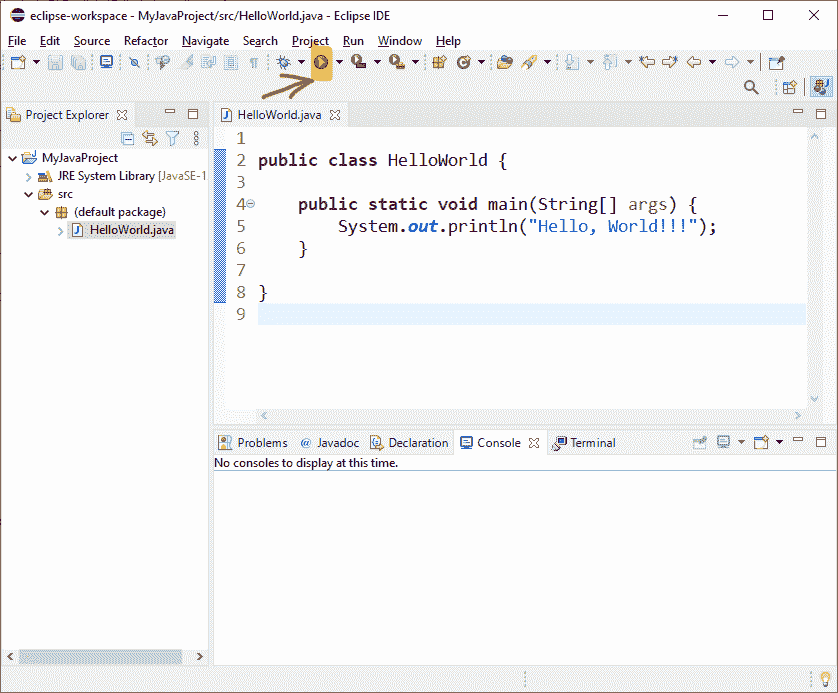

# 第一个 Java 程序

> 原文：<https://learnetutorials.com/java/syntax-of-java-program>

在本教程中，您将通过编写第一个 java 程序来了解 java 程序的基本结构，并将介绍编译和运行 java 程序的不同方法。

## java 程序的基本语法

让我们从《你好，世界》节目开始，这是一个传统的基本节目。如果你运行这个程序，它只是在你的屏幕上显示一条信息`Hello, World!!!`。这个程序的主要目的是让学习者了解 java 语言的基本结构。


## Java 中的注释

上面 java 程序的第一行叫做注释。基本上，注释是在两个正斜杠(//)之后开始的文本，或者包含在“/*”和“*/”中，以使代码更易读和更有意义。在我们的例子中，从最开始的一行我们就知道，这是‘你的第一个节目——你好世界节目’。

在 Java 中，我们可以通过两种方式编写注释:

*   单行注释:是以两个正斜杠//开头的文本，它的生命只存在于一行，当光标移动到下一行时结束。
*   多行注释:是分别以/*和*/开头和结尾的文本。它可以是单线或多线。如果您在“/*”和“*/”之间写任何东西，它都不会被执行，相反，编译器会忽略这两个符号之间写的任何东西。

评论区不是给前端用户的，而是给程序员的。这有助于他们跟踪程序的每个部分，而不会干扰编程结构。因为注释不是编程语句，所以它们可以出现在程序的任何地方，但是是可选的。

## Java 类声明

java 程序基本上是以某种顺序执行的 java 指令的集合。作为一种面向对象的编程语言，java 中的一切都与类和对象联系在一起。因此，java 中的每条指令都应该驻留在一个类中，该类中的所有内容都必须写在一个开始大括号“{ 0 }”和结束大括号“{ 1 }”中。与其他编程语言不同，java 中的左大括号从我们定义类的同一行开始。因此，我们可以把 java 中的类看作是一个包含一组变量及其相关方法的容器。

简单的类定义如下:

```java
 public class HelloWorld {

} 

```

这里， **Helloworld** 是类的名字。 **class** 是用于声明一个新的 java 类的 java 关键字， **public** 是用于表示类的访问的另一个 java 关键字，无论该类是公共可访问的还是私有可访问的。

在保存 java 代码时，您应该记住，“**Java 文件的名称应该与类的名称**相同”。这意味着这里 java 代码的文件名应该是 HelloWorld，后跟扩展名. java。所以 HelloWorld.java 是文件名。

## Java 中的 main()方法

java 程序的另一个不可避免的部分是方法。方法是一组用于操作变量的指令。方法主要位于类内部。一个类可以包含“n”个方法，但不少于一个。换句话说，一个类必须包含至少一个方法来通知 Java 虚拟机在哪里开始执行程序。这个触发 java 程序执行的单一方法在 java 中通常被称为 **main()** 方法。 **main()** 方法中的所有内容都必须写在开始大括号“{”和结束大括号“}”中

**main()** 方法声明采用如下形式:

```java
 public static void main(String[] args) {
   Statement/s;
} 

```

在这里，

**public** :关键字 public 表示方法的访问说明符。这里，方法被声明为公共的，这意味着它可以从程序中的任何地方访问。

**static**:Java 关键字 static 用于内存管理。它告诉我们方法 main()对于类是静态的，而不是对于类的实例。

**void**:Java 关键字 void 指定主方法不返回任何类型。

**main()** :这是启动 java 程序执行的唯一方法的名称。

**String[] args** :它只是一个字符串的数组，用来存储启动程序时命令行传递的用户数据。具体来说,“args”以字符串数组的形式存储所有命令行参数。

## Java 中的语句

当程序开始执行时，java 中的语句纯粹是编译器的 java 指令。java 中的 print 语句具有以下签名:

在这里，

*   **系统**是包`java.lang`内的一个类，包含 3 个主流，即`System.in`、`System.out`和`System.err`。在 java 中，我们经常使用 System.out 来显示应用程序的输出。
*   出的**既是系统类的静态成员，也是公共成员，属于`PrintStream`类型。**
*   **println()** 是 PrintStream 类的一个方法，用于打印传递到控制台的消息并添加一个新行。

最后，上述程序的输出只是 println()方法内部的文本。那只不过是文字“**你好，世界！！！**”。

注意:语句必须始终以分号结尾

## 如何编译和执行 java 程序

写完一个 java 程序后，下一个必要的步骤是编译它们。Java 中的编译与其他语言有很大的不同。在这里，程序员可读的代码被转换成字节码，任何有 JVM 的计算机都很容易解释。要了解更多关于 [Java 虚拟机](../java/java-architecture-and-its-components)的信息，请参考我们之前的教程。执行是运行程序以获得我们想要的输出的过程。

### 使用命令提示符

在这里，我们将逐步了解如何在 Windows 环境中使用记事本和命令提示符执行编译和执行。

**第 1 步**:打开记事本，按照上面给出的方法编写你的第一个 java 程序。


**第二步**:用保存程序。java”扩展，就像“HelloWorld.java”一样，可以在任何工作空间中随意使用。在这里，我把它保存在桌面上的 JPRO 文件夹中，在下图中，JPRO 以黄色突出显示。



**第三步**:现在打开你的命令提示符，把目录改成保存程序的地方。



**第四步**。现在提供编译命令为“Javac HelloWorld.java”。

*   没有错误:如果 java 代码是完美的，没有任何语法错误，那么将出现下面的结果屏幕。
*   有错误:如果您遗漏了一个大括号或发生了其他错误，编译器会指出如下所示的错误。

**第 5 步**:接下来运行程序，用命令
“Java hello world”获得想要的输出。



### 使用 ECLIPSE 集成开发环境

如果你是一个 Windows 用户，还没有下载过 eclipse IDE，那么请访问我们的教程——Java IDE Windows 安装，了解 IDE 的安装和设置，以实现无障碍编程。现在让我们熟悉 eclipse IDE 来编写您的第一个程序，然后编译并运行它。

**第一步**:打开 Eclipse IDE。将出现以下窗口。


**步骤 2** :要创建一个 java 项目，请遵循下面的步骤，为了便于理解，该步骤已经被很好地描述了。

**点击文件- >新建- > Java 项目- >点击回车。**


**第三步:**屏幕上出现如下所示的窗口**。**

1.  为您的 java 项目提供一个合适的名称。在这里，我们的项目名称是 **MyJavaProject** 。
2.  您可以根据自己的意愿选择工作区。这里我们坚持使用**默认位置**。
3.  然后点击**完成**按钮。


**第四步**:现在你会看到一个如下图的屏幕。该窗口包含 3 个部分

1.  红色方框代表**项目浏览器区域**，这里列出了你所有的作品。如果你在你的 LHS 上找不到项目浏览器，那么沿着路径**窗口- >显示视图- >项目浏览器**。
2.  橙色方框代表**编辑器区域**，您可以在这里输入所有的 java 代码。
3.  蓝色方框代表显示所有输出的**控制台区域**。


**第 5 步**:现在要在 Eclipse IDE 中编写第一个程序，需要在 java 项目下创建一个类。创建一个类

**右键单击 MyJavaProject - >然后单击**新建 **- >然后单击类**



**第六步**:下面的窗口会是结果

1.  给定一个类名。这里我们给出了类名“HelloWorld”。
2.  确保勾选截图中以绿色突出显示的主要方法。
3.  最后点击完成按钮。


第七步:点击完成按钮，下面的窗口将在编辑器区域显示一些预定义的代码。java 类和 main 方法是自动创建的，现在您可以开始在语句中编写代码了。


在项目浏览器上，您可以注意到创建了一个名为 HelloWorld.java 的 java 文件。

注意:运行 java 代码的快捷键是 Ctrl+F11。

**第 8 步**:在 Eclipse IDE 中，编译和执行都是通过一个名为“运行”按钮的按钮来完成的，如下所示。



**第 9 步**:执行 java 代码时，输出将显示在控制台上，如下图所示。

