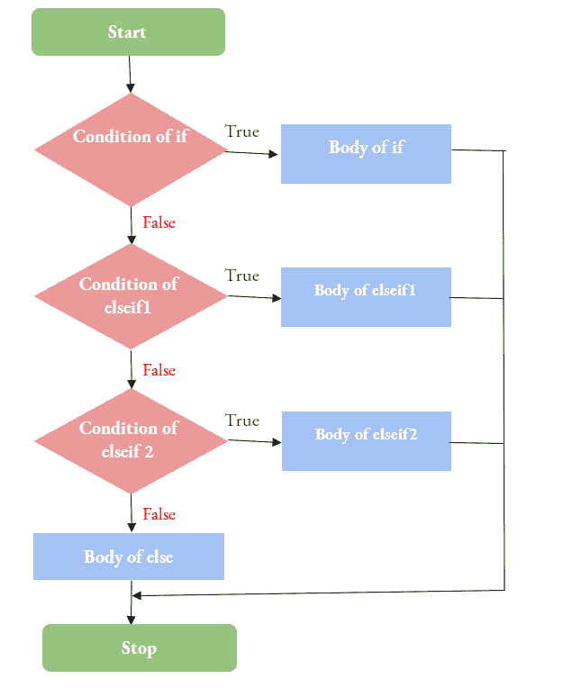

# java 中的决策

> 原文：<https://learnetutorials.com/java/decision-making-statements>

在本教程中，我们将介绍 java 中决策语句的基础、语法和用法，例如 if、if else、if else、嵌套 if 等。您还将学习如何在 java 中处理 switch 语句。

我们在现实生活中都曾经做过决定。在特定的条件下，我们更喜欢从各种选择中选择最好的行动来达到预期的结果。java 中决策的概念也是一样的。像在任何其他编程语言中一样，我们使用决策语句来运行备选方案中的特定代码块，以获得所需的结果。

## 什么是决策？

从定义上来说，决策是从可能的选项中选择一个合适的行动方案来达到预期结果的过程。

每种编程语言都有一些控制程序执行的条件。在 java 中，决策语句根据表达式测试条件来选择运行程序的语句或代码块。决策结构测试程序中的一个或多个条件。如果表达式的值为真，控制流进入特定的代码块；否则，将为测试值执行另一组代码；假的。

java 支持的决策语句的工作原理如下:


### 决策声明的工作

如果满足测试条件，则执行一组语句，否则执行另一组语句。测试条件有助于决策部门选择要执行的适当语句集。

## 决策陈述的类型

以下是我们将在本教程中介绍的各种 java 决策语句:

1.  如果语句
    *   简单 If 语句
    *   If-else 语句
    *   嵌套 If 语句
    *   If-else-If 语句
2.  交换语句

现在让我们详细看看每个话题。

## 1.如果语句

if 语句是一个强大的工具和简单的决策语句，用于用值检查特定的条件。它检查测试条件的值是否为真。它控制条件语句的执行流程。

在 Java 中，If 语句有多种形式，这些语句在程序中的使用是基于要测试的条件的复杂性。

***布尔*** 是 if 语句中最常用的数据类型，用于条件测试。Boolean 是一种基元数据类型，只表示两种可能的值:true/false。如果您还没有浏览布尔数据类型，请访问我们的`Data types in java` *教程。*

### 1.简单如果:

`if`语句，用两个可能值检查条件:真/假。如果条件为真，它将执行条件主体后面的代码块。
语句的一般语法:

```java
 If (test_condition)
{
// block of codes();
}
// statement; 

```

代码块可以是单个语句或一组语句。

#### if 语法的工作原理:

这里，如果测试条件为真，则立即执行一组代码；否则，控件将被跳过到 if 语句之后的指令。

#### If 语句的流程图:

为了更好地理解，让我们看看流程图中的工作原理:


### If 语句的流程图:

现在看简单 if 语句的例子；

```java
 public class IfStatementEx {

 public static void main(String[] args) {
  int score = 100;
  if(score==100) {
   System.out.println("Century!!!");
  }
  System.out.println("Exit");
 }

```

**输出:**

```java
 Century!!!
Exit 
```

**节目解说:**

在最初的程序中，我们给变量`score`分配了一个整数值。然后使用 if 语句我们检查变量得分中的值是`100`。如果相等，则程序应显示信息`Century!!!`。然后，它跟随下一个语句，这又是一个带有“退出”消息的打印语句。如果提供的条件不满足，则打印 `if`条件后的声明，即打印消息`Exit`。简单的 i `f`语句的缺点是，它只执行遵循真值的语句，而不处理真和假的情况。

### 2.If-else 语句

`If-else`语句的工作原理类似于简单的 i `f`语句。在`if`语句中，如果测试值为假，则紧接在`If` 语句之后的指令将被执行，而在`if-else`语句中，当`if`的测试条件值为假时，将执行 else 部分。

`if-else`语句的语法是:

```java
 If(test_condition)
{
// block of codes();
}
else
{
// block of codes();
} 

```

#### If-else 语句的工作原理:

这里，如果测试条件为真，则执行`if`部分的代码集，或者如果测试条件为假，则执行 else 部分的代码集。此后，控件将移动到剩余的语句。


### If-else 语句的流程图:

示例:

```java
 public class IfStatementEx {

 public static void main(String[] args) {
  int n = -10;
  if(n > 0) {
   System.out.println("Positive Number");
  }
  else {
   System.out.println("Negative Number");
  }
  System.out.println("Exit");
 } 

```

**输出:**

```java
 Negative Number
Exit 
```

从上面的例子可以很清楚地看出，如果给定的条件 n>0

*   确实，它应该显示消息“正数”作为输出
*   假，它应该显示消息“负数”作为输出

在我们的例子中，n 的值是-10，这是一个负数，显示的输出也是。

### 3.java 中的 If-else-If 梯形语句

`if-else-if`梯子可用于检查多个条件。这是一种非常常见的编程构造，允许检查多个条件。

一般语法如下:

```java
 If (test_condtion 1)
{
// block of codes();
}
elseIf (test_condtion 2)
{
// block of codes();
}
elseIf (test_condtion 3)
{
// block of codes();
} 

```

#### 如果-否则-如果梯子的工作:

如果测试条件为真，将执行测试条件之后的代码块；否则，控制移动到检查 elseif 跟踪中提到的后续条件。如果这些条件都不满足，那么 else 语句将被执行。

工作流程图:



### If-else-If 语句的流程图:

示例:

```java
 public class IfStatementEx {

 public static void main(String[] args) {

  String color = "Red";
  if(color == "Green") {
   System.out.println("GO,PLEASE");
  }
  else if(color =="Orange") {
   System.out.println("WAIT, PLEASE");
  }
  else if(color =="Red"){
   System.out.println("STOP, PLEASE");
    } else {
     System.out.println("Signal not working");
    }

 }
} 

```

**输出:**

```java
 STOP, PLEASE 
```

上面的例子显示了交通信号是如何工作的。这里

*   首先我们检查颜色是否为绿色，如果为真则显示输出`GO, PLEASE`。
*   如果不是，将再次检查颜色是否为橙色，当条件满足时应显示`WAIT, PLEASE`
*   如果不是，将再次检查颜色是否为红色，如果是，输出将是`STOP,PLEASE`
*   如果不满足任何条件，那么将执行 else 语句，该语句将打印“`Signal not working”.`

### 4.嵌套 If

另一个 if 中的一个`If`叫做一个`Nested If`。有时，我们需要检查一个 if 语句来执行另一个`If`语句的目标。

一般语法如下:

```java
 If(test_condition)
{
If(test_condition)
{
// block of codes();
}
Else
{
// block of codes();
}
}
else
{
// block of codes();
}
//statements(); 

```

#### 语法工作:

如果测试条件为真，将执行测试条件之后的代码块；这里的代码块是另一个带有 else 部分的 `if`语句。如果初始 If 条件是 `false`，那么 `else`语句将被执行。

工作流程图:


### 嵌套 if 语句的流程图:

示例:

```java
 public class IfStatementEx {

 public static void main(String[] args) {

  int a = 10, b =20;
  if(a!=b ) {
   if(a>b) {
    System.out.println("a is greater than b");
   }else {
    System.out.println("a is less than b");
   }
  }else {
   System.out.println("a and b are the same  numbers");
  }

 }
} 

```

**输出:**

```java
 a is less than b 
```

上面的程序展示了如何使用`nested if`验证两个数字之间的关系。最初，它将检查两个数字是否是不同的数字

*   如果是，那么它将再次检查第一个数字 a 是否大于 b。
    *   如果是，将显示消息“`a is greater than b`”。
    *   如果没有，将显示`“a is less than b”`信息。
*   如果没有，那么程序将显示消息“`a and b are the same numbers`”。

## 2.交换语句

java 的`switch`语句主要是作为一种速记，当我们有几个选项可以测试，为每个选项执行不同的任务时。开关是 java 中`multiple If` 语句的简写。

switch case 语句的一般语法如下:

```java
 Switch(expression);
{
case 0:
Statement 0();
break;
case 1:
Statement1();
break;
case 2:
Statement2();
break;
case 3:
Statement3();
break;
case 4:
Statement4();
break;
default:
Statement details();
} 

```

#### 语法工作:

一旦对`switch`语句中给出的表达式求值，该表达式的值将与每种情况下的值进行比较。当存在匹配时，将执行相关联的代码块。switch 语句可以与`break`语句一起使用，也可以不与`break`系统一起使用。


### SWITCH 语句的流程图:

签出以下程序:

```java
 class Rainbow {
    public static void main(String[] args) {
        int colour = 7;
switch (colour) {
  case 1:
    System.out.println("Red");
    break;
  case 2:
    System.out.println("Orange");
    break;
  case 3:
    System.out.println("Yellow");
    break;
  case 4:
    System.out.println("Green");
    break;
  case 5:
    System.out.println("Blue");
    break;
  case 6:
    System.out.println("Indigo");
    break;
  case 7:
    System.out.println("Violet");
    break;
default:  System.out.println("Not a rainbow colour");
}

    }
} 

```

**输出:**

```java
 Violet 
```

这里，在这个程序中，颜色是一个整数值变量，赋值为`7`。现在 switch 语句将对变量求值，取值`7`并在其大小写值中搜索匹配。我们有一个带有打印语句的案例 7，显示“`Violet`”作为它的输出。

使用 `switch`语句时需要注意的要点。

1.  `Switch`可以有一个或多个病例数。
2.  案例值应该是唯一的，并遵循`switch expression`的类型。
3.  大小写值应该是文字或常数。不允许变量。
4.  开关表达式可以是`character, string, integer, byte , short,long`或`enum`。
5.  关键词`break`和`default`可选。