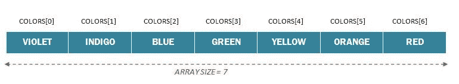
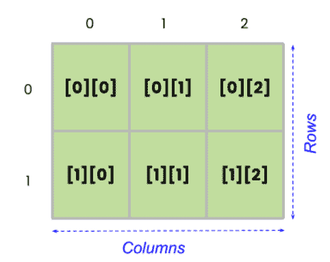
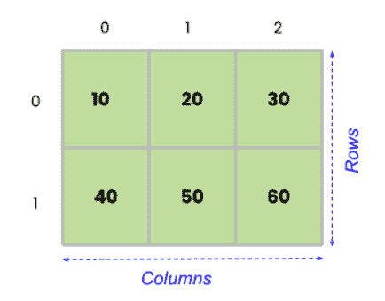

# Java 中的数组

> 原文：<https://learnetutorials.com/java/arrays>

在本 java 教程中，您将了解到关于称为数组的数据结构的一切。借助简单有趣的示例，您将了解如何通过声明、初始化和访问数组中的变量来操作数组。

## 什么是阵列？

数组是 java 中最简单、最基本的数据结构。顾名思义，数据结构是一种将数据存储在内存中的特定结构。很明显，有条理的记忆是有效的。所以在 java 中，有几种方法可以存储数据，可以线性存储，也可以堆叠存储，或者以树形结构存储。

**数组是一种线性数据结构，在连续内存**中存储相同数据类型的有限元素集。java 中的数组使用索引来存储和检索元素，并且它总是存储同质数据。


这就是数组的样子。这里，数组能够存储六条数据，索引从 0 到 5。所以这个数组的长度是 6，并且总是固定的。

## 如何用 java 声明数组？

我们从之前的教程中学习了如何在 java 中声明变量。java 中的数组声明也与此类似，但几乎没有附加组件。数组变量保存多个相同类型的项。数组声明的一般语法是:

```
 data_type[] array_name; 

```

哪里，

**data_type** 代表数组类型，可以是任何基本数据类型，如 int、char、float、string 等，也可以是任何 java 对象。

**array_name** 是数组变量的名称，按照命名约定可以是任意的；

**[]** 是表示所述变量是数组的特殊符号。

```
 String[] colors; 

```

例如:

这里，colors 是类型字符串的数组。

java 中的数组声明也可以采用以下形式:

```
 String []colors; or
String colors[]; 

```

## 如何在 Java 中分配数组

声明一个变量并不意味着数组已经被分配到内存中。它只是告诉编译器声明的变量是一个数组。让我们来了解一下在 java 中数组是如何分配的。语法是:

```
 data_type[] array_name = new data_type[array_size]; 

```

示例:

```
 String[] colors = new String[7] ; 

```

这里我们已经声明了一个名为`colors`的数组，并借助`new`关键字在内存中分配了它们，大小被称为`7`。数组的分配以“`null`”开始，因此序列的最后一个元素将存储在`a[size -1]`。在我们的示例中，数组的第一个元素将在 `colors[0]`分配，最后一个元素将在 `colors[6]`分配。这里可以说**数组长度或大小**是`7`并且是固定的。

相同的申报和分配可以用如下所示的另一种形式书写:

```
 String[] colors
colors = new String[7] ; 

```

## 用 Java 初始化数组

所以我们已经看到了如何声明和分配数组。现在让我们看看如何用元素初始化数组。初始化可以通过两种方式完成；

1.  ### 在声明期间初始化数组

    Java 提供了在声明时初始化数组的工具。这可以通过在花括号中列出元素，后跟逗号来实现。数组初始化语法是:

    ```
     data_type[] array_name = {value_1st_element,value_2nd_element,3rd.....}; 

    ```

    例如，

    ```
     String[] colors = {"VIOLET", "INDIGO", "BLUE", "GREEN","YELLOW", "ORANGE", "RED"}; 

    ```

    当您观察上面的例子时，您可能会注意到没有提到数组的大小。这里，编译器通过计算初始化数组的元质数量来自动考虑数组的大小。在这种情况下，数组的长度是 7，因为数组中包含七种颜色。

2.  ### 使用数组索引初始化:

    初始化数组的另一种方法是使用索引号。内存位置总是与一个称为索引号的数字相关联，这有助于轻松分配和检索数组元素。例如，

    ```
     //String array declaration 
    String[] colors = new String[7] ;
    // Array initialization
    colors[0] = “VIOLET”;
    colors[1] = “INDIGO”;
    colors[2] = “BLUE”;
    colors[3] = “GREEN”;
    colors[4] = “YELLOW”;
    colors[5] = “ORANGE”;
    colors[6] = “RED”; 

    ```

    初始化后的一维数组可以最好地可视化如下。

    

## 用 java 访问数组的元素”

现在是时候讨论如何在 java 中访问数组元素了。可以通过两种方式访问数组元素:

1.  ### **使用索引**

    在初始化时，我们已经看到了 java 中索引是如何工作的。类似地，为了检索数组的元素，我们可以使用相同的索引技术，其语法如下:

    ```
     array_name[index_number]; 

    ```

    请参见下面的示例:

    ```
     class ArrayRainbow{
        public static void main(String[] args) {
            String[] colors = {"VIOLET", "INDIGO", "BLUE", "GREEN","YELLOW", "ORANGE", "RED"};
             System.out.println("Accessing Elements of Array:");
             System.out.println("Element at index of 0: " + colors[0]);
             System.out.println("Element at index of 2: " + colors[2]);
             System.out.println("Element at index of 4: " + colors[4]);
             System.out.println("Element at index of 6: " + colors[6]);

        }
    } 

    ```

    输出将是:

    **输出:**

    ```
     Accessing Elements of Array:
    Element at index of 0: VIOLET
    Element at index of 2: BLUE
    Element at index of 4: YELLOW
    Element at index of 6: RED 
    ```

2.  ### **使用索引和循环**

    现在假设您的数组包含 100 个元素，并且您想要一次访问所有元素。你怎么能做到呢？是的，我们的救援循环来了。我们可以使用循环一次访问并打印数组中的所有元素，如下例所示。

    ```
     class ArrayRainbow{
        public static void main(String[] args) {
            String[] colors = {"VIOLET", "INDIGO", "BLUE", "GREEN","YELLOW", "ORANGE", "RED"};
             System.out.println("Accessing Elements of Array using for loop");
             for(int i=0;i <colors.length></colors.length> 
    ```

    `The output will be:`

    `**Output:**`

    ```
     <samp>Accessing Elements of Array using for loop
    VIOLET
    INDIGO
    BLUE
    GREEN
    YELLOW
    ORANGE
    RED</samp> 
    ```

## 数组长度和数组索引输出异常

上面的示例向您展示了如何在数组中循环。您可能会注意到 for 循环中指定的长度属性。如果不是，在 java 中，数组的长度或大小表示数组有多少元素，可以使用 length 属性来确定。语法如下:

```
 array_name.length; 

```

见下面的例子

```
 class ArrayRainbow{
    public static void main(String[] args) {
        String[] colors = {"VIOLET", "INDIGO", "BLUE", "GREEN","YELLOW", "ORANGE", "RED"};
        //size of the array
        int len = colors.length;
        System.out.println("Length of the array is "+len);

         System.out.println("Accessing Elements of Array using for loop");
         for(int i=0;i<=len;i++)
         {
         System.out.println(colors[i]);
         }
} 

```

输出将是:

**输出:**

```
 Length of the array is 7
Accessing Elements of Array using for loop
VIOLET
INDIGO
BLUE
GREEN
YELLOWORANGE
RED Exception in thread "main" java.lang.ArrayIndexOutOfBoundsException: Index 7 out of bounds for length 7at ArrayRainbow.main(ArrayRainbow.java:14) 
```

在上面的输出中，您可以看到一个**ArrayIndexOutOfBoundException**。正如其名称所示，当您搜索超出给定数组索引限制的元素时，就会出现这种情况。当你忘记考虑**数组索引总是从 0 开始到 n-1** 结束这一事实时，错误就发生了。在上面的示例中，for 循环检查第 7 个位置的元素，尽管数组索引限制在第 6 个位置。

## 使用 for-each 循环遍历数组

Java 提供了另一种更好的方式来遍历数组中的每个元素。这种方法被认为是遍历数组中每个元素的最简单、最容易的方法。为什么呢？因为它不需要计数器(length 属性)，也没有任何索引出站异常发生的机会。语法是:

```
 for (datatype variable_name : array_name) {
  ...
} 

```

上述示例可以修改为:

```
 class ArrayRainbow{
    public static void main(String[] args) {
        String[] colors = {"VIOLET", "INDIGO", "BLUE", "GREEN","YELLOW", "ORANGE", "RED"};

        for (String c : colors){
    System.out.println(c);
}
    }
} 

```

输出将是:

**输出:**

```
 VIOLET
INDIGO
BLUE
GREEN
YELLOW
ORANGE
RED 
```

## 如何修改数组元素

假设您想要将特定位置的数组元素更改为其他元素。在 java 中可能吗？绝对有可能。这里也要利用 index 方法，用你想要的值重新初始化它。见以下程序:

```
 class ArrayRainbow{
    public static void main(String[] args) {
        String[] colors = {"VIOLET", "INDIGO", "BLUE", "GREEN","YELLOW", "ORANGE", "RED"};

        colors[2]="BLACK";
         colors[4]="WHITE";

        for (String c : colors){
    System.out.println(c);
}
    }
} 
```

**输出:**

```
 VIOLET
INDIGO
BLACK
GREEN
WHITE
ORANGE
RED 
```

## Java 中的多维数组

到目前为止，我们一直在讨论如何操作一维数组。通常，具有一行一列以上的数组称为**多维数组**。因为多维数组中的每个元素本身就是一个数组，所以我们可以说**多维数组是数组**的数组。它可以是二维数组、三维数组或 n 维数组。因此，让我们讨论二维数组，以了解多维数组是如何工作的。二维数组由行和列组成，就像矩阵一样。可以认为是多维数组。

### **2D 阵宣言:**

声明语句有两个连续的索引，一个表示行数，另一个表示列数，如图所示:

```
 data_type[][] array_name = new data_type[row] [column];
int[][] table= new int[2][3]; 

```

这里，`table`是一个 2 行 3 列 6 个整数值的二维数组。声明二维数组时，行大小和列大小都必须用方括号括起来。每个元素的分配如下:



### **2D 阵列的初始化:**

初始化可以在声明过程中完成，其形式如下

```
 data_type[row] [column] array_name = {{value_1st_element,value_2nd_element,3rd.....},{.........}}; 

```

比如我 **nt[2][3]表={ {10，20，30}，{40，50，60} }**

初始化后的二维数组可以最好地可视化如下。



要了解更多多维程序，请访问 [java 程序。](https://learnetutorials.com/java/programs)