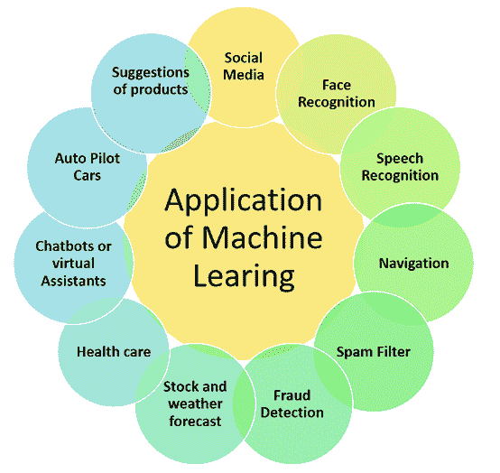
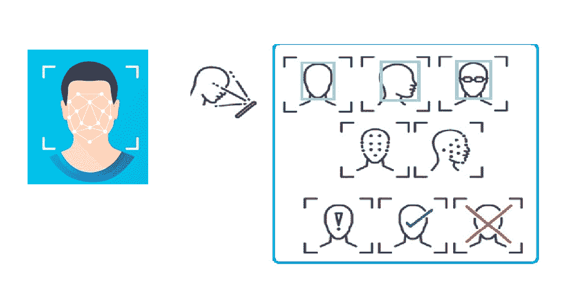
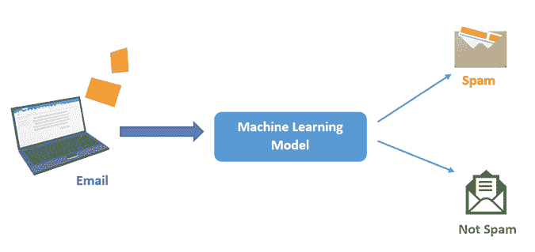
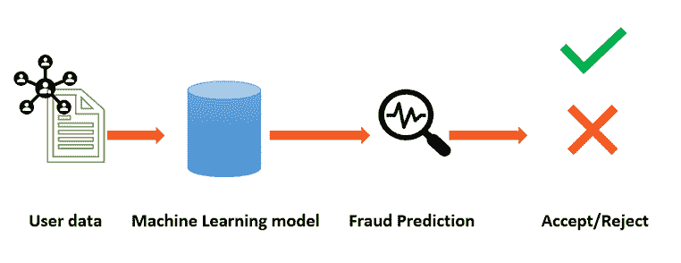
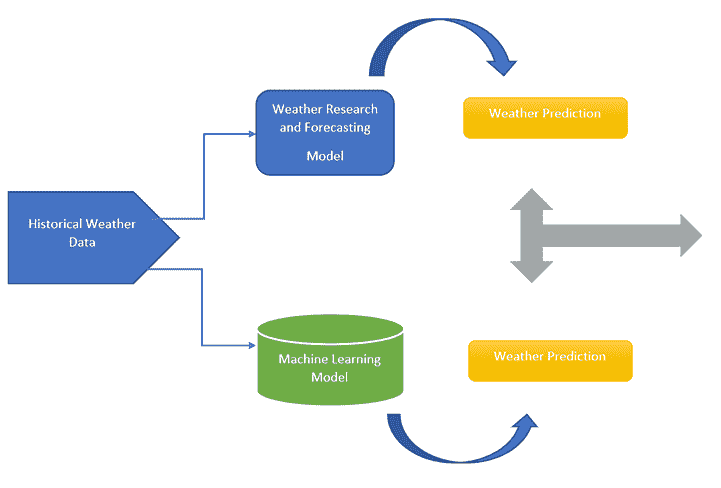
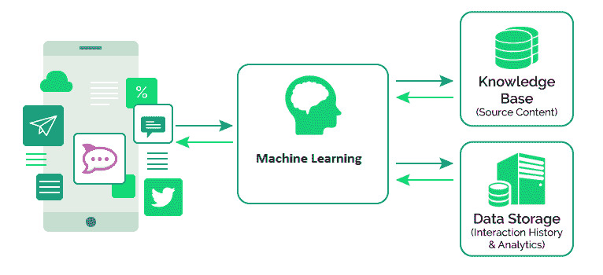

# 机器学习的应用

> 原文：<https://learnetutorials.com/machine-learning/machine-learning-applications>

机器学习是技术领域的热门词汇之一。机器学习有助于学习和分析大量数据，学习其中的模式，并有助于基于数据做出决策，这种决策被称为数据驱动决策。

我们在日常生活中使用机器学习应用程序，却不知道我们在使用这项技术。机器学习是我们现代世界中发展最快的技术之一；这将是科技世界的下一次革命。

在学习机器学习之前，我们需要知道这种机器学习在实际世界中的应用。在本教程中，我们将熟悉一些著名的和日常使用的机器学习应用程序。

## 社会化媒体

脸书、推特等社交媒体正在使用机器学习进行数据分析和预测。我们使用了朋友建议，类似的视频，推荐页面和小组都在内部为他们的工作做机器学习。脸书持续检查你的喜好、访问的页面、群组和视频，使用最大似然算法分析数据，并使用预测来获得推荐的视频、群组、页面和朋友建议。

## 人脸识别

第二，脸书做人脸识别。你有没有想过当你上传一张照片时，脸书是如何立即识别照片中的朋友并给你一个标签选项的。它涉及许多后端功能，但总的来说，它是机器学习的一个应用。
脸书正在使用名为 Deep Face 的技术，该技术通过分析照片的数据，识别其中相似的模式，并将其与你朋友列表中的照片进行比较，这涉及到一个复杂的过程，正如我们前面所说；它是机器学习的一个应用。

## 语音识别

今天，我们主要使用语音命令，如谷歌的语音搜索，这是机器学习的一个应用。像谷歌语音、Siri、Alexa 等属于语音识别的应用程序正在使用机器学习进行语音处理。
当我们讲系统的时候，把语音翻译成文本，这就是通常所说的语音识别。现在，我们正在使用机器学习算法来分析和学习数据并做出决策。

## 航行

如今，当我们想去一个地方的时候，我们首先要做的，就是拿着谷歌地图去获取路线和交通状况。谷歌地图预测流量，并给出到达目的地的最短时间路径。
你有没有想过谷歌地图是如何预测流量的？它使用两个输入来分析交通，即车辆的实时位置和过去几天到达某个位置的平均时间。

数据被处理、分析，并从数据中学习一些模式。然后预测输出，这显然是机器学习的一个应用。

## 垃圾邮件过滤器

你有没有想过一封电子邮件是如何自动过滤到我们的收件箱或垃圾邮件文件夹的。我们总是只收到垃圾邮件文件夹中的垃圾邮件和收件箱中作为单独标题的重要电子邮件。它是机器学习的一个应用。
Gmail 如何过滤垃圾邮件？

1.  内容过滤
2.  标题过滤
3.  黑名单
4.  基于规则的归档

机器学习算法也被用于恶意软件检测。

## 欺诈检测

在线交易正在使用机器学习进行安全操作。我们每天都在做网上交易，有很多骗子，他们试图针对我们的交易，如假身份证、假账户、假网站，在网上玩诈骗，并能在交易之间窃取我们的钱。

机器学习算法正在帮助我们保护我们的交易。对于每个事务，输出都转换为一些哈希值。在真正的交易中，这种价值会有特定的模式，而在欺诈交易中，不会有特定的模式。因此，机器学习可以很容易地理解欺诈并采取必要的行动。

## 股票和天气预报

我们使用机器学习进行模式识别和预测。机器学习的这种适用性被用于天气预报和股票预测。
机器学习算法能够从海量的数据中进行分析和学习，能够预测出准确高效的结果，并将在两种应用中得到应用。

## 卫生保健

医疗保健包含各种问题，包括高昂的管理费用、维护隐私和安全、简化记录保存和改善患者结果。健康信息学使用信息技术来改善患者结果并优化医疗保健领域的管理。

将机器学习应用于诊断技术是一个新兴的令人兴奋的领域。在 2017 年的一篇论文中，Esteva 等人使用 13 万张皮肤病图像训练了一个深度神经网络，其表现与 21 名获得委员会认证的皮肤科医生一样准确。其他美国食品和药物管理局批准的基于人工智能的医疗设备也开始用于其他疾病

## 聊天机器人或虚拟助理

如果你曾经和亚马逊的 Alexa 或者谷歌的 Nest 智能音箱互动过，那么你就和一个聊天机器人互动过。聊天机器人是一个模拟和解释人类语言的程序。这允许人类与他们的电子设备进行交互，就像他们在与人交谈一样。由于自然语言处理的进步，这项技术一直在发展，自然语言处理是人工智能的一个分支，允许计算机理解人类语言。

聊天机器人建立在理解文本和语音的基础上。最近，在处理常见问题或不复杂的任务时，他们一直在替换客户服务人员。

## 自动驾驶汽车

即将到来的技术使用机器学习算法来工作。例如，特斯拉公司使用机器学习算法来分析和学习数据。使用这样的数据预测，它可以识别人、物体、汽车和到达目的地的最简单路线。

## 产品推荐(电子商务、视频、广告)

在日常生活中，我们都在使用亚马逊、Flipkart 等电子商务网站，以及网飞等视频网站。机器学习在这些网站中发挥了很好的作用。你有没有想过这些网站给我们推荐的产品选择。它使用机器学习算法来分析我们的购物模式和搜索数据，并预测我们推荐的产品。

这种方法也用于广告。当我们在谷歌或其他搜索引擎中搜索某样东西时，他们也会使用机器学习算法向我们展示相关广告。

## 将机器学习应用于实际问题的建议

1.  Take time to understand the problem

    如果你打算用任何技术创造一个解决方案，我们需要知道这个问题。要了解这个问题，这里有一些问题可以帮助您思考:

    *   你需要解决哪些技术问题？
    *   我的客户的痛点是什么？
    *   为什么这是一个值得解决的问题？
    *   我是解决这个问题的人吗，为什么？
2.  Learn and see how others have or have not addressed the problem

    一旦你很好地理解了这个问题，我们不仅需要知道谁是我们的客户，还需要识别我们的竞争对手。以下是一些需要思考的问题:

    *   谁是这个领域的关键人物？
    *   他们比我有什么优势？他们的弱点是什么？
    *   我的产品如何才能打败他们？
    *   我甚至需要在同一个空间竞争吗？我的产品会创新到让竞争对手过时吗？
3.  Experiment and engineer your machine learning solution

    现在是时候为你的问题开发一个数据库和机器学习解决方案了。这一部分有一个可变的时间框架，但它将是值得的。