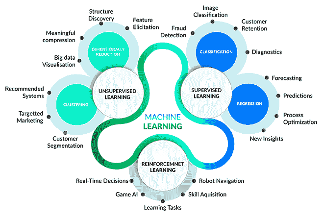
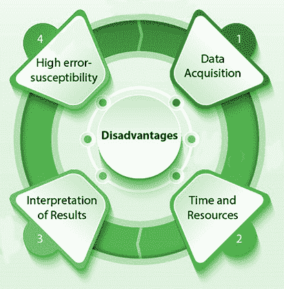

# 为什么是机器学习？

> 原文：<https://learnetutorials.com/machine-learning/why-machine-learning>

机器学习技术发展迅速，在机器学习平台上搭建了多个软件产品。然而，机器学习不一定是一个放之四海而皆准的解决方案。

人类有能力做出决定，他们可以解决复杂的任务，但是在某些场景中，人类无法完成任务，例如导航到未知区域、天气预报和一些动态场景。在这种情况下，我们需要机器的帮助来做出决策，解决复杂的任务来帮助人类。

对于人类来说，分析海量数据是一项非常复杂且耗时的任务，在分析数据时会出现大量的人为错误，这种场景也使得机器学习成为需要。

对于在 AI 中进行决策的机器来说，机器学习和深度学习将有助于分析海量数据，并找到一些有助于决策的模式或类别，这种决策被称为数据驱动决策。

数据驱动的决策在自动化中非常有帮助，这将提高以更精确和无错误的方式解决复杂任务的速度。

使用机器学习，我们可以提高系统的效率和准确性。

在机器学习中，我们为机器学习算法提供了大量的数据来训练它。它将分析数据，根据数据建立模型，并预测所需的输出。使用机器学习，我们可以节省大量的精力和金钱。

在我们的现代世界中，很多应用都在使用机器学习，其中包括
1。天气预报
2。
股票价值预测 3。自动驾驶汽车
4 辆。
导航 5。人脸检测
6。欺诈检测
还有很多……
我们将探讨机器学习可以解决哪些问题，它不能解决哪些问题，并讨论如何选择您选择的机器学习工具。

## 机器学习的优势

### 从数据中学习

机器学习可以用来分析大量数据，以找到一些对人类来说非常困难的模式或类别。比如网飞的推荐视频，电商网站的推荐产品都是用机器学习的。

机器学习的主要优势之一是模型学习数据中的趋势。**一般来说，我们能够提供的算法的高质量数据越多，随着时间的推移其性能就越好**。更多的数据使我们能够在给定新数据的情况下做出预测，或者在给定历史数据的情况下预测未来。

### 易于自动化

使用机器学习，我们让机器从数据中做出决定，所以我们不想坐在算法的每一步。该算法使用和分析数据，并根据数据进行预测，以改进其算法。垃圾邮件过滤器和防病毒就是例子，它们从每一个威胁中学习。

### 永无止境的改进

有了机器学习，算法在分析数据时不断做出更高的准确性和效率。你提供的数据越多，算法就会自动得到越来越多的改进。一个例子是天气预报，它将从不均衡的数据供应中获得越来越准确的预测。

### 处理大量不同的数据

机器学习算法可以处理各种各样的数据，并可用于动态决策场景。

### 广泛的适用性

机器学习可以用于各种领域，包括医疗、天气、股票、银行和所有其他主要领域。有了机器学习，我们可以大大改善客户互动。从海量数据中进行准确的分析和预测，可以大大增加业务。

## 机器学习的缺点

### 数据采集

机器学习模型依赖于我们提供的数据，因此机器学习算法需要大量的数据，这些数据也必须准确和良好。训练模型需要这个好的数据集

### 时间和努力

机器学习算法需要大量的时间来分析和训练数据，以使模型具有准确性。机器学习算法需要大量的动力和资源(数据)来工作和开发。

### 机器学习算法的选择

机器学习需要手动选择算法，这不是一个简单的任务。我们必须在测试样本数据和每个算法中的测试数据后选择算法，以选择最佳的一个来获得最佳结果。这个手动过程非常耗时，需要大量的努力。

### 错误概率高

机器学习需要人工选择算法，我们需要检查所有算法中的样本数据来选择最佳算法。但是在训练和测试这些庞大的数据时会有很高的出错机会，这将导致结果中的错误，考虑到数据量，这是不容易纠正的

## 摘要

*   使用机器学习的优势在于:
    *   数据越多，算法越好。
    *   一些统计指标让我们衡量模型的可靠性。
    *   每个模型都有已知的优点和缺点。
*   使用机器学习的缺点是:
    *   非线性模型表现更好，但更难诊断
    *   也很难确定非线性模型如何进行预测。
*   几个因素决定使用什么模型。
    *   线性模型更简单，更容易解释，训练速度也更快。
    *   非线性模型可以捕捉非线性趋势，利用更大的数据集，并且对真实世界的数据更准确。