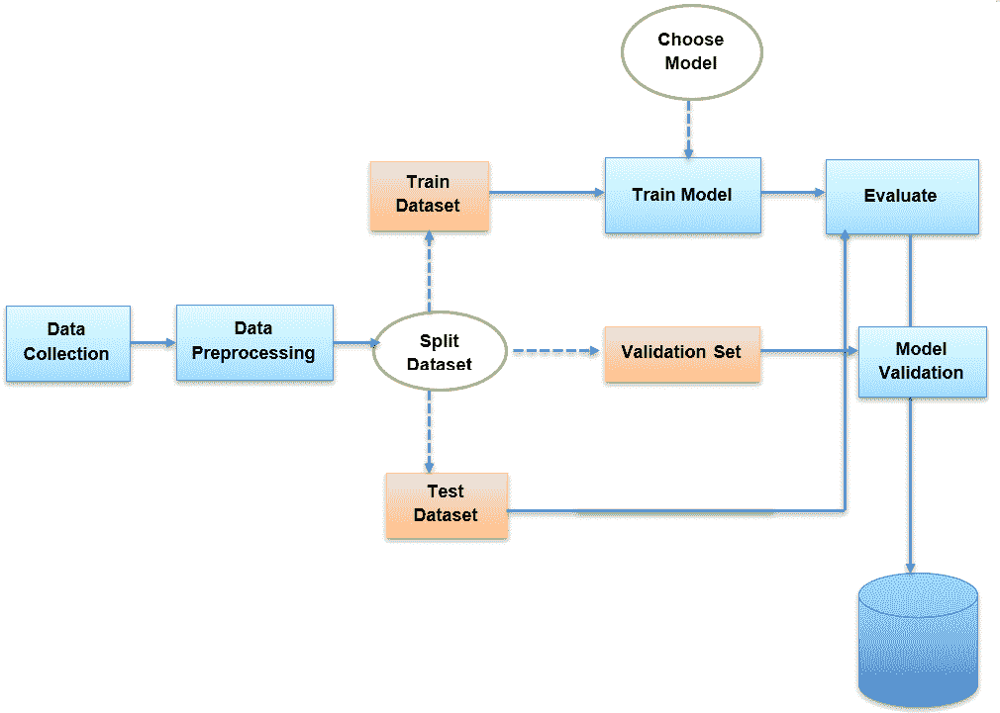
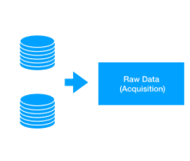
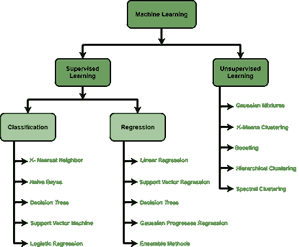
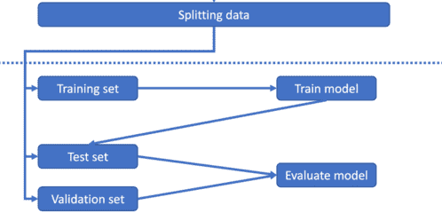
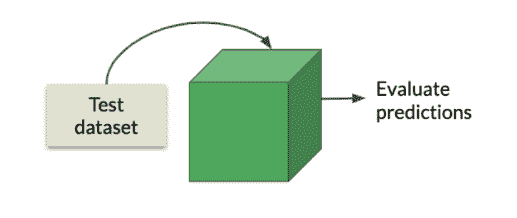

# 机器学习工作流

> 原文：<https://learnetutorials.com/machine-learning/machine-learning-workflow>

许多人认为机器学习只是一种特定的算法，例如逻辑回归或随机森林。然而，在实践中，许多其他组件将决定模型的性能。这些步骤包括数据清理和使用超参数调整优化模型。

机器学习工作流定义了进行机器学习项目必须遵循的步骤或路径，

1.  数据收集
2.  数据处理
3.  选择型号
4.  培训模式
5.  评估模型
6.  模型验证

本教程更详细地介绍了机器学习工作流的每个组成部分。

## 1.数据收集和输入数据

在这一步中，我们必须从不同的来源收集数据，这些来源可能是文件或数据库或传感器等。如果我们正在收集实时数据，我们可以直接使用来自物联网设备的数据。收到的数据质量对系统的准确性和结果非常重要。

我们从文件、扫描仪等收集的数据不能直接使用，因为这些数据会有很多不清晰、大值和很多错误，并且会有丢失的数据。为此，我们必须做好数据准备。

希望有人已经生成了一个数据集，您可以用它来回答您的特定问题。否则，我们需要创建自己的数据集来融入机器学习工作流。这可能是机器学习工作流程中最耗费人力、时间和成本的部分。

一旦我们制作好数据集，我们需要创建一个**数据存储**，它允许我们为后面的步骤访问数据。要带走的重要一点是，我们应该保留原始数据集的记录。这对透明度和再现性至关重要。

## 2.数据处理

一旦我们加载了数据，我们就应该“清理”数据。我们从外界获得的数据将包含

1.  **缺失数据**:不是连续的数据，它缺失了流程的某一部分。
2.  **噪音数据**:是因为我们采集数据的设备人为错误或者技术错误导致的
3.  **数据不一致**:是人为失误或者数据重复导致的

不能直接应用到系统中。我们必须使用不同的方法将原始数据清理成干净的数据集，这通常被称为数据预处理。

数据预处理通过不同的步骤完成，包括

1.  将数据转换成某种数字格式，以便机器能够理解
2.  忽略缺失的值
3.  使用平均值、中值
4.  从数据集中删除重复数据
5.  通过删除数据中的错误来规范化数据。

这是机器学习工作流程中复杂但重要的一步。如果不理解底层数据结构，我们可能无法理解模型输出。

## 3.选择机器学习模型

从我们之前的教程中我们已经知道，我们有不同的预处理数据模型，我们必须根据我们的目标类型和我们提供的数据类型来选择最佳性能。

如果数据被标记，我们必须对数据进行分类，我们将使用我们的分类算法。如果我们需要一个回归工作，并且提供的数据是有标签的，我们可以使用回归学习模型。如果我们的数据没有标记，我们可以使用聚类模型对给定的数据进行聚类。

## 4.培训和测试模型

最后，一旦我们处理了数据，我们需要**将其拆分为三个数据集进行训练，并评估我们在训练阶段使用的机器学习模型，以提高模型的能力。为了进行训练，我们必须分割数据集:**

*   **训练 se** t 帮助计算机理解如何处理信息。训练集是算法用来学习数据及其相关结果之间的关系。
*   **验证集**是在优化模型时用于评估模型的数据。它充当了一个诊断工具，用来查看模型的学习情况。
*   **测试集**是用于提供最终模型的无偏评估的数据。测试集产生的统计数据是我们在学术文章中或向公司利益相关者报告的数据。

一旦数据集准备就绪，我们就必须将该训练数据集输入到模型中，以便它能够了解特征和参数。现在，我们可以使用验证集，通过将参数修改到您可接受的水平来进一步完善模型。测试集用于测试模型。
在这个阶段，学习算法找到输入数据和输出之间的关系，并生成模型。

## 5.模型评估

到目前为止，我们一直在讨论优化数据以提高模型性能的方法。然而，我们也可以考虑优化模型组件。

在这一阶段，用测试数据集测试模型的准确性和精确性。我们正在使用测试数据集，因为它在训练之前没有使用，这是新鲜的，并且给出了完美的结果。

如果模型的表现没有达到我们的预期，我们可以使用一个更复杂的称为超参数的参数来重建模型。超参数值控制学习过程。根据所用算法的类型，可以有许多超参数。

为了选择最终模型，我们需要测试每个超参数对模型性能的影响。这发生在模型训练过程中。

## 6.模型验证

一旦我们确定了合适的模型超参数，我们就可以使用测试集来评估模型。我们可以看看是否需要在这个阶段继续调整我们的数据/模型，或者将模型作为产品进行部署。

## 机器学习管道

一个**机器学习管道**是执行整个机器学习工作流程的自动化方式。管道遵循基本的软件工程原则。在管道中，我们将工作流部件制成独立的、可重用的和模块化的组件。这使得构建模型的过程更加高效和简化。

## 摘要

*   机器学习工作流程有 5 个一般阶段:
    1.  收集数据并创建数据存储
    2.  处理数据
    3.  拆分数据集
    4.  选择和调整模型超参数
    5.  评估模型和迭代细化
*   机器学习管道是执行机器学习工作流的自动化方式。