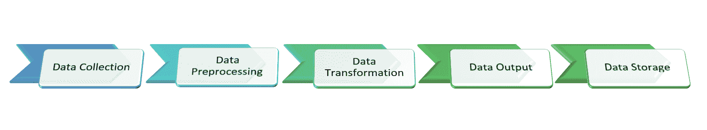
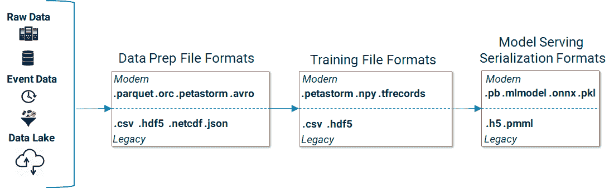
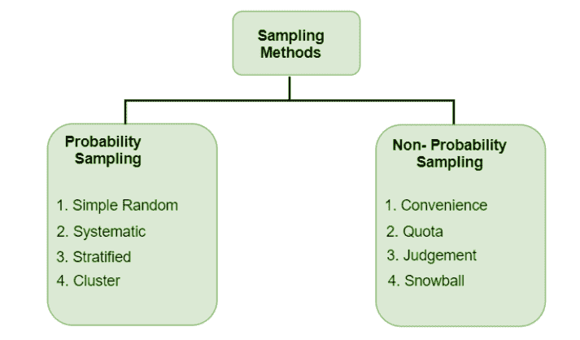
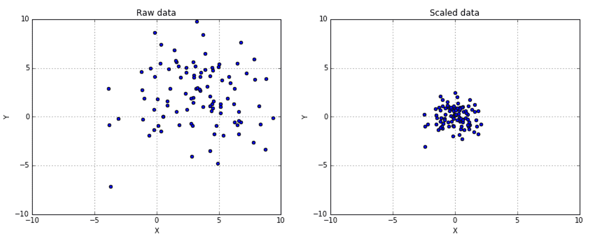
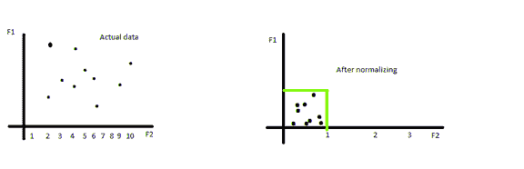
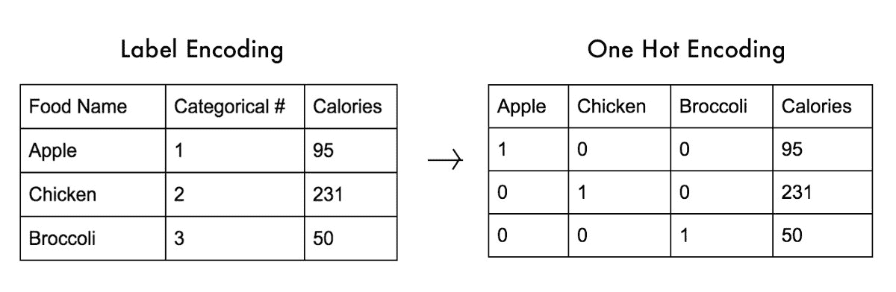

# 数据处理

> 原文：<https://learnetutorials.com/machine-learning/data-processing>

## 什么是数据处理？

数据可以有各种各样的形式，比如从财务报表到图像和音频剪辑的数字数据。在所有这些情况下，都需要对数据进行处理，以获取数据中的重要信息。数据处理是一种将原始数据转换成有意义的东西以从数据中获取更多信息的方法。

使用机器学习算法和统计数据，数据处理任务可以完全自动化。数据处理任务是一个结构化的过程，按如下方式完成

1.  数据收集
2.  数据预处理
3.  数据转换
4.  数据输出
5.  数据存储

## 1.数据收集

这是数据处理的第一步，数据处理的主要任务是从所有可用和可信的资源中收集数据。收集数据的主要标准是质量，收集数据的质量必须良好和准确。这是数据处理中需要付出巨大努力和时间的任务。收集的数据可能有一些错误，包括

1.  缺失数据
2.  不准确的数据
3.  dota 不平衡
4.  偏置数据

有几种技术可以解决这个问题，包括

1.  仅获取干净准确的免费数据集
2.  创建您自己的私人数据
3.  众包数据

## 2.数据预处理/数据清理

在这一步，我们需要使数据准确，我们必须解决收集的数据中的一些问题。最后，我们需要将数据转换成特定的格式，这样算法就可以使用这些数据，

### 1.格式化数据

我们将从不同来源收集的数据可能有不同的格式和文件格式，我们需要将这些数据转换成少量的格式，以便机器学习算法可以更准确地处理这些数据。

### 2.缺失数据

真实数据很乱。缺失信息是真实数据集的一部分。虽然没有完美的解决方案来解决这个问题，但是有一些方法可以使用缺少值的数据，而不删除整个观察。

*   **Ignore it**

    虽然这个解决方案并不完美，但是如果你碰巧知道单个观测值被随机丢弃，我们可以选择处理缺失值的算法。

    随机森林就是一个例子。它会自动检测大多数实现中的缺失值，并与它们一起工作以获得一个相当不错的模型。

*   **Delete it**

    通过行(样本)或列(特征)删除数据是处理丢失数据的另一种方法。如果您怀疑:

    A.特定数据点不可靠地获得(行方向删除)或
    B .如果大部分特征没有被测量(列方向删除)。

    必须采取预防措施，以确保我们没有偏向数据集，并且我们有足够的数据。这两个问题都会影响模型性能。

*   **Impute it**

    最后，我们可以根据一些系统的方法估算数据。当我们有不能删除数据的小数据集，并且不能简单地忽略丢失的值时，这是理想的。

    

    数据插补的常见方法包括使用数据的平均值、中值或模式来填充缺失值。k 近邻或线性回归也可用于估算缺失值。在这两种情况下，我们对可能不成立的数据做出假设，并冒着偏离我们的数据的风险。

### 3.数据采样

在某些情况下，由于这种情况下的误差，我们无法获取整个数据集，我们可以从庞大的数据集中获取样本数据，这些样本数据可以用来训练机器学习模型。

**采样中涉及的步骤**

1.  识别和定义目标数据
2.  选择采样框架
3.  选择取样方法
4.  确定样本量
5.  收集所需数据

**取样方法的类型**

1.  **概率抽样**:在概率抽样中，数据的每个分量都有被选择的等价可能性。概率抽样让我们有最好的机会做出一个真实的数据表示的例子
2.  **非概率抽样**:在非概率抽样中，所有的成分都没有被选择的等价可能性。

## 3.数据转换

现在，您已经选择了机器学习算法来处理已经上传到库中的数据集。现在我们要看处理过的数据的转换过程。许多转换方法包括。

### 1.缩放数据

**缩放**数据是一种在不改变底层数据分布的情况下标准化我们数据集中的值范围的方法。

一种广泛应用的缩放方法是**最小-最大缩放**，我们在 0 到 1 的范围内变换值。

### 2.标准化数据

**归一化**数据改变了底层数据分布，使其遵循正态分布。

一种常见的方法是计算 **Z 分数**。该方法使用平均值对数据进行中心化，并将标准偏差设置为 1。

### 3.分解

在这个过程中，我们使用分解算法将异构数据转换为三重模型数据。这里的数据分为结构化、半结构化和非结构化数据。我们将为我们的机器学习算法选择一个。

### 4.标签编码

**标签编码**是将标签转换为分类算法可以使用的数字格式的过程。标签可以是分类数据或任何类型的基于文本的数据。

传统的标签编码为每个类分配一个唯一的值。虽然这是一种简单的方法，但模型可能会不恰当地对结果数值进行加权。

一种解决方案是**对数据进行一键编码**。我们为每个类别构造一个新的列，如果它是一个特定的类，我们将该值赋为 1，如果不是，则赋为 0。这消除了算法中考虑不同权重的可能性。

## 4.数据输出和解释

在这里，我们将获得一些图形表示的输出，如图形、视频或图像等，这些图形表示是有意义和有价值的，包括步骤

### 1.解码

在这一步中，我们将数据解码为用户可以随时访问的某种可理解的格式，如图形、视频或图像，这些数据会在机器学习算法中提前编码。

## 5.数据存储

这是数据处理的最后一步，我们将数据或输出存储在一些设备中以备将来使用。

## 摘要

数据处理是将原始数据转换成某种有意义的格式。这包括不同的步骤，即我们从各种来源收集数据的数据收集。然后我们对数据进行预处理，去除丢失的数据，清除数据中的错误。然后我们转换数据以用于算法。第四步包括解码和接收输出，最后一步是保存输出。