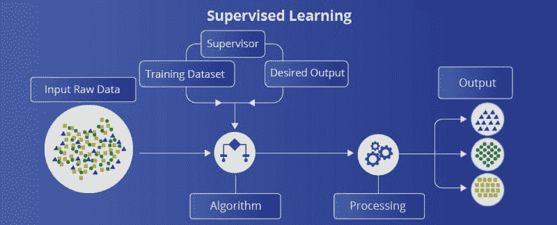
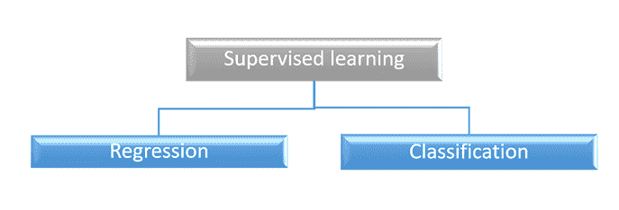
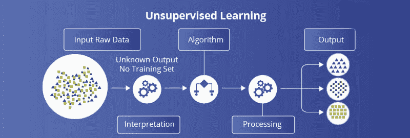
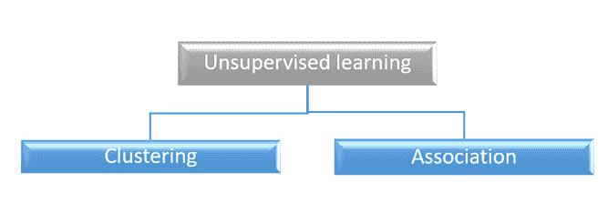
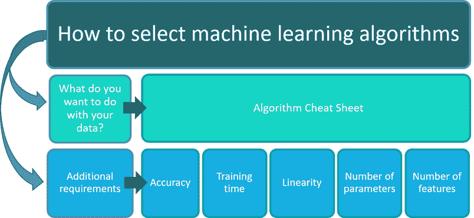

# 机器学习模型

> 原文：<https://learnetutorials.com/machine-learning/machine-learning-models>

机器学习是一个帮助计算机从数据中学习的过程，它将帮助机器自己做出决定，也就是说，机器学习有助于人工智能的发展。
每种机器学习算法解决不同类型的问题。我们必须根据我们期望的结果和我们提供的数据来选择机器学习模型。在本机器学习教程中，我们将涵盖所有的机器学习模型。

1.  监督学习
2.  无监督学习
3.  半监督学习
4.  强化学习

## 监督学习

监督学习是一种最大似然学习，我们向机器学习系统提供样本训练数据来训练机器学习系统。ML 将根据我们提供的样本数据预测输出。

假设我们想预测下个月的房价，考虑到往年的房价。这是**监督学习**的一个例子。我们试图学习一个将输入数据集与结果联系起来的函数或模型。

在这里，系统使用样本数据创建一个模型，用于理解和学习数据和数据集，并从中提供一个结果。

监督学习是在监督下进行的，这类似于学生在监督下进行活动的教室。监督学习的例子是垃圾邮件过滤、房价预测、人脸识别等。

监督学习执行两种任务:

1.  **当输入变量和输出变量之间存在关系时，使用回归**。对于连续数据预测，我们可以使用回归，例如天气预报、股票交易预测等。
2.  **分类**当我们可以将样本数据分为男性和女性等类别时使用。真假等等。

## 无监督学习

**无监督学习**它与监督学习正好相反，监督学习意味着机器学习是在没有任何监督的情况下完成的。查看数据集并尝试找到数据的最佳底层表示。

没有标签或数值可以预测。相反，该算法学习数据分布以揭示数据集中的结构。分析师(你)必须解释这些结构，并将它们与某种意义联系起来。

在无监督学习中，我们提供没有任何关系的数据，算法在没有任何监督的情况下处理数据以从数据中找到一些相关的模式。这里算法必须从大量的原始数据中找出关系。

无监督学习进一步分为两类

1.  **聚类**
2.  **协会**T2】

**无监督学习执行以下任务:**

*   可视化高维数据的探索性数据分析
*   聚类将可能有一些真实关联的相似数据点分组
*   降维提取重要特征
*   在高维数据集中分配优先级的要素排序

## 半监督学习

在上述两种算法中，要么我们提供所有的标记数据，模型使用标记数据并预测输出，要么根本没有标记数据，模型必须从数据中找到关系和模式。

半监督学习介于两者之间，这意味着我们有一些标记数据，但由于成本较高，无法为所有数据集提供标记数据。

在现实世界的应用中，我们有大量的输入数据，但是很少有标记数据。**半监督学习**试图利用无监督和监督学习的优点。

在半监督学习中，无监督学习将未标记的数据分组为簇。用户可以标记这些聚类，并将数据输入监督学习算法。

## 强化学习

**强化学习**是教一个算法想出决策的过程。这是一个基于反馈的系统。用户为给定任务中的正确和错误决策提供奖励和惩罚。强化学习算法试图通过与环境交互来获得更多的奖励以达到更高的准确性和学习。

强化学习是我们与人工智能联系在一起的另一项新兴技术。

## 如何为你的问题选择合适的算法？

### 数据集大小和类型

算法的选择从数据量和数据集中的数据类型开始。如果目标是执行分类任务并对数据集中的数据进行分类，这将阻止我们使用基于回归的算法，如线性回归和 LASSO。

机器学习从业者用来选择算法的另一个通用技巧是评估有多少数据点与我们正在考虑的变量的数量。如果有少量的数据点和更多的变量，基于线性的模型往往会工作得更好。但是，如果数据点多，变量少，非线性模型更合适。

一般来说，真实世界的数据往往在单个数据集中有几种数据类型(例如，数值、分类等)。)并且通常是大的高维时间历程数据集。

### 数据和结果之间的关系

一般来说，我们的目标是使用最合适的算法，该算法可以提供输入数据和某些结果之间关系的最佳模型，或者如何将相似的数据点最佳地分组在一起。如果我们可以用一条直线做到这一点，线性算法往往表现良好。

但是，当数据不具有这些线性关系或者不能用直线分离数据时，我们应该使用非线性算法。一般来说，真实世界的数据往往是非线性的。

### 准确性与可解释性的权衡

如前所述，算法变得越非线性，越不可解释。虽然非线性算法往往在处理非线性数据时表现得更好，但有时我们需要选择更容易解释的精度较低的算法。

其中一个明显的领域是医疗保健行业。识别误差来源对于临床医生相信模型试图预测的是至关重要的，因为临床医生可能会对医疗事故负责。因此，如果模型易于解释并且可以缓解痛点(例如，更高的准确性、更少的劳动等)。)，它将通过黑盒模型被接受。

### 培训时间和成本

在生产级部署机器学习算法时，训练时间至关重要。一般来说，培训时间越长，与模型相关的成本就越多。这些成本来自分配给模型训练的计算资源，以及在市场上推出模型的滞后。

一般来说，模型越简单，训练模型的速度就越快。然而，更复杂的模型往往更好地处理现实世界的数据，因为它们的非线性性质。因此，用户或公司必须决定什么模型是最合适的，并了解成本和性能之间的权衡。

## 摘要

我们可以将算法分为 6 大类机器学习方法:

1.  **监督学习**进行推理。
2.  **无监督学习**进行聚类和降维。
3.  **半监督学习**帮助监督算法处理非结构化数据。
4.  **强化学习**教算法如何做决策。

