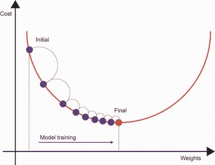
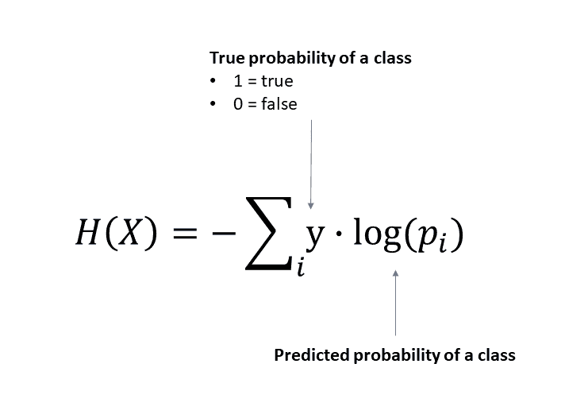

# 成本函数介绍

> 原文：<https://learnetutorials.com/machine-learning/introduction-to-cost-functions>

## 什么是优化？

在机器学习中，我们感兴趣的是找到一个最能映射一些数据和结果之间关系的函数。我们通常对模型预测与实际标签或数据值相比有多准确感兴趣。为此，我们需要设置一个过程来最大化给定类的概率或最小化模型误差。这就是所谓的**优化**问题。

在本教程的剩余部分，我们将讨论优化的最常见用法，即最小化模型误差或**成本值**。计算模型误差的函数称为**成本函数**。

## 使用成本函数评估机器学习模型

成本函数告诉模型在映射输入数据和输出之间的关系时模型有多错误。这是用一个称为成本值的单一值来衡量的，该值代表预测值和实际值之间的平均误差。

## 使用梯度下降最小化成本

既然我们有了测量模型误差的方法，我们就需要讨论如何使成本函数最小化。我们将使用的优化过程称为**梯度下降**，这是一种高效的优化算法，用于神经网络等多个模型。该算法试图找到与给定模型相关的最小误差。

模式训练以逐步的方式在几次迭代中进行。直觉上，梯度下降试图找到模型应该调整其系数的方向，以减少每一步的误差。这个方向被称为梯度。

随着我们在每次迭代中继续训练模型，成本值逐渐收敛到最小值。此时，成本值稳定下来。在每个步骤中，模型系数由梯度调节，使得它最小化成本函数。

## 通用成本函数

既然我们已经讨论了为什么需要计算成本值，我们将讨论一些常见的成本函数。

### 均方误差

**均方误差(MSE)** 是一个相对直观的函数，用于估计误差的平均平方。平方项强制值为正值，其中接近 0 的值表示模型误差较小。该成本函数通常应用于基于回归的任务。

### 交叉熵

**交叉熵**是典型应用于分类任务的成本函数，其根源在于**逻辑回归**。交叉熵源于信息论，衡量随机变量的两种概率分布有多不同。

如果我们推断这是一个二元分类问题，平均交叉熵表达式将如下所示:

交叉熵损失值的解释如下。如果该值为 0，则预测的类概率与实际集合完全相同。但是，如果该值较高，则预测标签和实际数据之间的概率分布存在一定距离。

### 应用:逻辑回归和软最大激活函数

上面的例子是交叉熵损失函数的二元分类方程。但是，如果有 2 个以上的类呢？

在不涉及太多技术细节的情况下，我们可以将上面的损失函数推广到考虑多类逻辑回归问题。softmax 函数是多项式逻辑回归的扩展(稍后将详细介绍)。然而，它使用相同的交叉熵损失函数来评估一个观测值属于给定类别的概率。