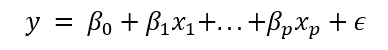
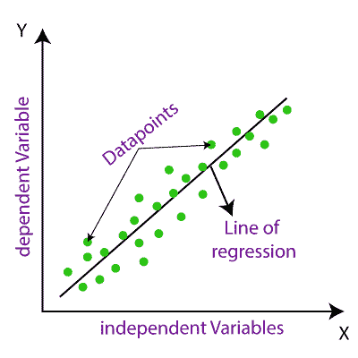
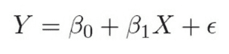
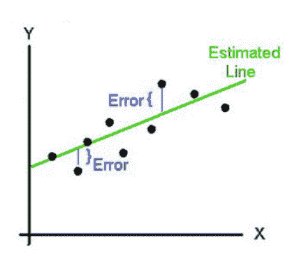
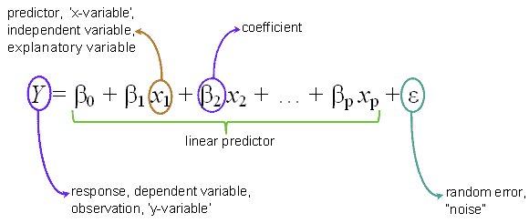
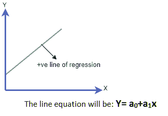
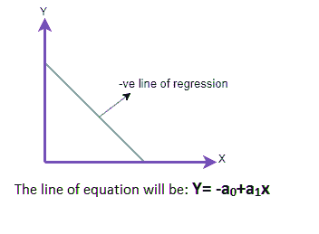
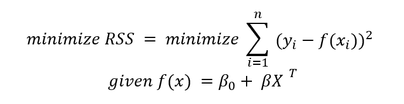
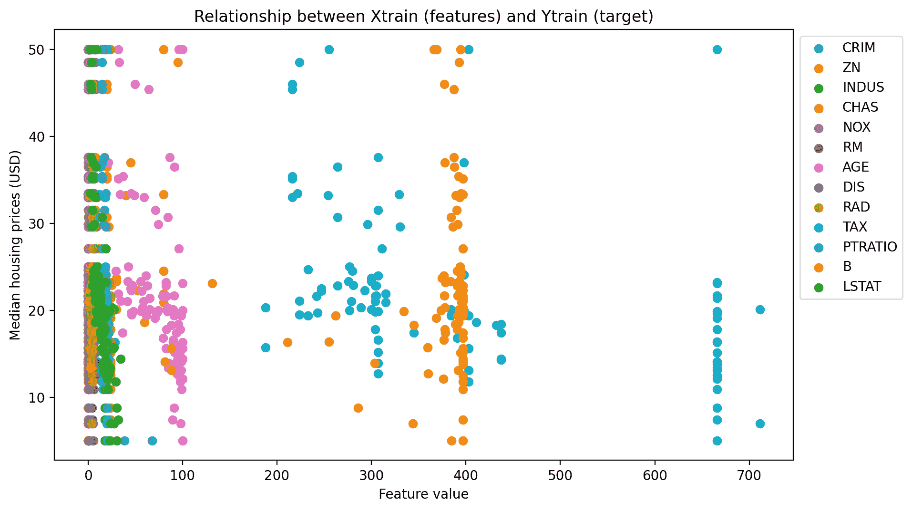

# 回归：线性回归

> 原文：<https://learnetutorials.com/machine-learning/linear-regression>

## 什么是线性回归？

**线性回归**是一种建模称为自变量或输入变量的特征与响应或输出之间关系的方法，响应或输出是一组输入特征的因变量。

线性回归是回归分析中最常见和最流行的机器学习算法之一。线性回归使用统计方法，输出将是真实和连续的，用于预测销售、年龄、产品价格预期等。

该方法使用的主要假设是模型要学习的**参数**或**系数**为直线。

下面显示了一个简单的示例:



其中 p 是数据集中预测因子的数量， **β <sub>0</sub>** 是截距， **β <sub>p</sub>** 代表我们试图用给定特征 **xp** 估计的参数。

ε为**残差**:直线距离实际数据点有多远。这个变量很重要，因为它衡量了一个模型的错误程度。残差或 **RSS** 的**平方和是用于评估模型拟合度的度量。**

线性回归将有助于可视化输入变量和预测输出之间的关系，这将是线性的，意味着直线。因此，我们称之为线性回归。

在线性回归的图形表示中，独立输入变量将在 X 轴上，相关输出将在 Y 轴上，线性回归将是连接最大数据点的倾斜直线。



在这个图形表示中，我们可以理解线性回归是如何显示为连接了最大数据点的直线的。

## 什么使模型是线性的？

注意，虽然模型参数 **β** 和预测值 **x** 之间的关系需要是线性的，但是非线性函数可以应用于数据。尽管下面的等式更复杂，但仍被认为是线性回归问题:


## 什么使模型非线性？

以下方程是非线性函数，因为参数与预测值不成比例。


## 线性回归有哪些类型？

在回归分析教程中，我们已经讲过线性回归可以再分为两种

1.  简单线性回归
2.  多元线性回归


### 简单线性回归

如果我们只有**一个独立的输入变量**来确定输出，我们称这种机器学习算法为简单线性回归。

我们可以用一句简单的话来说



*   **Y** 代表预测输出或因变量。
*   **β0** 是代表截距(回归估计值)的常数
*   而 **β1** 是表示系数(回归斜率的估计值)的常数。
*   **ε**(ε)为误差项。



在这个图形表示中，我们可以理解简单的线性回归是如何用连接数据点的直线表示的。

### 多元线性回归

多元线性回归与简单回归相反，就好像我们有**多个输入预测变量**来确定因变量输出，我们称这种机器学习算法为多元线性回归。输入变量可以是连续的或分类的。



描述预测值如何与多元线性回归方程中的自变量相关的方程


上图显示在一张图上绘制多条线性回归线

## 什么是线性回归线？

在线性回归图中，我们知道有一条直线将输入变量和预测变量之间的关系联系起来，这条直线称为线性回归线。在这个图中，线性回归线可以显示两种不同的关系，

1.  ### 正线性关系

    在线性回归图中，如果输入自变量和预测输出变量分别沿 x 轴和 Y 轴增加，称为正相关。

    
2.  ### 负线性关系

    在线性回归图中，如果输入变量沿 x 轴增加，而依赖于独立输入变量的预测输出变量沿 Y 轴减少，则回归线将在某一点与 Y 轴相交。叫做负线性关系。

    

## 模型性能

模型性能可以描述为回归线如何与数据点相关，它们接触了多少，以及离回归线有多远。我们必须从回归中的不同模型中找到最佳模型，这叫做优化模型

### 平方法

这是一种简单的统计方法，用于确定回归线如何与图表中的数据点相匹配。R 平方方法的工作原理是，它以 10 到 100%的比例计算输入和输出变量的关系强度。

R 平方方法的值用于确定模型的完美性。R 值高意味着模型是好的，因为它表示预测值和实际值之间的差异较小。这也称为决定系数。

我们可以用公式计算 R 的平方值


## 最小二乘回归

训练回归模型最常用的方法是**最小二乘法**。该模型旨在最小化从每个数据点到代表 **x** 和 **y** 之间关系的直线的平方误差之和。

从数学上讲，我们可以将这种关系写成如下语句:



### 关于数学符号的重要说明:

*   这个简写符号表明 **β** 是数据集内 1×特征数的向量。
*   如果特征占据了列，**X<sup>T</sup>T3】是一个矩阵，其中有 m 个特征的 n 个观察值。**
    *   我们需要转置数据集(翻转行和列)来使数学工作。
*   截距 **β <sup>0</sup>** 可以是标量或矢量。

### 为什么要执行最小二乘回归？

最小二乘回归是一个相对简单的模型。我们试图找到最适合数据的线，同时将模型的误差降至最低。

那么，为什么我们要使用真实数据的最小二乘法呢？

1.  **实现**简单快捷，如果我们需要一个快速的模型，这是有优势的
2.  **易于解释和诊断错误**:输入和输出之间的关系定义明确。
    *   如果数据中存在异常值等问题，最小二乘法可以帮助我们排除一些明显的异常。
3.  **这是最坏的情况**:我们知道更复杂的模型会比最小二乘法表现更好，尤其是如果数据包含非线性关系。
    *   然而，最小二乘法的预测可以作为我们建模方法的最坏情况。

### **最小二乘回归假设**

*   为了使用线性回归，我们必须假设几件事来确保我们得到最好的结果。这包括假设:
*   **x** 和 **y** 之间的关系是**线性**。
*   数据**没有异常值和噪声。**
*   数据已经过过滤，因此删除了高度相关的特征。这些类型的特征是**共线**并且将导致线性模型**过度拟合**数据。
*   数据结构为**正态**数据分布。

## 用 Python 实现线性回归:波士顿房价数据集

### 数据描述

[波士顿房屋数据集](https://www.cs.toronto.edu/~delve/data/boston/bostonDetail.html)是一个经典的数据集，包含了与波士顿房屋市场相关的几个特征，包括 1978 年的犯罪率和房屋的中值。

### 我们正在解决的问题

**这个数据集的目标是预测一套房子的中位数价格。**

我们将把要素和目标数据集设置为熊猫数据框数据类型，以便于下游分析。

```
 # Import general-use data science libraries
import pandas as pd
import numpy as np

# Import features
df = pd.DataFrame(data=data.data, 
                  columns=data.feature_names)
print(df)

# Import target (median housing prices)
target = pd.DataFrame(data=data.target, 
                      columns=["MEDV"])
print(target) 

```

```
 CRIM    ZN  INDUS  CHAS    NOX  ...  RAD    TAX  PTRATIO       B  LSTAT
0    0.00632  18.0   2.31   0.0  0.538  ...  1.0  296.0     15.3  396.90   4.98
1    0.02731   0.0   7.07   0.0  0.469  ...  2.0  242.0     17.8  396.90   9.14
2    0.02729   0.0   7.07   0.0  0.469  ...  2.0  242.0     17.8  392.83   4.03
3    0.03237   0.0   2.18   0.0  0.458  ...  3.0  222.0     18.7  394.63   2.94
4    0.06905   0.0   2.18   0.0  0.458  ...  3.0  222.0     18.7  396.90   5.33
..       ...   ...    ...   ...    ...  ...  ...    ...      ...     ...    ...
501  0.06263   0.0  11.93   0.0  0.573  ...  1.0  273.0     21.0  391.99   9.67
502  0.04527   0.0  11.93   0.0  0.573  ...  1.0  273.0     21.0  396.90   9.08
503  0.06076   0.0  11.93   0.0  0.573  ...  1.0  273.0     21.0  396.90   5.64
504  0.10959   0.0  11.93   0.0  0.573  ...  1.0  273.0     21.0  393.45   6.48
505  0.04741   0.0  11.93   0.0  0.573  ...  1.0  273.0     21.0  396.90   7.88

[506 rows x 13 columns]
     MEDV
0    24.0
1    21.6
2    34.7
3    33.4
4    36.2
..    ...
501  22.4
502  20.6
503  23.9
504  22.0
505  11.9 
```

### 将数据分成训练集和测试集

```
 from matplotlib.pyplot import figure
fig, ax = plt.subplots()
for i in Xtrain:
  plt.scatter(Xtrain[i], Ytrain, label=str(i))
ax.legend(bbox_to_anchor=(1., 1.))
plt.xlabel("Feature value")
plt.ylabel("Median housing prices (USD)")
plt.title("Relationship between Xtrain (features) and Ytrain (target)")
fig.set_dpi(200)

savepath="/content/img/"
fig.set_size_inches(10, 6)
fig.savefig(savepath+"scatter.png", bbox_inches='tight') 

```

```
 Dataset sizes after train_test_split()
Xtrain size:  (101, 13)
Xtest size:  (405, 13)
Ytrain size:  (101, 1)
Ytest size:  (405, 1) 
```

### 可视化数据

```
 from matplotlib.pyplot import figure
fig, ax = plt.subplots()
for i in Xtrain:
  plt.scatter(Xtrain[i], Ytrain, label=str(i))
ax.legend(bbox_to_anchor=(1., 1.))
plt.xlabel("Feature value")
plt.ylabel("Median housing prices (USD)")
plt.title("Relationship between Xtrain (features) and Ytrain (target)")
fig.set_dpi(200)

savepath="/img/"
fig.set_size_inches(10, 6)
fig.savefig(savepath+"scatter.png", bbox_inches='tight') 

```



### 训练一个线性回归

```
 # Fit the model
from sklearn.linear_model import linear_model as lm
model = lm().fit(Xtrain, Ytrain)
print(model) 

```

```
 LinearRegression(copy_X=True, fit_intercept=True, n_jobs=None, normalize=False) 
```

### 检查模型组件

```
 print("Important model objects")
print("Regression coefficients: ", str(model.coef_))
print("Y-intercept: ", str(model.intercept_)) 

```

```
 Important model objects
Regression coefficients:  [[-1.10998550e-01  5.59525865e-02  1.52041041e-01  1.62336940e+00
  -2.52970054e+01  3.14436742e+00  3.94375733e-02 -1.31328247e+00
   3.01518760e-01 -1.20457172e-02 -1.23308582e+00  6.49058329e-03
  -6.06938545e-01]]
Y-intercept:  [47.50246908] 
```

### 评估模型

有几种方法与模型对象相关联。如果我们想用测试集进行预测，我们可以使用`predict()`方法。

```
 Ypred = model.predict(Xtest)
print(Ypred) 

```

```
 [21.04711236]
 [16.0519687 ] 
 [22.08124826]
 [24.9550908 ]
 [22.58486361]
 [18.30309637]
 [36.34589925]
 [20.84835474]
 [34.53960168]
 [25.75900913]
 [18.57619619]
 [ 3.15134125]
 [24.60956537]
 [18.28628001]
 [15.22482753]
 [29.71273752]
 [31.22651416]
 [22.66172954]
 [20.61047944]
 [22.90176779]
 [26.96548001]
 [19.92578633]
 [31.0290531 ]
 [19.55288498]
 [19.0799543 ]
 [23.47680399]
 [18.14110649]
 [14.52089098]
 [27.04951364]
 [25.58432198]
 [22.15694304]
 [21.72038631]
 [20.88291021]
 [18.1170226 ]
 [19.05318278]
 [30.97678281]
 [30.5478923 ]
 [16.62990827]
 [18.75101055]
 [33.66266989]
 [17.01643957]
 [14.17095253]
 [32.62854346]
 [24.94957009]
 [13.37233271]
 [24.45143619]
 [20.09491092]
 [38.58474904]
 [44.15771256]
 [21.54061052]
 [21.61272714]
 [ 3.85894539]
 [19.81522043]
 [42.8604927 ]
 [26.02782308]
 [35.09436136]
 [23.79821583]
 [18.26944428]
 [32.92705099]
 [14.8280985 ]
 [20.77294734]
 [12.31289156]
 [34.24357418]
 [22.66837597]
 [13.22221194]
 [21.63774045]
 [17.37198566]
 [17.85270836]
 [30.28365937]
 [32.18075657]
 [20.45336081]
 [29.75959666]
 [ 7.18982288]
 [18.89723132]
 [30.10475681]
 [20.57839242]
 [33.3974039 ]
 [24.24358861]
 [14.26738546]
 [24.20106907]
 [32.91401148]
 [17.80684621]
 [26.29527134]
 [22.10605813]
 [24.43018928]
 [32.65649583]
 [26.2304317 ]
 [23.11068013]
 [21.37121057]
 [21.59383797]
 [11.26008499]
 [16.94212371]
 [22.85497267]
 [29.61466174]
 [23.09151181]
 [12.26582213]
 [24.38136745]
 [13.14379108]
 [ 7.98377975]
 [31.77241579]
 [12.00109812]
 [13.18440467]
 [31.33628903]
 [19.70216857]
 [28.20054128]
 [ 0.60101149]
 [31.12712135]
 [24.19502058]
 [29.53687253]
 [ 9.68649156]
 [10.11971136]
 [ 7.12036418]
 [20.70524276]
 [14.50594171]
 [23.88299493]
 [22.20130119]
 [ 6.58848017]
 [18.23088525]
 [30.87930596]
 [14.74069658]
 [22.10694463]
 [32.68525461]
 [29.82819265]
 [30.72089238]
 [19.16986842]
 [29.39425529]
 [17.80744526]
 [21.82646237]
 [24.31193619]
 [30.23574889]
 [20.25455558]
 [15.88697828]
 [23.44452457]
 [21.86141303]
 [14.83881915]
 [32.36894068]
 [23.76741903]
 [21.66801612]
 [13.53616923]
 [16.77326467]
 [16.68268242]
 [33.67449135]
 [30.06984231]
 [25.98382116]
 [15.58993356]
 [17.51342189]
 [ 5.72952529]
 [12.49735596]
 [27.35548835]
 [35.55403582]
 [26.03031409]
 [30.2652679 ]
 [20.79109449]
 [13.36025789]
 [25.72460123]
 [ 8.9366379 ]
 [15.54265181]
 [25.21990601]
 [18.55971622]
 [32.15802211]
 [36.40020073]
 [22.56136319]
 [22.7234512 ]
 [34.37231992]
 [-3.94468944]
 [14.23851594]
 [20.31829917]
 [32.69907633]
 [21.14937346]
 [27.1818681 ]
 [20.77005275]
 [26.33401396]
 [18.66135437]
 [29.2236251 ]
 [32.13618142]
 [13.65673552]
 [ 9.83952335]
 [37.20348635]
 [20.45829063]
 [18.82696886]
 [22.46200016]
 [20.70769228]
 [24.98878401]
 [24.94873464]
 [22.63186389]
 [27.95664184]
 [34.95321661]
 [29.57340438]
 [ 6.2979752 ]
 [18.58409807]
 [22.12319937]
 [21.82862584]
 [12.68613277]
 [11.81831775]
 [23.86158832]
 [24.73085406]
 [30.67013986]
 [24.06240533]
 [34.82481321]
 [18.24315249]
 [15.27193751]
 [11.26864556]
 [31.03156474]
 [27.71373401]
 [41.03106415]
 [28.29517411]
 [19.41491991]
 [36.25536337]
 [21.12170882]
 [32.81354451]
 [24.64850689]
 [31.94774974]
 [19.8091977 ]
 [17.03760649]
 [28.82566707]] 
```

然后我们可以计算出均方差。

```
 mse = np.square(np.mean(Ytest-Ypred))
print(mse) 

```

```
 MEDV    0.139942
dtype: float64 
```

如果我们想要得到线与测试数据集拟合程度的度量(也称为**确定系数**，我们可以使用`score()`方法。

```
 R2 = model.score(Xtest, Ytest)
print(R2) 

```

```
 0.7219648298245812 
```

决定系数假定值在 0 和 1 之间，其中 1 是完美的直线拟合。我们有一个很好的分数！