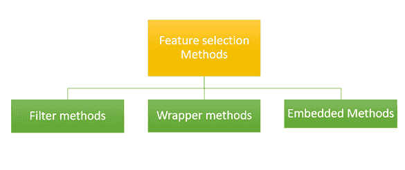
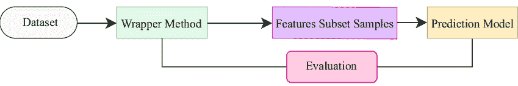
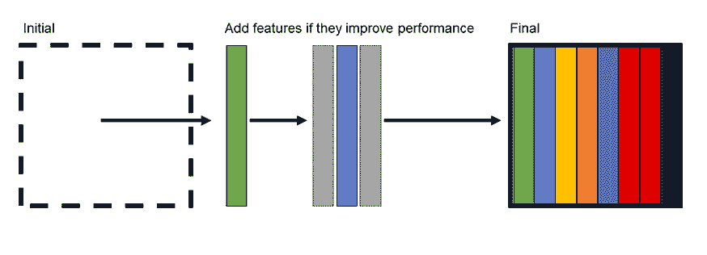

# 特征选择

> 原文：<https://learnetutorials.com/machine-learning/feature-selection>

从前面的教程中，我们学习了一种非常强大的使用线性回归建模变量的方法。然而，线性回归模型对噪声非常敏感。本教程将介绍消除数据集噪声和提高线性模型性能的策略。

## 什么是特征选择？

当我们得到一个新的数据集时，我们可能会发现在探索性数据分析过程中存在高度相关的特征。此外，我们可能还会发现，非信息特征可能不会将两个类彼此分开，也不会识别具有低方差的特征。如果存在不重要的特征，它将对我们系统的准确性产生负面影响，增加模型的复杂性。

如果可以，我们应该去掉这些特征。从数据集中移除冗余或不具信息性的特征以形成一个好系统的过程称为特征选择。**特征选择**是有利的，因为:

1.  它简化了数据集，使分析结果更加容易
2.  它减少了计算时间，因为我们上传的数据更少了
3.  它减少了过度拟合的机会，在这种情况下，模型将只学习相关数据，而忽略其他一切。

## 执行特征选择的方法

执行特征选择有几种策略，它们是

1.  过滤方法
2.  包装方法
3.  嵌入式方法

## 过滤方法

过滤方法可以用来选择特征，而不用考虑机器学习算法。过滤是在机器学习实现的预处理步骤中完成的。过滤方法是去除重复、相关和冗余数据的有效且廉价的过程。过滤方法在处理多重共线性数据时不是很有效，因为在过滤方法中，对每个数据单独进行选择，并且如果输入数据彼此相关，这将是困难的。

过滤使用这些技术

### 信息增益

信息增益可以被定义为一个特征可以为目标预测提供多少信息以及减少预测中的误差。每个输入属性的信息增益取决于目标值。

### **卡方检验**

该测试用于分类值，通过比较观察值和期望值来找出值之间的关系。

### 费希尔分数

在这个方法中，我们使用 fisher 标准给每个属性打分。然后，它选择具有较大 fisher 值的属性，这必须是最佳选择的特征。最后，我们得到了一组很好的特性。

### 方差阈值

在这种方法中，我们去除了其方差不满足某个阈值的输入特征。在这种方法中，我们假设高方差值表示输入特征包含更有生产力的信息。

### 平均绝对差

在这种方法中，我们使用平均值，然后从平均值中找出差异。该过程类似于方差阈值法，但使用的是平均值及其差值。

### 相互依存

当两个输入变量相关时，使用此方法。在这种情况下，我们观察通过使用另一个变量，我们可以收集到一个变量的多少信息。它衡量一个特性对预测输出的贡献。

### 减轻

在这种方法中，我们测量从数据集中随机选择的属性的质量。

## 包装方法

我们将描述包装器方法——尝试在数据子集上训练模型的方法。根据模型的性能，我们决定添加或删除特征，然后我们看看新模型是否优于旧模型。

包装器方法的主要优点是它们能够为算法提供最佳的特征集进行训练。它可以提供更高的准确性和效率，但代价是更大的计算能力。

### 预选

正向选择是我们从没有特征被建模开始的地方。然后，我们迭代地向模型中添加一个特征，看看这个特征是否提高了模型的性能。性能可以通过几个指标来衡量，包括均方误差或确定系数。

### 向后消除

反向消除是我们从建模数据集中的所有要素开始的。然后，我们迭代地移除对模型没有影响的特征，或者移除后会提高模型性能的特征。

正向选择是我们从没有特征被建模开始的地方。然后，我们迭代地向模型中添加一个特征，看看这个特征是否提高了模型的性能。性能可以通过几个指标来衡量，包括均方误差或确定系数。

### 逐步回归

逐步回归结合了向前选择和向后消除的优点。通过结合这两种方法，我们消除了不具信息性的特征，同时重新引入了可能过早被抛弃的特征。

scikit-learn 库有几种主要通过消除方法进行特征选择的方法。功能选择的文档可以在这里找到。

## 嵌入式方法

在嵌入式方法中，我们使用特征选择算法作为机器学习算法的一部分，因此在该方法中，我们可以克服过滤方法和包装方法的缺点。在这种方法中，我们还可以将过滤方法的质量(如快速和简单)与包装方法的质量(如准确性和效率)结合起来。

一些嵌入式技术包括

### 正则化

在这种方法中，我们使用输入变量的惩罚来避免模型的过拟合。我们已经知道我们在套索中使用这个正则化作为 L1 和 L2 正则化。在这里，我们为系数添加了一个惩罚，使一些系数为零，并从数据集中消除它们。

### 基于树的方法

这里我们检查哪些因素对预测输出有影响，我们称之为特征重要性，我们在随机森林方法中使用这种方法。我们使用特征重要性来选择