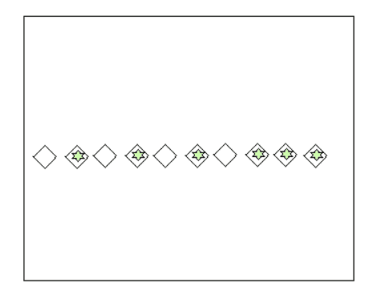
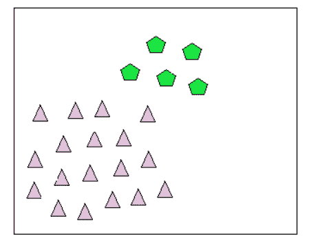

# 机器学习中的异常值

> 原文：<https://learnetutorials.com/machine-learning/outliers>

## 机器学习中有哪些离群点？

现实世界数据中有一些数据点看起来往往与其他数据点“不同”。**异常值**是错误的数据点——它们是不代表数据的异常。简单地说，我们可以将异常值定义为数据点中的一个奇数。它显示出与人群数据不同的特征。

由于某些执行错误、不正确的输入、观察中的错误报告、采样错误等，会形成异常值，并且会使我们偏离其余的数据点。

如果可能的话，我们必须移除离群数据，以减少误差并提高数据集的准确性，但这不是一个容易的过程。为此，我们必须分析离群数据，这通常被称为离群数据挖掘或离群数据分析。数据科学家在关心数据处理之前会检查异常值的影响。

并非所有奇怪的数据点都是异常值。如果数据点是极端的，但是描述了一个潜在的自然现象，那么它们可以有很高的杠杆作用。

作为数据科学家，区分异常数据点和高杠杆数据点至关重要。我们将介绍一些简单的启发式策略来识别异常值。

## 异常值的类型

1.  ### 全局异常值:

    

    如果离群数据与总数据集中发现该离群数据的剩余数据有如此大的差异，则称为全局离群数据。例如，考虑办公室中一些员工的年龄，您发现其中一个员工的年龄为 1000 岁，这将被视为全局或点异常数据。

2.  ### 条件异常值:

    

    在上下文中，与该上下文数据集的正常数据点有较大差异的数据点值称为上下文异常值，这意味着当上下文数据集发生变化时，该数据可能不是异常值。

3.  ### 集体异常值:

    

    顾名思义，我们有一些数据点存在偏差或异常，但我们有许多数据点彼此接近，具有相同或相似的异常可以称为集体异常值。

## 分析异常值的重要性是什么？

机器学习算法使用来自数据集的训练数据来训练模型。如果数据集或训练数据中存在异常值，它将导致训练的破坏，还会产生非常不准确的预测和较低的效率。此外，在一些情况下，如垃圾邮件或欺诈检测，我们需要分析错误或异常数据，以了解它们并防止它们。

## 我们如何检测数据集中的异常值

我们有许多检测异常值的方法，大致分为两种类型，它们是

1.  **算法级别**:在这个方法中，我们改变机器学习算法来处理异常值。这是一种高计算成本的方法。
2.  **分类器无关**:在这种方法中，我们在数据预处理步骤中处理异常值，所以处理异常值是一种相对容易的方法。

在处理异常值数据的情况下，科学家完全去除异常值并处理数据集。在另一种情况下，他们只是控制异常值。

## k 聚类方法

现在我们必须检查一种方法，以及它如何处理异常值。考虑方法 K 聚类，使数据点作为一些具有平均值的聚类。平均值接近的数据点被视为属于该聚类。

在这种寻找异常值的方法中，我们使用了两件事。首先，我们必须以这样的方式设置阈值，即如果数据点大于阈值，则距离最近的聚类的距离被认为是异常值。

其次，我们必须计算测试数据和聚类平均值之间的阈值距离。然后，如果测试数据和最近的聚类之间的距离大于阈值，则我们认为测试数据是异常值。

## 库克的距离

具有大残差的数据点倾向于使回归系数偏离总体数据趋势。库克距离是评估移除数据点影响的指标，衡量数据点的影响程度。

Python 中的[黄砖](https://www.scikit-yb.org/en/latest/index.html)库有一个计算库克距离的实现。文件可以在[这里](https://www.scikit-yb.org/en/latest/api/regressor/influence.html)找到。

## 稳健回归

在给定其余数据的情况下，异常值往往会改变最小二乘拟合，并产生比我们预期更大的影响。

稳健回归试图降低这些异常值的影响。这导致残差显著，并且数据点是易于识别的潜在异常值。

[statsmodels](https://www.statsmodels.org/stable/index.html) 库有一个鲁棒线性模型方法。文件可以在[这里](https://www.statsmodels.org/stable/rlm.html)找到。

## 防止异常值的方法

我们必须检查数据集中主要考虑两点的异常值的影响。

1.  数据集有多大，如果数据集这么大一个离群点不会对机器学习算法造成巨大的影响。
2.  第二个是离群值相对于数据集的偏差有多大。如果偏差较小，不会造成巨大影响。

现在我们考虑一些防止异常值的技巧

1.  删除异常值高的记录
2.  限制异常数据
3.  如果出现错误，给异常值分配一个新值。
4.  转换异常值。
5.  z 评分法
6.  IQR 方法