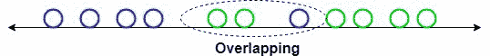
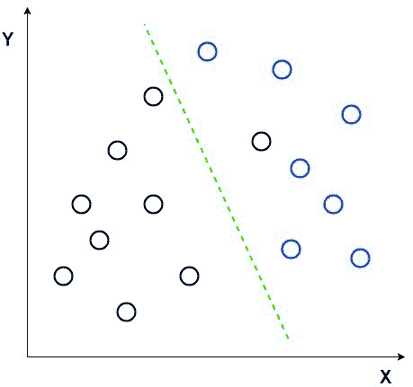
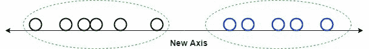

# 判别分析

> 原文：<https://learnetutorials.com/machine-learning/discriminant-analysis>

我们发现逻辑回归是一个有用的二进制分类算法，它通过映射一个类的对数优势和数据之间的线性关系。然而，逻辑回归仍然受到线性假设的限制。

在本教程中，我们将讨论**判别函数**:试图识别哪个变量组合可以分离出多个类的函数。

## 逻辑回归的局限性或线性判别分析的需要

逻辑回归是一种强有力的分类算法，属于监督学习。但是它也有一些局限性，使得 LDA 和其他算法的形成

1.  **二元问题**:我们知道逻辑回归在二元分类问题中非常有效。如你所知，它有多类分类，但使用不多。
2.  **不稳定**:逻辑回归在正常情况下是完美的，但是当类别完全分离时，逻辑回归变得不稳定
3.  **数据较少时不好**:如果数据不足以估计参数，那么逻辑回归可能会产生一些误差，我们称之为不稳定。

线性判别分析解决了这些问题，如果有任何这些条件，可以用来代替逻辑回归。如果你两个都尝试，选择最好的，那就好了。

## 线性判别分析

**线性判别分析(LDA)** 是一种用于降维的方法，常用于有监督机器学习中的分类问题。它用于预测不同类别的差异。简单来说，我们可以说它是用来把一个群体的特征在较高维度上展现给较低的维度。

假设我们有两组具有不同特征的不同数据，我们希望使用单个特征将它们分开或分类。当我们这样做时，重叠的可能性很高，如图所示。所以我们必须增加特征的数量才能有一个好的分类。

考虑一个让概念更清晰的例子。让我们有两组不同组的数据。现在我们想把它们分成两个不同的组，就像 2D 的图片一样。但是当我们试图在 2D 图上制作数据点时，不会有一条直线将数据分成两组。

在这种情况下，我们使用线性判别分析，将 2D 图简化为单维图，这样我们可以在两组数据点之间获得更好的分离性。

在这种方法中，线性判别分析使用图形坐标，如 X 轴和 Y 轴，创建一个新的坐标，并使用新的坐标或轴显示数据。因此，我们实现了 2D 图的降维，并有助于增加分离。

新坐标使用两个规则创建，这两个规则是

*   将两组平均值之间的距离增加到最大值
*   将两组的差异降至最低。

在上面的图片中，我们用红色显示了新的轴，并且我们绘制了关于新轴的数据点，使得两组平均值之间的距离增加，而两组之间的方差减小。

使用我们的规则在新轴上绘制数据点后，如下图所示。

上面的函数是判别函数，它告诉我们一个数据点属于类 **k** 的可能性有多大。注意**πkT5】是 k 类的先验，f k 是 **k** 类数据的概率密度函数。**

对于 LDA，我们将假设数据是均值为**μkT3 的正态分布。我们还假设协方差矩阵**σ**在所有类中都是相同的。因此，我们得到以下判别函数:** 

要点是这样的:**如果我们比较任意两个类，最好把两个类分开的线是一个线性函数**。因此，LDA 找到了分隔任意两个类别的最佳线。

我们不能一直使用这种线性判别分析，因为如果平均值被共享，它将失败，因为线性判别分析不能找到新的坐标和轴。在这种情况下，我们使用非线性判别式。非线性判别式的一些常见例子有

1.  **二次判别分析**:在这个方法中，每个类都有自己的方差估计。如果有两个以上的输入，则为协方差。
2.  **灵活判别分析**:它将用于我们在前面教程中讨论的样条，因为输入是非线性组合
3.  **正则化判别分析**:我们知道什么是正则化，在这个方法中我们引入了方差估计中的正则化。这有助于减少可变因素对线性判别分析的影响。

## 二次判别分析

现在，如果我们想找到能够分离更多非线性数据的曲线，该怎么办？为了完成这个更复杂的任务，我们需要确定和考虑每个类的差异。

### 二次判别分析优于线性判别分析的例子。

如果我们不假设每个类的方差相同，判别函数就会变得更加复杂:

要点是，通过不假设相等的方差，判别函数变成了二次函数。这允许我们分离具有不等方差的非线性数据。

## 什么时候选择线性还是二次判别分析？

判别分析对于使用线性和非线性决策边界对数据进行分类非常有用，但是在某些特定情况下，您可能希望使用一种算法而不是另一种算法。

下表描述了在线性和二次判别分析之间进行选择的用例。

|  | 皱胃向左移 | 数量折扣分析 |
| 观察次数 | 低的 | 高的 |
| 功能数量 | 高的 | 低的 |
| 数据分布 | 标准 | 非线性的 |