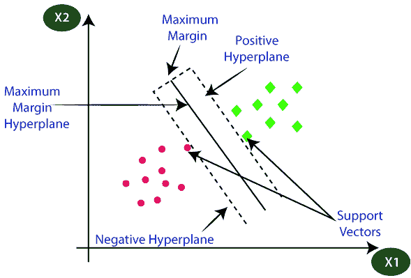
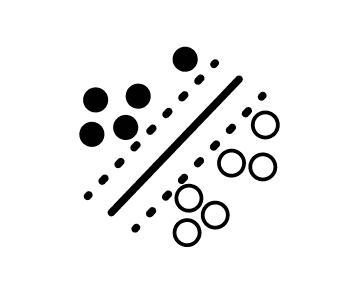
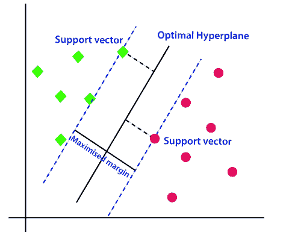
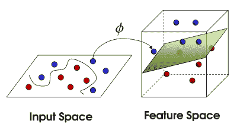

# 支持向量机

> 原文：<https://learnetutorials.com/machine-learning/support-vector-machines>

支持向量机是最流行和使用最多的监督机器学习算法之一，主要用于分类，但它可以用于分类和回归类型的问题。它因其良好的准确性和较少的计算成本而受到欢迎。

正如我们所知，分类是将数据分类到不同的类别中，我们需要有一条清晰而精确的线来将数据分类，支持向量机是通过绘制一条清晰的边界线来实现的，我们称之为超平面。借助于那条边界线，我们可以很容易地将新数据分成不同的类别。

超平面是在支持向量的帮助下创建的。支持向量是我们选择用来制作超平面的极值点。我们使用这些支持向量来决定超平面，因此我们称这种机器学习算法为支持向量机。

从下图中，您可以了解超平面和基于超平面划分的类别。

现在让我们通过检查一个简单的例子来更清楚地说明这一点。让我们考虑我们有一些老虎和狮子，我们有一只奇怪的老虎，它和狮子有些相似之处。在这种情况下，我们需要一个模型，可以清楚地分类老虎和狮子。为此，我们需要支持向量机的帮助，支持向量机将使用大量的老虎和狮子的图像进行训练，以便能够正确地对狮子和老虎进行分类。

现在我们将陌生的老虎展示给 SVM，它通过在老虎和狮子中取极值点来创建超平面，然后在老虎和狮子之间创建决策，最后根据支持向量和超平面将陌生的老虎分类为老虎。

支持向量机主要应用于人脸检测、图像分类等领域。

## 支持向量机的剖析

首先，让我们以下面显示的二进制分类问题为例，该问题旨在确定实心和空心数据点之间的决策边界:

**支持向量**是最靠近**决策边界**(实线)的数据点。它们是分类和直接确定决策边界位置最具挑战性的数据点。

目标:最大化两个类别之间的差距

支持向量机旨在最大化不同类别的支持向量之间的余量(虚线)。换句话说，我们正在尝试了解如何确定能够最好地分离数据的决策边界。

它如何最大化利润？它通过**约束优化**方法来做到这一点，这些方法针对代表我们定义的限制的约束来优化一些目标函数。

理解优化步骤的数学需要大量的线性代数，但是在教程的剩余部分，我们将简单地解释支持向量机的直觉。总的来说，SYM 可以分为两种类型

1.  线性 SVM
2.  非线性 SVM

## 线性支持向量机

线性 SVM 用于一个简单的数据集，其中数据点可以使用一条线性线分为两类。这种数据点称为线性数据，这种算法称为线性 SVM 分类器。

对于线性 SVM，目标是画一条直线，最好地将两个类分开，这是通过

1.  识别支持向量
2.  最小化不可线性分离的数据点的数量。

虽然我们已经展示了类之间完美分离的突出例子，但我们应该注意到，有时，我们需要接受一些错误。毕竟，如果 SVM 能够始终完美地分离数据，那将是过度拟合，不会推广到其他数据集。支持向量机旨在最大限度地分离数据点，并允许对一些错误的数据点进行分类。

### 线性 SVM 是如何工作的

假设我们有一个包含绿色和粉色点数据的数据集。因此，我们需要一种算法，可以根据 x 和 y 坐标对绿色和粉色点进行分类，其中 x 和 y 是数据集的特征。

现在，让我们检查它是一个 2D 平面，我们可以使用一条直线将数据点分开，并可以将它们分为两类，但在这种情况下，我们可以绘制一条以上的直线，就像这张图片一样。

因此，问题出现了，哪条线是对数据点进行分类的最佳线，于是 SVM 就出现了。SVM 帮助画出了最好的线，叫做超平面。在找到被称为决策边界的线之后，SVM 将在具有超平面的两个类别中找到最近的点，这被称为支持向量。现在，在超平面和支持向量之间会有一个间隙，这将被称为边距。SVM 的主要目标是最大化边际，它将被称为最优超平面。

## 非线性支持向量机

非线性 SVM 用于非线性数据，这意味着不能使用线性线分割数据集。我们用来对非线性数据进行分类的算法称为非线性支持向量机。

### 非线性 SVM 是如何工作的？

假设原始数据不能像现在这样线性分离。解决这个问题的一种方法是通过将数据投影到更高维的空间中，将数据转换为可线性分离的。为了可视化这意味着什么，假设我们在两个类之间有以下数据分布。

左边的数据分布很难用二维平面上的线性模型来建模。但是，如果我们使用函数将数据扩展到更高的维度呢？可以绘制一个**超平面**，将紫色点和橙色点分开。

这种向数据集添加维度的强大方法被称为**核函数**。许多核可以应用于不同的数据结构，它是优化 SVM 模型需要考虑的超参数。

## SVM 的优势

1.SVM 提供了很高的精确度。SVM 对所有维度的空间都很好
3。SVM 使用非常少的内存和资源
T5】4。性价比高

## SVM 的缺点

1.大数据
2 训练时间长，不好。如果数据与类重叠，它将失败或给出错误预测

## SVM 的应用

1.人脸观察检测
2。正文和超文本排列
3。生物信息学