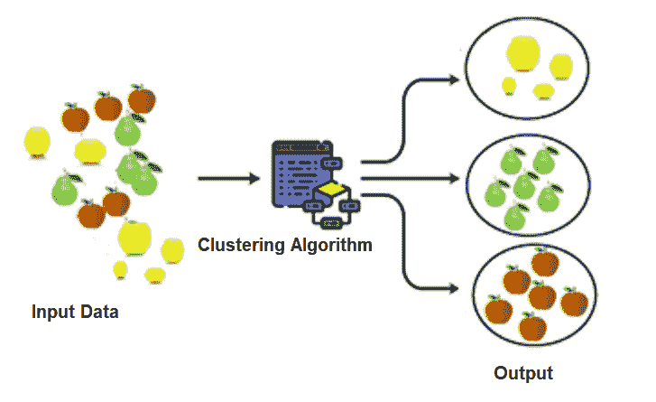

# 机器学习中的聚类

> 原文：<https://learnetutorials.com/machine-learning/clustering>

聚类是一种无监督的机器学习方法，它将未标记数据中的对象分类成不同的类别。它可以被正式定义为一种根据相似性将未标记的数据分组或归类到不同组的方法。这意味着聚类将与一个组相似而与另一个组不相似的数据点分组。

聚类如何从未标记的数据集中进行分组？这是通过从数据集中找到一些相似之处或模式来完成的，比如颜色或形状。然后，它会将具有相同特征的对象分组到一个组中，并将其他对象分组到另一个组中。

在将未标记的数据分组为聚类后，当我们处理庞大的数据集时，会给每个聚类一个唯一的 id 来进行识别。聚类有点类似于分类算法，但是聚类对未标记的数据起作用，而分类对标记的数据起作用。通常这种方法用于数据的统计分析。考虑下图，以理解图示视图中的聚类概念。

考虑到我们正在访问一个市场，我们可以通过一个真实的例子来学习集群。在市场里，我们可以看到所有的商品都根据它们的相似性和特点进行分组，比如鱼、不同种类的肉、蔬菜和不同种类的水果。当它被分类成组时，我们将很容易找到东西，这是聚类的一个完美例子。
聚类适用性涉及到不同的领域，有些是在

1.  异常感应
2.  图象分割法
3.  社交网络分析
4.  数据分析

亚马逊、YouTube 或网飞等许多地区也使用聚类对视频进行分类和分组，并显示完美的推荐。它还参与了展示类似产品的电子商务公司等。

## 聚类的类型

在一个数据集中，可能有一些对象只能分组到一个组，这就是所谓的硬聚类。像这样，将会有数据对象，这些数据对象也可以是我们称之为软聚类的其他组。这是广义的分类。让我们逐一检查 ML 中使用的聚类方法。

1.  分区聚类
2.  基于密度的聚类
3.  分布模型
4.  层次聚类
5.  模糊聚类

### 分区聚类

分区聚类也称为基于质心的聚类，因为这种聚类基于一个称为质心的中心点，并基于该质心进行分组。在分区聚类中，数据点被分成非分层组。例如，K 表示聚类。
在这种聚类方法中，数据集被分割成多个预定义的组，这些组可以表示为 K，因此称为 K 组。每个集群都有一个中心，创建该中心的方式是，该集群的相似点比其他集群的其他点更靠近中心点(最小距离)。

### 基于密度的聚类

基于密度的聚类是一种根据数据点的密度对数据集进行聚类并将这些密度较大的数据点连接成一个聚类的方法。这种方法将高密度点连接到一个集群。
在该方法中，ML 算法找到数据集中的所有聚类，然后将相似特征的密集区域连接成聚类。由于密集区域的这种连接，该簇的形状将是任意形状的。如果数据集的密度和维度变化很大，这种类型的聚类就很困难。

### 基于分布模型的聚类

这种聚类方法是基于概率的，因为数据是根据数据集属于某个分布的概率划分成不同的聚类的。这种方法是通过假设一些称为高斯分布的分布来进行分组。
示例:期望-最大聚类

### 层次聚类

分层聚类有点类似于分区聚类，因此可以作为一种替代方法。不同的是，在划分集群时，我们需要预先定义集群编号，但这里不需要。
在这种聚类方法中，我们知道创建了一个层次树，称为树图。我们可以将任意数量的观测值添加到树图中，方法是删除树图中不正确的级别。
示例:凝聚分层算法

### 模糊聚类算法

这种类型的聚类用于软聚类。在软聚类中，一个数据点可能属于多个组，因此很难对这些点进行分组。在这里，数据点被赋予一个值，我们称之为成员资格。根据隶属度将该点添加到聚类中。
示例:模糊 C 均值算法或模糊 K 均值聚类

## 聚类应用

集群有许多应用程序级的用途，下面给出了其中的一些。

1.  **医学领域**:这种聚类广泛应用于医学领域，例如在肿瘤科，这种聚类用于从其他细胞中识别癌细胞。它可以将细胞分裂成癌细胞和非癌细胞。
2.  **搜索引擎**:聚类在搜索引擎中被广泛使用，因为它将结果分组以向用户显示完美的结果。它根据搜索查询用相似的对象组成聚类。
3.  **市场调研**:用于市场等业务，根据客户的兴趣和选择对客户进行拆分。
4.  **生物学**:这种聚类方法是根据食肉动物、食草动物等不同的标准来进行动植物的分组。

## 不同的聚类算法

如上所述，有不同的聚类类型，基于这些类型，我们有不同的聚类算法。有许多可用的聚类算法，但只有少数常用。聚类算法取决于我们需要聚类的数据类型。例如，一些聚类算法需要知道数据集中有多少个聚类。一些聚类算法需要知道数据点的距离。
我们来看看机器学习中常用的一些聚类算法。

**K 表示聚类**

这是最流行的聚类算法类型，现在用于机器学习。该算法根据复杂度为 O(n)的方差将数据集分为不同的组。

对于 K 均值聚类，算法需要指定数据集中的聚类数。

**凝聚分层算法**:

这是分层聚类的一个例子，它形成了一个树形结构。在凝聚算法中，聚类将是自下而上的方式，其中每个数据点在开始时将被视为一个聚类，然后它将被合并到树中。

**均值漂移算法**

均值漂移算法是基于质心的聚类的一个很好的例子，它使一个中心点和与该聚类相关的所有数据点靠近质心。这相当于使可能是质心的点位于簇的中心。

**亲和传播算法**

这是一个不同于上面讨论的聚类算法，因为这个算法不需要提到聚类的数量。在该算法中，数据点在收敛之前在对之间通信。这种聚类的问题在于它的复杂性，即 0(N2T)