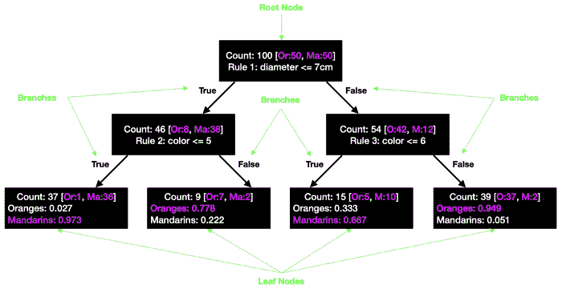
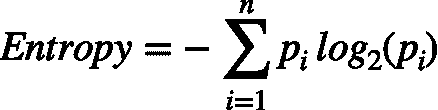

# 分类和回归树

> 原文：<https://learnetutorials.com/machine-learning/classification-and-regression-trees>

**决策树**是直观的算法，旨在根据导致给定结果的数据选择最佳的一系列决策。它们非常灵活，可以用于分类和回归任务。用法上的唯一区别是关于目标变量。

**分类回归树** ( **CART** )是套袋、随机造林、提升的基础。本教程提供了决策树的基础，将引导我们探索这些更复杂的集成技术。

**分类问题**:我们使用的是 CART 算法进行分类问题，唯一不同的是输出变量。在分类问题中，输出将是一个有限的值。也就是说第二天会不会是晴天。

**回归问题**:在回归问题中，我们将得到输出变量为无穷值集。例如，预测房价。

## 分类和回归树是如何工作的？

为了便于理解，CART 的工作考虑了一个例子，因为我们有一些橙子和一些橘子混合在一起。我们需要将它们分成不同的类别，因此我们需要一些规则来帮助对它们进行分类。

首先我们取两者的大小，因为橘子比橘子大一点，所以我们可以假设橘子的大小在 10 厘米左右，而橘子小于 7 厘米。同样我们可以考虑橘子的颜色会比橘子浅。

所以我们可以考虑橙子的颜色范围从 0 到 5。因此，我们可以用 3 个规则做一棵树，用橘子来分割橘子。

## 将数据表示为决策树

我们举一个简单的例子，我们将根据三个标准来决定是出去还是呆在家里:天气、温度，以及我们是否有一本好书。这个虚构的数据集如下所示:

从**根节点**到**叶节点**画一棵决策树，代表结果:我们是待在里面还是出去了。决策过程中考虑的其他特征称为**内部节点**。

我们可以描述节点之间的关系。父节点是决策过程中子节点之前的节点。基于模型在训练过程中学习的决策规则，节点被分成多个分支。

从这个简单的例子中，我们已经确定了导致特定结果的规则集。然而，CART 的目标是 a)学习一个合适的树结构，b)学习这些决策规则。

## 绘制决策树

因为我们从根节点有三个不同的特征，所以我们可以根据天气、温度或书籍来拆分树。关键问题是确定算法如何选择分割特征的顺序。

在 CART 中，我们基于每个特征创建三个初始分割。然后，我们评估分割在多大程度上最小化了误差或改善了预测。这个分支分裂的过程被重复用于进一步的细分，直到我们到达叶节点。

上面的示例显示了天气和温度要素之间的分割。该算法首先在天气轴中的晴天和雨天之间进行分割，因为这将导致输入和输出类之间的最佳分离。然后，在温度轴上，70 度看起来是划分两个类别的最佳温度。

### 使用基尼杂质系数确定分割质量

在回归树中，均方误差用于确定所有分支的分割质量。

其中 pi 是一类项目的分数。

然而，在分类树中，准确度不是确定分割质量的好方法，尤其是在不平衡数据的情况下，整体模型准确度会导致结果偏差。相反，我们可以使用两个替代指标:

**熵****信息增益**。这些可选的度量标准告诉模型拆分是如何分离类的。熵几乎与基尼杂质相同，但使用了不同的公式。

为了做出一个好的分割，我们必须理解以上所有的事情，并且始终记住熵最小的分割是最好的。同样，检查两个子节点的熵，如果它不高于父节点，停止分裂。

### 树木打顶和修剪

决策树的主要问题是，如果它们为给定的数据集创建了唯一的复杂树，则容易过度拟合。因此，告诉模型何时停止拆分非常重要。

这个超参数被称为最大深度，它指的是模型从根节点到叶节点的最长路径。

虽然我们可以告诉模型停止分裂，但我们也可以回溯并修剪降低分裂质量的分支。树剪枝相当于正则化，alpha 是用来加权节点的超参数，告诉模型去掉包含很少信息的分支。