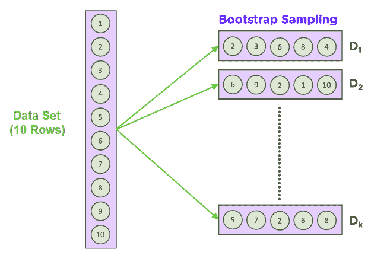
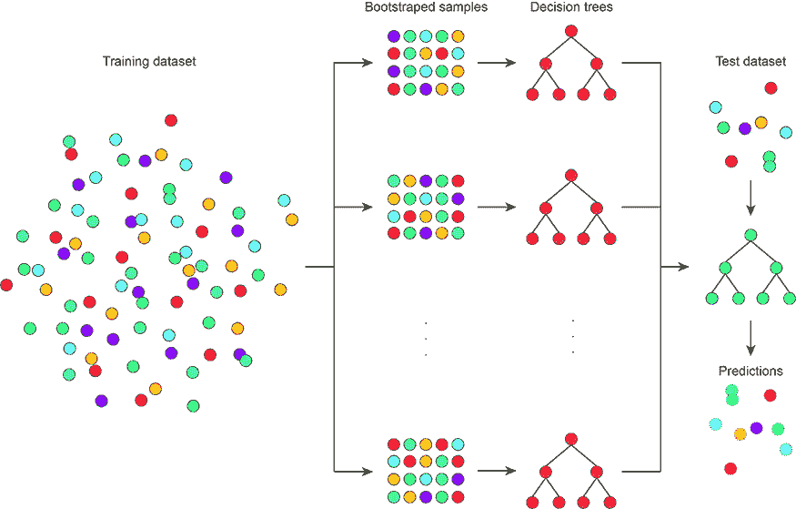

# 装袋和随机森林

> 原文：<https://learnetutorials.com/machine-learning/bagging-and-random-forest>

## <h>分类和回归树问题(CART)</h>

虽然 CART 是一种直观而强大的算法，但 CART 方法的几个弱点是:

1.  **过拟合**:决策树容易过拟合，基于选择的最大深度，以及对于高度可变的特征数据是否偏斜。
2.  **模型不稳定性**:即使是对训练数据集的一个小扰动(比如增加一个数据点或者有一个稍微不同的训练集)也会对树的结构产生巨大的影响。
3.  **对不平衡数据的敏感度**:决策树识别分支拆分的方式取决于每个类的标签数量。

为了解决这些问题，已经提出了集成方法来提高决策树的准确性。我们将讨论两个相关的修改:
1。装袋
2。随机森林。

## 拔靴带

要理解 Bagging，我们需要理解一种叫做**自举抽样方法**的统计方法。自举方法的目标是在给定有限数据集大小的情况下估计未知数据分布。

自举是计算种群参数；自举是如何工作的，就像用替换从数据集中随机形成一些数据样本。

基本思想是在随机**数据采样**期间，或者取数据集的较小子集，我们也可以**对**数据进行重采样:我们从原始数据集抽取重复样本。这个过程被重复大量次(1，000-10，000 次)，通过在每次迭代中取平均值或任何其他统计量，我们可以获得数据分布的感觉。

## 制袋材料

Bagging 也可以称为 bootstrap 聚合，用于集成学习方法中，以提高集成学习方法的准确性和性能。打包如何通过减少数据集中的差异来提高性能。
Bagging 常用于决策树算法中。它将用于分类和回归方法，因为它有助于减少过拟合问题。

**装袋**旨在利用自举方法解决 CART 的模型不稳定性问题。打包算法如下:

1.  通过替换创建大量随机训练集子样本
2.  对于每一组，训练一个 CART 模型
3.  给定测试集，计算每个模型的平均预测
4.  对于分类任务，给定类别的所有模型中的多数票是最终的预测类别。
5.  对于回归任务，所有模型的模式都是最终的预测值。

这个过程稳定了最终的模型答案，因为它选择了大多数树中显示的路径。然而，打包并不能解决树算法的另一个关键问题:高方差和高度相关的特征。

问题很简单:当构建每棵树时，我们总是使用所有的特征。一些特征自然具有较高的方差或彼此高度相关。这些特征将总是作为 CARTs 集合中的一个重要特征出现，但可能会掩盖数据集中的真实关系。

## 打包是如何工作的

1.  假设我们有一个数据集，它有许多特征和观测值。首先，我们必须从这个数据集中选择一个没有替换的随机样本。[我们必须创建多个样本子集]。
2.  为我们选择的每个子集创建一个基础模型
3.  通过平行且相互独立地从每个数据集学习来创建模型。
4.  结合所有子模型的预测，得到最终结果

## 套袋的优点

*   通过减少过拟合问题改进模型
*   提高模型的性能和准确性
*   它能够处理高维数据。

## 装袋的缺点

*   这可能会导致模型的可解释性丧失
*   如果做得不好，装袋会引起很大的偏差。
*   装袋成本相对较低，即使它使装袋更加准确。

## 随机森林

为了解决具有高方差特征或共线性的问题，更好的方法是在装袋过程中省略高度可变的特征或周期性地移除一些相关特征。这将揭示通常被这些特征隐藏的重要树结构。

**随机森林**通过对打包过程进行一个小调整来解决这个问题:在训练每棵树时，使用随机的更小的特征子集，而不是使用所有的特征。这最终会从数据中移除有问题的特征，并且在多次重复这个过程后，隐藏的树结构会开始出现。

用于分支拆分的特征数量是一个在随机林中引入的超参数，需要指定。

随机森林是一个带有 CART 模型的自举算法。假设我们有 1000 个观测值和 10 个变量。随机森林将使用这些样本和初始变量制作不同的 CART。这里它将采取一些随机样本和一些初始变量，并建立一个 CART 模型。现在它将重复这个过程一段时间，并预测最终结果，这将是每一个预测的平均值。

简单来说，随机森林就是随机决策树的集合。但致力于 2 个概念，从多个树中找到最终的预测。

1.  构建树时对数据集的随机采样
2.  分割节点时要素的随机子集

### 随机森林算法是如何工作的

1.  考虑来自数据集的 M 个随机数据
2.  基于这些记录构建决策树
3.  选择所需的树的数量，并重复步骤 1 和 2

## 现成的估计性能

在每次引导过程中，有一些样本不包括在模型训练中。这些被称为**袋外样本**，它们被用作评估单个树的模型性能的验证集。

通过取袋外性能的平均值，我们得到了类似于交叉验证程序的袋装模型的估计精度。这就是所谓的**出袋精度。**

这也是 bootstrap 是 CART 和机器学习模型的强大统计方法的另一个原因:它引入了一种稳健的统计方法来评估模型的准确性。

### 优势

*   随机森林算法是无偏的
*   它非常稳定，好像我们添加一个新数据集不会产生很多问题
*   随机森林在分类问题和数值问题中都可以顺利工作
*   即使数据集中缺少它，它也能有效地工作。

### 不足之处

*   结构和过程的高度复杂性，包括多个决策树
*   由于复杂性，需要大量时间进行培训