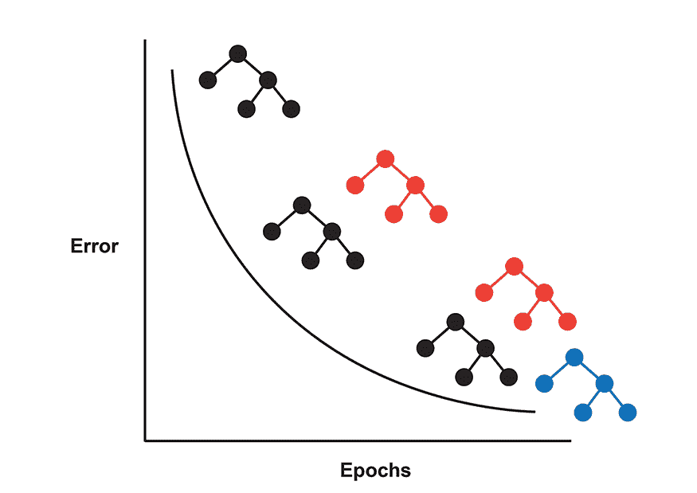

# 机器学习中的助推

> 原文：<https://learnetutorials.com/machine-learning/boosting-algorithms-and-its-types>

## 助推

我们之前讨论了优化决策树集合性能的统计方法:装袋和随机森林。这些算法并行训练 CART 模型，最后汇总结果。

然而，树算法的另一个子家族叫做 boosting，它采用了一种完全不同的方法，按顺序训练几棵树。这些树是**弱学习者** -它们是单劈叉的树。然而，从这些弱学习者聚集的知识将用于调整模型权重，以迫使模型随着时间的推移学习得更好。

在本教程中，我们将讨论什么是增强以及增强的不同风格。

## 什么是助推？

**Boosting** 优化一个朴素的树模型，迭代地修正权重，并在每次迭代中改进模型，这可以用简单的话来解释，比如 Boosting 是一种帮助弱学习者变得更强的方法或算法集合。

这意味着 boosting 方法能够通过串联构建弱分类器树，从多个弱分类器树中创建强分类器树。在增强树的制作中，从训练数据集开始。

根据可用的训练集，boosting 方法创建第一棵树或模型，这可能会有很多错误。其次，助推技术制造第二模型，这有助于清除第一模型的误差。同样，添加第三个模型，并继续下去，直到所有数据集的预测都完美无缺，或者添加了最大数量的模型或树。

现在让我们考虑一个例子来清楚地理解助推概念。让我们举一个检查邮件是否是垃圾邮件的例子。例如，为了检查邮件是否是垃圾邮件，我们制定了一些邮件分类规则

1.  检查邮件只有一张图片，那么它很可能是垃圾邮件
2.  检查邮件只有一个链接，那么它很可能是一个垃圾邮件
3.  检查一些像获奖者一样的词，那么它一定是垃圾邮件
4.  检查邮件是否来自正确的号码或域，那么它不是垃圾邮件
5.  检查邮件是否来自真实号码，那么它就不是垃圾邮件

现在，我们有五个条件来检查邮件是否是垃圾邮件。你相信这些单独的条件仅仅足以检查邮件是否是垃圾邮件吗？答案是否定的，所以我们可以称这些情况为弱学习者。
因此，在这些场景中，boosting 开始出现，它结合了弱学习者，使其非常适合给出正确的输出。Boosting 使用这些单独的条件来检查垃圾邮件，并结合起来形成一个强大的条件来检查邮件垃圾邮件。它使用如下方法

1.  使用平均值
2.  预测有更高的投票率。

## 实施助推的步骤:

1.  弱学习者进行预测，并为每个数据点分配同等价值的权重。
2.  对模型进行了评估。如果模型中存在误差，则改变权重以更加关注具有预测误差的数据点。
3.  这个学习过程重复进行，直到模型达到最大精度水平(或者我们迭代次数用完)。

## 增强算法

助推算法有不同的变体。在检查增强算法之前，我们必须记住，增强不是一种特定的算法，它是一种通用的方法，有助于改进特定的模型。在提升中，我们必须更喜欢我们将要使用的模型，如回归或决策树，提升需要改进。
我们将讨论两种传统的分类和回归方法，以及一种针对性能优化的现代增强方法。

### 自适应升压或自适应升压

**自适应增强或 AdaBoost** 是最初的增强分类器，它选择提高模型预测能力的特征。AdaBoost 的工作原理是构建决策树桩——具有单个拆分的单个决策树，如上图所示，每个单独的树。

如你所见，单个树桩不是很好的分类器。然而，错误分类的数据点在 AdaBoost 方案中被加权。在构建这些树的最后，从这些弱学习者中添加权重。由所有这些弱学习者构建的最终模型可以找到复杂的决策边界，可以准确地对数据点进行分类。

从上图中，检查树 1，其中每个数据点都有相等的权重，如加号和减号，我们还可以看到一个由对数据点进行分类的直线表示的决策树桩。

从图片中我们可以理解，分类是不恰当的，因为不是所有的加号都在决策树桩内。现在我们给加号加上更高的权重，并做出另一个**决策树桩**。

注意检查图片 2，我们为加号添加更多的权重，并绘制另一个决策树桩，但这也不是正确的预测，因为一些减号也在树桩内，这可能会导致分类错误。所以我们给这些负数加上一些权重，画出另一个决策树桩。

同样，在图片 3 之后，我们将通过组合前面三个单独的树来获得树 4 中所示的完美分类。Adaboost 的工作原理是将弱的个体学习者结合起来，形成一个强的学习者。

### 梯度升压

梯度助推是另一种助推变体。然而，AdaBoost 和 Gradient Boosting 的主要区别在于，AdaBoost 通过向错误分类的数据点添加惩罚值来识别模型错误。然而，梯度增强使用梯度下降来校正模型权重。

AdaBoost 和梯度升压之间的另一个小区别是损耗函数。AdaBoost 将指数损失函数最小化，而梯度提升可以使用任何可微的损失函数。指数损失函数容易出现异常值；因此，梯度增强是噪声数据的理想增强算法。

## XGBoost

虽然梯度增强是一种强大的方法，但它最初的实现并没有针对实际应用进行优化。因此，极限梯度增强(XGBoost)被创建来使得梯度增强对于各种各样的问题是可访问的。

XGBoost 只是梯度增强，有几个改进，可以让它运行得更快、更准确。

**下面列出了其中的几项改进，包括:**

1.  具有梯度增强的并行树构建
2.  树木修剪
3.  高效使用硬件
4.  避免过度拟合的正则化
5.  处理丢失的数据
6.  内置交叉验证

XGBoost 是一个健壮的现成算法，可以开始处理许多复杂的数据科学问题。

## 增压的优点

1.  **容易实现**:非常容易实现，因为不需要对数据进行特定的预处理。它也有许多方法来处理任何丢失的数据。
2.  **非常低的偏差**:提升是通过按顺序组合许多树来完成的，这需要大量的观察，因此它将减少偏差。
3.  **计算效率高**:只需要需要的特征，增加了提供适当效率的能力，增加了模型的计算效率。

## 升压的缺点

1.  **过拟合**:会有过拟合模型的机会。
2.  **密集计算** : Boosting 是通过组合很多树来做一个强大的算法，增加计算量。

## 升压的应用

1.  医疗保健:通过结合许多微弱的观察结果，如心血管或癌症存活率等，提高医疗水平有助于减少医疗预测中出错的机会。
2.  信息技术:它在很多方面有助于信息技术行业，如搜索引擎，正确评估低排名页面。
3.  金融:Boosting 方法有助于金融领域减少定价、欺诈检测等关键任务中的错误。