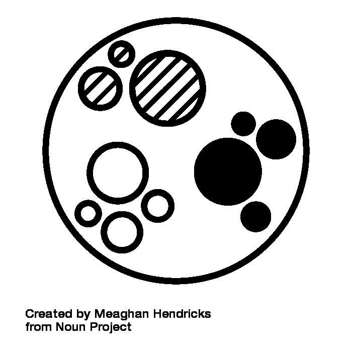

# 无监督学习

> 原文：<https://learnetutorials.com/machine-learning/unsupervised-learning>

现在我们已经了解了监督学习方法以及我们在监督学习中使用的不同回归和分类算法。现在是时候进一步转向我们称之为无监督学习的无管理学习了。

简而言之，无监督学习有助于解决更多现实世界的问题，因为它的工作方式类似于人脑，因为它必须从数据集学习底层模式，而没有适当构建的训练数据集。

## 什么是无监督学习？

**无监督学习**是机器学习的另一种类型。目标是学习数据中潜在的模式和结构，不需要人工干预，也不需要将其映射到响应变量或标签。相反，可以对数据进行排序、压缩、聚类或可视化，从而允许用户理解整个数据集的高级概述。

换句话说，我们可以将无监督学习定义为在没有监督的情况下完成的学习。这意味着我们只有一个数据集，不会有给定的训练数据集来训练模型。因此，模型必须找到隐藏在数据集中的内部模式和关系，并根据相似性对它们进行分类。

为了清楚地理解，我们可以举一个蔬菜和水果的例子。无监督机器学习算法必须对蔬菜和水果的图片进行分类。不同的是，有一个训练好的数据集来了解蔬菜和水果的特征，并像监督学习一样对它们进行分类。这里的算法对蔬菜或水果的特征一无所知；它必须自己识别图像中的相似性，并且必须将给定的数据集分类为水果和蔬菜。
无监督学习是通过根据分析数据集得到的相似性将图像聚类成组来实现的。

数据探索

有时候，我们得到了一个数据集，但是我们没有任何方向去执行什么样的分析。相反，我们被要求在数据中寻找有趣的属性。

这就是无监督学习的好处——理解数据结构的本来面目，没有任何自我强加的偏见。例如，通过对数据进行聚类，我们可以看到是否有我们可以进一步分析的自然出现的模式。

### 
数据可视化

对于包含许多特征的数据集，如果没有一种方法来可视化这些高维数据集中的数据，提取见解可能会很有挑战性。

一些现代无监督学习算法，如 SNE 和 UMAP，可以将高维数据集压缩成更小的集合。这些方法使数据可视化变得更加容易，同时提供了对底层数据结构的重要见解。

### 去相关你的数据

让我们以观察弹簧振荡来测量弹簧常数为例，这是一个经典的物理问题。我们提供了三个摄像头来计算球在弹簧上的轨迹。

出现的一个问题是，“我们是否在以最佳方向查看数据，以测量我们的弹簧常数？”(答案是否定的)。这类似于训练一个机器学习模型，我们需要以最好的方式构建我们的数据，以便模型能够提取尽可能多的信息。像主成分分析这样的无监督方法可以通过对数据进行去相关来做到这一点。

### 压缩您的数据

如果我们考虑上面的相机例子，我们注意到三个相机都在测量同一个事件，只是以稍微不同的方式观察春天。因此，其中一些功能有点多余。

无监督学习方法可以告诉我们哪些特征没有携带太多信息或者彼此高度相关，从而使模型能够更高效地学习。

## 无监督学习是如何工作的

在这张图片中，我们可以理解，有一些原始数据有许多未分类和未归类的项目，这些项目被输入到机器学习算法中。它没有任何训练数据集或输出来帮助对数据进行分类，就像在监督学习中一样。

首先，机器学习算法自己解释给定的数据集，以理解数据集中隐藏的模式，然后使用这些模式对数据集进行排序。

有许多算法，能够与无监督算法一起工作。当我们应用适当的算法，如 k 均值聚类或决策树等。然后，它根据从数据集中找到的模式将数据分类。

## 无监督学习的类型

### 使聚集

**聚类**方法旨在根据数据与同一集合中其他数据的相似性或差异对数据进行分组。我们已经看到了一个分类背景下的 K 均值聚类的例子，其中数据点是基于质心进行分组的。还有许多其他方法可以对数据进行分组，例如层次聚类和 DBSCAN。

### 关联规则

关联规则是一种帮助在给定的大数据集中找到变量之间的一些关系的方法。它有助于查找数据集中组合出现的数据集。

你可以想象你在一家杂货店，你正在努力寻找一些牛奶。你从经验中知道，牛奶在冰箱的过道里，却没有被明确告知它在那里。此外，因为你买的是牛奶，所以你很有可能在商店里买一些和牛奶搭配的东西，比如麦片。

这种购买体验是**关联规则**的一个例子，该规则旨在基于概率找到给定数据集中变量之间的关系。

### 降维

**降维**旨在减少数据集内的特征数量，并对其进行压缩，以便只保留最有意义的特征。主成分分析是减少数据集中特征数量的一种方法。

## 无监督学习的优势

当使用无监督学习时，我们有下面列出的一些优势

1.  它可以用于许多现实生活中的复杂任务，因为它不需要经过训练的数据集。
2.  在比较已标记的数据时，使用无监督学习来获取未标记的数据是值得的

## 无监督学习的挑战

虽然无监督学习是建模和理解数据的好方法，但需要注意一些挑战:

1.  人类需要解释结果并定义成功的标准。
2.  根据算法的不同，训练时间长，计算量大。
3.  很难解释无监督学习模型的内部工作原理。

## 无监督学习算法

*   K 均值聚类
*   KNN (k 近邻)
*   分级聚类
*   异常检测
*   神经网络
*   主成分分析
*   独立成分分析
*   Apriori 算法
*   奇异值分解