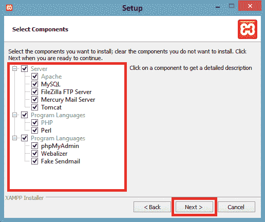
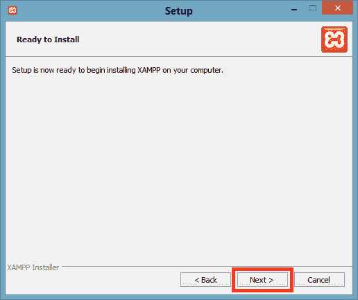
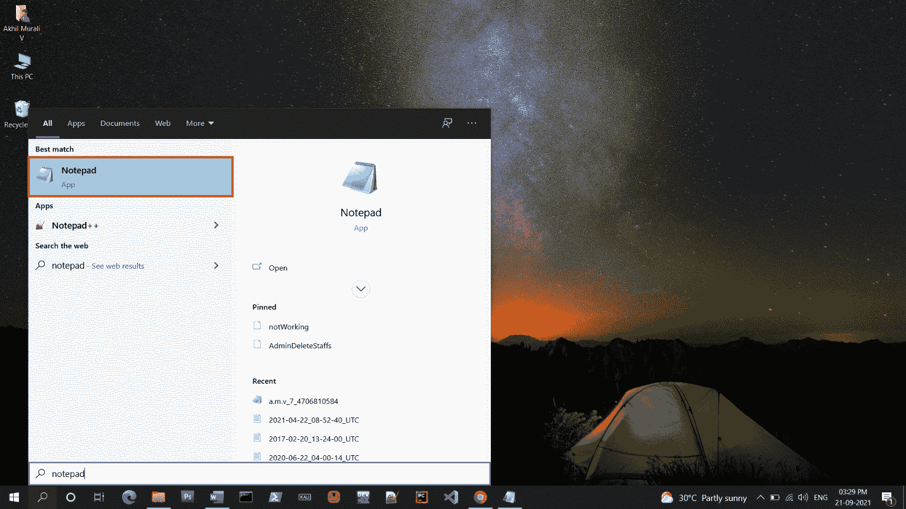
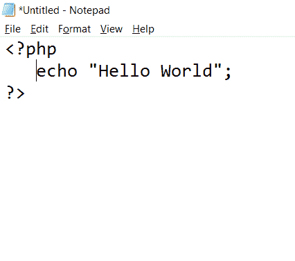
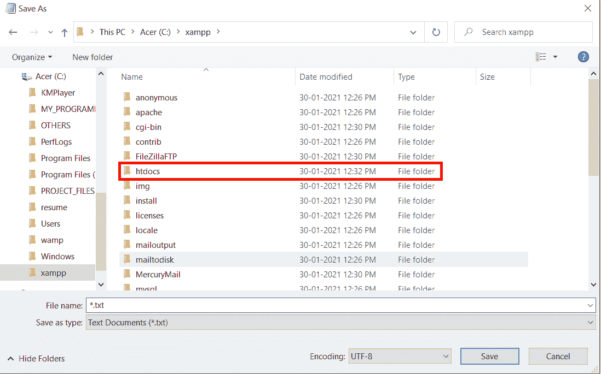

# PHP 环境设置

> 原文：<https://learnetutorials.com/php/environment-setup>

PHP 是一种解释的面向对象的脚本语言。PHP 可以在简单的文本编辑器上编写。Web 服务器应用程序用于运行程序。

## PHP 编程的要求是什么？

*   集成驱动电子设备
*   网络服务器
*   数据库ˌ资料库
*   安培

## 什么是 IDE？

集成开发环境是那些用于开发其他应用程序的应用程序。集成开发环境可以执行开发应用程序所需的所有功能。集成开发环境包括源代码编辑器、编译器、调试器和其他内置工具。

## PHP 最流行的 ide 有哪些？

*   VS 代码
*   黯然失色
*   开发工具
*   原子
*   IntelliJ IDEA
*   PHPStorm
*   x mode(x mode)-x mode(x mode)-x mode(x mode)(x mode)(x mode)(x mode)(x mode)(x mode)(x mode)(x mode)
*   括号
*   科莫多编辑
*   web 图形

## 什么是网络服务器？

要加载用 PHP 编写的网页，需要一个 web 服务器应用程序。几乎每个 web 服务器应用程序都支持 PHP。最常用的网络服务器应用是 Apache 服务器。

## PHP 数据库

PHP 可以与目前行业中使用的大多数数据库集成，即 MySQL、PostgreSQL、Oracle 和微软的 SQL Server。MySQL 数据库是最常用的数据库。MySQL 是一个开源的关系数据库管理系统。

## 什么是 AMP？

AMP 表示用于 PHP 安装的软件栈。在 AMP 中，A 代表“Apache”，M 代表“MySQL”，P 代表“PHP”。最常用的放大器有:

*   **WAMP** : WAMP 是软件栈 Windows、Apache、MySQL、PHP 的首字母缩写。它是为视窗操作系统开发的。下载链接:[https://www.wampserver.com/en/](https://www.wampserver.com/en/)
*   **LAMP** : LAMP 是软件栈 Linux、Apache、MySQL、PHP 的首字母缩写。它是为 Linux 操作系统开发的。下载链接:[http://csg.sph.umich.edu/abecasis/LAMP/download/](http://csg.sph.umich.edu/abecasis/LAMP/download/)
*   **MAMP** : MAMP 是软件栈 Mac、Apache、MySQL、PHP 的首字母缩写。它是为 mac 操作系统开发的。下载链接:[https://www.mamp.info/en/downloads/](https://www.mamp.info/en/downloads/)
*   **XAMPP** : XAMPP 是软件栈 Cross、Apache、MySQL、PHP、Perl 的缩写。它是为跨平台开发的。下载链接:[https://www.apachefriends.org/download.html](https://www.apachefriends.org/download.html)

## 如何安装 XAMPP:

尽管 XAMPP 支持每一种操作系统，我们还是展示了在 windows 上安装 XAMPP 的步骤

1.  根据系统规范下载 XAMPP 应用程序。
2.  成功下载后，运行。并授予安装所需的权限。
3.  选择所有需要的组件，点击下一步
4.  选择系统上安装 xampp 的文件夹或设置为默认路径，点击【下一步】
5.  点击【下一步】按钮
6.  点击下一步按钮安装 xampp
7.  点击【完成】按钮完成安装过程
8.  选择语言
9.  现在 XAMPP 已经可以使用了。点击 Apache 和 MySQL 的开始按钮
10.  如果没有出现错误 XAMPP 将成功运行

如果 XAMPP 运行成功，PHP 程序可以在本地主机上运行。

## 如何运行一个 PHP 程序？

1.  为这个程序打开任意文本编辑器我们正在使用记事本
2.  在记事本中写下 PHP 代码。例如，我们正在编写打印“你好世界”的代码
3.  要保存文件，单击文件菜单中的保存或另存为菜单，或使用快捷键 ctrl + s 或 ctrl + shift + s
4.  现在从驱动器中选择 xampp 文件夹
5.  然后从 xampp 文件夹中选择 htdocs 文件夹
6.  然后创建一个新的文件夹来保存 PHP 文件。这里我们正在创建一个名为的文件夹
7.  现在我们必须给这个 PHP 文件起一个名字，这里我们用扩展名保存为“first_program”。php "(一个 PHP 文件应该总是以的扩展名保存。php)。然后将另存为类型更改为“所有文件”，并通过单击保存按钮保存文件。
8.  保存文件后我们应该打开 XAMPP的控制面板
9.  如果没有发生错误，窗口将如下打开。然后我们要点击 Apache 和 MySQL 的的开始按钮
10.  如果它成功启动 Apache 和 MySQL，我们可以在 Apache 和 MySQL 上看到绿色以及与之对应的 PID。
11.  Apache 和 MySQL 成功启动后，根据您的喜好在任何网络浏览器上打开 localhost。现在我们可以看到我们创建的名为“demo”的文件夹，打开这个文件夹我们可以看到我们创建的名为“first _ program”的 PHP 文件
12.  打开 PHP 文件后，程序将运行，输出将显示在屏幕上