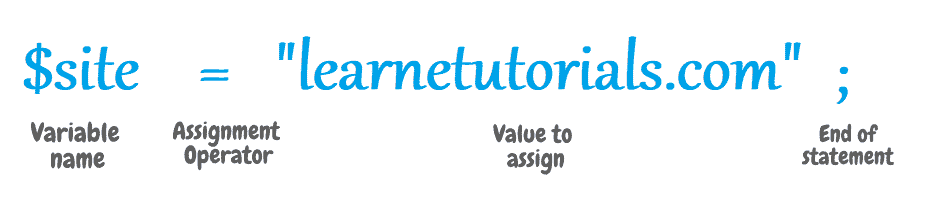
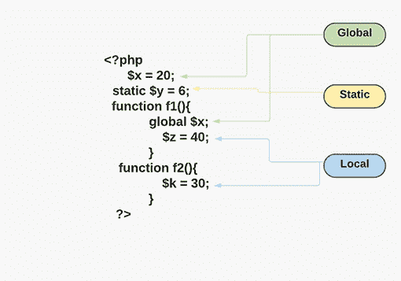

# PHP 变量

> 原文：<https://learnetutorials.com/php/variables>

在本 PHP 教程中，您将学习所有关于变量的知识，变量是编程语言的基本单位。我们将借助示例详细讨论什么是 PHP 中的变量，如何命名、声明和初始化变量。

## 变量是什么意思？


变量是计算机中的一组内存空间，可用于存储数据并为其指定唯一的名称。内存中的每个字节数据都有一个唯一的地址。

## PHP 中变量如何命名？

*   在 PHP 中，我们在变量名前使用“ **$** ”符号来表示变量。

    ```php
    $name 

    ```

*   PHP 中的变量只包含字母数字( **a-z，a-z，0-9** )字符和下划线( **_** )。

    ```php
    $name                  // Valid Variable Name
    $Age                   // Valid Variable Name
    $Check_Name            // Valid Variable Nam 

    ```

*   每个变量必须以字母( **a-z，A-Z** )或下划线( **_** )开头。另一方面，数字(0-9)或特殊字符不能是

    ```php
    $name   // Valid Variable Name
    $_age   // Valid Variable Name
    $01Name // Invalid Variable Name
    $#Name  // Invalid Variable Name 

    ```

*   像其他语言一样，变量名不能包含空格。

    ```php
    $check name // Invalid Variable Name 

    ```

*   PHP 中的变量是区分大小写的，我们可以给变量起名字`$name`和 `$Name`是两个不同的变量。我们可以在一个例子中看到

    ```php
    $name = "John";
    $NAME = "Doe";
    echo "First Name: $name Last Name: $NAME"; 

    ```

    ```php
     First Name: John Last Name: Doe 
    ```

## PHP 中如何声明一个变量？

*   在 PHP 中，在程序中使用变量之前，不需要声明变量。它会根据变量值自动分配数据类型。
*   当一个变量被声明时，它可以在整个程序中被重用
*   赋值运算符(=)用于将值赋给变量

## 在 PHP 中给变量赋值



我们使用“=”符号给变量赋值。

**语法**

```php
 $variable_name = value; 

```

例子

```php
 $name = "John";
echo $name; 

```

**输出:**

```php
 John 
```

在 PHP 中，我们使用 8 种数据类型来构造变量:

| **阵列** | **布尔** | **双倍或浮动** | **整数** |
| **空** | **物体** | **资源** | **弦** |

```php
 $count   = 1;              // Variable hold an integer value;
$count   = “one”;     // Variable hold a String value;
$num      =  1.5;         // Variable hold a Float value;
$num      =  True;       // Variable hold a Boolean value; 

```

我们使用内置函数 var_dump()来打印输入变量的数据类型。

**语法**

```php
 var_dump(var1, var2, ...); 

```

检查变量的数据类型

```php
 $name = "John";
$age = 25;
$salary = 1201.78;
var_dump($name);
var_dump($age);
var_dump($salary); 

```

**输出:**

```php
 string(4) "John"
int(25)
float(1201.78) 
```

## PHP 中什么是变量作用域？

在 PHP 中，我们可以在程序的任何地方声明一个变量。变量的范围指的是可以访问它的程序的范围。换句话说，变量的作用域是程序中定义它并可以被访问的块。变量范围有三种类型，它们是:


1.  静态范围
2.  本地范围
3.  全球范围

### 1)静态范围

PHP 的一个特点是，它删除了已经完成执行的变量，内存将被释放出来用于进一步的处理。即使在函数完成之后，我们也可能需要存储一些变量以供进一步使用。因此，静态变量是变量范围的关键组成部分。只需将关键字 static 放在其名称前面，就可以将变量定义为静态的，这种变量称为静态变量。只有局部函数有静态变量。当一个函数完成/执行时，它的所有变量通常都会被删除。然而，当我们不希望局部变量被破坏时，偶尔会有一些需求。我们可能需要它再执行一次死刑。出于这些目的，我们可能必须首先将变量声明为静态变量来实现这一点。然后，当再次调用该函数时，该变量仍将保存上次调用时的信息。静态变量在函数结束时不会丢失其值，这与指定为函数参数的变量不同，后者在函数退出时被删除。如果再次调用该函数，它也将保留其值。值得注意的是，变量仍然是局部变量。

静态范围的示例:

```php
 function counting()
{
    static $x = 1;
    echo "Count $x \n";
    $x++;
}
counting();
counting();
counting(); 

```

**输出:**

```php
 Count 1 
Count 2 
Count 3 
```

在上面的例子中，我们可以看到变量 x 的值首先被定义为静态变量，并且该值只被赋值一次，每次调用该函数时，该值都不会影响程序。

### 2)本地范围

函数中声明的变量称为函数的局部变量。局部变量只能在该函数中引用。这些局部变量的范围仅限于声明它们的函数。因为这些变量有局部作用域，所以不能在函数外访问。在函数外声明的同名变量与在函数内声明的变量不同。在该函数之外进行的任何赋值都被视为与函数中的变量完全独立的变量。

局部变量示例

```php
 function check()
{
    $x = "learnetutorials.com";
    echo "You are at $x";
}
check();
echo $x; 

```

**输出:**

```php
 You are at learnetutorials.com 
```

在上面的例子中，我们可以看到变量“x”是在函数的块中声明的，当它在函数中使用时，它会完美地工作，然后尝试在函数之外使用它，但它不会工作，因为变量“x”是一个局部变量。

### 3)全球范围

函数外的变量称为全局变量。在整个程序中可以访问全局变量。我们必须在变量前使用 GLOBAL 关键字来访问函数中的全局变量。全局变量可以在函数外直接访问或使用，无需使用任何关键字。因此，访问函数外部的全局变量不需要任何关键字。与局部变量不同，全局变量可以从程序的任何地方访问。全局变量必须在函数中明确定义为全局变量，才能在函数中进行修改。为此，我们使用$GLOBALS 数组作为在函数内部使用全局变量的另一种方法。通过将关键字 GLOBAL 放在需要识别为全局的变量前面。当您在现有变量前面应用这个关键字时，PHP 将使用具有该名称的变量。如果您试图在不使用全局关键字的情况下访问函数内部的全局变量，您将会收到一个错误消息，称该变量未定义。

全局变量的示例

```php
 $name = "Jhon Doe";
function welcome()
{
    echo "Hello! $name welcome to learnetutorials.com \n";
}
welcome();
echo "$name how are you doing?"; 

```

**输出:**

```php
 Hello!  welcome to learnetutorials.com 
Jhon Doe how are you doing? 
```

在上面的例子中，我们可以看到，当在函数中使用在函数外声明的变量时，它将不起作用，并将被视为错误。

使用关键字全局的示例

```php
 $name = "Jhon Doe";

function welcome()
{
    global $name;
    echo "Hello! $name welcome to learnetutorials.com \n";
}
welcome(); 

```

**输出:**

```php
 Hello! Jhon Doe welcome to learnetutorials.com 
Jhon Doe how are you doing? 
```

在上面的例子中，我们可以看到，当在函数外定义的变量前面使用 global 关键字时，它也在函数块中被接受。

## PHP 中的变量范围示例



在上面的例子中，我们可以看到变量“ **x** ”是在函数外部定义的，我们已经了解到在函数外部定义的每个变量都是全局变量。而变量“ **y** 被定义为静态变量我们可以看到，关键字 static 将变量设置为静态变量。变量“ **z** ”和“ **k** ”是在功能块中定义的，功能块中定义的每个变量都将是一个只能在当前函数中使用的局部变量，我们还可以看到变量“ **x** ”在函数中被用作全局变量，方法是使用它前面的关键字 global，如果我们更改该函数中变量“ **x** ”的值，那么该值在整个程序中也会发生变化。