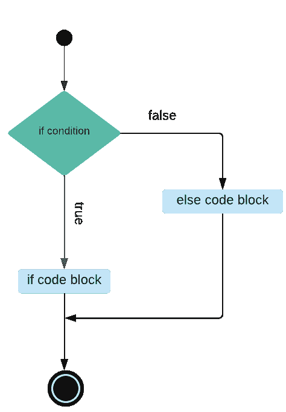
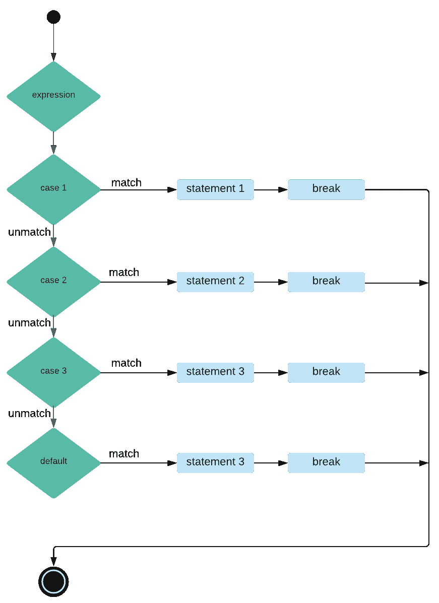

# PHP 条件语句

> 原文：<https://learnetutorials.com/php/conditional-statements>

在本 PHP 教程中，您将学习 PHP 中条件语句的所有知识。我们将详细讨论不同类型的条件语句，即 **if，if … else，if… else if … else，嵌套 if，switch，三元运算符**。

## PHP 中的 if 语句是什么？

如果给定条件为真，if 语句将执行其代码块。

**语法**

```
 if (condition) {
  code to be executed if condition is true;
} 

```


### 示例:PHP 中的 if 语句

```
 $a = 20;
$b = 18;
if($a > $b){
    echo "$a is the greatest…";
} 

```

**输出:**

```
 20 is the greatest… 
```

在上面的例子中，我们比较了两个变量，并打印了其中最大的一个。在这个程序中，我们使用 if 语句来检查条件“a > b”。如果条件为真，我们将打印变量 a 的值最大，并退出程序。如果条件为假，我们将退出程序。

## PHP 中的 if … else 语句是什么？

在 if … else 语句中，我们首先检查条件，如果条件为真，则执行 if 代码块，如果条件为假，则执行 else 代码块。

**语法**

```
 if (condition) {
  code to be executed if condition is true;
} else {
  code to be executed if condition is false;
} 

```



### 示例:PHP 中的 if 语句

```
 $a = 10;
$b = 17;
if($a > $b){
    echo "$a is the greatest…";
} else {
    echo "$b is the greatest…";
} 

```

**输出:**

```
 17 is the greatest… 
```

## PHP 中的 if … else if … else 语句

如果我们必须执行多个条件检查，并且对于每个条件，我们必须执行不同的代码块，我们使用 if … else if … else 语句。它首先检查 if 和 if 中的条件是否为真，它执行 if 代码块，如果为假，它检查 else if 和 if 中的条件是否为真 if 执行它的代码块，我们可以执行多个 else if 块，如果默认情况下每个条件都为假，它将执行 else 块。

**语法**

```
 if (condition) {
  code to be executed if this condition is true;
} elseif (condition) {
  code to be executed if first condition is false and this condition is true;
} else {
  code to be executed if all conditions are false;
} 

```


### 示例:如果…否则如果…否则 PHP 中的语句

```
 $a = 10;
$b = 17;
$c = 8;
if($a > $b && $a > $c){
    echo "$a is greatest...";
}
else if($b > $c){
    echo "$b is greatest...";
}
else{
    echo "$c is greatest...";
} 

```

**输出:**

```
 17 is the greatest… 
```

在上面的例子中，我们比较了三个变量，并打印了其中最大的一个。在这个程序中，我们使用 if … else if … else 语句，检查条件“a > b”和“a > c”。如果两者都为真，我们将打印变量“a”的值最大，并退出程序。如果为假，则检查条件“b > c”。如果为真，则打印变量“b”的值最大。如果两个条件都为假，则打印变量“c”的值最大。

## PHP 中什么是嵌套 if 语句？

在嵌套的 if 语句中，if 代码块将包含另一个 if 语句。只有当外部条件为真时，才会执行这个内部 if 语句。

**语法**

```
 if (condition) {    
code to be executed if condition is true   
if (condition) {    
code to be executed if condition is true    
}    
} 

```


### 示例:PHP 中的嵌套 if 语句

```
 $a = 19;
$b = 17;
$c = 15;
if($a > $b){
    if($a > $c){
        echo "$a is greatest...";
    }
}
else if($b > $c){
    echo "$b is greatest...";
}
else{
    echo "$c is greatest...";
} 

```

**输出:**

```
 19 is greatest... 
```

在上面的例子中，我们比较了三个变量，并打印了其中最大的一个。在这个程序中，我们使用嵌套的 if 语句，检查条件“a > b”是否为真，然后检查条件“a > c”是否为真， 我们打印变量“a”的值是最大的，并退出程序，如果它是假的，那么我们将退出外部 if 代码块的块，然后检查条件“b > c”。如果是真的，那么我们打印变量“b”的值作为最大值，如果两个条件都是假的，我们打印变量“c”的值作为最大值。

## 什么是 PHP 中的 switch 语句？

在 switch 语句中，我们传递一个表达式，检查不同的情况，并对每个匹配执行不同的语句。最后将执行默认块。

**语法**

```
 switch (n) {
  case label1:
    code to be executed if n=label1;
    break;
  case label2:
    code to be executed if n=label2;
    break;
  case label3:
    code to be executed if n=label3;
    break;
    ...
  default:
    code to be executed if n is different from all labels;
} 

```



### 示例:PHP 中的 if 语句

```
 $ch = 6;  
    switch ($ch)  
    {     
        case 1:   
            echo "Monday";  
            break;  
        case 2:   
            echo "Tuesday";  
            break;  
        case 3:   
            echo "Wednesday";  
            break;  
        case 4:   
            echo "Thursday";  
            break; 
        case 5:   
            echo "Friday";  
            break;  
        case 6:   
            echo "Saturday";  
            break;  
        case 7:   
            echo "Sunday";  
            break; 
        default:   
            echo "Wrong Choice";  
            break;  
    } 

```

**输出:**

```
 Saturday 
```

在这个节目中，我们将打印一周中的某一天。为此，我们首先给变量“ch”指定一天的数字，然后在 switch 语句中传递变量“ch”的值，然后在 switch 语句的块中，我们为每个选项编写案例。最后，我们使用一个默认语句来执行操作，其中每个案例都会失败。