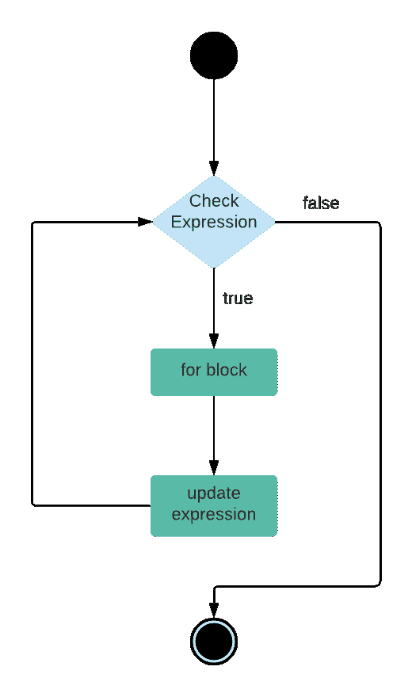

# PHP 循环语句

> 原文：<https://learnetutorials.com/php/loops-with-examples>

在本 PHP 教程中，您将学习 PHP 中条件语句的所有知识。我们将详细讨论不同类型的条件语句，即 for 循环、嵌套 for 循环、while 循环、嵌套 while 循环、do…while 循环和 foreach 循环。

## PHP 中的 for 循环语句

for 循环用于将代码块集执行指定的次数。

**语法**

```
 for(initialization; condition; increment/decrement){  
//code to be executed  
} 

```

for 循环中有三个参数:

*   **初始化**:我们可以在这里初始化一个计数器。它只能使用一次，也是一个可选参数
*   **条件**:将指定何时退出循环的条件
*   **递增/递减**:递增或递减变量值



### 示例:PHP 中的 if 语句

```
 for ($i = 1; $i <= 10; $i++) {    
echo "$i ";    
} 

```

**输出:**

```
 1 2 3 4 5 6 7 8 9 10 
```

在上例中，我们打印的是从 **1 到 10** 的数字。为此，我们首先将变量“ **i** ”初始化为值“ **1** ”，在条件参数中，我们检查条件“ **i < = 10** ”，如果条件为真，将执行 For 循环的块，并且在执行之后，将执行递增/递减参数，因为变量“ **i** ”的值是递增的，并且循环将持续到条件“ **i < = 10**

## PHP 中的嵌套 for 循环是什么意思？

嵌套 for 循环是指在另一个 for 循环内部使用 for 循环。当外部 for 循环的条件变为真时，将执行内部 for 循环。在嵌套 for 循环中，在外部 for 循环的每次迭代中，内部 for 循环将执行整个迭代，直到内部 for 循环的条件变为假，并且它将继续，直到外部 for 循环的条件变为假。

### 示例:PHP 中的 if 语句

```
 for ($i = 1; $i <= 3; $i++) {    
    for ($j = 1; $j <= 5; $j++){
        echo "$i * $j = ". $i * $j. "\n";
    }    
} 

```

**输出:**

```
 1 * 1 = 1
1 * 2 = 2
1 * 3 = 3
1 * 4 = 4
1 * 5 = 5
2 * 1 = 2
2 * 2 = 4
2 * 3 = 6
2 * 4 = 8
2 * 5 = 10
3 * 1 = 3
3 * 2 = 6
3 * 3 = 9
3 * 4 = 12
3 * 5 = 15 
```

在上面的例子中，我们正在打印 1、2 和 3 的乘积。为此，我们使用嵌套 For 循环。这里我们首先使用了一个 for 循环，参数“ **i = 1** ”作为初始化，“ **i < = 3** ”作为条件，而“ **i++** ”作为增量。然后在 for 循环的块中，我们有另一个 for 循环，参数为“ **j = 1** ”作为初始化，“ **j < =** 5”作为条件，“ **j++** ”。在内部 for 循环的块中，我们打印乘法。我们还可以看到，在外部 for 循环的第一次迭代中，内部 for 循环将执行整个迭代，直到条件变为假。并且它一直持续到外部 for 循环条件变为 FALSE。

## PHP 中的 while 循环

**while 循环**用于执行该组代码块，直到指定的条件变为假。while 循环也称为**进入控制循环**，因为在 while 循环中，首先检查条件，如果条件为真，则执行代码块，否则退出循环。

**语法**

```
 while(condition){  
//code to be executed  
} 

```


### 示例:PHP 中的 if 语句

```
 $i = 1;
while ($i <= 10) {    
echo "$i ";    
$i++;
} 

```

**输出:**

```
 1 2 3 4 5 6 7 8 9 10 
```

在上面的例子中，我们打印了从 1 到 10 的数字。为此，我们首先用值“ **1** ”初始化变量“ **i** ，在 while 循环中，我们检查条件“ **i < = 10** ”，如果条件为真，while 循环的块将在代码块中执行， 我们正在打印变量“ **i** ”的当前值，然后递增变量“ **i** ”的值，它再次检查 while 循环中的条件，如果是 **TRUE** ，它将再次执行代码块，循环将继续，直到 while 条件变为 **FALSE** 。

## PHP 中的嵌套 while 循环

嵌套的 while 循环是指在另一个 **while 循环**中使用一个 **while 循环**时。当外部 while 循环的条件变为真时，将执行内部 while 循环。在嵌套 while 循环中，在外部 while 循环的每次迭代中，内部 while 循环将执行整个迭代，直到内部 while 循环的条件变为假，并且它将继续，直到外部 **while 循环的条件变为假**

### 示例:在 PHP 中嵌套

```
 $i = 1;
while ($i <= 3) {
    $j = 1;
    while ($j <= 5){
        echo "$i * $j = ". $i * $j. "\n";
        $j++;
    }
    $i++;
} 

```

**输出:**

```
 1 * 2 = 2
1 * 3 = 3
1 * 4 = 4
1 * 5 = 5
2 * 1 = 2
2 * 2 = 4
2 * 3 = 6
2 * 4 = 8
2 * 5 = 10
3 * 1 = 3
3 * 2 = 6
3 * 3 = 9
3 * 4 = 12
3 * 5 = 15 
```

在上面的例子中，我们正在打印 1、2 和 3 的乘积。为此，我们现在使用嵌套的 while 循环。在这里，我们首先初始化了一个变量“ **i = 1** ，并使用了一个 while 循环，条件为“ **i < = 3** ”。然后在 while 循环的块中，我们有另一个 while 循环，其中我们首先初始化了变量“ **j = 1** ”，并且我们使用了另一个 while 循环，条件为“ **j < = 5** ”。在 while 循环块中，我们将值相乘并打印结果，并增加变量“ **j** ”的值，在内部 while 循环外，我们增加变量“ **i** ”的值，直到外部 while 循环的条件变为假为止。

## PHP 中的 do while 循环语句

do while 循环主要类似于 while 循环；它将根据条件迭代代码块。但是在 do while 循环中，代码块将至少执行一次。do while 循环也称为退出控制循环，因为在块循环中将首先执行，然后检查条件。

**语法**

```
 do{  
//code to be executed  
}while(condition); 

```


### 示例:PHP 中的 if 语句

```
 $i = 1;
do{
    echo "$i ";
    $i++;
}while($i <= 10); 

```

**输出:**

```
 1 2 3 4 5 6 7 8 9 10 
```

在上面的例子中，我们打印了从 1 到 10 的数字。为此，我们首先初始化了值为“1”的变量“I ”,在 do while 循环中，我们首先执行 do 块，打印变量“I”的当前值，并增加变量“I”的值，然后在 while“I < = 10”中检查条件，如果条件为真，则我们再次执行 do 块，循环将继续，直到 while 条件变为 FALSE。

## PHP 中的 while 循环和 do-while 循环有什么区别？

| while 循环 | 边循环边做 |
| 它也被称为入口控制回路 | 它也被称为出口控制回路 |
| 它将首先检查条件，如果条件为真，将执行循环块 | 它将首先执行循环的块，然后检查条件。 |
| 只有当条件为真时，它才会执行代码块 | 它将至少执行一次该代码块 |
| 它不会使用任何分号来终止循环 | 它使用分号来结束循环 |