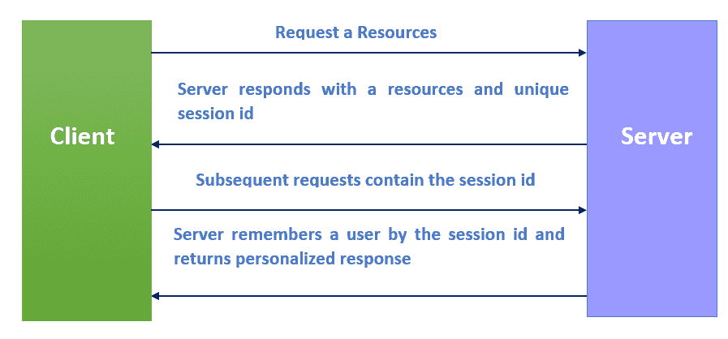

# PHP 会话

> 原文：<https://learnetutorials.com/php/sessions>

在本 PHP 教程中，您将了解 PHP 中的所有会话。我们还将讨论如何启动会话、创建会话、检查会话、访问会话和销毁会话

## PHP 中什么是 Sessions？

通常，会话是两种介质之间的通信帧。PHP 会话用于将数据保存到服务器，而不是用户的机器。会话标识符，或称为 sid，是用于在基于会话的系统中识别每个用户的数字。SID 用于将用户与其在服务器上的信息相关联，如帖子、电子邮件等。

Although cookies may be used to store data, there are certain security concerns. Because cookies are saved on the user's computer, an attacker may easily manipulate the cookie content to introduce potentially malicious data into your application, potentially breaking it. Furthermore, every time a browser requests a URL from a server, all cookie data for a website is automatically transmitted to the server as part of the request. This implies that if you keep 5 cookies on the user's device, each of which is 4KB in size, the browser must upload 20KB of data each time the user accesses a page, which might hinder the speed of your site. Using the PHP session, we can overcome both of these problems.

## 如何用 PHP 启动一个会话？

我们必须首先启动会话，然后才能在会话变量中存储任何数据。只需执行 PHP session_start()方法来启动一个新的会话。它将启动一个新的会话，并为用户分配一个唯一的会话标识。
示例

```php
 session_start() 

```

与 cookies 类似，我们必须在脚本开始时使用 session_start()函数启动会话。

## PHP 中如何在会话中存储数据？

使用$_SESSION[]超全局数组，我们可以将会话数据存储在键值对中。在会话的生命周期内，可以访问存储的数据。
示例

```php
 session_start();
$_SESSION['user'] = "Roy"; 

```

## PHP 中如何访问会话？

要访问会话值，我们使用 PHP $_SESSION[]超全局变量。它通常是一个关联数组，包含浏览器在当前请求中给出的所有会话值的列表，按会话名称键入。使用正常的数组语法，可以获得单独的会话值。

### 示例:“session.php”包含会话的页面

```php
 <?php
session_start();
$_SESSION['user'] = "Roy";
?> 

```

### 访问会话值的“session_demo.php”页面

```php
 <?php
session_start();
?>
<!DOCTYPE html>
<html lang="en">
<head>
    <title>Document</title>
</head>
<body>
    <h1>Hi! <?php echo $_SESSION['user'] ?> Welcome to learnetutorials.com</h1>
</body>
</html> 

```

```php
  
```

正如我们在上面的例子中看到的，所有的页面都在访问会话值，函数 session_start()应该被声明。所有这些页面应该属于同一个域

## PHP 中如何销毁会话？

如果我们只想销毁一个特定的会话，我们可以使用 unset()函数，将该会话的密钥作为参数。
示例

```php
 session_start();
if (isset($_SESSION['user'])) {
    unset($_SESSION['user']);
} 

```

如果我们想销毁整个会话，我们可以使用函数 session_destroy()。session_destroy()函数不需要任何参数。使用 session_destroy()后，我们将无法访问任何会话。
示例

```php
 session_start();
session_destroy(); 

```