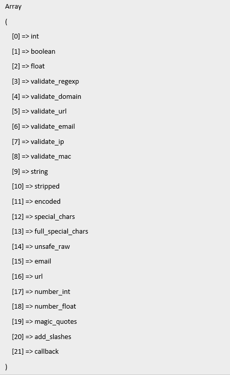

# PHP 过滤器

> 原文：<https://learnetutorials.com/php/filter-functions>

在这篇 PHP 教程中，您将了解 PHP 中不同类型的过滤器。我们将详细讨论过滤器的类型和各种类型的过滤器功能。

## PHP 中的过滤器是什么意思？

PHP Filter 是一个数据过滤扩展，可以过滤或验证数据。这对网站的安全性至关重要，尤其是当数据来自未知或外来来源时，例如用户提供的信息。例如，来自 HTML 表单的数据。

## PHP 中不同类型的过滤器

*   确认
*   卫生处理

### 什么是 PHP 中的验证过滤器？

验证用于确定数据是否符合特定标准。例如，使用 FILTE_VALIDATE_EMAIL 将检查给定的数据是否是有效的电子邮件，通过使用验证，它不会影响指定的数据。

### PHP 中的杀毒过滤器是什么？

清理与验证不同，清理将清理给定的数据，通过消除或更改数据来确保不存在不需要的字符。例如，使用 FILTER _ SAITH _ URL 将消除所有不适合网址的字符。但是，它不会验证数据。

## PHP 中用来过滤数据的不同函数有哪些

通过使用过滤器功能，可以过滤来自不安全来源的数据。

1.  filter_var(): It is used to filter the variable with the specified filter

    句法

    ```
     filter_var(var, filtername, options) 

    ```

    例子

    ```
     <?php
        $email = "roy@test.com";
        if (filter_var($email, FILTER_VALIDATE_EMAIL)) {
            echo ("$email is a valid email address");
        } else {
            echo ("$email is not a valid email address");
        }
        ?> 

    ```

    **输出:**

    ```
     roy@test.com is a valid email address 
    ```

2.  filter_var_array(): It is used to filter multiple variables mostly the array of variable

    句法

    ```
     filter_var_array(data_array, args, add_empty) 

    ```

    例子

    ```
     <?php
    $details = array(
        'username' =--> 'johndoe',
        'age' => '23',
        'email' => 'johndoe@test.com',
    );
    $filtere_data = filter_var_array($details);
    var_dump($filtere_data);    
    ?> 

    ```

    **输出:**

    ```
     array(3) {
      ["username"]=>
      string(7) "johndoe"
      ["age"]=>
      string(2) "23"
      ["email"]=>
      string(16) "johndoe@test.com"
    } 
    ```

3.  filter_has_var(): It is used to check whether a variable of a specified input type exists or not

    句法

    ```
     filter_has_var(type, variable) 

    ```

    例子

    ```
     <?php
    if (!filter_has_var(INPUT_GET, "email")) {
        echo ("Email is available...");
    } else {
        echo ("Email is not available...");
    }
    ?> 

    ```

    **输出:**

    ```
     Email is not available... 
    ```

    在上面的示例中，检查了通过 get 方法从窗体传递的值。要检查的输入类型。可以如下:

*   输入 _ 获取
*   输入后
*   输入 _COOKIE
*   INPUT_SERVER
*   输入 _ 环境

1.  filter_id(): It is used to return the specific filter id of the given filter name

    句法

    ```
     filter_id(filter_name) 

    ```

    例子

    ```
     <?php
    echo (filter_id("validate_url"));
    echo "\n";
    echo (filter_id("validate_email"));
    ?> 

    ```

    **输出:**

    ```
     273
    274 
    ```

2.  filter_list(): It is used to return all the supported filter name

    句法

    ```
     filter_list() 

    ```

    例子

    ```
     <?php
    print_r(filter_list());
    ?> 

    ```

    **输出:**

    ```
      
    ```

3.  filter_input(): It is used to access an external variable and filter it

    句法

    ```
     filter_input(type, variable, filter, options) 

    ```

    例子

    ```
     !DOCTYPE html>
    <html>
    <body><
        <form method="get" action="<?php echo htmlspecialchars($_SERVER["PHP_SELF"]); ?>">
            E-mail: <input type="text" name="email">
            <input type="submit" name="submit" value="Submit">
        </form>
        <?php
        if (isset($_GET["email"])) {
            if (!filter_input(INPUT_GET, "email", FILTER_VALIDATE_EMAIL) === false) {
                echo ("The email is valid");
            } else {
                echo ("The email is not valid");
            }
        }
        ?>
    </body>
    </html> 

    ```

    **输出:**

    ```
      
    ```

4.  filter_input_array(): It is used to access multiple external variables and filter it

    句法

    ```
     filter_input_array(type, definition, add_empty) 

    ```

    例子

    ```
     <html>
    <body>
        <form method="post" action=" <?php echo htmlspecialchars($_SERVER["PHP_SELF"]); ?> ">
            Name: <input type="text" name="name">
            Age: <input type="text" name="age">
            E-mail: <input type="text" name="email">
            <input type="submit" name="submit" value="Submit">
        </form>
        <?php
    $filters = array(
            "name" => array(
                "filter" => FILTER_CALLBACK,
                "flags" => FILTER_FORCE_ARRAY,
                "options" => "ucwords"
            ),
            "age"   => array(
                "filter" => FILTER_VALIDATE_INT,
                "options" => array("min_range" => 1, "max_range" => 120)
            ),
            "email" => FILTER_VALIDATE_EMAIL
        );
        print_r(filter_input_array(INPUT_POST, $filters));
        ?>
    </body>
    </html> 

    ```

    **输出:**

    ```
      
    ```

## PHP 中有哪些不同类型的过滤器常量？

以下是一些预定义的过滤器常数:

### 验证过滤器常数:

1.FILTER_VALIDATE_BOOLEAN:用于验证一个布尔数据
2。FILTER_VALIDATE_INT:用于验证整数数据
3。过滤器验证浮动:用于验证浮动数据
4。FILTER_VALIDATE_REGEXP:用于验证一个正则表达式
5。过滤器验证 IP:用于验证一个 IP 地址
6。FILTER_VALIDATE_EMAIL:用于验证电子邮件地址
7。过滤器验证网址:用于验证网址

### 净化过滤器常数:

1.FILTER_SANITIZE_EMAIL:用于删除电子邮件地址中的所有非法字符
2。FILTER_SANITIZE_ENCODED:用于去除/编码特殊字符
3。FILTER_SANITIZE_MAGIC_QUOTES:用于应用 addslashes()函数
4。FILTER_SANITIZE_NUMBER_FLOAT:用于删除除数字、+-和可选字符之外的所有字符。
5。FILTER_SANITIZE_NUMBER_INT:用于删除除数字和+–
6 以外的所有字符。FILTER_SANITIZE_SPECIAL_CHARS:用于去除特殊字符
7。FILTER _ SANITIZE _ FULL _ SPECIAL _ CHARS:用于对可以使用 FILTER_FLAG_NO_ENCODE_QUOTES 禁用的报价进行编码。
8。FILTER_SANITIZE_STRING:用于移除字符串中的标签/特殊字符
9。FILTER_SANITIZE_STRIPPED:用作 FILTER_SANITIZE_STRING
10 的别名。它用于从网址中删除所有非法字符

### 其他过滤器常数:

1.FILTER_UNSAFE_RAW:用于不做任何事情，可选对特殊字符进行剥离/编码
2。FILTER_CALLBACK:用于调用用户自定义函数过滤数据