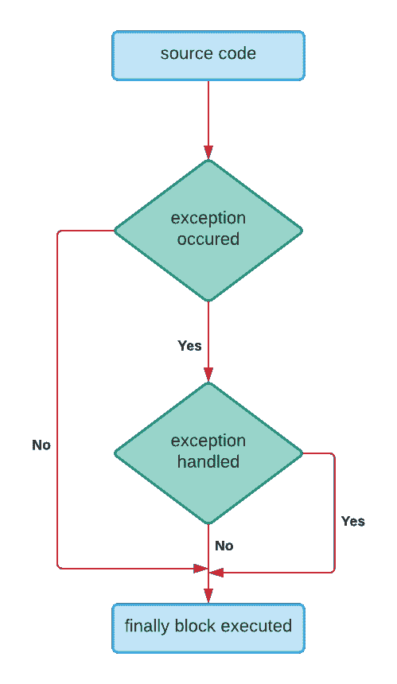

# PHP 异常处理

> 原文：<https://learnetutorials.com/php/exception-handling>

在本 PHP 教程中，您将学习 PHP 中的所有异常处理。我们将详细讨论尝试、接球、投掷和最后陈述。

## PHP 中的异常处理是什么意思？

异常是程序可以处理的意外结果。本质上，一个例外扰乱了程序的正常流程。但是，它与错误的不同之处在于，可以处理异常，但错误不能由脚本控制。异常作为一个信号，表明异常事件或错误已经发生。异常可能由于各种原因而发生，例如数据库连接或查询失败，您试图访问的文件不存在，等等。PHP 有一个健壮的异常处理结构，使您能够适当地处理错误。与 PHP 的标准错误处理方法相反，异常处理是一种面向对象的问题管理技术，它支持更可控、更灵活的错误报告类型。PHP 版本 5 是第一个提供异常模型的版本。



以下术语用于处理例外情况:

*   **  try –** 

    try 块包含可能导致异常或可能发生异常的代码。当脚本执行过程中在 try 块中发生异常时，它会在 catch 块中被捕获和解决。try 块后面必须跟一个 catch 或 finally 块。一个 try 块后面可以跟有任意数量的 catch 块，至少有一个 catch 块。

*   **    catch – **

    catch 块包括在引发特定类型的异常时执行的代码。它只与 try 块一起使用，从不单独使用。当异常发生时，PHP 会寻找对应的 catch 块。

*   **    throw – **

    这是一个用于生成异常的关键字。记录函数抛出但没有处理的所有异常也是有益的。同样，try 块抛出的块也应该包含至少一个 catch 块。

*   **finally –** 

    最后，Finally 块中有用于清理 PHP 脚本活动的代码。本质上，它执行程序的核心代码。

## 在 PHP 中使用异常处理有什么好处？

*   **Grouping of error types**:

    在 PHP 中，基本异常和对象异常都可以抛出。它可以构建异常对象的层次结构，将异常排列成类，并根据它们的类型对它们进行分类。

*   **Keep error handling and normal code separate**:

    为了处理传统错误处理方法中的错误，它通常使用 if-else 块。这些条件和错误处理代码变得复杂，使其不可读。try Catch 块使代码更容易理解。

### 例子

示例 1:展示异常的基本用法

当抛出异常时，它将尝试找到相应的“catch”块，而不是执行代码后面的 PHP 脚本。如果未捕获到异常，则会发出致命错误，并显示“未捕获到异常”消息。

### 让我们试着用 0 除一个数

```php
 <?php
try {
 $num1 = 10;
 $num2 = 0;
 if ($num2 == 0)
  throw new Exception("Can't divide by 0");
 else {
  echo $num1 / $num2;
 }
} catch (Exception $e) {
 echo 'Message: ' . $e->getMessage();
}
?> 

```

**输出:**

```php
 Message: Can't divide by 0 
```

在上面的例子中，我们正在检查程序是否试图用 0 除一个数。在这个程序中，我们已经在 try 块中编写了代码，并检查如果除数是 0，那么它将抛出一个错误，否则它将在除法之后打印值的结果。

### 示例 2:要使用多个捕捉块

```php
 <?php
class ExceptionDivideByZero extends Exception
{
}
class ExceptionDivideByNegativeNum extends Exception
{
}
function checkNum($dividend, $divisor)
{
 try {
  if ($divisor == 0) {
   throw new ExceptionDivideByZero;
  } else if ($divisor < 0) {
   throw new ExceptionDivideByNegativeNum;
  } else {
   $result = $dividend / $divisor;                echo "Result of divisi \n";
  }
 } catch (ExceptionDivideByZero $dze) {
  echo "Trying to Divide by Zero Exception! \n";
 } catch (ExceptionDivideByNegativeNum $dnne) {
  echo "Trying to Divide by Negative Number Exception \n";
 } catch (Exception $ex) {
  echo "Unknown Exception";
 }
}
checkNum(13, 7);
checkNum(40, -5);
checkNum(17, 0);
?> 

```

**输出:**

```php
 Result of divisi                     
Trying to Divide by Negative Number Exception 
Trying to Divide by Zero Exception! 
```

在上面的例子中，我们正在检查程序是否试图将一个数字除以 0 和一个负数。在这个程序中，我们相应地创建了自定义异常。我们在包含 try 块的函数中编写了检查脚本。对于每个异常，我们都有一个 catch 块。

## 如何在 PHP 中设置顶级异常处理程序？

如果没有捕获到异常，PHP 会创建一个致命错误，并显示消息“未捕获到异常...”。此错误消息可能包括敏感信息，如文件名和发生故障的行号。如果您不想向用户提供这样的信息，您可以编写自己的自定义函数，并使用 set_exception_handler()方法注册它来处理任何未捕获的异常。
示例

```php
 <?php
function myException($exception)
{
 echo "Exception: " . $exception->getMessage();
}
set_exception_handler('myException');
throw new Exception('Uncaught Exception occurred');
?> 

```

**输出:**

```php
 Message: Can't divide by 0 Exception: Uncaught Exception occurred 
```