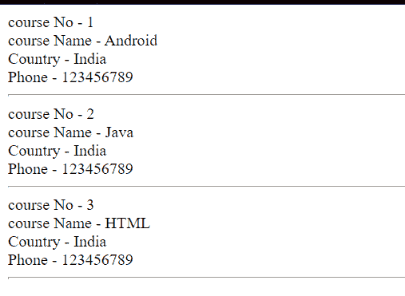

# PHP XML

> 原文：<https://learnetutorials.com/php/xml-parsers>

在本 PHP 教程中，您将了解 PHP 中的所有 XML。我们将详细讨论 XML 的类型、XML 解析扩展等等。

## XML 是什么意思？

XML 是可扩展标记语言的缩写。XML 是一种标记语言，用于在网络上传输数据。它是人类可读的，也是机器可读的。RSS 提要是可共享 xmls 的一个例子。XML 解析器对于在网络浏览器中读取和更新数据非常重要。

## XML 的所有用途是什么？

SOAP 和 REST 等 Web 服务以 XML 格式交换数据。因为当前的应用程序严重依赖于 web 服务，所以了解什么是 XML 以及它是如何工作的可以为您提供作为开发人员的竞争优势。XML 文档可以用来保存应用程序的配置参数。它允许您构建自己的标签，使其更加通用。

## XML 解析器是什么意思？

XML 解析器是一个将 XML 文档转换成 XML 文档对象模型的程序。XML DOM 对象可以用 JavaScript、Python 和 PHP 等语言来处理。解析 XML 文档时，术语 CDATA 代表(未解析的)字符数据，用于排除特殊字符，如“”。

## 有哪些不同类型的 XML 解析器？

*   **Tree-Based Parsers**

    基于树的解析器将完整的文本保存在内存中，并将其转换为树结构。它分析整个文档，并允许您访问树元素。这种样式的解析器更适合较小的 XML 文档；但是，由于性能限制，它不适合大的 XML 文档。
    基于树的解析器的例子有

    *   SimpleXML
    *   数字正射影像图
*   **Event-Based Parsers**

    基于事件的解析器不会将全文保存在内存中，而是一次读入一个节点，并允许与它实时交互。当您继续到下一个节点时，前一个节点会被移除。这种类型的解析器可以很好地处理大量的 XML 文档。它解析得更快，占用的内存更少。
    基于事件的解析器的例子有:

    *   的成员
    *   XML Expat 解析器

## 有哪些不同的 XML 解析扩展？

XML 解析扩展依赖于 libxml 工作。PHP 核心包括下面列出的 XML 解析器。

*   **Simple XML parser**

    简单的 XML 解析器，通常被称为基于树的 XML 解析器，将解析一个简单的 XML 文件。为了从给定的位置获取 xml，简单的 XML 解析将调用 simplexml_load_file()函数。

*   **DOM XML parser**

    DOM 解析器，也称为复杂节点解析器，用于读取极其复杂的 XML 文件。它用作编辑 XML 文件的接口。DOM 解析器使用了 UTF 8 字符编码。

*   **XML parser**

    SAX 解析是 XML 解析的基础。所有以前的解析器都比较慢。它将生成并解析 XML 文件。XML 解析器使用的字符编码包括 ISO-8859-1、美国-ASCII 和 UTF-8 字符编码。

*   **XML Reader**

    拉 XML 解析是 XML 阅读器解析的另一个术语。它用于更快地读取 XML 文件。它支持使用 XML 验证的高复杂性 XML 文档。

## 什么是简单的 XMP 解析器？

如果您知道 XML 文档的结构或布局，SimpleXML 使获取元素的名称、属性和文本内容变得很简单。SimpleXML 将 XML 文本转换为可迭代的数据结构，类似于数组或对象的集合。与 DOM 或 Expat 解析器相比，SimpleXML 需要更少的代码行来读取元素中的文本数据。
简单 XML 解析器中最常用的函数有:

1.  **simplexml_load_file()**: It is used to convert XML file into a readable object.

    ### datas . xml 文件

    ```
     <?xml version &equals; "1.0" encoding="UTF-8"?>
    <data>
      <to>John</to>
      <from>Jane</from>
      <heading>Reminder</heading>
      <body>Don't forget the party!</body>
    </data> 

    ```

    ### Php 文件

    ```
     <?php
    $xml = simplexml_load_file("datas.xml") or die("Error: Cannot create object");
    print_r($xml);
    ?> 

    ```

    **输出:**

    ```
     SimpleXMLElement Object
    (
        [to] => John
        [from] => Jane
        [heading] => Reminder
        [body] => Don't forget the party!
    ) 
    ```

2.  **simplexml_load_string()**: It is used to convert XML string into a readable object.

    ### 例子

    ```
     <?php $myXMLData = "<?xml version &equals; '1.0' encoding='UTF-8'?>
        <data>
        <to>John</to>
        <from>Jane</from>
        <heading>Reminder</heading>
        <body>Don't forget the party!</body>
        </data>";
    $xml = simplexml_load_string($myXMLData) or die("Error: Cannot create object");
    print_r($xml);?> 

    ```

    **输出:**

    ```
     SimpleXMLElement Object
    (
        [to] => John
        [from] => Jane
        [heading] => Reminder
        [body] => Don't forget the party!
    ) 
    ```

3.  **simplexml_import_dom()**: It is used to returns a Simple XML Element object from a DOM node

    ### 例子

    ```
     <?php
    $dom = new domDocument;
    $dom->loadXML("<data>
    <to>John</to>
    <from>Jane</from>
    <heading>Reminder</heading>
    <body>Don't forget the party!</body>
    </data>");
    $x = simplexml_import_dom($dom);
    echo $x->body;
    ?> 

    ```

    **输出:**

    ```
     Don't forget the party! 
    ```

## 什么是简单的 XML GET？

节点值是使用 XML Get 从一个 XML 文件中获得的。下面的示例演示如何从 XML 中获取数据。

### 示例:“datas.xml”文件

```
 <?xml version &equals; "1.0" encoding="UTF-8"?>
<data>
  <to>John</to>
  <from>Jane</from>
  <heading>Reminder</heading>
  <body>Don't forget the party!</body>
</data> 

```

### Php 文件

```
 <!DOCTYPE html>
<html>
<body>
    <?php
    $xml = simplexml_load_file("datas.xml") or die("Error: Cannot create object");
    echo $xml->to . "<br>";
    echo $xml->from . "<br>";
    echo $xml->heading . "<br>";
    echo $xml->body;
    ?>
</body>
</html> 

```

**输出:**

```
 John
Jane
Reminder
Don't forget the party! 
```

## 什么是 SAX 解析器？

SAX 解析器用于解析 XML 文件，在内存管理方面优于示例 XML 解析器和 DOM。因为它不在内存中维护任何数据，所以可以处理非常大的文件。以下示例将演示如何使用 SAX 应用编程接口从 XML 中提取数据。

### 示例:“datas.xml”文件

```
 <?xml version &equals; "1.0" encoding = "utf-8"?>
<students>
   <course>
      <name>Android</name>
      <country>India</country>
      <phone>123456789</phone>
   </course>
   <course>
      <name>Java</name>
      <country>India</country>
      <phone>123456789</phone>
   </course>
   <course>
      <name>HTML</name>
      <country>India</country>
      <phone>123456789</phone>
   </course>
</students> 

```

### Php 文件

```
 <?php
$students   = array();
$elements   = null;
function startElements($parser, $name, $attrs)
{
    global $students, $elements;
    if (!empty($name)) {
        if ($name == 'COURSE') {
            $students[] = array();
        }
        $elements = $name;
    }
}
function endElements($parser, $name)
{
    global $elements;
    if (!empty($name)) {
        $elements = null;
    }
}
function characterData($parser, $data)
{
    global $students, $elements;

    if (!empty($data)) {
        if ($elements == 'NAME' || $elements == 'COUNTRY' ||  $elements == 'PHONE') {
            $students[count($students) - 1][$elements] = trim($data);
        }
    }
}
$parser = xml_parser_create();
xml_set_element_handler($parser, "startElements", "endElements");
xml_set_character_data_handler($parser, "characterData");
if (!($handle = fopen('datas.xml', "r"))) {
    die("could not open XML input");
}
while ($data = fread($handle, 4096)) {
    xml_parse($parser, $data);
}
xml_parser_free($parser);
$i = 1;
foreach ($students as $course) {
       echo "course No - " . $i . '<br/>';
    echo "course Name - " . $course['NAME'] . '<br/>';
    echo "Country - " . $course['COUNTRY'] . '<br/>';
    echo "Phone - " . $course['PHONE'] . '<hr/>';
    $i++; } ?>

```

**输出:**

```
  
```

## 什么是 DOM Parser？

Dom Parser 在处理 XML 和 HTML 时都很高效。Dom 解析器以基于树的方式运行，在访问数据之前，它将数据加载到 dom 对象中，并在 web 浏览器中更新数据。下面的例子演示了如何在网络浏览器中访问 HTML 数据。

### 例子

```
 <?php
$html = ' 
      <head> 
         <title>Xml Demo</title>
      </head> 
      <body> 
         <h2>Course details</h2> 
         <table border = "0"> 
            <tbody> 
               <tr> 
                  <td>Python</td> 
                  <td>3 Month</td> 
                  <td>learnetutorials.com</td> 
               </tr>          
               <tr> 
                  <td>PHP</td> 
                  <td>3 Month</td> 
                  <td>learnetutorials.com</td> 
               </tr>          
               <tr> 
                  <td>JAVA</td> 
                  <td>3 Month</td> 
                  <td>learnetutorials.com</td> 
               </tr>          
               <tr> 
                  <td>JavaScript</td> 
                  <td>3 Month</td> 
                  <td>learnetutorials.com</td> 
               </tr> 
            </tbody> 
         </table> 
      </body> 
   </html> 
   ';
$dom = new domDocument;
$dom->loadHTML($html);
$dom->preserveWhiteSpace = false;
$tables = $dom->getElementsByTagName('table');
$rows = $tables->item(0)->getElementsByTagName('tr');
foreach ($rows as $row) {
    $cols = $row->getElementsByTagName('td');
    echo 'Course: ' . $cols->item(0)->nodeValue . '
';
    echo 'Duration: ' . $cols->item(1)->nodeValue . '
';
    echo 'Site: ' . $cols->item(2)->nodeValue;
   echo '<hr />';} ?> 
```

```
  
```